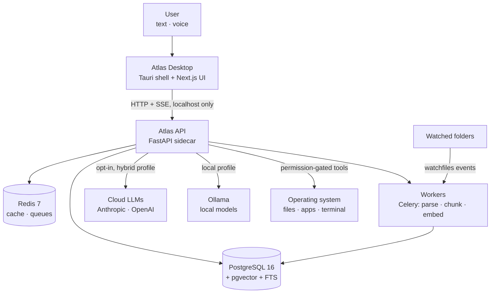
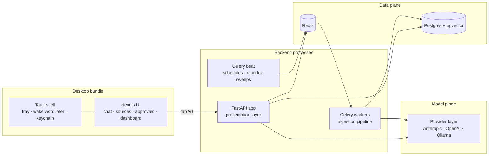
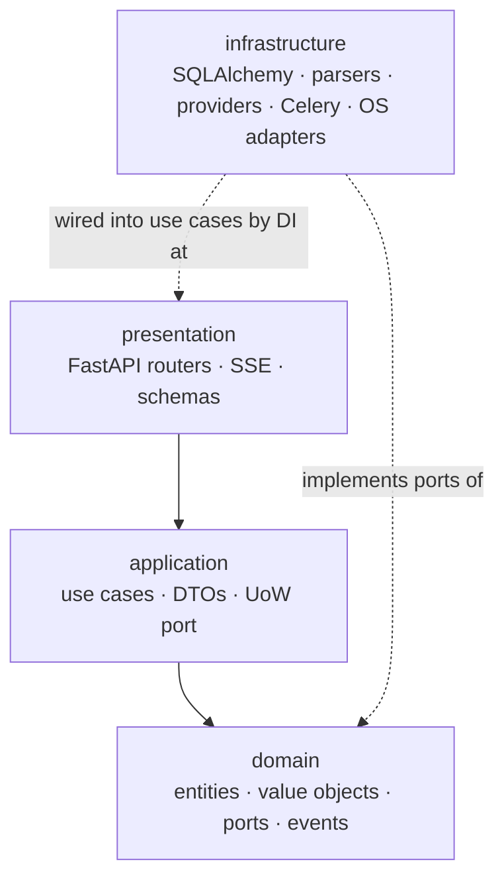

# Atlas — High-Level Architecture, Clean Architecture Design & Folder Structure

> Deliverables 3, 4, 5. Conforms to [`00-architecture-decisions.md`](00-architecture-decisions.md).

---

## 1. System context (C4 level 1)

Atlas sits between one person and everything they've allowed it to see. It is a
**modular monolith** running locally, with clearly drawn seams so that any
module can later be extracted into a service without rewriting business logic.



Key boundary properties:

- The API binds to `127.0.0.1` only. Nothing listens on the network in local mode.
- User content flows to a cloud LLM **only** in the hybrid profile, and
  embeddings are always computed locally regardless of profile (§9 of the spine).
- The OS is reached exclusively through the tool layer: schema-validated,
  policy-checked, audited (§11 of the spine). There is no other code path from
  model output to a syscall.

## 2. Container view (C4 level 2)



Why a modular monolith and not microservices from day one: a single-user,
local-first product gains nothing from network partitions inside itself — it
would pay latency, operational complexity, and debugging cost for scalability it
doesn't yet need. The discipline that matters is *logical* modularity:
dependency rules, ports and adapters, and one schema owner per table. That is
what makes later extraction (e.g. an ingestion service in a cloud deployment)
a mechanical exercise. This is the standard progression modern teams follow
("monolith first" — Fowler), and it is doubly right for software that must also
run entirely on a laptop.

## 3. Clean Architecture design

### 3.1 The dependency rule



- `domain` is pure Python: entities, value objects, domain events, errors, and
  **ports** (abstract interfaces). It imports no framework, no SDK, no ORM.
- `application` holds one class per use case (`IngestDocument`,
  `HybridSearch`, `SendMessage`, `InvokeTool`, `StartAgentRun` …). Use cases
  depend on ports, never adapters, and own transaction boundaries via a
  Unit-of-Work port.
- `infrastructure` implements ports: repositories (SQLAlchemy), parsers
  (PyMuPDF, python-docx, python-pptx, pandas), providers (Anthropic, OpenAI,
  Ollama), the filesystem watcher, Celery tasks, and OS-facing tool executors.
- `presentation` is thin: request parsing, auth, DI wiring, response shaping,
  streaming. No business rules.

**What this buys us (and what it costs).** The core promise is testability and
longevity: business rules run in unit tests with fakes, with no database or
network; frameworks and vendors are replaceable at the edges. The cost is
ceremony — more files, mapping between domain objects and ORM models. We accept
the cost deliberately because Atlas is a long-lived product with a security
boundary in the middle of it; the permission engine and agent runtime *must* be
trivially unit-testable. Where the ceremony has no payoff (e.g. trivial CRUD for
settings), use cases may be thin — but the dependency direction is never violated.

### 3.2 Vertical capability modules

`ai/`, `rag/`, `agents/`, `tools/`, `evals/` are vertical modules that follow
the same rule set (interfaces inward, vendors outward). They exist as top-level
packages because they are Atlas's product core and deserve first-class homes,
not because they are exempt from layering. Example: `rag/` defines the
`Retriever` pipeline in terms of `ChunkRepository` and `EmbeddingProvider`
ports; the pgvector SQL lives in `infrastructure/search/`.

### 3.3 Cross-cutting

`observability/`, `auth/`, `config/`, `shared/` are cross-cutting: initialized
once at the composition root (FastAPI app factory / worker bootstrap), consumed
everywhere via DI. Feature flags live in `config/` with a DB-backed override
table (`feature_flags`) so flags flip without redeploys.

## 4. Canonical folder structure

The full tree is normative in the spine (§4–§5). Summary:

```
Atlas-AI/
├── apps/
│   ├── api/          # FastAPI + workers — src/atlas/{domain,application,
│   │                 #   infrastructure,ai,rag,agents,tools,evals,
│   │                 #   observability,auth,config,presentation,shared}
│   ├── web/          # Next.js UI
│   └── desktop/      # Tauri 2 shell (bundles api as sidecar)
├── packages/
│   ├── api-client/   # TS client generated from OpenAPI — UI never hand-rolls fetches
│   └── ui/           # shared shadcn-based primitives
├── evals/            # golden datasets (JSONL), eval suite configs
├── infra/            # docker/, compose/ (profiles: core, observability, full)
├── docs/             # this documentation set, adr/
└── .github/workflows/
```

Monorepo rationale (ADR-0001): atomic cross-cutting changes (API + client +
UI in one PR), one CI, one version of truth for the OpenAPI contract. The
generated `api-client` package is the enforcement mechanism keeping frontend
and backend honest.

## 5. Primary data flows

Two flows define the product; everything else hangs off them. (Full catalog
with sequence diagrams: [`13-sequence-flows.md`](13-sequence-flows.md).)

**Ingestion (event-driven, incremental):**
watcher event → debounce → hash check (skip unchanged) → `ingestion_jobs` row →
Celery: parse → structure-aware chunk → embed (local) → upsert
`document_versions`/`chunks` → index visible in search. Every step traced;
failures land in a dead-letter state with retry policy, never silent loss.

**Grounded chat (interactive, streaming):**
`POST /conversations/{id}/messages` → use case assembles conversation memory +
relevant `memories` → hybrid retrieval (vector ∥ FTS → RRF → rerank) → context
pack with citation markers → LLM stream over SSE → citations persisted →
trace + tokens + cost recorded. If retrieval confidence is low: abstain
honestly instead of hallucinating.

**Tool execution (S3+)** adds the safety interlock between model and machine:
model emits intent → Pydantic schema validation → deterministic policy check
against `permission_grants` → risk-tier gate (T2/T3 park an `approvals` row and
wait for the human) → sandboxed executor → `tool_invocations` + `audit_events`.

## 6. Module map to deliverable docs

| Subsystem | Document |
|---|---|
| Domain model | [`10-domain-model.md`](10-domain-model.md) |
| Database schema & ERD | [`11-database-schema.md`](11-database-schema.md) |
| API specification | [`12-api-specification.md`](12-api-specification.md) |
| Sequence flows | [`13-sequence-flows.md`](13-sequence-flows.md) |
| AI provider architecture | [`20-ai-architecture.md`](20-ai-architecture.md) |
| RAG pipeline | [`21-rag-architecture.md`](21-rag-architecture.md) |
| Memory systems | [`22-memory-architecture.md`](22-memory-architecture.md) |
| Agent runtime | [`23-agent-architecture.md`](23-agent-architecture.md) |
| Tool registry & permissions | [`24-tool-architecture.md`](24-tool-architecture.md) |
| Computer automation | [`25-computer-automation.md`](25-computer-automation.md) |
| Security | [`30-security-architecture.md`](30-security-architecture.md) |
| Observability | [`31-observability-architecture.md`](31-observability-architecture.md) |
| Evaluation | [`32-evaluation-architecture.md`](32-evaluation-architecture.md) |
| Deployment / infra / scaling / cost | `40x` series |
| Roadmap / risks / testing / CI-CD | `5x` series |
| Milestones | [`60-milestones.md`](60-milestones.md) |
