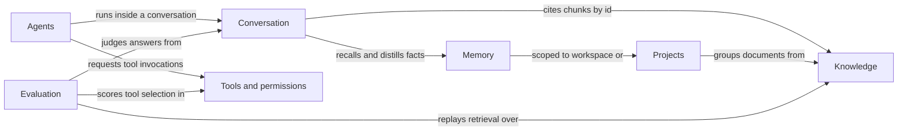
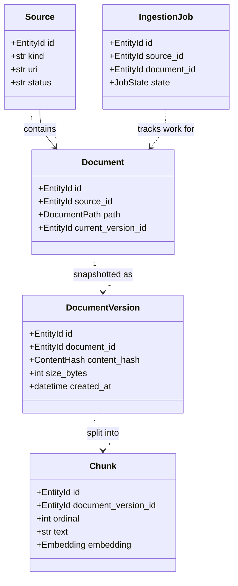
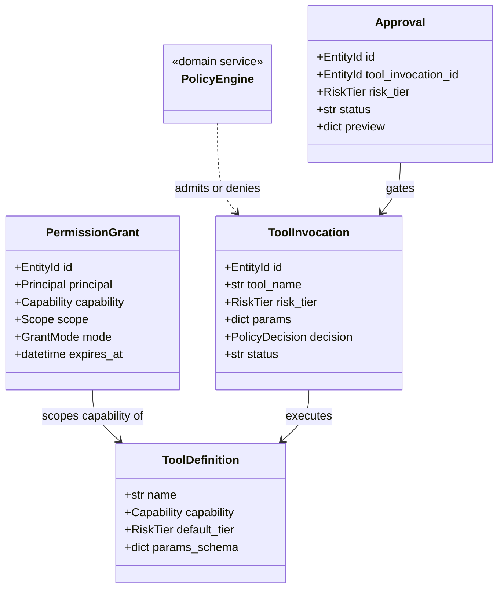

# Atlas — Domain Model

> Deliverable(s) 7. Conforms to [00-architecture-decisions.md](00-architecture-decisions.md).

---

## 1. The domain layer's contract

The domain layer (`apps/api/src/atlas/domain/`) is the enterprise core of Atlas.
It is pure Python 3.12: entities, value objects, aggregates, domain events,
domain errors, and **ports** (typed `Protocol` interfaces). It imports no
SQLAlchemy, no FastAPI, no Pydantic, no vendor SDK — nothing from the outer
layers (spine §5). That is the point: Atlas has a security boundary (the
permission engine) and a correctness boundary (grounding) in the middle of its
business logic, and both must be unit-testable with in-memory fakes — no
database, no network, no model.

Two conventions apply throughout. **Ports are `typing.Protocol`, not ABCs**:
structural typing lets an adapter or a test fake satisfy a port by shape
alone, with `mypy --strict` verifying conformance at the seam; the price —
Protocols cannot host shared behavior — is a feature, since behavior in an
interface means logic leaking out of entities. **Cross-context references are
identities, never object graphs**: a `Citation` holds a `ChunkId`, not a
`Chunk`, so no aggregate can mutate another context's state through a
navigation property.

The Unit-of-Work port lives in `application/` (spine §5): transaction scope is
a use-case concern. Aggregates *record* domain events; the UoW collects and
dispatches them after commit, so handlers never observe uncommitted state.

## 2. Bounded contexts overview

| Context | Package | Mission | Key aggregates |
|---|---|---|---|
| Knowledge | `domain/knowledge` | Turn watched content into a citable index | Source, Document, IngestionJob |
| Conversation | `domain/conversation` | Grounded, streaming chat with citations | Conversation |
| Agents | `domain/agents` | Multi-step task execution with checkpoints | AgentRun |
| Tools & permissions | `domain/tools` | Deterministic consent between model intent and OS action | ToolDefinition, PermissionGrant, Approval, ToolInvocation |
| Memory | `domain/memory` | Typed long-lived facts, distinct from history and index | Memory |
| Projects | `domain/projects` | User groupings of sources and documents with scoped memory | Project |
| Evaluation | `domain/evaluation` | Golden datasets and regression-gated quality | EvalDataset, EvalRun |



Relationships are customer–supplier and flow through two channels only:
identity value objects (a chunk id inside a `Citation`) and domain events (an
`ApprovalGranted` event resumes a parked `AgentRun`); the shared kernel below
is the one deliberate exception, kept tiny by policy.

## 3. Shared kernel (`domain/shared`)

The shared kernel holds identity types, the `Result` type, the domain error
hierarchy, the `DomainEvent` base, and the provider ports that more than one
context consumes (`LLMProvider`, `EmbeddingProvider`, `Reranker` — spine §9):
knowledge needs embeddings, while conversation, agents, and evaluation all
need completions, so a per-context port would just be duplication.

```python
from typing import Protocol
from collections.abc import AsyncIterator, Sequence
from dataclasses import dataclass
from datetime import datetime

type EntityId = str          # UUIDv7 string, generated app-side (spine ADR-0009)

@dataclass(frozen=True, slots=True)
class DomainEvent:
    event_id: EntityId
    occurred_at: datetime    # UTC, injected via the shared Clock

@dataclass(frozen=True, slots=True)
class Ok[T]: value: T
@dataclass(frozen=True, slots=True)
class Err[E]: error: E
type Result[T, E] = Ok[T] | Err[E]

@dataclass(frozen=True, slots=True)
class Embedding:
    values: tuple[float, ...]   # 768 dims in the default profile (spine §7)
    model: str                  # e.g. "nomic-embed-text"

class EmbeddingProvider(Protocol):
    @property
    def model(self) -> str: ...
    @property
    def dimension(self) -> int: ...
    async def embed(self, texts: Sequence[str]) -> list[Embedding]: ...

class LLMProvider(Protocol):
    async def complete(self, request: "CompletionRequest") -> "CompletionResult": ...
    def stream(self, request: "CompletionRequest") -> AsyncIterator["CompletionDelta"]: ...

class Reranker(Protocol):
    async def rerank(self, query: str, texts: Sequence[str]) -> list[float]: ...
```

`CompletionRequest` carries the `PromptVersion` name so every call is
attributable (spine §12); `CompletionResult` carries tokens, cost USD, and
stop reason. `Result` is used where failure is an expected outcome (policy
denial, abstention), reserving exceptions for genuine faults.

## 4. Knowledge context

**Entities:** `Source`, `Document`, `DocumentVersion`, `Chunk`, `IngestionJob`.
**Value objects:** `ContentHash` (SHA-256 hex), `DocumentPath` (stable
source-relative path or external id), `HeadingPath`, `JobState` (`pending →
running → succeeded | failed | skipped`), `Embedding` (shared).

### 4.1 Aggregates and invariants

- **Source** (root). Invariants: `kind` is fixed at creation (a folder never
  becomes a Drive connector — you register a new Source); the URI is unique
  per workspace (repository-enforced); a paused Source schedules no ingestion.
  Source does not contain its Documents: holding thousands of documents inside
  one aggregate would make every file event contend on one root.
- **Document** (root) with its **DocumentVersion** history. Invariants:
  `(source_id, path)` is unique; `current_version_id` always points at a
  version *of this document*; registering a new version and flipping the
  current pointer happen in one transaction; a soft-deleted document never
  surfaces in retrieval. Document, not DocumentVersion, is the root because
  the pointer flip is the invariant needing transactional protection.
- **Chunk** belongs to the DocumentVersion boundary but is *loaded* through
  `ChunkRepository`, never materialized as a collection on the aggregate: a
  large PDF yields hundreds of chunks, and no invariant needs them in memory.
  Deliberate CQRS-lite — writes go through the aggregate, retrieval reads go
  straight to the repository.
- **IngestionJob** (root): worker-owned retry state; folding it into Document
  would couple user-facing reads to background-job churn.

### 4.2 Class diagram



### 4.3 Why DocumentVersion is immutable and content-hash keyed

A DocumentVersion is a snapshot of exact bytes, keyed by their SHA-256. Three
load-bearing properties fall out. First, **idempotency**: the watcher fires
duplicate and spurious events constantly; because ingestion starts with a hash
lookup, re-ingesting unchanged bytes is a cheap no-op (`skipped` job), which
is what makes incremental re-index (M12) safe to run aggressively. Second,
**citation stability**: a Citation points at a Chunk of a specific version, so
when the user edits the file tomorrow, the sentence Atlas cited yesterday
still exists verbatim — "grounded or silent" (spine §2) is only honest if the
ground cannot shift under old answers. Third, the hash is a **cache key** for
the whole parse→chunk→embed pipeline. The alternative — a mutable Document
row updated in place — destroys all three at once: every save forces a
re-embed decision, breaks old citations, and turns "did anything change" from
an index lookup into a byte comparison. Immutability costs storage for
superseded versions; the schema doc defines pruning.

### 4.4 Why Chunk belongs to DocumentVersion, not Document

Chunking is a pure function of exact bytes plus chunker configuration
(structure-aware, 512-token target — spine §10). If chunks hung off the
mutable Document, an edit would mutate or delete the very rows citations
reference. Hanging them off the immutable version gives two guarantees: old
citations always resolve, and re-indexing is an **atomic swap** — the new
version's chunks are fully embedded *before* `current_version_id` flips, so
search never observes a half-indexed document. Retrieval filters to chunks of
current versions; superseded chunks stay only to serve citations until pruned.

### 4.5 Domain events and ports

Events: `SourceRegistered`, `DocumentDiscovered`, `DocumentChanged` (hash
differs), `DocumentIngested` (version current, chunks searchable),
`ChunkEmbedded`, `IngestionFailed`, `DocumentRemoved`.

```python
class SourceRepository(Protocol):
    async def get(self, source_id: EntityId) -> Source | None: ...
    async def list_active(self, workspace_id: EntityId) -> list[Source]: ...
    async def add(self, source: Source) -> None: ...
    async def save(self, source: Source) -> None: ...

class DocumentRepository(Protocol):
    async def get(self, document_id: EntityId) -> Document | None: ...
    async def get_by_path(self, source_id: EntityId, path: DocumentPath) -> Document | None: ...
    async def add(self, document: Document) -> None: ...
    async def save(self, document: Document) -> None: ...

class ChunkRepository(Protocol):
    async def add_all(self, chunks: Sequence[Chunk]) -> None: ...
    async def similar(self, embedding: Embedding, limit: int, scope: SearchScope) -> list[ScoredChunk]: ...
    async def keyword(self, query: str, limit: int, scope: SearchScope) -> list[ScoredChunk]: ...

class IngestionJobRepository(Protocol):
    async def add(self, job: IngestionJob) -> None: ...
    async def save(self, job: IngestionJob) -> None: ...

class DocumentParser(Protocol):
    def supports(self, mime_type: str) -> bool: ...
    async def parse(self, raw: bytes, mime_type: str) -> ParsedDocument: ...
```

`similar` and `keyword` are candidate-generation primitives; RRF fusion and
reranking live in `rag/` and `infrastructure/search/` (spine §5, §10) — the
port exposes capabilities of the index, not the retrieval policy.

## 5. Conversation context

**Entities:** `Conversation` (root), `Message`, `Citation`, `Feedback`.
**Value objects:** `MessageRole` (`user | assistant | tool | system`),
`CitationMarker` (the `[n]`), `TokenUsage`, `CostUsd`, `TraceId`.

The Conversation aggregate appends messages and owns these invariants:
citations attach only to `assistant` messages; markers are unique and
contiguous within a message; every assistant message that makes claims about
user data either carries citations or is explicitly marked as an abstention —
the aggregate makes "grounded or silent" (spine §2) structural, not
aspirational. Messages record `model`, `prompt_version`, tokens, cost, and
latency because observability is a domain requirement (spine §2.5).

Events: `ConversationStarted`, `UserMessagePosted`, `AnswerStreamed`,
`AnswerGrounded` (citations recorded), `AnswerAbstained`, `FeedbackRecorded`.

```python
class ConversationRepository(Protocol):
    async def get(self, conversation_id: EntityId) -> Conversation | None: ...
    async def add(self, conversation: Conversation) -> None: ...
    async def save(self, conversation: Conversation) -> None: ...
    async def recent_messages(self, conversation_id: EntityId, limit: int) -> list[Message]: ...
```

`recent_messages` exists because loading a 500-message conversation to append
one message would be aggregate abuse; the root loads a bounded tail.

## 6. Agents context

**Entities:** `AgentRun` (root), `AgentStep`, `AgentCheckpoint`.
**Value objects:** `Plan` (ordered goal decomposition — a frozen value,
replaced wholesale on re-plan), `StepKind` (`thought | tool | observation`),
`RunStatus`.

AgentRun is the root because the run's status machine is the invariant:
`pending → running → awaiting_approval → running → succeeded | failed |
cancelled`. Steps carry dense, gapless ordinals; a step of kind `tool`
references a `ToolInvocation` by id, but the agents context never executes
anything itself — it *requests* through the tools context, which is the
spine's three-way split (intent, permission, action — §2.2) made structural.
Checkpoints snapshot resumable state after each completed step so a crashed
run resumes instead of replaying paid LLM calls (and become Temporal-managed
at M19). Invariants: a run in `awaiting_approval` has exactly one pending
Approval; a cancelled run accepts no further steps; checkpoint ordinals are
monotonic; run token and cost totals equal the sum over steps.

Events: `AgentRunStarted`, `AgentStepCompleted`, `AgentRunCheckpointed`,
`AgentRunAwaitingApproval`, `AgentRunCompleted`, `AgentRunFailed`,
`AgentRunCancelled`.

```python
class AgentRunRepository(Protocol):
    async def get(self, run_id: EntityId) -> AgentRun | None: ...
    async def add(self, run: AgentRun) -> None: ...
    async def save(self, run: AgentRun) -> None: ...
    async def latest_checkpoint(self, run_id: EntityId) -> AgentCheckpoint | None: ...
```

## 7. Tools and permissions context

**Entities:** `ToolDefinition`, `PermissionGrant`, `Approval`,
`ToolInvocation`. **Value objects:** `Capability` (namespaced verb, e.g.
`fs.read`, `terminal.run`), `Scope` (glob such as `~/Projects/**`),
`RiskTier` (`T0 | T1 | T2 | T3`), `GrantMode` (`auto | ask`), `Principal`,
`PolicyDecision` (`allowed | denied | needs_approval`, with the reason).
**Domain service:** `PolicyEngine` — a pure function from (intent, active
grants, tool definition) to `PolicyDecision`; deterministic, unit-tested code
(spine §11) with no I/O, no model, no clock beyond an injected `now`.

Each entity is its own aggregate root because each has an independent
lifecycle: definitions are registered at startup, grants are created and
revoked by explicit user action, approvals are pending human decisions that
outlive any single request, invocations are audited execution records.
Invariants: a `ToolInvocation` always records the `PolicyDecision` that
admitted it; a T2/T3 invocation cannot enter `running` without a referenced
Approval in `approved` state; `GrantMode` may *tighten* a tool's default tier
behavior (force `ask`) but never loosen it; a revoked or expired grant is dead
immediately; an Approval decides exactly once (`pending → approved | denied |
expired`) and gates exactly one ToolInvocation or one AgentStep, never both.



### 7.1 Why PermissionGrant and Approval are domain objects, not infrastructure config

The tempting shortcut is a YAML allowlist read at startup. It is wrong for
Atlas for four reasons. First, grants and approvals have **lifecycle and
invariants** — expiry, revocation, single-decision semantics, the
tighten-never-loosen rule — and lifecycle with rules is the definition of
domain state; config files have neither. Second, the permission engine is the
product's central safety claim, and the spine (§11) demands it be
deterministic *and unit-tested*: that requires grants you can construct in a
test, not parsed files behind a settings loader. Third, **auditability**:
every grant, revocation, and approval decision must write an `audit_events`
row (§11) and be explainable in the UI (§2.7 "no magic"); edits to a config
file are invisible to both. Fourth, a grant is a record of *user consent* —
created only by explicit user action, never mintable by model output.
Deployment config describes how software runs; grants describe what the human
allowed. Conflating them would put the security boundary in the one layer the
domain cannot see or test.

### 7.2 Ports

```python
class ToolRegistry(Protocol):
    def get(self, tool_name: str) -> ToolDefinition | None: ...
    def list_all(self) -> list[ToolDefinition]: ...

class PermissionGrantRepository(Protocol):
    async def active_for(self, principal: Principal, capability: Capability) -> list[PermissionGrant]: ...
    async def add(self, grant: PermissionGrant) -> None: ...
    async def save(self, grant: PermissionGrant) -> None: ...

class ApprovalRepository(Protocol):
    async def get(self, approval_id: EntityId) -> Approval | None: ...
    async def add(self, approval: Approval) -> None: ...
    async def save(self, approval: Approval) -> None: ...
    async def list_pending(self, workspace_id: EntityId) -> list[Approval]: ...

class ToolInvocationRepository(Protocol):
    async def add(self, invocation: ToolInvocation) -> None: ...
    async def save(self, invocation: ToolInvocation) -> None: ...

class ToolExecutor(Protocol):
    async def execute(self, invocation: ToolInvocation) -> ToolResult: ...

class AuditLog(Protocol):
    async def append(self, event: AuditRecord) -> None: ...
```

Events: `PermissionGrantCreated`, `PermissionGrantRevoked`, `ApprovalRequested`,
`ApprovalGranted`, `ApprovalDenied`, `ToolInvocationExecuted`, `ToolInvocationDenied`.

## 8. Memory context

**Entity:** `Memory` (root). **Value objects:** `MemoryKind`
(`preference | project_fact | decision | entity | episodic` — spine §6),
`MemoryScope` (workspace-wide, or scoped to one Project), `Confidence`.

Memory is deliberately *not* conversation history and *not* the knowledge
index: it is a curated, typed fact store (spine §6). Invariants:
`project_fact` requires a project scope; an expired memory is never recalled;
forgetting is a user-visible soft operation. Each memory records the message
it was distilled from, so recall can always answer "why do you believe this."
Events: `MemoryRemembered`, `MemoryUpdated`, `MemoryForgotten`, `MemoryExpired`.

```python
class MemoryRepository(Protocol):
    async def add(self, memory: Memory) -> None: ...
    async def save(self, memory: Memory) -> None: ...
    async def recall(self, scope: MemoryScope, kinds: Sequence[MemoryKind], limit: int) -> list[Memory]: ...
```

## 9. Projects context

**Entities:** `Project` (root), `ProjectDocument` (membership). Invariants:
membership is unique per (project, document); detaching a document never
deletes it — projects are views over the knowledge context, not owners of it;
deleting a project is a soft archive that releases its memory scope but
preserves conversations that referenced it. Events: `ProjectCreated`,
`ProjectDocumentAttached`, `ProjectDocumentDetached`, `ProjectArchived`.

```python
class ProjectRepository(Protocol):
    async def get(self, project_id: EntityId) -> Project | None: ...
    async def add(self, project: Project) -> None: ...
    async def save(self, project: Project) -> None: ...
```

## 10. Evaluation context

**Entities:** `EvalDataset` (root) with `EvalExample` children; `EvalRun`
(root) with `EvalResult` children. **Value objects:** `EvalTask`
(`retrieval | grounding | tool_selection` — the three gated capabilities from
spine §2.6), `Scores`, `Metrics`.

Two aggregates rather than one: a dataset is edited by humans and versioned in
`evals/` JSONL; a run is an immutable execution record against a dataset at a
point in time. Invariants: one result per (run, example); aggregate metrics
are derived from results, never hand-set; a run pinned as a CI baseline cannot
be deleted. Events: `EvalRunStarted`, `EvalRunCompleted`,
`EvalRegressionDetected` — the last is what the CI gate (M11) listens for.

```python
class EvalDatasetRepository(Protocol):
    async def get_by_name(self, name: str) -> EvalDataset | None: ...
    async def add(self, dataset: EvalDataset) -> None: ...

class EvalRunRepository(Protocol):
    async def add(self, run: EvalRun) -> None: ...
    async def save(self, run: EvalRun) -> None: ...
    async def latest_for_dataset(self, dataset_id: EntityId) -> EvalRun | None: ...
```

The LLM-judge harness in `evals/` consumes the shared `LLMProvider` port; it
needs no port of its own because judging is application logic over completions.

## 11. Domain events summary

| Event | Context | Emitted when | Primary consumers |
|---|---|---|---|
| DocumentIngested | Knowledge | Version current, chunks searchable | Projects, observability |
| ChunkEmbedded | Knowledge | A chunk's embedding is stored | Index-lag metric |
| AnswerGrounded | Conversation | Citations persisted for an answer | Evaluation sampling |
| ApprovalRequested | Tools | T2 or T3 intent parked | Approvals UI, notifications |
| ApprovalGranted | Tools | Human approves | Executor, waiting AgentRun |
| ToolInvocationExecuted | Tools | Executor finished | Audit log, AgentRun |
| AgentStepCompleted | Agents | Step recorded and checkpointed | Steps UI stream |
| EvalRegressionDetected | Evaluation | Metrics below pinned baseline | CI gate |

Dispatch is in-process and post-commit (collected by the Unit of Work). A
durable outbox is deliberately deferred to M19, when Temporal makes
cross-process delivery worth its cost; until then every consumer is idempotent
and in-process, so post-commit delivery plus startup reconciliation suffices.

## 12. Ubiquitous language

This table conforms to spine §6, adding only where each term lives in the
model; where the spine defines a term, the spine's wording governs.

| Term (spine §6) | Context | Modeled as |
|---|---|---|
| Source | Knowledge | Aggregate root |
| Document | Knowledge | Aggregate root, owns version pointer |
| DocumentVersion | Knowledge | Immutable entity in Document aggregate, keyed by ContentHash |
| Chunk | Knowledge | Entity under DocumentVersion, loaded via ChunkRepository |
| IngestionJob | Knowledge | Aggregate root with JobState machine |
| Conversation / Message | Conversation | Aggregate root / entity with role, tokens, cost |
| Citation | Conversation | Entity linking assistant Message to ChunkId with marker |
| Capability | Tools | Value object, namespaced verb |
| PermissionGrant | Tools | Aggregate root — principal, capability, scope, mode, expiry |
| RiskTier | Tools | Value object enum T0 to T3 |
| ToolInvocation | Tools | Aggregate root, audited execution record |
| Approval | Tools | Aggregate root, single pending human decision |
| AgentRun / AgentStep | Agents | Aggregate root / ordered entity, checkpointed |
| Memory | Memory | Aggregate root with kind and scope |
| Project | Projects | Aggregate root; ProjectDocument is membership entity |
| PromptVersion | — (capability module `ai/prompts`) | Immutable registry record, referenced by id from Messages and EvalRuns |
| AuditEvent | Tools (via AuditLog port) | Append-only record, written by infrastructure adapter |

`PromptVersion` and `AuditEvent` are deliberately not domain aggregates: the
prompt registry belongs to the `ai/` capability module (spine §5), and audit
events are write-only for the domain — appended via `AuditLog`, never read back.

## 13. Decisions made in this document

- Provider ports (`LLMProvider`, `EmbeddingProvider`, `Reranker`) live in
  `domain/shared`, since multiple contexts consume them.
- Ports are async `typing.Protocol`s with a get/add/save repository shape; the
  Unit-of-Work port stays in `application/`.
- `Principal` renders as `user:<uuid>` today (extensible to agent principals);
  `GrantMode` is `auto | ask`, and grants tighten, never loosen, tier defaults.
- `Plan` is a frozen value object on AgentRun, replaced wholesale on re-plan;
  Chunks load via repository, not on the aggregate (small-aggregate rule).
- Domain events dispatch in-process post-commit via the UoW; durable outbox
  deferred to M19 (Temporal).
- `EvalTask` enumerates `retrieval | grounding | tool_selection`, matching the
  spine's evaluation-gated capabilities.
