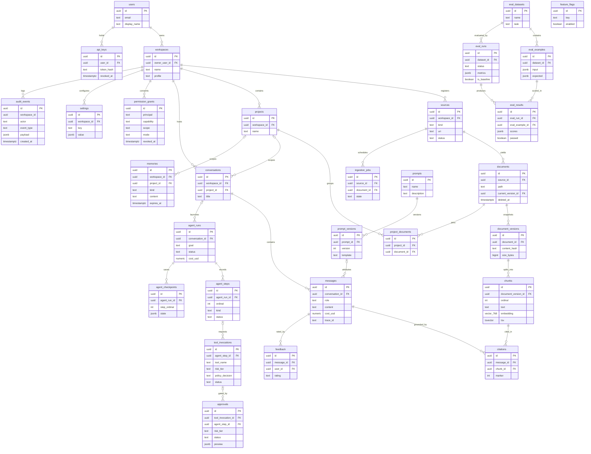

# Atlas — Database Schema & ERD

> Deliverable(s) 6 and 21. Conforms to [00-architecture-decisions.md](00-architecture-decisions.md).

---

PostgreSQL 16 with `pgvector` is the single datastore for relational data,
vectors, and full-text search (spine ADR-0003). One database means one backup,
one transaction boundary, and no consistency seam between "the index" and "the
truth" — a chunk row and its embedding commit together or not at all. The cost
is betting that Postgres is good enough at vector search; with HNSW at
single-user corpus sizes (10^5–10^6 chunks) it comfortably is. Extensions:
`CREATE EXTENSION IF NOT EXISTS vector;`

## 1. Conventions

### 1.1 Primary keys: UUIDv7, generated application-side

Every table uses `id uuid PRIMARY KEY` minted by `atlas/shared/ids.py` (spine
ADR-0009), never a DB default. UUIDv7 is time-ordered, so inserts on
append-heavy tables (`messages`, `audit_events`, `chunks`) land on the right
edge of the B-tree instead of splattering random pages the way UUIDv4 does —
and PK order doubles as creation order, which the messages query exploits.
App-side generation lets the domain mint identities before persistence
(aggregates reference each other pre-commit, tests inject a deterministic id
factory, workers create ids offline); Postgres 16 has no native UUIDv7
generator anyway.

### 1.2 Timestamps

`created_at` / `updated_at` are `timestamptz` (UTC), set by the SQLAlchemy
layer (`onupdate`), not DB triggers — one writer, one clock abstraction, and
Alembic autogenerate stays cleanly diffable. **Convention: every table has
both columns; they are omitted from the DDL below for brevity. Append-only
tables carry `created_at` only and are marked `-- immutable`:**
`document_versions`, `chunks`, `citations`, `feedback`, `project_documents`,
`agent_checkpoints`, `prompt_versions`, `eval_results`, `audit_events`,
`messages`.

### 1.3 Enums: `text` + `CHECK`, not Postgres enum types

All enumerations are `text` columns with `CHECK (col IN (...))`. Native enums
look cleaner but age badly: values can be added yet never removed or
reordered, `ALTER TYPE ... ADD VALUE` interacts awkwardly with transactional
migrations, and SQLAlchemy autogenerate produces noisy, sometimes wrong diffs
for them. A CHECK constraint migrates additively — drop and recreate in one
transaction — and keeps the canonical definition where it belongs: in the
domain layer's value objects, with the database merely enforcing it. The cost
(a few bytes per row versus an enum OID) is irrelevant at local-first scale.

### 1.4 Soft deletes

`deleted_at timestamptz` appears only where the domain needs user-visible,
reversible removal *and* other rows keep pointing at the row afterwards:
`sources`, `documents`, `projects`, `conversations`, `memories` — citations
must keep resolving after a document leaves search; conversations restore
from trash. Everything else hard-deletes or is immutable and pruned by
retention (§4). `audit_events` never has `deleted_at`: an audit log you can
edit is not an audit log (spine §7, §11), so the application role also gets
`INSERT`/`SELECT` only, with `UPDATE`/`DELETE` revoked at the role level.

### 1.5 Referential and index conventions

FKs are `NOT NULL` unless optionality is domain-meaningful; `ON DELETE
CASCADE` only from owner to owned rows inside one aggregate (messages,
chunks, steps), never across contexts. Every FK on a hot path gets an index;
partial indexes (`WHERE deleted_at IS NULL`, `WHERE status = 'pending'`) keep
them small. Constraint names follow a fixed SQLAlchemy `naming_convention` so
autogenerate diffs stay stable.

## 2. Schema by bounded context

Creation order follows this section order, except that `agent_steps` precedes
`tool_invocations` (FK direction); the one circular reference
(`documents.current_version_id ⇄ document_versions`) is resolved by adding
the FK via `ALTER TABLE` after both tables exist.

### 2.1 Identity & configuration

Atlas is single-user today but JWT/OIDC-ready (spine §5), so `users` and
`workspaces` exist from day one; every domain row hangs off a workspace.

```sql
CREATE TABLE users (
  id uuid PRIMARY KEY,
  email text NOT NULL UNIQUE, display_name text NOT NULL
);

CREATE TABLE workspaces (
  id uuid PRIMARY KEY,
  owner_user_id uuid NOT NULL REFERENCES users(id), name text NOT NULL,
  profile text NOT NULL DEFAULT 'hybrid' CHECK (profile IN ('hybrid','local_only'))
);

CREATE TABLE api_keys (            -- hashed local bearer tokens (spine: local token auth)
  id uuid PRIMARY KEY,
  user_id uuid NOT NULL REFERENCES users(id), name text NOT NULL,
  token_hash text NOT NULL UNIQUE, -- SHA-256; plaintext shown once, never stored
  last_used_at timestamptz, expires_at timestamptz, revoked_at timestamptz
);
CREATE INDEX api_keys_user_idx ON api_keys (user_id) WHERE revoked_at IS NULL;

CREATE TABLE settings (
  id uuid PRIMARY KEY,
  workspace_id uuid NOT NULL REFERENCES workspaces(id),
  key text NOT NULL, value jsonb NOT NULL,
  UNIQUE (workspace_id, key)
);

CREATE TABLE feature_flags (       -- DB-backed overrides, flip without redeploy (doc 03)
  id uuid PRIMARY KEY,
  key text NOT NULL UNIQUE, enabled boolean NOT NULL DEFAULT false, payload jsonb
);
```

### 2.2 Knowledge

Immutable content-hash-keyed versions, chunks owned by versions, atomic
current-version flip — justified in doc 10 §4.

```sql
CREATE TABLE sources (
  id uuid PRIMARY KEY,
  workspace_id uuid NOT NULL REFERENCES workspaces(id),
  kind text NOT NULL CHECK (kind IN ('folder','git','drive','notion','slack','email')),
  name text NOT NULL, uri text NOT NULL,   -- folder path now; connector URI at M22
  config jsonb NOT NULL DEFAULT '{}',
  status text NOT NULL DEFAULT 'active' CHECK (status IN ('active','paused','error')),
  last_indexed_at timestamptz, deleted_at timestamptz,
  UNIQUE (workspace_id, uri)
);

CREATE TABLE documents (
  id uuid PRIMARY KEY,
  source_id uuid NOT NULL REFERENCES sources(id),
  path text NOT NULL,              -- stable source-relative path / external id (spine §6)
  title text, mime_type text,
  current_version_id uuid,         -- FK added below (circular)
  deleted_at timestamptz,
  UNIQUE (source_id, path)
);

CREATE TABLE document_versions (   -- immutable
  id uuid PRIMARY KEY,
  document_id uuid NOT NULL REFERENCES documents(id) ON DELETE CASCADE,
  content_hash text NOT NULL,      -- SHA-256 hex of raw bytes
  size_bytes bigint NOT NULL, parser text NOT NULL,
  meta jsonb NOT NULL DEFAULT '{}',
  UNIQUE (document_id, content_hash)
);
ALTER TABLE documents ADD CONSTRAINT documents_current_version_fk
  FOREIGN KEY (current_version_id) REFERENCES document_versions(id);

CREATE TABLE chunks (              -- immutable; re-chunk = new version's rows
  id uuid PRIMARY KEY,
  document_version_id uuid NOT NULL REFERENCES document_versions(id) ON DELETE CASCADE,
  ordinal int NOT NULL, text text NOT NULL, token_count int NOT NULL,
  heading_path text[] NOT NULL DEFAULT '{}', -- structure-aware breadcrumb (spine §10)
  meta jsonb NOT NULL DEFAULT '{}',
  embedding vector(768) NOT NULL,  -- dim is a deployment-profile constant (spine §7)
  embedding_model text NOT NULL,   -- 'nomic-embed-text'; single model per index
  tsv tsvector GENERATED ALWAYS AS (to_tsvector('english', text)) STORED,
  UNIQUE (document_version_id, ordinal)
);
CREATE INDEX chunks_embedding_hnsw ON chunks
  USING hnsw (embedding vector_cosine_ops) WITH (m = 16, ef_construction = 64);
CREATE INDEX chunks_tsv_gin ON chunks USING gin (tsv);

CREATE TABLE ingestion_jobs (
  id uuid PRIMARY KEY,
  source_id uuid NOT NULL REFERENCES sources(id),
  document_id uuid REFERENCES documents(id),  -- NULL for source-wide sweeps
  state text NOT NULL DEFAULT 'pending' CHECK (state IN ('pending','running','succeeded','failed','skipped')),
  attempts int NOT NULL DEFAULT 0, error text, trace_id text,
  started_at timestamptz, finished_at timestamptz
);
CREATE INDEX ingestion_jobs_state_idx ON ingestion_jobs (state, created_at);
CREATE INDEX ingestion_jobs_document_idx ON ingestion_jobs (document_id);
```

Chunks are inserted only after embedding succeeds (the pipeline embeds, then
batch-inserts), so `embedding` is honestly `NOT NULL` and search never sees a
half-embedded version.

### 2.3 Projects

```sql
CREATE TABLE projects (
  id uuid PRIMARY KEY,
  workspace_id uuid NOT NULL REFERENCES workspaces(id),
  name text NOT NULL, description text, deleted_at timestamptz,
  UNIQUE (workspace_id, name)
);

CREATE TABLE project_documents (   -- immutable membership; detach = delete row
  id uuid PRIMARY KEY,
  project_id uuid NOT NULL REFERENCES projects(id) ON DELETE CASCADE,
  document_id uuid NOT NULL REFERENCES documents(id) ON DELETE CASCADE,
  UNIQUE (project_id, document_id)
);
CREATE INDEX project_documents_document_idx ON project_documents (document_id);
```

### 2.4 Conversation

```sql
CREATE TABLE conversations (
  id uuid PRIMARY KEY,
  workspace_id uuid NOT NULL REFERENCES workspaces(id),
  project_id uuid REFERENCES projects(id),    -- optional scoped search (M13)
  title text, deleted_at timestamptz
);
CREATE INDEX conversations_ws_idx ON conversations (workspace_id, updated_at DESC) WHERE deleted_at IS NULL;

CREATE TABLE messages (            -- immutable; UUIDv7 PK order = chronological order
  id uuid PRIMARY KEY,
  conversation_id uuid NOT NULL REFERENCES conversations(id) ON DELETE CASCADE,
  role text NOT NULL CHECK (role IN ('user','assistant','tool','system')),
  content text NOT NULL,
  abstained boolean NOT NULL DEFAULT false,   -- grounded-or-silent, made queryable
  model text, prompt_version_id uuid REFERENCES prompt_versions(id),
  input_tokens int, output_tokens int, cost_usd numeric(12,6), latency_ms int,
  trace_id text
);
CREATE INDEX messages_conversation_idx ON messages (conversation_id, id);

CREATE TABLE citations (           -- immutable
  id uuid PRIMARY KEY,
  message_id uuid NOT NULL REFERENCES messages(id) ON DELETE CASCADE,
  chunk_id uuid NOT NULL REFERENCES chunks(id),
  marker int NOT NULL, score real, -- marker is the [n] inline label (spine §10)
  UNIQUE (message_id, marker)
);
CREATE INDEX citations_chunk_idx ON citations (chunk_id);

CREATE TABLE feedback (            -- immutable; POST /messages/{id}/feedback
  id uuid PRIMARY KEY,
  message_id uuid NOT NULL REFERENCES messages(id) ON DELETE CASCADE,
  user_id uuid NOT NULL REFERENCES users(id),
  rating text NOT NULL CHECK (rating IN ('up','down')), comment text
);
```

`citations.chunk_id` has no cascade: deleting a cited chunk must fail loudly
— that restrictive FK is the retention interlock §4 relies on.

### 2.5 Memory

```sql
CREATE TABLE memories (
  id uuid PRIMARY KEY,
  workspace_id uuid NOT NULL REFERENCES workspaces(id),
  project_id uuid REFERENCES projects(id),    -- NULL = workspace scope (doc 10 §8)
  kind text NOT NULL CHECK (kind IN ('preference','project_fact','decision','entity','episodic')),
  content text NOT NULL,
  source_message_id uuid REFERENCES messages(id),  -- provenance
  confidence real, expires_at timestamptz, deleted_at timestamptz,
  CHECK (kind <> 'project_fact' OR project_id IS NOT NULL)
);
CREATE INDEX memories_scope_idx ON memories (workspace_id, project_id, kind) WHERE deleted_at IS NULL;
```

### 2.6 Tools & permissions

```sql
CREATE TABLE permission_grants (
  id uuid PRIMARY KEY,
  workspace_id uuid NOT NULL REFERENCES workspaces(id),
  principal text NOT NULL,         -- 'user:<uuid>' today (doc 10 §13)
  capability text NOT NULL,        -- namespaced verb: 'fs.read', 'terminal.run' (spine §11)
  scope text NOT NULL,             -- glob: '~/Projects/**'
  mode text NOT NULL CHECK (mode IN ('auto','ask')),  -- tighten-only override
  expires_at timestamptz, revoked_at timestamptz
);
CREATE INDEX permission_grants_lookup_idx ON permission_grants (workspace_id, capability) WHERE revoked_at IS NULL;

CREATE TABLE tool_invocations (
  id uuid PRIMARY KEY,
  workspace_id uuid NOT NULL REFERENCES workspaces(id),
  tool_name text NOT NULL, capability text NOT NULL,
  risk_tier text NOT NULL CHECK (risk_tier IN ('T0','T1','T2','T3')),
  params jsonb NOT NULL,
  policy_decision text NOT NULL CHECK (policy_decision IN ('allowed','denied','needs_approval')),
  status text NOT NULL DEFAULT 'pending' CHECK (status IN
    ('pending','awaiting_approval','running','succeeded','failed','denied','cancelled')),
  result jsonb, error text, trace_id text,
  agent_step_id uuid REFERENCES agent_steps(id),  -- NULL for direct chat tool use
  started_at timestamptz, finished_at timestamptz
);
CREATE INDEX tool_invocations_status_idx ON tool_invocations (workspace_id, status, created_at);

CREATE TABLE approvals (
  id uuid PRIMARY KEY,
  workspace_id uuid NOT NULL REFERENCES workspaces(id),
  tool_invocation_id uuid REFERENCES tool_invocations(id),
  agent_step_id uuid REFERENCES agent_steps(id),
  risk_tier text NOT NULL CHECK (risk_tier IN ('T2','T3')),
  preview jsonb NOT NULL,          -- rendered preview; T3 adds typed confirmation
  status text NOT NULL DEFAULT 'pending' CHECK (status IN ('pending','approved','denied','expired')),
  decided_by uuid REFERENCES users(id), decided_at timestamptz, decision_note text,
  CHECK (num_nonnulls(tool_invocation_id, agent_step_id) = 1)
);
CREATE INDEX approvals_pending_idx ON approvals (workspace_id, created_at) WHERE status = 'pending';

CREATE TABLE audit_events (        -- immutable, append-only; no FKs by design
  id uuid NOT NULL,
  workspace_id uuid NOT NULL,
  actor text NOT NULL,             -- 'user:<uuid>' | 'agent:<run uuid>' | 'system'
  event_type text NOT NULL,        -- 'permission.granted', 'tool.denied', …
  subject_type text NOT NULL, subject_id uuid,
  payload jsonb NOT NULL DEFAULT '{}', trace_id text,
  created_at timestamptz NOT NULL,
  PRIMARY KEY (id, created_at)     -- partition key must be in the PK
) PARTITION BY RANGE (created_at);
CREATE TABLE audit_events_2026_07 PARTITION OF audit_events
  FOR VALUES FROM ('2026-07-01') TO ('2026-08-01');
CREATE INDEX audit_events_ws_time_idx ON audit_events (workspace_id, created_at);
CREATE INDEX audit_events_type_idx ON audit_events (event_type, created_at);
```

`audit_events` has no foreign keys: evidence must outlive whatever it
describes and never block domain deletes; referents are plain
`subject_type` + `subject_id` values.

### 2.7 Agents

```sql
CREATE TABLE agent_runs (
  id uuid PRIMARY KEY,
  workspace_id uuid NOT NULL REFERENCES workspaces(id),
  conversation_id uuid REFERENCES conversations(id),
  goal text NOT NULL,
  plan jsonb,                      -- frozen Plan value, replaced on re-plan (doc 10 §6)
  status text NOT NULL DEFAULT 'pending' CHECK (status IN
    ('pending','running','awaiting_approval','succeeded','failed','cancelled')),
  model text, trace_id text,
  input_tokens bigint NOT NULL DEFAULT 0, output_tokens bigint NOT NULL DEFAULT 0,
  cost_usd numeric(12,6) NOT NULL DEFAULT 0,
  started_at timestamptz, finished_at timestamptz
);
CREATE INDEX agent_runs_ws_idx ON agent_runs (workspace_id, created_at DESC);

CREATE TABLE agent_steps (
  id uuid PRIMARY KEY,
  agent_run_id uuid NOT NULL REFERENCES agent_runs(id) ON DELETE CASCADE,
  ordinal int NOT NULL,            -- dense, gapless (doc 10 §6)
  kind text NOT NULL CHECK (kind IN ('thought','tool','observation')),
  content jsonb NOT NULL,
  status text NOT NULL DEFAULT 'running' CHECK (status IN ('running','succeeded','failed','skipped')),
  UNIQUE (agent_run_id, ordinal)
);

CREATE TABLE agent_checkpoints (   -- immutable
  id uuid PRIMARY KEY,
  agent_run_id uuid NOT NULL REFERENCES agent_runs(id) ON DELETE CASCADE,
  step_ordinal int NOT NULL,
  state jsonb NOT NULL,            -- resumable runtime state; Temporal-owned at M19
  UNIQUE (agent_run_id, step_ordinal)
);
```

### 2.8 Prompt registry

```sql
CREATE TABLE prompts (
  id uuid PRIMARY KEY,
  name text NOT NULL UNIQUE,       -- 'rag.answer', 'agent.plan', 'memory.distill' …
  description text
);

CREATE TABLE prompt_versions (     -- immutable: a version's template never changes
  id uuid PRIMARY KEY,
  prompt_id uuid NOT NULL REFERENCES prompts(id),
  version int NOT NULL, template text NOT NULL,
  variables jsonb NOT NULL DEFAULT '[]',
  content_hash text NOT NULL,      -- guards against silent template drift
  UNIQUE (prompt_id, version)
);
```

### 2.9 Evaluation

Golden datasets live in `evals/` JSONL under git; these tables are the loaded
queryable copies plus run history for the CI regression gate (M11).

```sql
CREATE TABLE eval_datasets (
  id uuid PRIMARY KEY,
  name text NOT NULL UNIQUE,
  task text NOT NULL CHECK (task IN ('retrieval','grounding','tool_selection')),
  description text
);

CREATE TABLE eval_examples (
  id uuid PRIMARY KEY,
  dataset_id uuid NOT NULL REFERENCES eval_datasets(id) ON DELETE CASCADE,
  input jsonb NOT NULL, expected jsonb NOT NULL,
  tags text[] NOT NULL DEFAULT '{}'
);

CREATE TABLE eval_runs (
  id uuid PRIMARY KEY,
  dataset_id uuid NOT NULL REFERENCES eval_datasets(id),
  git_sha text, config jsonb NOT NULL DEFAULT '{}', -- model, prompt versions, k values
  status text NOT NULL DEFAULT 'pending' CHECK (status IN ('pending','running','succeeded','failed')),
  metrics jsonb,                   -- aggregates: recall_at_8, groundedness, cost
  is_baseline boolean NOT NULL DEFAULT false,       -- pinned for CI comparison
  started_at timestamptz, finished_at timestamptz
);
CREATE INDEX eval_runs_dataset_idx ON eval_runs (dataset_id, created_at DESC);

CREATE TABLE eval_results (        -- immutable
  id uuid PRIMARY KEY,
  eval_run_id uuid NOT NULL REFERENCES eval_runs(id) ON DELETE CASCADE,
  eval_example_id uuid NOT NULL REFERENCES eval_examples(id),
  output jsonb NOT NULL, scores jsonb NOT NULL, passed boolean NOT NULL,
  UNIQUE (eval_run_id, eval_example_id)
);
```

## 3. Hybrid search: the RRF query

Candidate generation per spine §10: top 24 by cosine over HNSW, top 24 by FTS
(`websearch_to_tsquery` + `ts_rank_cd`), fused with Reciprocal Rank Fusion at
k = 60. Both arms filter to chunks of **current** versions of non-deleted
documents — superseded chunks exist only for citations, never for search.

```sql
WITH vec AS (
  SELECT c.id, row_number() OVER (ORDER BY c.embedding <=> :qvec) AS rnk
  FROM chunks c
  JOIN document_versions dv ON dv.id = c.document_version_id
  JOIN documents d ON d.current_version_id = dv.id AND d.deleted_at IS NULL
  ORDER BY c.embedding <=> :qvec
  LIMIT 24
), fts AS (
  SELECT c.id, row_number() OVER (
      ORDER BY ts_rank_cd(c.tsv, websearch_to_tsquery('english', :qtext)) DESC) AS rnk
  FROM chunks c
  JOIN document_versions dv ON dv.id = c.document_version_id
  JOIN documents d ON d.current_version_id = dv.id AND d.deleted_at IS NULL
  WHERE c.tsv @@ websearch_to_tsquery('english', :qtext)
  LIMIT 24
)
SELECT id AS chunk_id,
       coalesce(1.0 / (60 + v.rnk), 0) + coalesce(1.0 / (60 + f.rnk), 0) AS rrf_score
FROM vec v FULL OUTER JOIN fts f USING (id)
ORDER BY rrf_score DESC
LIMIT 24;  -- fused top 24 → optional cross-encoder rerank → final top 8 (spine §10)
```

The HNSW index engages only for the exact shape `ORDER BY embedding <=> :const
LIMIT n`, which is why the vector arm keeps it; project-scoped search adds a
`project_documents` join to both arms. `SET LOCAL hnsw.ef_search = 40` trades
a little latency for recall — tuned by the retrieval eval suite, not by feel.

## 4. Retention & partitioning

**`audit_events`** is range-partitioned by month from day one (§2.6):
append-only tables are pruned by dropping partitions, not by million-row
`DELETE`s that bloat and lock. A Celery beat job creates next month's
partition ahead of time and, past the retention horizon (default 24 months),
detaches expired partitions and exports them to compressed JSONL in the
user's data directory before dropping — the trail leaves the hot store but is
never silently destroyed.

**`messages`** is deliberately *not* partitioned at v1: single-user volume is
far below where partitioning pays, and `(conversation_id, id)` gives locality
for every real query. Retention is user-controlled, not time-based:
soft-deleted conversations are purged (cascading messages) 30 days after
deletion by a janitor task, and an optional setting prunes `tool`/`system`
roles older than a horizon. If Atlas becomes multi-tenant, monthly
partitioning on `created_at` is the escape hatch — the UUIDv7 PK already
clusters by time.

**Superseded `document_versions`** and their chunks are pruned by the same
janitor: keep the current version plus the last two, plus any version whose
chunks are referenced by `citations` — the restrictive FK on
`citations.chunk_id` turns that policy into a hard guarantee.

## 5. Migrations: Alembic strategy

One Alembic environment in `apps/api/alembic/`, **autogenerate + hand
review**: every migration starts from `alembic revision --autogenerate` but
is read and edited before commit, because autogenerate cannot see everything
we use — `vector` columns, HNSW/GIN options, generated `tsvector` columns,
partition DDL, and CHECK changes are hand-written via `op.execute`. CI
enforces a **single head** (`alembic heads` must return exactly one), so
parallel branches rebase migrations instead of forking history, and runs
upgrade-from-empty plus downgrade-one-step against a scratch Postgres.

Policy is **additive-first** (expand/contract): new columns arrive nullable
or defaulted, code reads both shapes, backfill runs as a job, then a later
migration tightens to `NOT NULL`; renames are add + dual-write + backfill +
drop across releases; destructive changes ship only after no code references
the old shape. This matters even for a desktop app — users skip versions, so
any released schema must upgrade cleanly to any later one, possibly replaying
months of migrations in one launch.

## 6. Re-embedding migrations (model or dimension change)

The embedding dimension is a deployment-profile constant and a mixed index is
forbidden (spine §7). Switching models — say `nomic-embed-text` 768d to a
1024d successor — is an explicit blue-green migration:

1. **Expand:** add `embedding_next vector(1024)` (nullable, no index). Search
   continues on `embedding`.
2. **Backfill:** a Celery re-embed sweep walks current document versions and
   fills `embedding_next`, tracked as `ingestion_jobs` rows — resumable,
   observable via the index-lag metric, throttled, and idempotent (rows with
   `embedding_next IS NOT NULL` are skipped on retry).
3. **Verify:** counts reconcile and the retrieval eval suite (M11) passes
   against a shadow index on the new column — quality regressions are caught
   before cutover, not after.
4. **Cut over:** build the new HNSW index, then in one transaction drop the
   old index and column, rename `embedding_next` to `embedding`, and update
   `embedding_model`. Rollback before this step is dropping a column;
   after it, it is the same procedure run in reverse.

Chunks pruned by retention are never backfilled — the sweep's unit of work is
the current-version chunk set, mirroring exactly what search can reach.

## 7. Entity–relationship diagram (full schema)

All 30 tables; attributes trimmed to the most important columns per entity.



Workspace FKs are drawn only where structurally interesting; every context
table carries `workspace_id` as shown in §2. `feature_flags` is standalone.

## 8. Decisions made in this document

- Enums are `text` + `CHECK` (spine left this open; justified in §1.3).
- `updated_at` maintained by the ORM (`onupdate`), not DB triggers.
- Immutable-table set (§1.2) and soft-delete set (§1.4) fixed as listed;
  `audit_events` additionally loses `UPDATE`/`DELETE` at the role level.
- `documents.current_version_id` circular FK added via post-create `ALTER`.
- `api_keys` stores SHA-256 hashes of local bearer tokens, shown once.
- `chunks.embedding_model` column makes single-model-per-index enforceable
  and the re-embed cutover (§6) bookkeepable.
- HNSW built with pgvector defaults `m = 16, ef_construction = 64`;
  `hnsw.ef_search` tuned per query via the eval suite.
- `audit_events`: monthly partitions, 24-month default retention with JSONL
  export on expiry; `messages`: unpartitioned at v1 with a documented escape
  hatch; superseded versions pruned keep-last-3 unless cited.
- `eval_runs.is_baseline` pins the CI comparison run; `messages.abstained`
  makes grounded-or-silent auditable in SQL.
