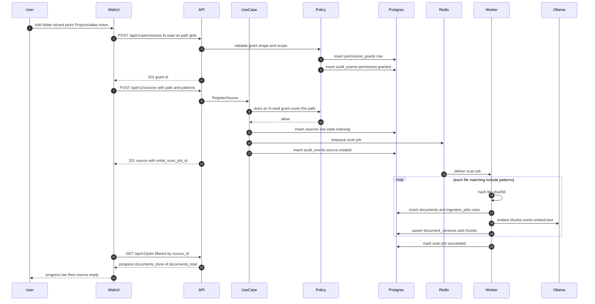
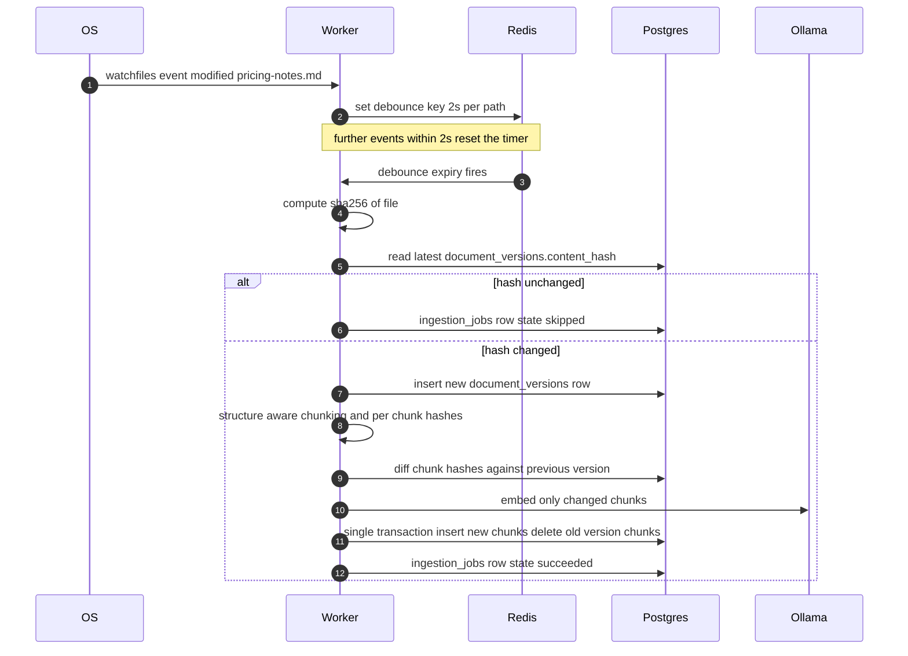
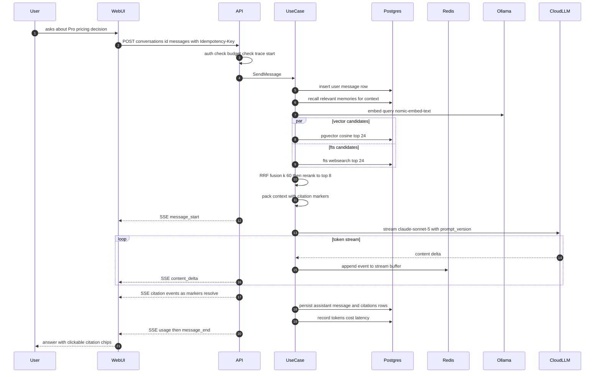
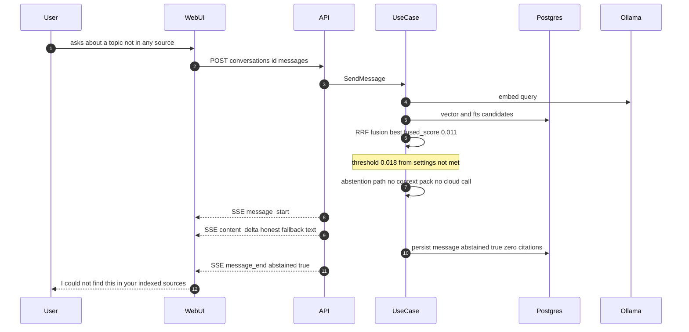
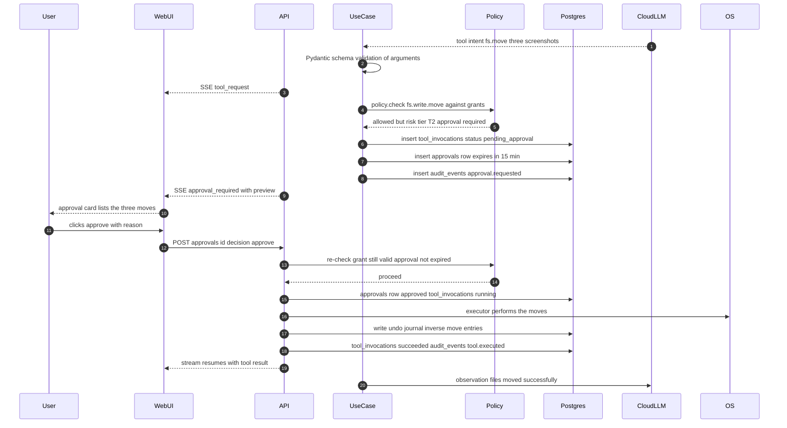
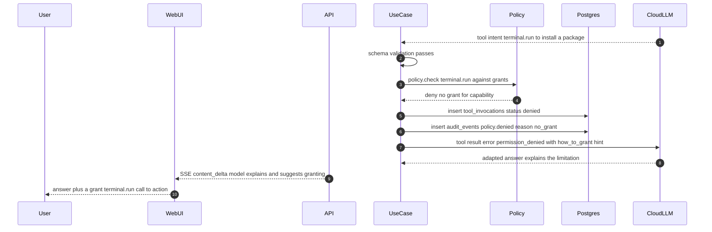
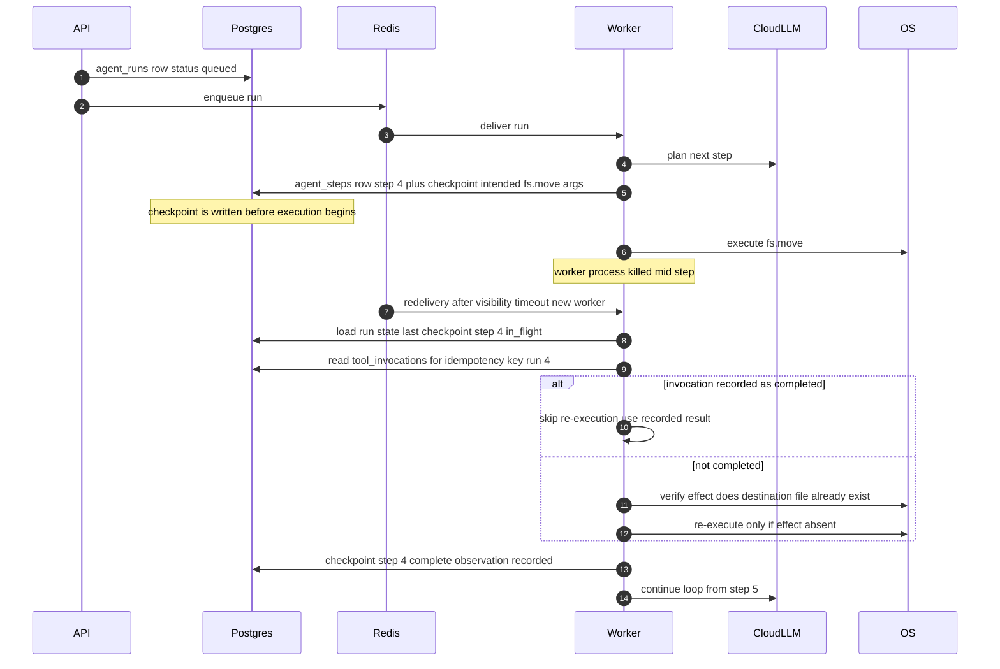
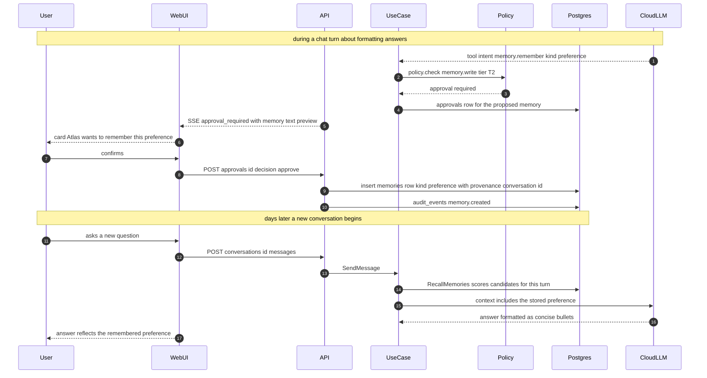
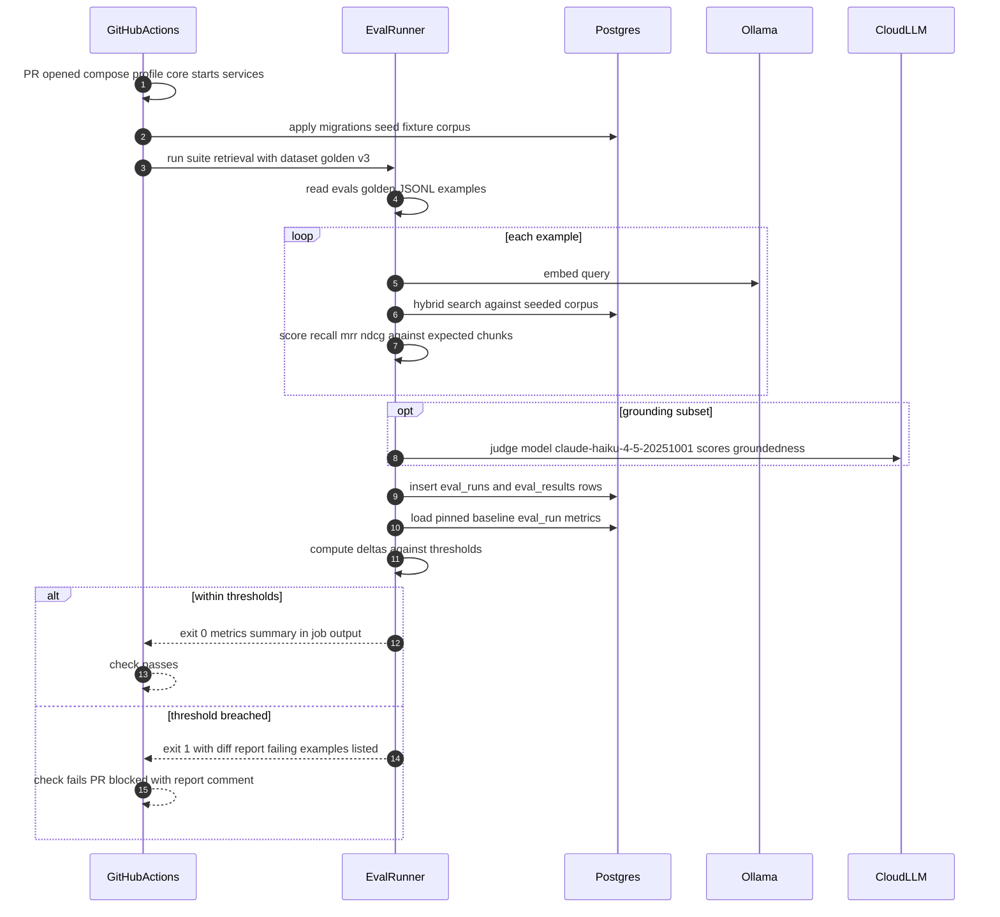
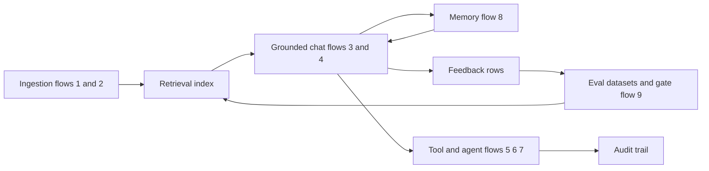

# Atlas — Sequence Flows

> Deliverable 19. Conforms to [00-architecture-decisions.md](00-architecture-decisions.md).

---

Nine flows that define how Atlas actually behaves at runtime. Participants use
consistent short names throughout: **User**, **WebUI** (Next.js), **API**
(FastAPI presentation), **UseCase** (application layer), **Policy**
(deterministic permission engine), **Postgres** (`PG`), **Redis**, **Worker**
(Celery), **Ollama**, **CloudLLM** (`Cloud`), **OS**. Endpoint shapes and error
codes referenced here are normative in
[12-api-specification.md](12-api-specification.md); span names and audit
conventions are fixed in spine §12.

Each flow is followed by its **failure paths** (what breaks, and what the system
does about it) and its **observability trail** (the spans, metrics, and
`audit_events` rows the flow leaves behind). A flow that leaves no trail did not
happen — that is principle 7, "no magic".

---

## Flow 1 — Source registration and first index

The user points Atlas at a folder. Registration is two explicit user actions —
grant, then source — because grants are never created implicitly (spine §11).

**Failure paths.** No covering grant → `403 permission_denied` at source
creation; the wizard routes the user back to the grant step. Nonexistent or
relative path → `422 validation_error`. Duplicate path → `409 conflict`.
Per-file failures never kill the scan: a parse error marks that file's
`ingestion_jobs` row `failed` with the error payload (e.g.
`unsupported_file_type`), retried up to 3 times with backoff before parking —
the scan job's `progress.failed` counter surfaces it in the UI. Ollama down →
embed steps retry with backoff; the job stays `running` and Redis queue depth
alerts fire rather than data being lost.

**Observability trail.** One trace per file: `ingest.parse` → `ingest.chunk` →
`ingest.embed`, all child spans of the scan job's root span. Audit rows:
`permission.granted`, `source.created`. Metrics: `atlas_ingest_files_total`
(by outcome), queue depth, index lag. The `jobs` API is a *view* over this
trail, not a separate bookkeeping system.

---

## Flow 2 — File modified, incremental re-index

The watcher turns filesystem noise into the minimum necessary work: debounce
collapses editor save-storms, the hash gate skips no-op writes, and chunk-level
diffing re-embeds only what changed.

**The stale-read window, explained.** Between the OS event and the final commit,
search serves the *previous* DocumentVersion — consistent but stale, typically
for 2–10 seconds. This is deliberate: the swap is one transaction, so a query
sees either the complete old version or the complete new one, never a
half-indexed hybrid. Old-and-consistent beats new-and-partial for a grounding
system — a citation must never point into a chunk set that is mid-rewrite. The
window is surfaced honestly: the search response's `index_freshness` block
reports `pending_jobs`, and `require_fresh: true` turns staleness into an
explicit `409 index_stale` for callers that care (evals do).

**Failure paths.** Crash after the new `document_versions` row but before the
chunk swap → the transaction never committed, so search still serves the old
version; the job row is `running` with a stale heartbeat and is re-enqueued by
the beat sweep. File deleted between event and hash → job `skipped`, document
marked deleted. Embedding failure → retry; after max attempts the job parks
`failed` and the old version keeps serving.

**Observability trail.** Spans `ingest.parse`, `ingest.chunk`, `ingest.embed`
(the skip path emits only a short-circuited root span with
`skip_reason=hash_unchanged`). Metrics: `atlas_index_lag_seconds` (event time →
searchable time), re-embed ratio (changed chunks / total chunks — the payoff
metric for incremental indexing). No audit rows: routine indexing is not a
security event.

---

## Flow 3 — Grounded chat turn, end to end (flagship)

Everything Atlas stands for in one request: hybrid retrieval, streaming with
citations, cost accounting, and a trace that stitches it all together.

**Failure paths.** Budget cap hit → `402 budget_exceeded` *before* any tokens
are bought (pre-stream, plain problem+json). Cloud provider errors → the
`atlas/ai` fallback chain retries, then trips the circuit breaker and falls
back to `llama3.1:8b` with a visible "answered locally" notice; if everything
is down, a terminal SSE `error` event carries `provider_unavailable`. Client
disconnect mid-stream → generation continues detached (events accumulate in the
Redis buffer); the client resumes via `GET /messages/{id}/stream` with
`Last-Event-ID` and misses nothing. Idempotent retry of the POST re-attaches to
the same stream rather than double-charging.

**Observability trail.** One trace: root request span → `rag.retrieve` (child
spans for the two candidate queries) → `rag.rerank` → `llm.call` with full
GenAI attributes (provider, model, `prompt_version=grounded_chat.v7`, tokens,
cost USD, stop reason). The `usage` SSE event is the client-visible projection
of the `llm.call` span. Metrics: token and cost counters per conversation and
per day, retrieval latency histogram. Audit rows: none — reading your own data
with T0 capabilities is not a security event, which is exactly why chat feels
instant while tool use (flow 5) does not.

---

## Flow 4 — Low-confidence abstention

Grounded or silent (principle 4). When retrieval cannot support an answer,
Atlas says so — it never decorates a guess with fake citations.

The fallback message is templated (with the searched scope named), not
free-generated over the user's data — so there is nothing to hallucinate *with*.
The UI renders it distinctly and offers next actions: broaden filters, add a
source, or ask as an ungrounded general question (an explicit, labeled mode).

**Failure paths.** The interesting failures are calibration failures, caught by
evals rather than at runtime: threshold too high → false abstentions (recall
loss), too low → confident nonsense (groundedness loss). The
`abstention_accuracy` metric in the eval suite (flow 9) exists precisely to pin
this threshold, and `settings.retrieval.abstention_threshold` makes it tunable
without a deploy. A user who thinks the abstention was wrong presses feedback —
`POST /messages/{id}/feedback` — which lands the case in the next golden
dataset revision.

**Observability trail.** Spans `rag.retrieve` (with the sub-threshold
`fused_score` recorded as an attribute) and no `llm.call` in the templated
path — an abstained turn costs $0. Metrics: `atlas_rag_abstentions_total`
incremented, abstention rate dashboarded next to recall. The message row
carries `abstained=true`, making abstentions queryable for eval mining.

---

## Flow 5 — T2 tool invocation with human approval

The safety interlock in action: the model *requests*, policy *decides*, the
human *approves*, an executor *acts* — three separate components plus you
(spine principle 2).

**Failure paths.** User denies → invocation `denied`, the model receives the
denial with the user's reason as its observation and adapts (flow 6 shows the
no-grant variant). Approval expires (15 min TTL) → invocation auto-canceled,
audit row `approval.expired`, late decision → `410 approval_expired`. Grant
revoked between request and decision → the mandatory re-check denies; approvals
are decisions about *still-valid* permissions, never cached ones. Execution
fails midway (target volume full after 2 of 3 moves) → executor rolls back via
the undo journal entries already written, invocation `failed`, model informed.
Undo remains available to the user afterward for the success case too — T1/T2
actions are reversible by design.

**Observability trail.** Spans: `policy.check`, `tool.invoke` (with capability,
tier, and invocation id attributes), inside the surrounding chat/agent trace.
Audit rows: `approval.requested`, `approval.decided` (with the human's reason),
`tool.executed`, plus the undo journal entry. This is the flow with the richest
trail on purpose: every state transition of a write is reconstructible.

---

## Flow 6 — Policy denial path

A denial is a *normal, recorded outcome* — deterministic code saying no,
telling the model why in machine-readable form, and moving on. It is not an
exception, not a crash, and never a silent drop.

The denial payload returned to the model is structured —
`{ "error": { "code": "permission_denied", "capability": "terminal.run",
"how_to_grant": "Settings > Permissions" } }` — so the model can do something
useful with it: complete the task another way, or tell the user exactly which
grant is missing. The UI turns the same information into a one-click path to
the grant screen (which is still an explicit user action — the model cannot
click it).

**Failure paths.** This flow *is* the failure path working correctly. The
degenerate cases: a model that loops re-requesting the same denied capability
is cut off by the per-run duplicate-denial limit (3 identical denials → the
agent step fails with guidance); a malformed intent fails schema validation
*before* policy and is returned as a `validation_error` tool result the same
way. Nothing in either case throws past the interlock.

**Observability trail.** Span `policy.check` with outcome `deny` and the
matched rule (`no_grant`). Audit row `policy.denied` with capability, requested
scope, actor, and trace id — the audit log answers "has the model ever tried to
run terminal commands?" with a query, not a shrug. Metric:
`atlas_policy_decisions_total{outcome="deny"}` — a rising deny rate is a
product signal (the model wants things users haven't granted), not just a
security one.

---

## Flow 7 — Agent run with crash recovery

Agent steps are checkpointed **write-ahead**: the intended action is durably
recorded before it is attempted, so a dead worker never means a lost or
double-executed step.

**Idempotency of the interrupted call.** Each tool invocation carries a
deterministic idempotency key `(run_id, step_no)`. Recovery asks, in order:
does a completed `tool_invocations` row exist for this key (crash after commit)?
If not, is the *effect* already present in the world (crash between action and
commit — the destination file exists with the expected hash)? Only if both are
negative does the executor act again. Effect verification is part of each
tool's contract — this is why tools declare `reversible` and verifiable
postconditions in the registry.

**Failure paths.** Crash before the checkpoint → the step simply never
happened; planning re-runs (LLM calls are safe to repeat — they have no side
effects, only cost, which the run budget caps). Crash during a T2 step's
approval wait → nothing to recover; the approval row survives in Postgres and
the resumed worker re-attaches to it. Repeated crashes on the same step → after
3 recovery attempts the run parks `failed` with the checkpoint preserved for
inspection; it is never silently retried forever. Cancel during recovery →
terminal states win; recovery checks run status first.

**Observability trail.** One `agent.step` span per step (the recovered step
appears twice: an aborted span and a completed one, linked by step id — the
trace shows the crash honestly). Run-level trace links every step span. Audit
rows for any tool executions as in flow 5. Metrics: recovery count, steps per
run, run cost vs budget. The steps timeline (`GET /agent-runs/{id}/steps`)
exposes checkpoint ids so the UI can render "resumed here" markers.

---

## Flow 8 — Memory capture with user confirmation

The assistant proposes; the user disposes. Memory writes go through the same
tool interlock as file writes — `memory.remember` is a T2 tool, so remembering
something about you requires your click.

The `memories` row records provenance — the conversation and message ids where
the preference was proposed — so "why does Atlas think I like bullet points?"
has a clickable answer. Memories are a typed, closed set (`preference |
project_fact | decision | entity | episodic`), distinct from both chat history
and the knowledge index; recall at turn time is scored, scoped (project vs
global), and packed under its own token budget.

**Failure paths.** User declines → nothing is stored, and the decline is
itself recorded so the model stops re-proposing the same fact (dedup by
semantic similarity against both stored memories and recent declines). A
memory later proven wrong → `PATCH /memories/{id}` or delete, both audited;
provenance makes stale memories debuggable rather than mysterious. Recall
returning a contradictory pair (old and new preference) → newest-wins at pack
time, with the conflict logged for the memory-consolidation sweep.

**Observability trail.** Spans: `policy.check`, `tool.invoke` for the capture;
memory recall appears as an attribute set on the chat trace (memory ids packed,
token count). Audit rows: `approval.decided`, `memory.created` (and
`memory.deleted` on forget — forgetting is security-relevant). Metric: memories
recalled per turn, capture acceptance rate — a falling acceptance rate means
the proposer prompt is over-eager, which is an evals matter.

---

## Flow 9 — CI eval regression gate

Retrieval and grounding quality are guarded the same way types and tests are:
a PR that degrades them fails CI (principle 6). The gate runs the eval suite
against a seeded corpus and compares to a pinned baseline run.

The baseline is a **pinned `eval_runs` id** committed in the repo (updated
deliberately, in its own reviewed PR, when an improvement is accepted) — not
"whatever main scored last night", which would let quality drift one
imperceptible regression at a time. Thresholds are per-metric (e.g.
`recall_at_8` may not drop more than 0.02 absolute; `abstention_accuracy` may
not drop at all). The failure report is a diff: metric deltas plus the specific
golden examples that flipped, with expected vs actual chunks — reviewable like
a snapshot test, not a mystery number.

**Failure paths.** Flaky infrastructure (Ollama cold start) → the runner
retries an example twice before counting it, and distinguishes `error` from
`wrong` in `eval_results` — an errored run fails CI as *infra*, not as
*regression*, so nobody "fixes" a network blip by lowering a quality bar. Judge
model unavailable → the LLM-judged subset is skipped and reported as such; the
deterministic retrieval metrics still gate. Cost control: CI runs the
deterministic suites on every PR and the judged suites nightly and on
`evals`-labeled PRs.

**Observability trail.** `eval_runs` row with metrics, git SHA, dataset id,
baseline id, cost; `eval_results` rows per example. The runner emits the same
`rag.retrieve` spans as production — eval traffic is distinguishable by a
`atlas.eval_run_id` attribute, so an eval run can be traced exactly like a user
query. The eval history *is* the quality changelog of the product.

---

## How the flows compose — the product loop

Ingestion (flows 1–2) feeds retrieval; retrieval feeds chat (flows 3–4); chat
feeds memory (flow 8) and feedback; feedback becomes golden examples that feed
the eval gate (flow 9), which protects the retrieval and grounding quality that
chat depends on — closing the loop. The tool and agent flows (5–7) hang off
chat as the acting arm, with the audit trail as their permanent record. Every
arrow in the loop is one of the flows above, every flow leaves a trace, and no
arrow bypasses the policy interlock — which is the whole design, stated twice:
once as principles in the spine, and once here as behavior.

## Decisions made in this document

1. **Flow 9 participants** extend the canonical set with `CI` (GitHub Actions)
   and `Runner` (the eval harness from `atlas/evals`) — no canonical short name
   existed for either.
2. **Memory capture is modeled as a T2 tool** (`memory.remember`, capability
   `memory.write`): writes to the long-lived user model always require explicit
   confirmation, and reusing the approvals machinery gives one confirmation UI
   and a free audit trail instead of a parallel bespoke flow.
3. **Debounce window 2 s**, per-path, Redis-keyed (flow 2); duplicate-denial
   cutoff 3 per agent run (flow 6); step recovery limit 3 attempts (flow 7) —
   simplest defensible defaults, all configurable via settings.
4. **Baseline pinning**: the CI gate compares against a pinned `eval_runs` id
   committed in-repo, updated only by a reviewed PR (flow 9).
