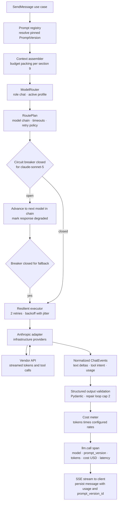

# Atlas — AI Provider & Model-Routing Architecture

> Deliverable 8. Conforms to [00-architecture-decisions.md](00-architecture-decisions.md).

---

## 1. Scope and position in the system

This document specifies the layer that turns "Atlas needs a model to do X" into a
completed, accounted, observable model call. It has three floors:

1. **Ports** — `LLMProvider` and `EmbeddingProvider`, pure Protocols owned by the
   domain. Everything above them is vendor-blind.
2. **Adapters** — `infrastructure/providers/{anthropic,openai,ollama}/`, the only
   code in Atlas allowed to import a vendor SDK or speak a vendor wire format.
3. **Runtime** — `atlas/ai/`: role-based routing, fallback chains, circuit
   breakers, retry/timeout policy, structured-output enforcement, the prompt
   registry (`atlas/ai/prompts/`), and token/cost accounting hooks.

Call sites — `SendMessage`, the agent runtime, memory extraction, title
generation, the eval harness — never name a vendor or a model id. They request a
**role** (§4). This is ports-and-adapters (hexagonal architecture) applied to
the most volatile dependency Atlas has: model vendors change pricing, ids, and
APIs far faster than our domain logic changes. The narrow waist keeps that
churn quarantined in adapters and one routing table.

Two spine principles shape everything here: *the model never touches the
computer* (§2.2 — the port returns tool-call **intent**, never executes it),
and *everything observable* (§2.5 — every call records prompt version, model,
tokens, cost, latency on an `llm.call` span).

## 2. The ports: `LLMProvider` and `EmbeddingProvider`

### 2.1 Design stance

The port models the **minimal common contract** all three vendors can honor:
chat messages in, streamed or complete response out, first-class tool-use,
mandatory usage reporting. Anything vendor-specific (server-side prompt
caching, vendor beta flags) is adapter configuration, never a call-site
parameter — the moment a use case passes a vendor knob, the port has leaked and
providers stop being interchangeable.

We deliberately made `usage` non-optional. A provider that cannot report exact
usage (older Ollama endpoints) must estimate and mark the estimate, because
cost accounting (§8) and the eval harness both depend on usage being present on
every response. An optional field would rot into "usually missing".

### 2.2 Protocol sketches

Ports live in `apps/api/src/atlas/domain/shared/` as typed Protocols with
Pydantic message types — pure Python, no SDK imports, per the spine's
dependency rule (§5).

```python
from collections.abc import AsyncIterator, Sequence
from typing import Literal, Protocol
from pydantic import BaseModel, Field

class ToolSpec(BaseModel):
    """A tool advertised to the model. JSON Schema, vendor-neutral."""
    name: str
    description: str
    input_schema: dict[str, object]

class ToolCall(BaseModel):
    """Model-produced INTENT. Never executed here — the policy engine
    and executors (docs 24/25) own permission and action (spine §2.2)."""
    id: str
    name: str
    arguments: dict[str, object]

class Usage(BaseModel):
    input_tokens: int
    output_tokens: int
    estimated: bool = False   # True when the adapter had to approximate

class ChatMessage(BaseModel):
    role: Literal["system", "user", "assistant", "tool"]
    content: str
    tool_calls: list[ToolCall] = Field(default_factory=list)
    tool_call_id: str | None = None      # set when role == "tool"

class ChatRequest(BaseModel):
    messages: Sequence[ChatMessage]
    tools: Sequence[ToolSpec] = ()
    max_tokens: int
    temperature: float = 0.2
    stop_sequences: Sequence[str] = ()

StopReason = Literal["end_turn", "tool_use", "max_tokens", "stop_sequence"]

class ChatResponse(BaseModel):
    message: ChatMessage                 # may carry tool_calls
    usage: Usage
    stop_reason: StopReason
    model: str                           # concrete model id actually used
    provider: str

class ChatEvent(BaseModel):
    """One streaming increment. The terminal event carries usage."""
    type: Literal["text_delta", "tool_call_delta", "usage", "done", "error"]
    text: str | None = None
    tool_call: ToolCall | None = None
    usage: Usage | None = None
    error_code: str | None = None

class LLMProvider(Protocol):
    name: str                            # "anthropic" | "openai" | "ollama"
    is_local: bool
    async def complete(self, model: str, request: ChatRequest) -> ChatResponse: ...
    def stream(self, model: str, request: ChatRequest) -> AsyncIterator[ChatEvent]: ...

class EmbeddingProvider(Protocol):
    name: str
    model: str                           # "nomic-embed-text"
    dimension: int                       # 768 — must match vector(768) (spine §7)
    async def embed(self, texts: Sequence[str]) -> list[list[float]]: ...
```

Notes on the shape:

- **Streaming is a first-class method, not a flag.** Chat UX streams over SSE
  (ADR-0008); background jobs (classification, extraction) use `complete`. Two
  methods keep both paths honestly typed instead of a union return.
- **`stop_reason` is normalized.** Adapters map vendor vocabularies
  (`end_turn`, `finish_reason=stop`, Ollama `done_reason`) onto four values the
  agent loop can branch on without vendor knowledge.
- **`dimension` is a property of the port**, so the ingestion pipeline can
  assert at startup that the configured embedding model matches the database
  column dimension. Switching models is an explicit re-embed migration, never a
  mixed index (spine §7).

## 3. Provider adapters — `infrastructure/providers/`

| Adapter | Serves | Transport | Notes |
|---|---|---|---|
| `anthropic/` | chat, escalation, classification (hybrid profile) | official `anthropic` SDK, SSE streaming | Native tool-use; maps our `ToolSpec` to Anthropic tool schema 1:1. |
| `openai/` | none by default | official `openai` SDK | Exists to prove the port is honest and as a user-configurable alternative; it earns no default route in spine §9. |
| `ollama/` | chat + classification (local-only), embeddings (both profiles) | HTTP to `localhost:11434` | `llama3.1:8b` for text, `nomic-embed-text` for vectors. JSON-mode structured output (§6). `is_local = True`. |

Every adapter has exactly four jobs:

1. **Auth** — read credentials via the keychain adapter
   (`infrastructure/security/`); API keys never appear in config files or logs.
2. **Mapping** — translate `ChatRequest`/`ChatResponse` to and from the vendor
   wire format, including incremental tool-call assembly during streaming.
3. **Error normalization** — collapse vendor exceptions into one taxonomy the
   runtime can reason about (below).
4. **Usage extraction** — populate `Usage` from vendor metadata; estimate
   (chars ÷ 4, `estimated=True`) only when the vendor omits it.

Normalized error taxonomy (domain errors, `domain/shared/`):

| Error | Typical causes | Retryable |
|---|---|---|
| `ProviderTimeout` | connect/first-token/total timeout exceeded | yes |
| `ProviderUnavailable` | 5xx, connection refused, Ollama not running | yes |
| `RateLimited(retry_after)` | 429 | yes, honoring `retry_after` |
| `AuthFailed` | 401/403, expired key | no — surface to user |
| `ContextWindowExceeded` | prompt too large | no — shrink and re-pack (§9) |
| `ContentRefused` | vendor safety refusal | no — surface honestly |
| `MalformedResponse` | unparseable stream, truncated JSON | once (counts as one retry) |

This taxonomy is the contract that lets retry policy (§5) live entirely above
the adapters: the runtime branches on error type, never on vendor status codes.

## 4. Model routing — `atlas/ai`

### 4.1 Roles, not models

The routing table is the spine §9 table, verbatim, keyed by role:

| Role | Hybrid profile (default) | Local-only profile |
|---|---|---|
| `chat` — chat / agent reasoning | Anthropic `claude-sonnet-5` | Ollama `llama3.1:8b` |
| `escalation` — complex planning / synthesis | Anthropic `claude-opus-4-8` | — (role unavailable; callers degrade to `chat`) |
| `classification` — cheap classification / routing / titles | Anthropic `claude-haiku-4-5-20251001` | Ollama `llama3.1:8b` |
| `embedding` | Ollama `nomic-embed-text` (768d, always local) | same |

(Reranking is not an LLM role; the optional cross-encoder `bge-reranker-base`
sits behind the separate `Reranker` port — see
[21-rag-architecture.md](21-rag-architecture.md).)

A call site asks the `ModelRouter` for a role; the router resolves
`(role, profile)` into a **RoutePlan**: an ordered model chain, the timeout
class, the retry policy, and default `max_tokens`. Escalation is always an
explicit decision — the agent planner requests it for multi-step synthesis, and
the user can force it per message — never an invisible auto-upgrade, because
opus-class calls are an order of magnitude more expensive and *no magic* is a
spine principle (§2.7).

### 4.2 Profiles are enforced structurally, then defensively

**Hybrid** (default): local data and indexing, cloud reasoning. **Local-only**:
no bytes leave the machine. The router respects this twice:

- *Structurally*: in local-only profile, route plans are built exclusively from
  providers with `is_local == True`. Cloud models are not "deprioritized" —
  they are absent from the plan.
- *Defensively*: the resilient executor asserts `provider.is_local` before
  dispatch when the active profile is local-only. If configuration drift ever
  produces a cloud plan in local mode, the call fails closed with an audit
  event rather than leaking a prompt.

Embeddings use Ollama `nomic-embed-text` in **both** profiles: the entire
document corpus flows through embedding, and shipping it to a cloud embedding
API would quietly upload everything the user has indexed. Only the handful of
retrieved snippets that enter a chat prompt ever reach a cloud model, and only
in hybrid profile — that is the explicit, visible contract of hybrid mode.

## 5. Resilience: timeouts, retries, fallback, circuit breaker

### 5.1 Timeout classes (defaults, config-overridable)

| Class | Used by | Connect | First token | Inter-token idle | Total |
|---|---|---|---|---|---|
| `interactive_stream` | chat, agent steps | 5 s | 20 s | 30 s | 300 s |
| `standard` | non-streamed completions | 5 s | — | — | 60 s |
| `escalation` | opus-class synthesis | 5 s | 30 s | 45 s | 600 s |
| `fast` | classification, titles | 3 s | — | — | 10 s |
| `embedding` | ingestion embed stage | 3 s | — | — | 120 s per batch |

Every timeout expiry raises `ProviderTimeout` and is recorded on the `llm.call`
span; there is no such thing as an unbounded model call in Atlas.

### 5.2 Retry policy

**Default: 2 retries (3 attempts total)** on `ProviderTimeout`,
`ProviderUnavailable`, and `RateLimited`; exponential backoff with full jitter,
`delay = random(0, 0.5s × 4^attempt)`, capped at 8 s; a 429 `retry_after`
overrides the computed delay. `MalformedResponse` gets exactly one retry.
`AuthFailed`, `ContentRefused`, and `ContextWindowExceeded` are never retried —
retrying them burns money to reproduce a deterministic failure.

**Never blindly retry non-idempotent tool-decision calls.** The subtle case: an
agent-step call whose output will select a tool with side effects times out
*after* bytes were received. The HTTP call itself is read-only, but the
workflow consuming it is not — a blind retry can yield a *different* tool
decision, and now the audit trail shows two contradictory intents for one step,
or a duplicated downstream action. Policy:

- Retry freely when the failure provably happened **before** any response
  bytes (connect failure, first-token timeout): the decision was never made.
- On **ambiguous** failures mid-stream in an agent step, do not auto-retry.
  The agent runtime checkpoints the step as `interrupted` and re-enters its
  loop deliberately (doc 23), producing a fresh, fully-audited step.
- Defense in depth: actual execution is idempotency-keyed at the
  `tool_invocations` layer (doc 24), so even a duplicated decision can never
  become a duplicated side effect. We still avoid blind retry because a
  coherent audit trail — one decision per step — is itself a product guarantee
  (spine §2.7).

### 5.3 Circuit breaker

One breaker per `(provider, model)` key, classic three-state design (Nygard,
*Release It!*):

- **Closed → Open** when ≥ 5 consecutive failures, or ≥ 50% failures across
  the last 20 calls within a 60 s window.
- **Open**: calls skip the model instantly (no connect attempt) for 30 s and
  proceed to the fallback chain.
- **Half-open**: one probe call; success closes the breaker, failure re-opens.

The breaker's job is to convert a hard vendor outage from "every chat waits
3 attempts × timeout" into "first token from the fallback model in
milliseconds". State transitions emit structlog events and a Prometheus gauge.

### 5.4 Fallback chains

Defaults per role (hybrid profile):

| Role | Chain |
|---|---|
| `chat` | `claude-sonnet-5` → `claude-haiku-4-5-20251001` → `llama3.1:8b` |
| `escalation` | `claude-opus-4-8` → `claude-sonnet-5` |
| `classification` | `claude-haiku-4-5-20251001` → `llama3.1:8b` |
| `embedding` | none — `nomic-embed-text` only |

Rules:

- **Degradation is visible.** Any response served by a non-primary model
  carries `degraded: true` plus the substitute model id in response metadata;
  the UI shows a banner. Silently answering a hard question with a small local
  model would violate *no magic*.
- **Embeddings never fall back.** The vector column is `vector(768)` bound to
  one model (spine §7); a substitute embedder would poison the index. If
  Ollama is down, ingestion jobs retry and park in the DLQ
  ([21-rag-architecture.md](21-rag-architecture.md)) — queries still work
  against the existing index.
- **Local-only profile has no cloud rungs.** If `llama3.1:8b` is down, the
  call fails with problem+json code `model_unavailable` and a UI prompt to
  start Ollama. Failing visibly beats leaking silently.
- Chain exhaustion returns `model_unavailable` with `trace_id`; an in-flight
  SSE stream terminates with a typed `error` event, never a silent hang.

## 6. Structured output strategy

Whenever Atlas needs JSON — tool arguments, memory extraction, classification
labels, plan steps — the strategy is, in order of preference:

1. **Tool-use / function-calling as the JSON channel.** For Anthropic models we
   define a single tool whose `input_schema` is the target schema and force its
   use. Models are heavily trained to emit schema-conforming tool arguments;
   this beats "please respond with JSON" prompting by a wide margin and gives
   the vendor-side a schema to constrain against.
2. **JSON mode for Ollama.** `llama3.1:8b` tool-calling is weaker, so the
   adapter uses Ollama's JSON output mode with the schema embedded in the
   prompt.
3. **Validate with Pydantic, always.** Every structured response is parsed
   into a Pydantic model at the runtime boundary. Nothing downstream ever
   touches raw model JSON.
4. **Repair loop, capped.** On `ValidationError`, re-prompt once with the
   original output plus a compact error summary ("`priority` must be one of
   …"), at temperature 0. **Cap: 2 repair attempts** (3 model calls total),
   then raise `StructuredOutputFailed` to the caller — the chat path degrades
   to an honest "I couldn't produce a reliable structured result"; the agent
   path marks the step failed. Every repair attempt is a fresh `llm.call` span
   and is paid for, so the cap is also a cost bound.

The repair loop is distinct from transport retries (§5.2): validation failures
are model behavior, not infrastructure failure, and they are never handled by
the resilience layer.

## 7. Prompt management — the registry

Prompts are versioned artifacts, not string literals. The registry
(`atlas/ai/prompts/`) is backed by the `prompts` and `prompt_versions` tables
(spine §7):

- `prompts`: `id` (UUIDv7), `name` (e.g. `chat.grounded_answer`,
  `memory.extract`, `rag.abstention_reply`), `description`.
- `prompt_versions`: `id`, `prompt_id`, `version` (monotonic int), `template`,
  `variables_schema` (JSON Schema for render variables), `created_at`.
  **Rows are immutable** — editing a prompt always inserts a new version; the
  application role has no `UPDATE` on this table.

Mechanics:

- **Rendering**: Jinja2 sandboxed environment with `StrictUndefined` —
  a missing variable is a hard error at render time, not an empty string
  silently shipped to a model.
- **Resolution**: each call site pins `name@version` in config
  (`config/prompts.toml`), so a deployment is reproducible and a prompt bump is
  a reviewed config diff. There is no "latest wins" at runtime.
- **Stamping**: the resolved `prompt_versions.id` is recorded (a) as the
  `prompt_version` attribute on every `llm.call` span (spine §12), (b) on the
  assistant `messages` row (`prompt_version_id` column), and (c) on
  `eval_results`. This closes the loop the eval harness needs: "did
  `chat.grounded_answer` v7 regress groundedness vs v6" is a database query,
  not archaeology.
- **Experimentation** happens in the eval harness (doc 32) by running suites
  against candidate versions — never via runtime traffic-splitting, which a
  single-user local product cannot power statistically anyway.

## 8. Token and cost accounting

Every `ChatResponse`/`ChatEvent(usage)` feeds the **cost meter**
(`observability/`), which computes `cost_usd = input_tokens × rate_in +
output_tokens × rate_out`.

**Rates are configuration, not code** — vendors reprice without asking us.
Shipped as `config/model_rates.yaml` (illustrative values; the file is the
authority and is updated when vendors change pricing):

```yaml
# USD per million tokens — data, not code. Local models cost 0 by definition;
# their "cost" shows up as latency and quality, which the eval harness measures.
anthropic:
  claude-sonnet-5:           { input: 3.00,  output: 15.00 }
  claude-opus-4-8:           { input: 15.00, output: 75.00 }
  claude-haiku-4-5-20251001: { input: 1.00,  output: 5.00 }
ollama:
  "llama3.1:8b":             { input: 0.00,  output: 0.00 }
  nomic-embed-text:          { input: 0.00,  output: 0.00 }
```

Where the numbers land (spine §12 — cost is a first-class metric):

- `llm.call` span attributes: provider, model, `prompt_version`, input/output
  tokens, cost USD, latency, stop reason (OTel GenAI semantic conventions).
- Prometheus counters: tokens and cost, labeled by model and role; aggregations
  per request, per conversation, per day drive the dashboard.
- The assistant `messages` row stores tokens and cost, so conversation cost is
  visible in the UI — a local-first product should show its user exactly what
  their cloud opt-in costs.
- **Budget guard**: a soft daily cost budget in `settings`
  (`ai.daily_budget_usd`, default 5.00). Crossing it never blocks `chat`, but
  further `escalation`-role calls require explicit user confirmation for the
  rest of the day. Deterministic, visible, and cheap to reason about.

## 9. Context-window management

Model context limits live in the same config registry as rates
(`context_window` per model id). For each call the assembler works against
`budget = context_window − max_tokens − safety_margin (10%)`:

| Segment | Allocation of budget | Overflow behavior |
|---|---|---|
| System prompt + tool schemas | measured, fixed | never truncated — if it alone overflows, that is a build bug |
| Memory context — preferences + project memory ([22-memory-architecture.md](22-memory-architecture.md)) | ≤ 10% | lowest-priority memories dropped whole |
| Retrieved chunks (top 8, doc 21) | ≤ 40% | drop whole chunks from rank 8 downward — never truncate mid-chunk, a half chunk breaks citation grounding |
| Conversation: rolling summary + recent turns | remainder (~50%) | oldest verbatim turns fold into the summary first |

Token counts use the vendor tokenizer where the SDK exposes one, otherwise the
chars ÷ 4 heuristic — the 10% safety margin exists precisely because heuristic
counting drifts. If a request still exceeds the window (`ContextWindowExceeded`
from the adapter), the assembler re-packs one notch tighter and retries once;
this is the only "retry" driven by request size, and it is deterministic.

The design principle: **degrade the newest, least-load-bearing context first**
(old small talk before retrieved evidence, retrieved evidence before the system
contract), and degrade in whole semantic units so every included element is
intact and citable.

## 10. Why a thin in-house layer instead of LangChain/LlamaIndex (ADR-0005)

**The steelman.** LangChain and LlamaIndex are genuinely good at what they
optimize for. You get hundreds of integrations (loaders, stores, providers) the
day you install them; battle-tested implementations of common patterns (RAG
variants, agent loops, output parsers); LlamaIndex in particular has thoughtful
ingestion and index abstractions; enormous communities mean most problems are a
search away; and for a prototype, time-to-first-demo is unbeatable. Choosing to
rebuild any of that needs justification beyond taste.

**Why Atlas still says no.**

1. **Control-flow inversion at our security boundary.** Frameworks own the
   loop: the chain/agent executor decides when the model is called and when a
   tool runs, and you inject callbacks. Atlas's core guarantee is a
   deterministic policy engine *between* intent and action (spine §2.2,
   ADR-0007) with risk-tier approval gates parked mid-flow. Threading that
   through a framework's executor means fighting the framework exactly where
   correctness matters most. Our loop must be boring, ours, and unit-tested.
2. **Hidden prompts break our observability and eval contract.** Framework
   components interpose their own prompt fragments. Atlas stamps an immutable
   `prompt_versions.id` on every call (§7) and gates releases on eval
   regressions; prompts we don't author are variables we can't pin.
3. **API churn.** Both ecosystems have restructured core abstractions
   repeatedly. Atlas is a long-lived product; the spine outlives any
   framework's current module layout.
4. **Dependency surface.** A local-first desktop app ships its Python runtime.
   Framework transitive dependency trees inflate install size, cold start, and
   CVE exposure for integrations we would never enable.
5. **We need three providers, not three hundred.** The full breadth we would
   actually use is: Anthropic, OpenAI, Ollama, pgvector, and Postgres FTS. All
   are specified in this documentation set at the depth a Staff engineer would
   review; the abstraction we need is ~a few hundred lines against ports we
   fully understand.

**What we accept.** We re-implement retries, routing, and fusion; those are
well-understood (this doc and doc 21 are their spec, with tests and evals).
And we deliberately keep the *ideas* — RRF from the IR literature, ReAct-style
loops, structured-output repair — patterns are free; it's the runtime coupling
that costs. LangSmith remains available as an optional OTel exporter
(ADR-0010) without adopting LangChain itself.

## 11. Request flow — chat completion end to end



The failure exits not drawn: breaker open on every chain rung → typed
`model_unavailable` error with `trace_id`; `ContextWindowExceeded` → re-pack
once → retry; repair-loop exhaustion → `StructuredOutputFailed` → honest
degraded reply.

## 12. Failure modes at a glance

| Failure | Runtime behavior | User sees | Signal |
|---|---|---|---|
| Vendor 5xx / timeout | 2 retries w/ jittered backoff, then next chain rung | answer, possibly `degraded` banner | span status, retry counter |
| Sustained vendor outage | breaker opens 30 s, chain serves | fast fallback answers, banner | breaker gauge, structlog event |
| Rate limited | backoff honoring `retry_after` | slight latency | 429 counter |
| Ollama down (local-only) | fail fast, no cloud rung exists | actionable error, "start Ollama" | `model_unavailable` errors |
| Ollama down (embeddings) | ingestion retries → DLQ; search serves existing index | stale-index notice in Sources UI | queue depth, index lag metrics |
| Invalid structured output | ≤ 2 repair calls, then typed failure | honest degraded reply / failed step | repair counter, span events |
| Ambiguous mid-stream failure in agent step | no blind retry; checkpoint `interrupted`, deliberate re-entry | step retried transparently in run log | `agent.step` span link |
| Cost budget crossed | escalation role gated behind confirmation | confirmation dialog | daily cost counter |

## 13. Decisions made in this document

Choices the spine left open, resolved here (simplest consistent option):

1. **Port location**: `LLMProvider`/`EmbeddingProvider` Protocols live in
   `atlas/domain/shared/`.
2. **Retry defaults**: 2 retries, full-jitter exponential backoff
   (0.5 s × 4ⁿ, cap 8 s); `MalformedResponse` retried once; 429 honors
   `retry_after`.
3. **Timeout classes**: the five-class table in §5.1.
4. **Circuit breaker parameters**: 5 consecutive or ≥ 50% of last 20 calls in
   60 s → open 30 s → single half-open probe; keyed by (provider, model).
5. **Fallback chains**: chat `sonnet → haiku → llama3.1:8b`; escalation
   `opus → sonnet`; classification `haiku → llama3.1:8b`; embeddings never
   fall back; all degradation visibly flagged.
6. **Structured-output repair cap**: 2 repair attempts, temperature 0,
   tool-use-as-JSON for Anthropic, JSON mode for Ollama.
7. **Prompt rendering/resolution**: sandboxed Jinja2 with `StrictUndefined`;
   versions pinned per call site in `config/prompts.toml`; new column
   `messages.prompt_version_id`.
8. **Rates and context limits as config**: `config/model_rates.yaml`
   (illustrative values shipped; file is authoritative).
9. **Budget guard**: `ai.daily_budget_usd` setting (default 5.00) gating only
   the escalation role behind explicit confirmation.
10. **Context budget split**: output reserve = `max_tokens` + 10% margin;
    memories ≤ 10%, retrieved chunks ≤ 40%, conversation remainder; whole-unit
    truncation only.
