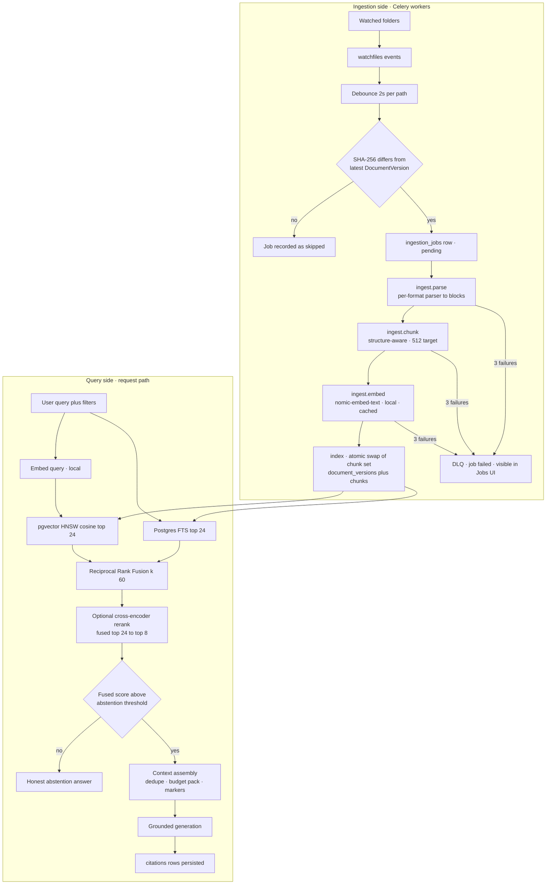

# Atlas — RAG & Knowledge Pipeline Architecture

> Deliverable 9. Conforms to [00-architecture-decisions.md](00-architecture-decisions.md).

---

## 1. Overview

The knowledge pipeline has two halves that meet at the `chunks` table:

- **Ingestion side** (asynchronous, Celery): watch → debounce → hash gate →
  `ingestion_jobs` → parse → chunk → embed → index. Its contract: every file
  the user has pointed Atlas at is represented by fresh, structure-aware,
  locally-embedded chunks — or by a visible failed job. Never silent loss.
- **Query side** (synchronous, inside a chat turn or `POST /search`): hybrid
  candidate generation (pgvector + Postgres FTS) → Reciprocal Rank Fusion →
  optional cross-encoder rerank → context assembly with citations → or
  **abstention** when the evidence isn't there (spine §2.4: grounded or
  silent).



## 2. Source watching and change detection

**Watcher** (`infrastructure/watcher/`, `watchfiles`): one watch task per
registered `Source` of type watched-folder, running in the worker process.
`watchfiles` uses the Rust `notify` backend — inotify/FSEvents, not polling —
so cost is proportional to change rate, not corpus size.

- **Debounce: 2 s per path.** Editors and sync clients (VS Code, Word,
  Dropbox) produce bursts — temp file, write, rename, chmod — for one logical
  save. Debouncing per path collapses each burst into one candidate event.
- **Ignore rules** before anything else: `.git/**`, `node_modules/**`,
  `__pycache__/**`, dotfiles, editor temp patterns (`~$*`, `*.swp`, `.#*`),
  plus a per-source glob list. Files over **50 MB** (config
  `ingestion.max_file_size_mb`) are skipped with a visible `skipped` job — a
  4 GB video should never wedge the parse queue.
- **SHA-256 hash gate.** The candidate file is streamed through SHA-256 and
  compared against the latest `document_versions.content_hash` for that
  document. Identical → record `skipped`, stop. This gate is what makes
  everything downstream cheap to trigger: a re-save without change, a touched
  mtime, or a full reconciliation sweep all no-op here. Content hash — not
  mtime, not size — is the identity of a `DocumentVersion` (spine §6).
- **Rename detection.** A delete+create pair inside one debounce window whose
  create-side hash equals the deleted document's latest version hash is a
  rename: update the document's source-relative path, keep its identity,
  citations, and chunks. No re-parse, no re-embed.
- **Deletes** mark the document `deleted_at` (soft delete — spine §7 allows it
  where the domain needs it, and "what happened to my file" is a domain
  question); its chunks are hard-deleted from the index (§10).

## 3. `ingestion_jobs` and the Celery pipeline

Each accepted change inserts an `ingestion_jobs` row
(`pending → running → succeeded | failed | skipped`, spine §6) keyed by
`(document_id, content_hash)` — **the content hash is the idempotency key for
the entire pipeline**.

**Stage layout.** One Celery task per stage — `ingestion.parse`,
`ingestion.chunk`, `ingestion.embed`, `ingestion.index` — chained, with the job
row recording the current stage. Why not one big task: per-stage retry (an
Ollama outage shouldn't re-run a 200-page PDF parse), per-stage spans
(`ingest.parse`, `ingest.chunk`, `ingest.embed` — spine §12), and honest queue
metrics. Stage payloads are passed by reference (job id), never by value;
intermediate parse/chunk output is persisted so any stage can resume from the
previous stage's committed output.

**Idempotency / safe re-runs.** Celery is at-least-once; duplicate delivery is
a certainty, not an edge case. Every stage is written to be re-runnable:

- `parse`/`chunk` recompute deterministically from the stored file bytes for a
  given `content_hash`; writing their output is an upsert on
  `(document_id, content_hash)`.
- `embed` looks up the embedding cache first (§6) — a re-run of an
  already-embedded chunk is a no-op.
- `index` performs an **atomic swap**: insert the new `document_versions` row
  and its chunk set, then flip visibility to the new version and delete the old
  version's chunks in one transaction. A crash before commit leaves the old
  index serving; a duplicate run finds the version already current and exits.
  There is never a window where the document has no chunks or mixed
  generations.

**Retry / DLQ policy.** Each stage: 3 retries with backoff 30 s → 2 min →
10 min (transient errors: Ollama down, DB contention, file briefly locked by
another process). Exhaustion marks the job `failed` with the terminal error
recorded, and the message parks on the `ingestion.dlq` queue. Failed jobs are
first-class UI: `GET /jobs` shows them with error and a retry action;
`POST /sources/{id}/reindex` requeues a whole source. A Celery beat sweep
retries DLQ jobs whose error class was transient once more after 6 h.
Permanent errors (corrupt PDF, password-protected DOCX) skip retries entirely
and fail immediately with a human-readable reason — retrying a deterministic
failure three times is just heat.

## 4. Parsing — per-format structure extraction

All parsers (`infrastructure/parsing/`) emit one normalized intermediate
representation — a `ParsedDocument`: an ordered list of typed blocks
(`heading(level)`, `paragraph`, `table`, `code`, `slide`, `sheet_region`,
`caption`) each carrying location metadata for citations. Chunking consumes
only this IR, so chunking logic exists once, not once per format.

| Format | Library | What "structure" means | Citation locator |
|---|---|---|---|
| PDF | PyMuPDF | page → text blocks in reading order; font-size/style heuristics recover heading levels; tables detected as blocks | page number |
| DOCX | python-docx | real heading styles (`Heading 1..n`) → a heading tree; lists, tables as units | heading path + paragraph index |
| PPTX | python-pptx | slide = natural unit; title, body placeholders, tables, speaker notes | slide number |
| XLSX / CSV | pandas | sheet → contiguous non-empty regions; header row detected and repeated per region; region rendered as compact markdown table | sheet name + cell range |
| Code | tree-sitter | syntax tree: functions, classes, methods as units; imports/module docstring as a preamble block | file + line range |
| MD | markdown-it (`markdown-it-py`) | the heading tree is explicit; fenced code blocks kept whole | heading path |
| TXT | plain | paragraphs by blank line; the weakest structure, closest to fixed-window | line range |

The IR is also where per-format weirdness dies: PDFs with two-column layouts
are re-ordered at parse time; XLSX numeric noise (empty cells, formatting
artifacts) never reaches the chunker.

## 5. Structure-aware chunking

Parameters are fixed by spine §10: **target 512 tokens, 15% overlap, hard max
1024**. The algorithm (`atlas/rag/`):

1. Walk the block list, packing whole blocks into a chunk until adding the next
   block would exceed 512 tokens.
2. Never split an atomic block (table, code function, slide) unless it alone
   exceeds the 1024 hard max — then split at row/statement boundaries with the
   header row or function signature repeated in each part.
3. Prefer to close a chunk at a structural boundary (heading, slide, function
   end) even if that lands short of 512 — a coherent 350-token chunk out-ranks
   an incoherent 512-token one.
4. Start the next chunk with ~15% overlap of trailing content, measured in
   whole sentences/blocks, to keep claims that straddle a boundary retrievable
   from at least one side.
5. Prefix each chunk's *embedded* text with its breadcrumb — document title
   plus heading path, e.g. `Q3 planning > Budget > Headcount` — so the vector
   carries context the raw span lacks. The breadcrumb is stored separately
   from display text so citations show the user clean content.

**Why structure-aware beats fixed-window.** Fixed 512-token windows are
indifferent to meaning, and the classic failures are exactly the queries users
ask: a table split mid-row so the header ("Amount", "Due date") lands in one
chunk and the values in another — retrieval returns numbers with no meaning or
labels with no numbers; a function signature separated from its body, so a
search for "what does `reconcile_ledger` do" retrieves a docstring with no
implementation; a heading ("Termination clauses") divorced from its section, so
the chunk that says "the notice period is 30 days" carries no signal about
*what* it applies to; an answer sentence sliced across two windows so neither
half ranks. Structure-aware chunking spends its token budget on semantic units
and keeps label-plus-value together, which lifts both embedding quality
(coherent chunks embed to cleaner points) and answer groundedness (the LLM sees
complete evidence). The cost — format-specific parsers and an IR — is precisely
the cost Atlas already pays to make citations point at pages, slides, and cell
ranges.

## 6. Embedding stage

- **Model**: Ollama `nomic-embed-text`, 768d, matching the `vector(768)` column
  (spine §7). **Local in both profiles** — this is a privacy decision, not a
  cost one: the embedding stage sees *every byte of every indexed document*.
  Routing it to a cloud API would silently upload the whole corpus, which
  would gut the hybrid profile's promise that only explicit chat context
  reaches the cloud. Query-time embeddings are local for the same reason
  (queries reveal what you're looking for) plus latency.
- **Task prefixes**: nomic-embed-text is trained with instruction prefixes —
  chunks are embedded as `search_document: <text>`, queries as
  `search_query: <text>`. Omitting these measurably degrades retrieval; the
  adapter owns the prefixes so callers can't forget them.
- **Batching**: 32 texts per call, 2 concurrent batches per worker — enough to
  saturate a laptop-class Ollama without starving interactive query
  embeddings, which share the same Ollama instance.
- **Embedding cache**: each chunk row stores `content_hash` (SHA-256 of its
  exact embedded text). The embed stage first looks up existing chunks with
  the same `(content_hash, model)` and reuses their vectors. No separate cache
  store — Postgres already holds the vectors, and a second copy in Redis would
  add an invalidation problem for single-digit-millisecond savings. Payoff:
  when a 300-chunk document is edited in one paragraph, ~297 chunks re-use
  cached vectors and re-embedding cost is proportional to the edit, not the
  document.

## 7. Hybrid retrieval — candidates, fusion, rerank

### 7.1 Candidate generation and RRF (spine §10)

Top **24** by pgvector cosine over HNSW, top **24** by Postgres FTS
(`websearch_to_tsquery` + `ts_rank_cd`), fused by **Reciprocal Rank Fusion with
k = 60**, implemented in SQL (`infrastructure/search/`):

```sql
WITH filtered AS (                       -- metadata filters, PRE-fusion (§7.3)
  SELECT c.id, c.embedding, c.fts, c.document_id
  FROM chunks c
  JOIN documents d ON d.id = c.document_id
  WHERE d.deleted_at IS NULL
    AND (:source_id::uuid  IS NULL OR d.source_id = :source_id)
    AND (:project_id::uuid IS NULL OR d.id IN (
          SELECT document_id FROM project_documents WHERE project_id = :project_id))
    AND (:path_prefix      IS NULL OR d.path LIKE :path_prefix || '%')
    AND (:file_type        IS NULL OR d.file_type = :file_type)
    AND (:modified_after   IS NULL OR d.modified_at >= :modified_after)
),
vec AS (
  SELECT id, ROW_NUMBER() OVER (ORDER BY embedding <=> :query_embedding) AS r
  FROM filtered
  ORDER BY embedding <=> :query_embedding
  LIMIT 24
),
fts AS (
  SELECT id, ROW_NUMBER() OVER (
           ORDER BY ts_rank_cd(fts, websearch_to_tsquery('english', :query)) DESC) AS r
  FROM filtered
  WHERE fts @@ websearch_to_tsquery('english', :query)
  LIMIT 24
)
SELECT COALESCE(vec.id, fts.id)                    AS chunk_id,
       COALESCE(1.0 / (60 + vec.r), 0)
     + COALESCE(1.0 / (60 + fts.r), 0)             AS fused_score
FROM vec FULL OUTER JOIN fts USING (id)
ORDER BY fused_score DESC
LIMIT 24;
```

**Why hybrid beats pure-vector.** Embeddings compress meaning and discard
surface form — which is fatal for the queries a personal knowledge base gets
most: exact identifiers (`INV-2024-0187`, `ECONNRESET`), people and product
names, dates, amounts, function names. A bi-encoder puts `INV-2024-0187` and
`INV-2024-0178` essentially at the same point; FTS distinguishes them exactly.
Conversely, pure-lexical misses paraphrase ("money we owe vendors" →
"accounts payable"). The two retrievers fail on *disjoint* query classes, which
is exactly when ensembling pays.

**Why RRF over weighted score fusion.** Cosine similarities (bounded,
distribution shifts with the embedding model) and `ts_rank_cd` scores
(unbounded, corpus-statistics-dependent) live on incommensurable scales.
Weighted-sum fusion needs per-corpus normalization and weight tuning, and it
silently breaks when either distribution drifts — e.g. after a re-embed
migration. RRF (Cormack, Clarke & Buettcher, SIGIR 2009) uses only **ranks**,
is parameter-light (k = 60 dampens the top-rank dominance), and reliably beats
tuned score fusion in TREC-style evaluations. For a system with heterogeneous,
per-user corpora and no per-user tuning budget, rank fusion is the robust
choice.

### 7.2 Optional cross-encoder rerank

Behind the `Reranker` port: local `bge-reranker-base` cross-encoder scores
(query, chunk) pairs jointly for the fused top 24 → final **top 8**. A
cross-encoder attends across query and passage together, catching what
bi-encoder geometry cannot (negation, "which version *deprecated* X"-style
relations). It is optional (feature flag `retrieval.rerank_enabled`, default
on where the model is installed) because it costs ~100–200 ms CPU per query
and its value varies by corpus; the eval harness (§11) is the arbiter per
deployment. Span: `rag.rerank`.

### 7.3 Metadata filtering — pre-fusion, always

Filters (source, project, folder prefix, date range, file type — the
`POST /search` surface) are applied in the `filtered` CTE, **before** both
retrievers run. Post-fusion filtering is a classic bug: fetch top 24, filter to
the project, be left with 2 candidates — not because evidence is missing but
because the pipeline filtered after ranking. Pre-fusion, both retrievers spend
their full candidate budget inside the allowed slice. Project scoping doubles
as a *privacy* boundary: a conversation bound to project A must never surface
project B's documents, so scoping lives in SQL, not in a post-hoc prompt-side
filter.

## 8. Context assembly and citations

From the final top 8 (`atlas/rag/`):

1. **Dedupe by document** — at most 3 chunks per document, so one long file
   cannot monopolize the context; adjacent chunks from the same document merge
   into one span when contiguous.
2. **Budget packing** — pack in rank order into the retrieved-context budget
   (≤ 40% of the prompt budget, [20-ai-architecture.md](20-ai-architecture.md)
   §9); drop whole chunks from the bottom, never truncate mid-chunk.
3. **Citation markers** — each packed chunk is numbered `[n]` and rendered
   with its provenance (document title, locator from §4). The system prompt
   (a pinned `PromptVersion`) instructs the model to attach `[n]` to grounded
   claims and to say so when evidence is insufficient.
4. **Persistence** — after the SSE stream completes, marker references found
   in the answer are written to `citations`: message id, chunk id, marker
   number, and a **denormalized snippet** of the cited text. The snippet
   matters: chunks are derived data that re-indexing replaces (§10), but a
   citation is part of the conversation's historical record and must survive
   its chunk. Dangling citations degrade to snippet-only display.

## 9. Abstention — grounded or silent (spine §2.4)

Two gates, both configuration (`retrieval.*`), both calibrated by the eval
harness rather than by feel:

- **Fused-score gate**: if the best fused score < **0.015**, retrieval found
  nothing worth standing on. Calibration intuition for k = 60: a chunk ranked
  1st in a single retriever scores 1/61 ≈ 0.0164; ranked ~6th, ≈ 0.0149. So
  0.015 means roughly "a top-handful hit in at least one retriever, or
  moderate agreement across both" — below that, candidates are tail noise.
- **Rerank gate** (when reranking is enabled): best cross-encoder relevance
  < **0.30** (sigmoid) also abstains — this catches the "lexically similar,
  semantically useless" survivors.

On abstention Atlas answers honestly from a dedicated `PromptVersion`
(`rag.abstention_reply`): it says it did not find supporting content, names
what was searched (scope + filters), and offers next actions (broaden scope,
check the source is indexed). The unfiltered LLM is *not* consulted "just in
case" — free-associating over the user's data is the exact failure the
principle forbids. Abstentions are logged as an outcome on the `rag.retrieve`
span, so abstention precision/recall are measurable (§11).

## 10. Freshness, incremental re-index, deletes and renames

- **Event-driven first**: the watcher (§2) makes index lag seconds-scale.
  `index_lag_seconds` (event time → chunks visible) is a Prometheus metric
  with a dashboard panel (spine §12).
- **Reconciliation sweep**: Celery beat walks each source every **6 h**
  comparing the filesystem against `documents` — catching events missed while
  Atlas was not running (laptops sleep; inotify does not queue for the dead).
  The sweep relies on the mtime-then-hash gate, so an unchanged corpus costs
  one stat per file plus hashing only mtime-changed files.
- **Delete propagation**: document soft-deleted (`deleted_at`); chunks
  hard-deleted (the `filtered` CTE also guards with `deleted_at IS NULL` for
  the window between mark and sweep); citations survive via snippets (§8).
  A user asking "why can't Atlas find my file" gets a real answer from the
  document record.
- **Rename propagation**: identity-preserving path update (§2); project
  memberships, citations, and chunks all follow because they reference the
  document id, not the path.
- **Version replacement** is the atomic swap of §3 — search never sees a
  half-indexed document.

## 11. Evaluation hooks

The pipeline is built to be measured (spine §2.6); golden datasets live in
`evals/` (JSONL), the harness in `atlas/evals/` (doc 32 specifies the runner):

- **Trace-first design**: `rag.retrieve` spans record candidate chunk ids,
  per-retriever ranks, fused scores, rerank scores, and the abstention
  decision. The eval harness replays golden queries through the real pipeline
  and reads results from the same span payloads production emits — no
  parallel "eval mode" code path to drift.
- **Retrieval metrics**: recall@8, MRR@8, nDCG@8 against labeled
  query→chunk relevance; measured per retriever and post-fusion, so a
  regression localizes to vector, FTS, fusion, or rerank.
- **Abstention metrics**: precision/recall of the abstain decision against
  labeled answerable/unanswerable queries — this is how the 0.015 / 0.30
  thresholds are actually set and re-validated after any chunking or
  embedding change.
- **Citation accuracy** (with doc 32's LLM-judge): do cited chunks entail the
  claims that cite them.
- **CI regression gate**: chunking, embedding, fusion, or threshold changes
  run the retrieval suite in CI; regressions beyond tolerance block merge
  (spine §2.6). An embedding model change additionally forces the explicit
  re-embed migration path (spine §7) — the gate refuses mixed-index states.

## 12. Failure modes at a glance

| Failure | Behavior | User sees | Signal |
|---|---|---|---|
| Ollama down during embed | 3 stage retries → DLQ; beat retry after 6 h | source shows pending/failed jobs | queue depth, DLQ counter |
| Corrupt / password-protected file | immediate `failed`, no retries, reason recorded | actionable per-file error in Jobs UI | `ingest.parse` span error |
| Oversized file | `skipped` job | skip reason in Jobs UI | skip counter |
| Worker crash mid-pipeline | at-least-once redelivery; stages idempotent by content hash | nothing — job completes late | job age histogram |
| Query embed fails | retry per doc 20 §5; then FTS-only candidates, flagged degraded | answer, degraded badge | `rag.retrieve` span attr |
| No candidates above threshold | honest abstention reply | "I didn't find this in your documents" + scope | abstention counter |
| Missed FS events (machine asleep) | 6 h reconciliation sweep re-syncs | briefly stale search | index lag metric |

## 13. Decisions made in this document

Choices the spine left open, resolved here (simplest consistent option):

1. **Debounce window**: 2 s per path; rename detected as delete+create with
   matching content hash inside the window.
2. **Ignore rules & size cap**: default glob ignore list; 50 MB
   `ingestion.max_file_size_mb` skip threshold.
3. **Pipeline shape**: one Celery task per stage, chained; job row tracks
   stage; payloads passed by job id; parse/chunk output persisted for
   stage-level resume.
4. **Retry/DLQ**: 3 retries per stage (30 s / 2 min / 10 min), permanent
   errors fail fast; `ingestion.dlq` queue; 6 h beat retry for transient DLQ
   entries.
5. **Parser IR**: normalized `ParsedDocument` block list with typed blocks and
   per-format citation locators; chunker consumes only the IR.
6. **Chunk breadcrumbs**: embedded text prefixed with title + heading path;
   stored separately from display text.
7. **Embedding cache**: `chunks.content_hash` keyed reuse within Postgres; no
   separate cache store; batch 32, concurrency 2; nomic task prefixes
   (`search_document:` / `search_query:`) owned by the adapter.
8. **Atomic index swap**: new version's chunks written then visibility flipped
   and old chunks deleted in one transaction.
9. **Filters pre-fusion** in the `filtered` CTE; project scoping enforced in
   SQL as a privacy boundary.
10. **Assembly caps**: ≤ 3 chunks per document; contiguous chunks merged;
    citations store denormalized snippets.
11. **Abstention thresholds**: fused ≥ 0.015 and (when reranking) rerank
    ≥ 0.30; both config, calibrated by the eval suite.
12. **Reconciliation sweep**: every 6 h via Celery beat, mtime-then-hash
    gated.
