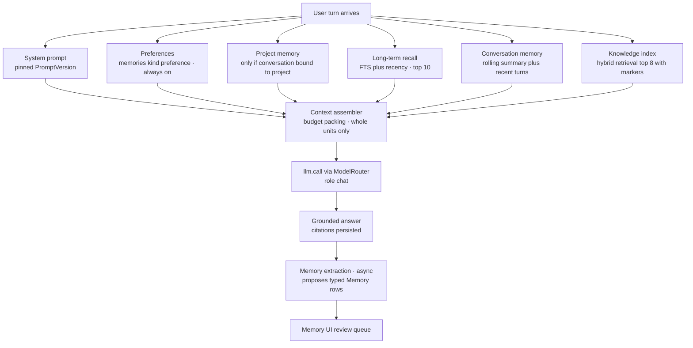

# Atlas — Memory Architecture

> Deliverable 12. Conforms to [00-architecture-decisions.md](00-architecture-decisions.md).

---

## 1. Seven memories, not one

"Memory" is the most overloaded word in agent engineering, and conflating its
meanings is a leading cause of broken assistants: preferences stuffed into a
vector store come back as hallucinated "facts"; conversation history mistaken
for knowledge makes yesterday's speculation today's ground truth; agent
scratch state leaking into chat context produces incoherent answers. Atlas
therefore names **seven distinct memory systems**, each with its own storage,
write path, read path, retention, and mutation authority. They compose at
request time (§9); they never blur.

| # | System | What it stores | Spine tables | Who may mutate |
|---|---|---|---|---|
| 1 | Conversation memory | what was said in this thread | `messages` + rolling summary on `conversations` | chat use cases only |
| 2 | Workflow state | where an agent task is | `agent_runs`, `agent_steps`, `agent_checkpoints` | agent runtime only |
| 3 | Knowledge index | what the user's documents say | `documents`, `document_versions`, `chunks` | ingestion pipeline only |
| 4 | User preferences | how the user wants Atlas to behave | `memories` with `kind = preference` | user; assistant via reviewed capture |
| 5 | Long-term memory | durable facts, decisions, entities, episodes | `memories`, kinds `decision`, `entity`, `episodic` | user; assistant via reviewed capture |
| 6 | Project memory | facts scoped to one project | project-scoped `memories` (typically `project_fact`) | user; assistant via reviewed capture |
| 7 | System configuration | how Atlas itself is configured | `settings`, `feature_flags` | user only — never the model |

The `Memory` domain type (spine §6) carries typed kinds
`preference | project_fact | decision | entity | episodic` and a `MemoryScope`
(`domain/memory/`). Rows in `memories` (columns decided here, §14): `id`,
`kind`, `scope_type` (`user | project`), `project_id` (nullable), `content`,
`status` (`proposed | active | superseded | expired`), `source_message_id`
(provenance), `superseded_by_id`, `expires_at`, `last_accessed_at`,
`deleted_at`, `created_at`, `updated_at`.

## 2. System 1 — Conversation memory

- **Stores**: the literal dialogue — every `messages` row (roles
  `user | assistant | tool | system`, spine §6) plus a **rolling summary** for
  long threads.
- **Where**: `messages`; summary as two columns on `conversations`:
  `summary` (text) and `summary_through_message_id` (watermark).
- **Write path**: `SendMessage` / `StreamAnswer` use cases append messages;
  when the verbatim tail exceeds its context budget
  ([20-ai-architecture.md](20-ai-architecture.md) §9), a background task
  regenerates the summary over everything up to a new watermark using the
  `classification` role (`claude-haiku-4-5-20251001`; `llama3.1:8b`
  local-only) with pinned prompt `conversation.summarize`.
- **Read path**: context assembly includes the summary plus verbatim turns
  after the watermark. The summary is folding, not forgetting — full history
  stays in `messages` and remains scrollable in the UI.
- **Retention**: until the user deletes the conversation (soft delete,
  30-day recovery window, then purge).
- **Not**: a source of durable facts. Nothing becomes "known" merely by having
  been said; promotion to memory goes through extraction (§10).

## 3. System 2 — Workflow state

- **Stores**: the operational state of agent tasks — plan, steps taken
  (thought/tool/observation), pending approvals, resumable checkpoints.
- **Where**: `agent_runs`, `agent_steps`, `agent_checkpoints` (spine §7);
  runtime in `atlas/agents/` (doc 23).
- **Write path**: exclusively the agent runtime — each loop iteration appends
  an `agent_steps` row; checkpoints written before every tool invocation and
  every approval gate, so a crash resumes rather than restarts.
- **Read path**: the runtime on resume; the UI via
  `GET /agent-runs/{id}/steps` for the live run log.
- **Retention**: runs and steps are kept — they are part of the explanation
  trail (spine §2.7) and cross-reference `tool_invocations` and
  `audit_events`. Checkpoints are operational scratch: pruned to the final one
  30 days after a run reaches a terminal state.
- **Never mixed with chat context.** An agent's internal deliberation is not
  conversation; injecting scratchpad state into chat is a classic
  incoherence bug. The chat thread sees a run's *outcomes* as ordinary
  messages, nothing more.

## 4. System 3 — Knowledge index

- **Stores**: what the user's documents say — parsed, chunked, embedded
  content ([21-rag-architecture.md](21-rag-architecture.md)).
- **Where**: `documents`, `document_versions`, `chunks` (+ `sources`).
- **Write path**: the ingestion pipeline only. Neither chat nor agents write
  here; the user affects it only by managing sources and files.
- **Read path**: hybrid retrieval at question time; always cited (`[n]` →
  `citations`), never asserted from model weights.
- **Retention**: mirrors the filesystem — documents live while files live;
  deletes propagate (doc 21 §10).
- **Not memory of *beliefs*.** The index stores what documents *say*, with
  provenance — not what Atlas concluded. A contract draft saying "fee: $50k"
  is evidence to cite, not a fact Atlas "knows"; conclusions users want kept
  become `decision`/`project_fact` memories via §10, with provenance.

## 5. System 4 — User preferences

- **Stores**: durable behavioral instructions: "answer in Spanish", "always
  show file paths", "prefer bullet points", "my work hours are 9–5 CET".
- **Where**: `memories`, `kind = preference`, `scope_type = user`.
- **Write path**: direct CRUD via `POST/PATCH/DELETE /memories` and the
  memory UI; or conversational capture ("remember that I prefer…") through the
  extraction pipeline (§10) — explicit statements activate immediately with a
  visible confirmation toast and undo.
- **Read path**: **always included** in every chat/agent system context —
  preferences are standing orders, not retrieval candidates. Capped at the
  memory budget (doc 20 §9, ≤ 10%); if a user exceeds it, most-recently
  updated wins and the UI flags the overflow.
- **Retention**: no decay. Preferences persist until edited, superseded, or
  deleted; stale ones are handled by conflict logic (§11), not time.

## 6. System 5 — Long-term memory

- **Stores**: durable user-scoped facts that outlive any conversation, typed:
  `decision` ("we chose Postgres over SQLite for the home server, March
  2026"), `entity` ("Dana is my accountant"), `episodic` ("spent last
  Tuesday debugging the NAS backup").
- **Where**: `memories` with those kinds, `scope_type = user`.
- **Write path**: extraction pipeline (§10) as `proposed`; explicit "remember
  this" as `active`; manual creation in the memory UI.
- **Read path**: recalled *selectively* per turn by the `RecallMemories` use
  case: filter by scope and status, rank by lexical match (Postgres FTS over
  `memories.content`) against the current turn plus recency
  (`last_accessed_at`), take top 10 into the memory budget. Deliberately
  lexical for now: a personal store is hundreds of rows, not millions, and
  skipping embeddings keeps memory out of the vector-store failure modes of
  §13. Embedding-based recall is a measured upgrade later, gated by the eval
  harness.
- **Retention**: `decision` and `entity` persist until superseded or deleted.
  `episodic` decays (§12) — 90-day default expiry, refreshed on access.

## 7. System 6 — Project memory

- **Stores**: facts with meaning only inside one project: "staging deploys
  from the `release` branch", "client prefers PDFs over links", "the API key
  in `.env.example` is fake".
- **Where**: `memories` with `scope_type = project` and `project_id` set;
  typically `kind = project_fact` (other kinds may be project-scoped too — a
  project-scoped `decision` is normal).
- **Write path**: same as §6, but capture from a project-bound conversation
  defaults the scope to that project — the reviewable proposal states the
  scope explicitly.
- **Read path**: included only when the active conversation or agent run is
  bound to that project. **Scope is an isolation boundary, not a relevance
  hint**: project B's facts never enter project A's context, exactly as
  project-scoped retrieval is enforced in SQL (doc 21 §7.3). Client-A/Client-B
  confidentiality is the obvious case.
- **Retention**: as §6; deleting a project soft-deletes its memory scope with
  the same 30-day recovery window.

## 8. System 7 — System configuration

- **Stores**: profile (hybrid/local-only), model routing overrides, budgets,
  retrieval thresholds, feature flags.
- **Where**: `settings`, `feature_flags` — with config precedence per
  `atlas/config/` (Pydantic Settings; DB-backed flag overrides, doc 03 §3.3).
- **Write path**: **the user only**, via `PATCH /settings` and the settings
  UI. No tool exposes settings mutation to the model — this is not a risk
  tier to gate but a capability that must not exist: a model that can edit
  its own configuration can silently widen its own autonomy, the exact
  self-modification failure §2 of the spine forbids. Every settings change
  writes an `audit_events` row.
- **Read path**: DI-injected config/services; never pasted wholesale into
  prompts (the model receives behavior, e.g. which model answered, not the
  raw settings table).
- **Retention**: current state + audit history of changes.

## 9. Composition at request time

One chat turn assembles the systems in fixed order under the budgets of
doc 20 §9 — each source labeled for what it is, so evidence, instructions,
and dialogue never masquerade as one another:

Notably absent: workflow state (agent-internal, §3) and system configuration
(shapes the call, never travels in it, §8). Every included memory gets its
`last_accessed_at` bumped — the signal episodic decay uses (§12).

## 10. The memory-extraction pipeline

**No silent belief formation.** Atlas never quietly "learns" things about its
user; every durable memory is explicitly created or visibly reviewable.

1. **Propose.** After an assistant turn completes, an async Celery task runs
   extraction over the recent exchange using the `classification` role and
   pinned prompt `memory.extract`, with structured output (tool-use JSON +
   Pydantic, doc 20 §6). Output: zero or more candidates, each with `kind`
   (`preference | project_fact | decision | entity | episodic`), content,
   proposed scope, and the `source_message_id` it derives from. Most turns
   yield zero — the prompt is instructed to prefer silence over noise.
2. **Gate.** Dedup against existing memories (exact and near-duplicate by
   trigram similarity) and against open proposals; contradictions route to
   conflict handling (§11).
3. **Capture — explicit or reviewable.**
   - *Explicit*: the user said "remember …" — created `active` immediately,
     confirmation toast with one-tap undo, `audit_events` row.
   - *Extracted*: created `status = proposed`. Proposed memories are **not**
     included in any context assembly; they sit in the memory UI review queue
     (accept / edit-then-accept / reject). A badge shows pending count.
4. **Own.** The memory UI is a feature, not an afterthought: list, search,
   filter by kind/scope/status, edit, delete, and per-memory provenance —
   "added from this conversation" links to `source_message_id`. `GET /memories`
   is the same surface the UI uses (spine §8). A user can read *everything*
   Atlas will ever say it knows about them, and change it.

Why reviewable rather than fully automatic: extraction models misread jokes,
hypotheticals, and quoted third parties ("my boss thinks we should use
MongoDB" is not a preference). A wrong preference silently applied to every
future answer is a high-blast-radius error with a trivially cheap mitigation —
a human glance. This is the same interlock philosophy as tool approvals
(spine §11), applied to belief formation.

## 11. Conflict handling — supersede with provenance

New fact contradicts old ("I've switched from VS Code to Zed"):

- The old memory is **never destructively edited**. The new memory row is
  created; the old row gets `status = superseded` and `superseded_by_id`
  pointing forward. Recall excludes superseded rows.
- Detection: extraction gate flags same-kind/same-scope candidates that
  contradict an active memory (trigram overlap + a `classification`-role
  contradiction check); the proposal is presented *as a supersession* in the
  review queue ("replace: *uses VS Code* → *uses Zed*"), so the user confirms
  the transition, not just the new text.
- The supersession chain is provenance: "why did Atlas stop suggesting VS Code
  extensions" has a first-class answer with dates and source messages. This
  mirrors `DocumentVersion` immutability (spine §6) and the append-only
  audit posture — Atlas replaces beliefs; it does not rewrite history.

## 12. Forgetting

Forgetting is a feature with three deliberate paths:

1. **Explicit delete** — from UI or `DELETE /memories/{id}`: soft delete
   (`deleted_at`), 30-day recovery, then purged by sweep. Deleted memories
   leave recall *immediately*.
2. **Expiry** — any memory may carry `expires_at` ("visiting Lisbon until
   May" should die in June). A daily Celery beat sweep marks past-due rows
   `expired`; expired memories are visible in the UI under "expired", restorable.
3. **Episodic decay** — `episodic` rows default `expires_at = created_at +
   90 days`; each recall inclusion refreshes it (`last_accessed_at` bump →
   expiry pushed out). Frequently relevant episodes persist; noise ages out.
   `preference`, `decision`, `entity`, and `project_fact` do **not** decay —
   silently forgetting a standing instruction is worse than keeping a stale
   one visibly listed.

What Atlas never does: probabilistically "compress" memories with an LLM in
the background. Lossy rewrites without review are silent belief mutation —
§10's rule applies to updates as much as creation.

## 13. Privacy boundaries

- **Memories never sync to cloud.** All seven systems live in local Postgres.
  There is no cloud memory backend, no telemetry containing memory content;
  LangSmith export (ADR-0010) is off by default and excludes memory payloads.
- **Prompt inclusion is not sync, but it is exposure** — in hybrid profile,
  memories included in context reach the cloud model inside the prompt. This
  is governed by the setting `memory.cloud_prompt_policy`:
  `all` (default) | `redacted` (memories the user has marked private are
  replaced by neutral placeholders on cloud calls, included verbatim only for
  local models) | `none` (memory context only ever accompanies local-model
  calls). The active policy is visible in the same settings surface as the
  profile toggle (spine §9).
- **Local-only profile** moots the question: no prompt bytes leave the
  machine at all.
- **Scope isolation** (§7) is also privacy: project-scoped memories stay
  inside their project's conversations.
- Memory content is treated as secret-bearing: never logged (structlog
  redaction processor), and the secrets-detection adapter
  (`infrastructure/security/`) warns when a proposed memory looks like a
  credential — an API key does not belong in `memories`; the keychain exists.

## 14. Anti-patterns — why not one big context, why not one vector store

**Anti-pattern 1: "just stuff everything into the context window."** Long
contexts are not free attention: retrieval quality inside the window degrades
for mid-context content (the well-documented lost-in-the-middle effect), cost
scales linearly with tokens shipped per turn, latency grows, and — worst —
undifferentiated context erases *epistemic status*: instructions, evidence,
speculation, and stale dialogue arrive as one soup, and the model treats
half-remembered chat as fact. Atlas's assembler ships a few thousand
*labeled, selected* tokens instead of a hundred thousand unlabeled ones.

**Anti-pattern 2: "memory = one vector store."** Cram preferences, chat
history, agent scratch, and documents into one embedding index and every
lookup becomes similarity search — the wrong operation for most of these
systems. Known failure modes, all avoided structurally here:

- *Similarity ≠ authority.* "The user prefers Python" (preference) and a blog
  chunk saying "many prefer Rust" (evidence) can land adjacent in vector
  space; a similarity query cannot tell an instruction from a citation.
  Atlas: preferences are always-on typed rows; documents are cited chunks.
- *Preferences that only sometimes apply.* If standing orders must win a
  similarity lottery to be retrieved, they intermittently vanish. Atlas:
  preferences are unconditionally included, never retrieved.
- *No update semantics.* Vector stores append; contradictions coexist and
  recall becomes a coin flip between old and new belief. Atlas: supersession
  chains with one active winner (§11).
- *Scratchpad contamination.* Embedded agent thoughts resurface as "memories"
  in later chats. Atlas: workflow state is not recallable memory at all (§3).
- *Cross-scope leakage.* One index happily returns client A's facts in client
  B's session. Atlas: scope is a SQL predicate, not a similarity hope (§7).
- *Unbounded growth.* Append-only episodic noise buries signal. Atlas: typed
  decay (§12).

The general lesson: **memory is a set of typed systems with distinct
lifecycles and authority, not a datastore choice.** Retrieval is the right
tool for exactly one of the seven (the knowledge index) — and even there,
hybrid retrieval with citations, not bare similarity (doc 21).

## 15. Decisions made in this document

Choices the spine left open, resolved here (simplest consistent option):

1. **Rolling summary storage**: `conversations.summary` +
   `conversations.summary_through_message_id`; regenerated via the
   `classification` role with pinned prompt `conversation.summarize`.
2. **`memories` columns**: `status` (`proposed | active | superseded |
   expired`), `scope_type`/`project_id`, `source_message_id`,
   `superseded_by_id`, `expires_at`, `last_accessed_at`, soft `deleted_at`.
3. **Recall strategy**: preferences always-on; long-term/project recall via
   Postgres FTS + recency, top 10, within the ≤ 10% memory budget; no memory
   embeddings initially (upgrade path gated by evals).
4. **Extraction flow**: async post-turn Celery task, `classification` role,
   prompt `memory.extract`, structured output; extracted → `proposed` +
   review queue; explicit "remember" → `active` + toast + undo + audit event.
5. **Conflicts**: supersession with `superseded_by_id` provenance chains;
   contradiction candidates presented as replacements in review.
6. **Decay/retention numbers**: episodic expiry 90 days refreshed on access;
   soft-delete recovery window 30 days (memories and conversations);
   checkpoint pruning 30 days after terminal run state; daily expiry sweep.
7. **Cloud prompt policy**: `memory.cloud_prompt_policy` setting —
   `all` (default) / `redacted` (per-memory private flag) / `none`.
8. **Settings immutability to the model**: no tool exposes `settings` /
   `feature_flags` mutation; user-only writes, always audited.
