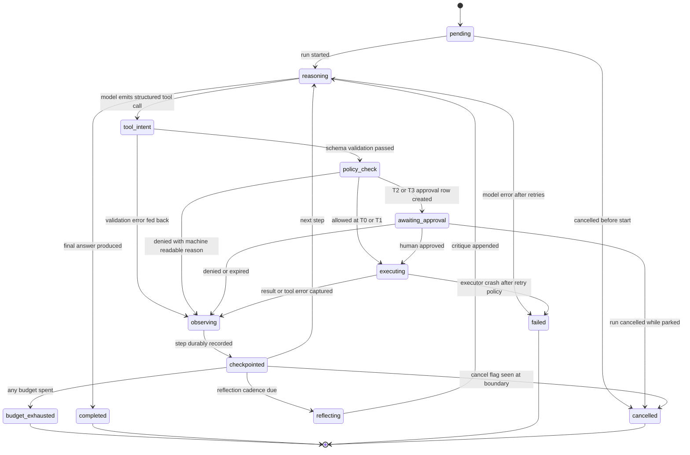

# Atlas — Agent Architecture

> Deliverable 10. Conforms to [00-architecture-decisions.md](00-architecture-decisions.md).

---

## 1. Scope and position

This document specifies the agent runtime that lives in `apps/api/src/atlas/agents/`
— the ReAct loop, planner, reflection, checkpointing, and approval gates — and its
persistence in `agent_runs`, `agent_steps`, and `agent_checkpoints`. It lands at
**M16 Agent runtime v1** and evolves at **M19 Durable workflows (Temporal)** per
ADR-0004. The runtime's domain types (`AgentRun`, `AgentStep`, `Plan` and their
ports) live in `atlas/domain/agents/`; orchestration use cases (`StartAgentRun`,
`ResumeAgentRun`, `ApproveStep`) live in `atlas/application/agents/`.

The single invariant everything below serves is spine §2.2: **the model produces
intent, the deterministic policy engine decides permission, executors perform
action.** The agent runtime is a *consumer* of the tool layer described in
[24-tool-architecture.md](24-tool-architecture.md); it never contains a code path
from model output to a syscall. Even a fully compromised prompt can only make the
runtime *ask* for things.

## 2. Single-agent first — a deliberate constraint

Atlas v1 runs exactly **one agent per AgentRun**: one reasoning loop, one context
window, one budget, one audit trail. Multi-agent topologies (planner/worker
swarms, debate, self-orchestrating crews) are explicitly deferred. The reasons
are engineering, not fashion:

- **Debuggability.** A single loop yields a single linear timeline. When step 7
  fails, the cause is in steps 1–6, all durably recorded. Multi-agent systems
  interleave nondeterministic timelines and turn every bug into a distributed
  systems investigation — unacceptable for software that touches a user's files.
- **Eval-ability.** Spine §2.6 requires golden datasets and CI gates before
  features ship. A single agent's tool choice and argument quality can be scored
  step-by-step against a golden trace (§15 below). Scoring emergent multi-agent
  coordination is a research problem, not a CI gate.
- **Attribution.** Every `tool_invocations` and `audit_events` row must answer
  "which reasoning led to this action?" One run, one loop keeps that mapping
  trivial and keeps the approvals UI honest.
- **Cost.** Agent conversations are token-hungry; N cooperating agents multiply
  the bill for gains that published results show are marginal on tasks of this
  shape (file operations, research over a personal index).

**What would justify multi-agent later.** Three concrete triggers, none expected
before Phase F: (1) *isolation* — a subtask should run with a narrower capability
set than the parent (e.g. an untrusted-content summarizer with zero tool access);
(2) *parallel fan-out* — M20 knowledge-graph enrichment over thousands of
documents wants concurrent workers, which Temporal (M19) gives us as child
workflows without inventing agent-to-agent chat; (3) *specialist prompts* — if
evals prove a dedicated critic model measurably beats single-loop reflection.
Even then the pattern will be **hierarchical with a single accountable root run**
— sub-agents as tools with their own budgets — never a peer-to-peer swarm.

## 3. The agent loop

The runtime is a **ReAct-style loop**: reason → tool intent → policy gate →
observe → reflect. We chose ReAct as the *chassis* over pure plan-and-execute
because personal-computing tasks are observation-driven — you cannot plan the
reorganization of a Downloads folder before listing it. Plan-and-execute is
layered *on top* as a planning mode (§4), not a competing runtime: the plan is
data the loop consults, so there is exactly one execution path to test, trace,
and checkpoint.

### 3.1 Step lifecycle

Terminal run statuses are `completed`, `failed`, `cancelled`, `budget_exhausted`.
`awaiting_approval` and `checkpointed` are durable park states: the process can
exit entirely while a run sits in either, and resume later (§7).

### 3.2 One step, precisely

A step is the atomic unit of persistence, budgeting, tracing, and recovery:

1. **Reason** — one `llm.call` with the assembled context (goal, plan if any,
   running summary, recent observations, filtered tool schemas). Output is either
   a final answer or a structured tool intent — never free text pretending to act.
2. **Gate** — Pydantic validation, then the deterministic `policy.check` against
   `permission_grants` and the tool's risk tier (T0 auto-allow · T1 auto-allow
   with visible notification · T2 approval · T3 approval with rendered preview
   and typed confirmation, spine §11).
3. **Act** — the sandboxed executor runs the tool; a `tool_invocations` row and
   `audit_events` row are written regardless of outcome.
4. **Observe** — the result is truncated (§12) and appended as an observation.
5. **Record** — step row finalized, checkpoint written, budgets debited. Only
   then may the next step begin.

## 4. Planning modes

The run's `mode` is chosen at start by a cheap router call (`claude-haiku-4-5-20251001`
in the hybrid profile, spine §9) over the goal plus available tools, and recorded
on `agent_runs.mode`. Three modes:

| Mode | When it triggers | Behavior |
|---|---|---|
| `direct` | No tool plausibly needed — pure knowledge or conversation questions | Single `llm.call`, no loop; cheapest path; ~0 tool tax |
| `tool_loop` | Tools needed, but the task is short-horizon or observation-dependent (lookups, single file action, "what changed in X") | Plain ReAct loop, no upfront plan |
| `plan_execute` | Multi-step, multi-file, or ordering-sensitive tasks (batch reorganization, "set up my dev environment", anything the router estimates at 5+ steps) | One planning `llm.call` produces an explicit numbered `Plan` (stored as a step of kind `plan`); the loop then executes with the plan pinned in context, and may revise it — each revision is a new recorded step |

The trade-off being managed: pure ReAct wanders on long tasks (it re-derives
intent every step and can loop); pure plan-and-execute is brittle when step 2's
observation invalidates the plan. Explicit-plan-inside-a-ReAct-loop takes the
coherence of planning and keeps the reactivity, at the cost of one extra LLM
call — which the router only spends when the task warrants it. The plan is also
what the approvals UI shows a human ("step 3 of 7 of this plan"), making T2/T3
decisions legible.

## 5. Reflection

Reflection is a **bounded self-critique step** (kind `reflection`), not an open
inner monologue:

- **When it runs:** (a) after any step that ends in a tool error or policy
  denial; (b) every 5 steps in `plan_execute` mode as drift control; (c) never in
  `direct` mode.
- **What it does:** one `llm.call` on the cheap model role asking three fixed
  questions — is the plan still valid, is the loop repeating itself, is the goal
  or budget better served by stopping and reporting. Output is a short critique
  appended to context, and optionally a plan revision or an early-stop signal.
- **Cost cap:** reflection may consume at most **10% of the run's token budget**
  and at most **1 reflection per 3 steps**; when the cap is hit, reflection is
  skipped and a `reflection_skipped` marker is recorded so evals can measure
  whether the cap hurt outcomes.

Reflection exists because the failure taxonomy (§11) feeds *observations* back
into the loop; reflection is the mechanism that turns three similar failures into
"stop trying that" instead of a fourth attempt.

## 6. Persistence: write-ahead, always

Three tables (canonical names, spine §7; full DDL in
[11-database-schema.md](11-database-schema.md)):

**`agent_runs`** — one row per task. Columns (representative): `id` (UUIDv7),
`conversation_id` (nullable — runs can start from chat), `goal`, `mode`,
`status` (`pending | running | awaiting_approval | completed | failed |
cancelled | budget_exhausted`), `budget` JSONB, `spent` JSONB, `result_summary`,
`error_code`, `trace_id`, `model`, `prompt_version`, timestamps.

**`agent_steps`** — one row per step, written **before** the step executes.
Columns: `id`, `agent_run_id`, `step_index` (monotonic), `kind` (`thought |
plan | tool | observation | reflection`), `status` (`pending | running |
awaiting_approval | succeeded | failed | denied | cancelled`), `tool_name`,
`tool_args` JSONB, `tool_invocation_id` (FK), `content` (thought / observation /
critique text), `tokens_in`, `tokens_out`, `cost_usd`, `started_at`,
`finished_at`.

**`agent_checkpoints`** — loop state snapshots enabling resume without replaying
LLM calls: `id`, `agent_run_id`, `step_index`, `state` JSONB (running summary,
recent-observation window, plan version, budget counters, pending intent if
any), `created_at`. One checkpoint per step boundary — this is a single-user
local system; the write is microseconds and buys total crash safety.

**The write-ahead rule.** Before any side-effecting work, the intent is durable:
the `agent_steps` row (status `pending`, args recorded) commits first; the
executor then writes its `tool_invocations` row (status `running`) *before*
touching the OS, and finalizes it after. Order of durability: intent → invocation
→ effect → result. Nothing ever happens that the database did not first say was
about to happen — which is also what makes the audit log complete by
construction (spine §2.7) rather than by discipline.

## 7. Crash recovery and resume

On worker restart, `ResumeAgentRun` scans for non-terminal runs:

1. **Run parked** (`awaiting_approval`) — nothing to do; the approval decision
   endpoint resumes it.
2. **Step `pending`** — intent recorded, execution never started. Safe to
   re-execute exactly as recorded.
3. **Step `running`** — the ambiguous case. The executor consults
   `tool_invocations` by the step's **idempotency key** (derivation in
   [24-tool-architecture.md](24-tool-architecture.md)): a `succeeded` row means
   the effect happened — adopt its result and continue; a `running` row means
   possible partial effect — run the tool's per-tool *reconciliation probe*
   (e.g. for `fs.move`: does the destination exist with the source's content
   hash?). If the probe is conclusive, continue; if not, the run fails safe with
   `error_code = ambiguous_effect` and the audit trail tells the user exactly
   which single operation to verify. We choose fail-safe over guessing because
   these are the user's files.
4. Rebuild context from the latest `agent_checkpoints` row — no LLM replay —
   and re-enter the loop.

Resume after approval works the same way: the checkpoint holds the pending
intent, so approval → `executing` costs zero additional model tokens.

## 8. Budgets — first-class runtime config

Budgets are constructor arguments of the loop, not advisory hints, stored on
`agent_runs.budget` and debited into `agent_runs.spent` at every boundary:

| Budget | Default (interactive) | Enforced at |
|---|---|---|
| `max_steps` | 20 | step boundary |
| `max_tokens` | 200,000 total in+out | before each `llm.call` (projected) and after |
| `max_cost_usd` | 1.00 | after each `llm.call`, from the cost meter in `atlas/observability` |
| `max_wall_clock` | 15 minutes | step boundary; a parked `awaiting_approval` run stops the clock |

Scheduled/background runs (M24) get their own profile defaults. The router may
*lower* budgets for trivial goals; only the user raises them.

**Graceful exhaustion.** The loop reserves a fixed 2,000-token wrap-up allowance
inside `max_tokens`. When any budget trips, the runtime makes one final bounded
`llm.call` producing a **partial-progress report**: what was accomplished (with
completed step references), what remains, and a recommended next action. The run
ends `budget_exhausted` — deliberately distinct from `completed` and `failed` so
dashboards and evals can see it — and the report lands in
`agent_runs.result_summary`. A budget stop after step N never rolls back steps
1..N; they were individually approved and recorded, and undo (see
[25-computer-automation.md](25-computer-automation.md)) remains available.

## 9. Human approval gates

When `policy.check` returns *approval required* (T2, or T3 with preview):

1. The step moves to `awaiting_approval`; the run parks durably.
2. An `approvals` row is written: the tool name, validated args, risk tier,
   rendered human-readable **preview** (T3 always; T2 where the tool provides
   one — e.g. the before/after tree for `fs.move`), the plan context, and
   `expires_at`.
3. The UI surfaces it via `GET /approvals`; decisions arrive at
   `POST /approvals/{id}/decision`. T3 additionally requires the typed
   confirmation phrase embedded in the preview (spine §11).
4. **Approved** → the parked intent executes from the checkpoint; the decision,
   decider, and timestamp are written to `audit_events`. The approval binds to
   the exact validated args by hash — if anything changed, it is void.
5. **Denied** → the denial (with the user's optional reason) becomes an
   observation; the loop resumes and may re-plan or wrap up. A denial is
   feedback, not a crash.
6. **Expired** — approvals expire after **24 hours** by default. Expiry is
   recorded as a denial with code `approval_expired`; the run resumes just long
   enough to emit a partial-progress report, then ends. Stale intents must never
   execute against a world that has moved on.

The model never sees that an approval UI exists in any way it can manipulate —
it sees only the eventual allow/deny observation. Prompt text cannot shorten,
skip, or pre-satisfy a gate; the gate is deterministic code (ADR-0007).

## 10. Cancellation

`POST /agent-runs/{id}/cancel` sets a cancellation flag on the run.
Cancellation is **cooperative and step-boundary**: the loop checks the flag
after finishing (and durably recording) the current step; a run parked in
`awaiting_approval` cancels immediately and voids its approval row. We do not
kill executors mid-syscall — interrupting a file move halfway is strictly worse
than letting a bounded operation finish and cancelling cleanly after. The
worst-case cancellation latency is one step's tool timeout, which the
ToolDefinition caps. Cancelled runs keep everything they recorded; `cancelled`
is a first-class terminal status, not deletion.

## 11. Failure taxonomy — and how each feeds back

| Class | Examples | Loop feedback | Retry owner |
|---|---|---|---|
| **Tool error** | file vanished, timeout, conflict at destination | Machine-readable error observation (`code`, `retryable`, details); the model adapts — pick a new name, re-list the folder | Executor retries transient codes per the tool's retry policy *before* the model ever sees the error; the model handles semantic errors |
| **Model error** | provider 5xx/429, malformed tool JSON, schema-invalid args | Provider faults: retried inside `atlas/ai` (fallback chain, circuit breakers — the loop sees at most a delay). Malformed intent: the Pydantic error is fed back as an observation for **one** repair attempt; a second failure marks the step `failed` | `atlas/ai` for transport; loop for structure |
| **Policy denial** | no grant covers the path, tier gate denied/expired | Denial observation with the *reason* (`no_grant_for_scope`, `approval_denied`, `approval_expired`) so the model can re-plan inside its permissions instead of hammering the wall | Never retried automatically — a denial repeated identically is the loop's bug, and reflection (§5) is triggered on every denial to catch it |

Unrecoverable variants (executor crash beyond retry policy, repeated malformed
intent, ambiguous recovery state) end the run `failed` with a stable
`error_code`. Everything else is an observation, because an agent that dies on
the first `ENOENT` is useless, and one that silently swallows denials is unsafe.

## 12. Context management across steps

The context window is a budget of its own. Rules, applied in order:

1. **Tool-result truncation at the source.** Every ToolDefinition carries a
   result-size cap; the executor stores up to the cap in `tool_invocations`, and
   the runtime passes the model a further-truncated slice (default 2,000 tokens,
   head and tail with an explicit `truncated` marker and the full result's row
   id). The model can ask a narrower question instead of paging raw bytes.
2. **Step summarization.** When assembled context exceeds 60% of the model's
   window, observations older than the last 6 steps are compacted by a cheap
   `llm.call` into a **running summary** (persisted in the checkpoint, so
   summarization survives restarts and is itself audited). The plan, the goal,
   and any pending approval context are never summarized away.
3. **Stable ordering.** Goal and plan first, running summary next, recent
   observations last — keeping the prompt prefix stable across steps also keeps
   provider-side prompt caching effective, which materially cuts run cost.

## 13. Observability

Spine §12 span names are used exactly: each step is an **`agent.step`** span,
parent to its `llm.call`, `policy.check`, and `tool.invoke` children, all under
the run's single trace (`agent_runs.trace_id`). `agent.step` records run id,
step index, kind, mode, budget remaining, and outcome; `llm.call` children
follow the OTel GenAI conventions (provider, model, `prompt_version`, tokens,
cost USD, latency, stop reason).

**The DB-alone guarantee:** the full run timeline — every thought, intent,
gate decision, effect, and cost — must be reconstructable from `agent_runs` +
`agent_steps` + `agent_checkpoints` + `tool_invocations` + `approvals` +
`audit_events` with **no telemetry backend present**. Traces are for latency
archaeology and pretty flame graphs; the database is the record. This is what
makes the run-timeline UI, the audit story (spine §2.7), and offline debugging
work on a laptop with the observability compose profile switched off.

Metrics (Prometheus): steps per run, terminal-status counts by reason, approval
wait time, denial rate by code, cost per run — cost is first-class per spine §12.

## 14. M19: the Temporal evolution (ADR-0004)

At M19 the loop's *durability mechanics* move into Temporal; the semantics above
do not change.

**What changes:**

- The loop becomes a **Temporal workflow**; each reason/act cycle's effects run
  as **activities** (every `llm.call` and every tool execution — anything
  nondeterministic — is an activity, keeping workflow code replay-deterministic).
- **Approvals become signals**: `awaiting_approval` is a workflow await on an
  approval signal with a 24h timer, replacing the hand-rolled park/resume in §7
  and §9. Cancellation becomes workflow cancellation, still honored at step
  boundaries.
- Hand-written crash recovery (§7 cases 2–3) is subsumed by Temporal replay and
  activity retry policies; `agent_checkpoints` narrows to a UI/resume-context
  convenience rather than the recovery mechanism.
- Long-horizon patterns get cheap: cron/scheduled runs (M24), child workflows
  for fan-out, `continue-as-new` for very long runs.

**What does not change:** the **policy engine and the tool layer are untouched**
— activities call the same `InvokeTool` use case through the same gates;
Temporal is plumbing below the safety invariant, never a bypass around it.
`agent_runs` / `agent_steps` / `tool_invocations` / `audit_events` remain the
product-facing source of truth (Temporal's event history is an internal
mechanism, not the user's audit log). The API surface (§8 of the spine) and the
eval harness are unchanged. This is why we did not adopt Temporal at M16:
Celery-era Atlas proves the loop's *semantics* with ~200 lines of explicit
state handling, and M19 swaps the engine underneath a stable contract.

## 15. Tool-selection quality — the eval harness

Spine §2.6: tool selection has golden datasets and CI regression gates before
computer control ships. The harness in `atlas/evals` (datasets under `evals/`
as JSONL, results in `eval_datasets` / `eval_examples` / `eval_runs` /
`eval_results`) scores each example — a goal, a fixture workspace, the offered
tool list with grants, and a golden trace — on:

| Metric | Definition | M16 gate |
|---|---|---|
| Tool-choice accuracy | Correct tool (or correct "no tool") at each golden decision point | ≥ 0.90 |
| Argument correctness | Exact match after canonicalization for paths/enums; LLM-judge rubric for free-text args | ≥ 0.85 |
| First-try validation rate | Intents passing Pydantic without a repair loop | ≥ 0.95 |
| Unnecessary-invocation rate | Tool calls a golden trace shows were avoidable | ≤ 0.10 |
| Denial-attempt rate | Intents outside offered grants (should be near zero when dynamic filtering works) | ≤ 0.02 |
| Budget efficiency | Steps used ÷ golden steps | ≤ 1.5× |

Runs execute against **sandbox fixtures with executors in dry-run mode** — evals
never touch a real filesystem. CI compares against the last accepted `eval_runs`
baseline and fails the PR on regression beyond noise bands (details in
[32-evaluation-architecture.md](32-evaluation-architecture.md)). Dynamic tool
filtering (only tools with live grants are offered — see
[24-tool-architecture.md](24-tool-architecture.md)) is itself an evaluated
variable: the same dataset run with and without filtering quantifies how much a
smaller tool list improves selection, turning a security posture into a measured
accuracy win.

## 16. Decisions made in this document

Choices the spine left open, resolved here (simplest consistent option):

- **Run statuses** fixed as `pending | running | awaiting_approval | completed |
  failed | cancelled | budget_exhausted`; `budget_exhausted` is a distinct
  terminal status with a reserved 2,000-token wrap-up allowance.
- **Step kinds** extend the spine's thought/tool/observation triple with `plan`
  and `reflection`, all in `agent_steps.kind`.
- **Planning-mode router**: three modes (`direct`, `tool_loop`, `plan_execute`)
  selected by a haiku-class router call and recorded on `agent_runs.mode`.
- **Reflection policy**: after every tool error or policy denial, every 5 steps
  in `plan_execute`; capped at 10% of run token budget and 1 per 3 steps.
- **Checkpoint cadence**: every step boundary.
- **Default interactive budgets**: 20 steps, 200k tokens, $1.00, 15 minutes;
  approval wait time excluded from wall clock.
- **Approval expiry**: 24 hours; expiry treated as denial (`approval_expired`)
  followed by graceful wrap-up; approvals bind to validated args by hash.
- **Cancellation**: cooperative at step boundaries only; parked runs cancel
  immediately.
- **Recovery stance**: at-most-once for side-effecting steps — ambiguous
  mid-execution crashes fail safe with `ambiguous_effect` after a per-tool
  reconciliation probe, never guessed through.
- **Model-visible tool-result slice**: 2,000 tokens default (full capped result
  in `tool_invocations`); summarization triggers at 60% context occupancy,
  preserving goal/plan/approval context verbatim.
- **M16 eval gates**: thresholds in §15's table.
