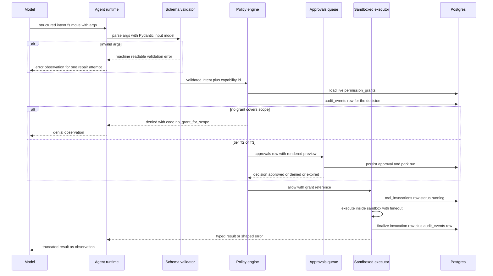

# Atlas — Tool Architecture

> Deliverable 11. Conforms to [00-architecture-decisions.md](00-architecture-decisions.md).

---

## 1. Scope and position

This document specifies the tool registry and invocation pipeline in
`apps/api/src/atlas/tools/` — the only bridge between model intent and the
operating system. It lands at **M15 Tool registry & permission engine** and is
consumed by the agent runtime ([23-agent-architecture.md](23-agent-architecture.md))
and, from M17 on, by the computer-automation capability set
([25-computer-automation.md](25-computer-automation.md)). Domain types
(`ToolDefinition`, `Capability`, `RiskTier`, `PermissionGrant`, `Approval`) live
in `atlas/domain/tools/`; the `InvokeTool`, `GrantCapability`, `RevokeCapability`
use cases in `atlas/application/tools/`; OS-touching executors in the module's
adapter code per the layering rules of
[03-architecture-overview.md](03-architecture-overview.md).

Everything here enforces spine §2.2: the model produces **intent**, the
deterministic policy engine decides **permission**, executors perform
**action** — three separate components, and this module owns the seams between
them.

## 2. Code-registered, not DB-registered

Tools are **declared in Python** — a `ToolDefinition` constructed in code and
registered at import time in `atlas/tools/registry.py`:

```python
# atlas/tools/builtin/fs.py (abridged)
FS_MOVE = ToolDefinition(
    name="fs.move",
    capability="fs.write.move",
    risk_tier=RiskTier.T2,
    input_model=FsMoveArgs,          # Pydantic v2
    output_model=FsMoveResult,
    executor=fs_move_executor,       # typed callable, checked by mypy
    ...
)
registry.register(FS_MOVE)           # import-time; duplicate names fail CI
```

The database holds **only runtime facts about tools**: `permission_grants`
(who may use which capability, where), `tool_invocations` (every execution),
`approvals` (pending human decisions), and `audit_events`. There is no `tools`
table; `GET /tools` reflects the in-process registry.

**Why code, not DB rows — the trade-off in full.** A DB-registered catalog
(rows holding name, JSON schema, maybe a dotted path to a handler) is the
flexible option: tools can be added at runtime, per-user, without deploys. It is
also exactly the wrong flexibility for a system whose tools touch the user's
filesystem:

- **Type safety.** A code-registered tool binds its schema to a Pydantic model
  and its executor to a typed function signature; `mypy --strict` verifies the
  pair at build time. A DB row binds a JSON blob to a string, verified never.
- **Review via PR.** Every new capability the model can request arrives as a
  diff — schema, executor, tier, rollback strategy, tests — reviewed and
  CI-gated (including the eval gates of §11). A DB insert has no reviewer.
- **No runtime injection.** If tool definitions were data, then anything that
  can write that data — a bug, a migration, a prompt-injected flow that reaches
  the DB — could mint new capabilities or quietly lower a risk tier. With code
  registration, the catalog is immutable at runtime by construction; spine
  §11's "model output can request, never grant" extends to "nothing at runtime
  can define". Versioning, rollback, and provenance come free from git.

What we give up: users cannot author arbitrary tools. That is the right v1
posture. The extensibility path that preserves the properties above is
parameterized *recipes over existing tools* (see `terminal.run` command
templates in [25-computer-automation.md](25-computer-automation.md)) and,
post-1.0, a vetted plugin mechanism — never raw schema rows.

## 3. The ToolDefinition contract

Every tool declares the following; the registry rejects (at import, i.e. in CI)
any definition with a missing field, an unknown capability id, or an
undocumented rollback strategy.

| Field | Type / shape | Purpose |
|---|---|---|
| `name` | dotted id, e.g. `fs.move` | Stable identity in intents, invocations, audit |
| `description` | model-facing prose | The *contract for selection* — written for the LLM, eval-tested (§11), states when *not* to use the tool |
| `capability` | capability id, e.g. `fs.write.move` | What `permission_grants` are matched against (spine §11 namespaced verbs) |
| `risk_tier` | one of `T0` `T1` `T2` `T3` | Drives the gate: auto-allow · notify · approve · approve with preview + typed confirmation |
| `input_model` | Pydantic v2 model | Single source of truth for validation *and* the LLM-facing JSON schema (§7) |
| `output_model` | Pydantic v2 model | Typed results; what truncation and error shaping operate on |
| `idempotency` | key-derivation rule | How an invocation's idempotency key is computed (default: SHA-256 of `agent_run_id`, `step_index`, `name`, canonical-JSON args) enabling at-most-once execution and crash reconciliation |
| `retry_policy` | max attempts, backoff, retryable codes | Executor-level retries for *transient* errors only; semantic errors go to the model |
| `rollback` | one of `undo` `compensate` `none_documented` + descriptor | `undo` = exact reverse op recorded in the undo journal; `compensate` = imperfect compensating action (documented); `none_documented` = irreversible, which **forces** T3 |
| `approval_policy` | preview builder + confirmation phrase rule | For T2/T3: renders the human-facing preview attached to the `approvals` row |
| `timeout` | seconds | Hard executor deadline; also bounds cancellation latency (runtime §10 of doc 23) |
| `result_size_cap` | bytes | Max result stored on `tool_invocations`; the runtime further truncates the model-visible slice |
| `version` / `deprecated` | int, bool | Schema evolution (§9) |

The registry is the enforcement point for coherence rules: `rollback =
none_documented → risk_tier = T3`; every T2/T3 tool must supply an
`approval_policy`; every tool must ship the test suite of §10.

## 4. Worked example: `fs.move`, end to end

```python
class FsMoveArgs(BaseModel):
    """Move a file or folder to a new location. Fails rather than overwrites."""
    src: AbsolutePath          # custom type: absolute, canonicalized, no ".."
    dst: AbsolutePath
    on_conflict: Literal["fail", "suffix"] = "fail"

class FsMoveResult(BaseModel):
    moved: bool
    src: str
    dst: str                   # final path (may carry suffix)
    bytes_moved: int
    undo_token: str            # references the undo journal entry
```

| Contract field | Value for `fs.move` |
|---|---|
| `name` | `fs.move` |
| `capability` | `fs.write.move` — a grant must cover **both** `src` and `dst` under its path scope |
| `risk_tier` | **T2** — approval required (spine §11 places move/rename under approval) |
| `idempotency` | SHA-256 of run id, step index, `fs.move`, canonicalized `src` + `dst`; replaying the key returns the recorded result, never a second move |
| `retry_policy` | 2 retries, 250 ms backoff, on `io_busy` only; `conflict` and `not_found` are semantic — the model decides |
| `rollback` | `undo` — the executor writes an undo-journal entry (reverse move `dst → src`, content hash, timestamps) on `tool_invocations` before reporting success; undo validity checked against the hash at undo time |
| `approval_policy` | Preview = before/after tree rendering of the affected paths plus file count and total bytes; no typed confirmation (that is T3); approval binds to the args hash |
| `timeout` | 30 s (same-volume rename is instant; cross-volume copy+delete dominates) |
| `result_size_cap` | 4 KiB — results are structural, not content |
| Executor invariants | canonicalize; resolve symlinks; verify both paths inside granted roots *after* resolution; never overwrite (`fail` default); cross-device moves are copy-verify-delete so a crash leaves the source intact |

The reconciliation probe (crash recovery, doc 23 §7): destination exists with
the recorded content hash and source absent → the move happened; source intact
and destination absent → it did not; anything else → `ambiguous_effect`,
fail safe.

## 5. The invocation pipeline



Properties worth naming: the policy engine writes its decision to
`audit_events` **whether or not** execution follows (every allow/deny/approval
decision is audited, spine §11); the invocation row commits *before* the side
effect (write-ahead, doc 23 §6); and denial is a normal, typed result — the
pipeline has no exception path that skips a table.

## 6. Dynamic tool filtering

Before each reasoning call, the runtime offers the model **only tools whose
capability has at least one live, unexpired `permission_grant`** (and, for
scoped capabilities, at least one usable scope). No grant for `terminal.run` —
the model never sees `terminal.run` exists.

Three distinct wins from one mechanism: **least privilege** (the option space
equals the permission space, so "denial-attempt" traffic approaches zero);
**better selection** (smaller tool lists measurably improve tool choice — the
eval harness quantifies this exact effect, doc 23 §15); and **lower cost**
(every offered schema is prompt tokens on every step; a 6-tool list instead of
16 is a direct per-step saving). Filtering is *presentation only* — the policy
engine still checks every intent independently, so a stale or confabulated
intent for an unoffered tool is denied, not trusted.

## 7. Exposure to the LLM

Tool schemas sent to the model are **auto-derived from the Pydantic input
model** into Anthropic tool-use JSON schema at registry load, then cached. One
source of truth: the same model that validates is the one the LLM sees, so the
schema can never drift from enforcement — the classic failure of hand-written
tool JSON. Derivation rules: field descriptions become schema descriptions
(they are model-facing documentation, written with the same care as
`description`); `Literal` types become enums; custom types like `AbsolutePath`
export their constraint text; `output_model` is *not* sent (models don't need
result schemas, and it saves tokens). The provider layer (`atlas/ai`, ADR-0005)
owns translation to any non-Anthropic function-calling dialect so tool code
stays provider-agnostic.

## 8. Versioning and deprecation

- Additive, compatible changes (new optional field with default, description
  wording) ship silently — Pydantic tolerates them and history stays readable.
- Breaking changes (renamed/retyped/removed required fields, semantic changes)
  bump `version`; `tool_invocations` records `(name, version)` so historical
  rows are always interpretable against the git history of the definition.
- Deprecation: `deprecated = True` removes a tool from model exposure (§6)
  while keeping it registered so old invocations remain renderable in the audit
  UI and undo journal entries stay executable. Removal requires zero live
  references from undoable journal entries.
- Because tools are code (§2), every schema change is a PR that must pass the
  contract tests and the tool-selection eval gate — a description rewrite that
  tanks selection accuracy fails CI, which is exactly the regression class
  prose-only review misses.

## 9. Error shaping back to the model

Executors and the policy engine never return prose to the loop. Every failure
is a typed envelope:

```json
{ "ok": false, "code": "conflict", "retryable": false,
  "message": "destination exists", "details": {"dst": "…/Reports/2026"} }
```

Canonical codes (stable, machine-readable — the RFC 9457 `code` convention of
spine §8 applied inside the loop): `validation_error`, `no_grant_for_scope`,
`approval_denied`, `approval_expired`, `not_found`, `conflict`, `io_busy`,
`timeout`, `sandbox_violation`, `result_too_large`, `executor_error`. The agent
branches on `code` and `retryable` — pick a new destination on `conflict`,
re-plan inside grants on `no_grant_for_scope` — without parsing English. Error
messages never echo content from outside granted scopes (a `sandbox_violation`
names the violated rule, not the forbidden path's contents). The same codes
appear on `tool_invocations.error_code`, so failure dashboards and loop
behavior share one vocabulary.

## 10. Testing strategy

| Layer | What it proves | How |
|---|---|---|
| **Contract tests** | Every registered tool: schema round-trips, derived JSON schema is valid and stable (golden snapshot), coherence rules of §3 hold, examples in descriptions actually validate | Pure unit tests over the registry; run on import of the full catalog |
| **Policy property tests** | The engine is deterministic and safe: no grant → deny, expired grant → deny, tier mapping exact, scope matching correct across path edge cases | Property-based (Hypothesis) over generated grants/intents; the deny-by-default property is asserted, not assumed |
| **Executor integration tests** | Real side effects behave: move/rename/copy/delete against a **sandbox temp dir** fixture tree; symlink-escape attempts; conflict and `on_conflict` behavior; undo round-trips restore the fixture byte-for-byte; crash reconciliation probes on artificially interrupted operations | pytest with tmp-path fixtures; no test ever touches a path outside its fixture |
| **Pipeline e2e** | Intent → validation → policy → approval park/resume → execution → rows in `tool_invocations` and `audit_events` | Against the compose `core` profile with a scripted approver |
| **Selection evals** | The model picks the right tool with the right args | Doc 23 §15 harness; gates in CI per spine §2.6 |

## 11. Observability and cost

Every invocation is a **`tool.invoke`** span (child of `agent.step` when driven
by the runtime), sibling to its **`policy.check`** span — names fixed by spine
§12. Attributes: tool name and version, capability, tier, outcome, error code,
grant id honored, duration, result size, retries. The DB-alone rule of doc 23
§13 applies: `tool_invocations` + `approvals` + `audit_events` fully reconstruct
what the machine did without a telemetry backend.

Tool cost is real even though executors are local, and it is measured in three
currencies: **schema tax** (prompt tokens for offered schemas, every step —
reduced by dynamic filtering §6 and by keeping schemas lean), **result tax**
(observation tokens — reduced by `result_size_cap` and runtime truncation), and
**latency** (executor time inside `timeout`, visible per-tool in Prometheus
histograms). The cost meter attributes all three to the run, per spine §12's
cost-as-first-class rule.

## 12. Anti-patterns — enforced, not just discouraged

- **Mega-tools.** One `filesystem` tool with an `operation` enum destroys the
  security model: capability and tier live at tool granularity, so a mega-tool
  flattens T0 reads and T3 deletes behind one grant. One verb, one tool, one
  tier. (Registry lint: an input model with an `operation`/`action` field is
  rejected.)
- **Prose arguments.** A `command: str` or `instructions: str` field is model
  output flowing to an executor unparsed — unvalidatable, unauditable,
  injection-friendly. Arguments are typed fields; where genuinely free text is
  required (`terminal.run`), the argument selects a **parameterized template**,
  never free-form shell — see [25-computer-automation.md](25-computer-automation.md).
- **Model-visible raw paths outside grants.** Tool results and error messages
  never reveal filesystem structure beyond granted scopes (no "did you mean
  /Users/x/Secrets?"). Listings come only from granted roots; a
  `sandbox_violation` explains the rule, not the territory.
- **Result dumping.** Returning a whole file's content from a listing-shaped
  tool bloats context and leaks by default; caps in §3 make it structurally
  impossible.
- **Grant-shaped arguments.** No tool takes "which permission to use" as an
  argument — the policy engine resolves the grant; the model cannot steer
  enforcement.

## 13. Decisions made in this document

Choices the spine left open, resolved here (simplest consistent option):

- **No `tools` table** — the registry is in-process code; the DB holds only
  `permission_grants`, `tool_invocations`, `approvals`, `audit_events`.
- **Capability id for the move tool** is `fs.write.move` (spine §11's
  namespaced form); tool *name* stays `fs.move`.
- **Default idempotency key**: SHA-256 over run id, step index, tool name,
  canonical-JSON args; per-tool overrides allowed but must be documented in the
  definition.
- **Rollback taxonomy** fixed as `undo | compensate | none_documented`, with
  `none_documented → T3` enforced by the registry.
- **Undo journal location**: undo descriptors live on `tool_invocations`
  (JSONB `undo_plan`, plus `undo_status` and a self-referencing
  `undo_invocation_id`), keeping spine §7's table list closed — no new table.
- **Error-code vocabulary** as listed in §9, shared between loop observations,
  `tool_invocations.error_code`, and API problem+json.
- **`fs.move` specifics**: T2, no-overwrite default with `fail | suffix`
  conflict modes, cross-device moves as copy-verify-delete, 30 s timeout,
  4 KiB result cap.
- **Schema derivation**: Anthropic tool-use JSON generated from Pydantic at
  registry load; `output_model` never sent to the model; non-Anthropic dialects
  handled in `atlas/ai`.
- **Deprecation rule**: deprecated tools are hidden from exposure but remain
  registered while any undo-journal entry references them.
