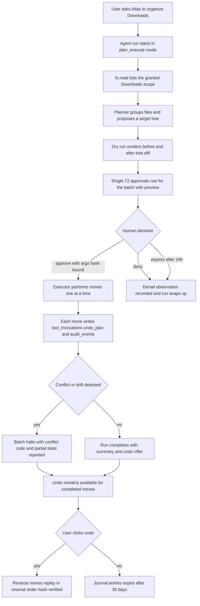

# Atlas — Computer Automation

> Deliverable 13. Conforms to [00-architecture-decisions.md](00-architecture-decisions.md).

---

## 1. Scope and position

This document specifies what Atlas is allowed to *do* to the machine: the
built-in automation tools shipped in `atlas/tools/builtin/`, their capability
ids, risk tiers, grant scopes, and undo stories; the sandboxing rules their
executors obey; and the rollout schedule that takes Atlas from read-only (S3's
threshold) to approved autonomous workflows. It builds directly on the tool
contract and invocation pipeline of
[24-tool-architecture.md](24-tool-architecture.md) and the agent runtime of
[23-agent-architecture.md](23-agent-architecture.md); the governing invariant
remains spine §2.2 — model intent, deterministic permission, executor action —
plus spine §2.3: **read-only by default; every write capability is opt-in,
risk-tiered, audited, and reversible where physically possible.**

## 2. Staged capability rollout

Capabilities ship in the order a user can *trust* them, mapped to spine §13
milestones. A stage never weakens the guarantees of the stages before it
(spine §1); each milestone's tools pass their executor integration tests and
the tool-selection eval gate before the next tier unlocks.

| Milestone | Stage gate | What ships | Why this order |
|---|---|---|---|
| **M15 Tool registry & permission engine** | T0 read-only | `fs.read`, `system.info`, `git.read` — plus the registry, policy engine, grants UI, audit trail | Prove the *pipeline* (validate → policy → execute → audit) on tools that cannot damage anything; the permission engine gets months of production burn-in before the first write |
| **M17 Safe filesystem actions** | T1–T3 writes on files | `fs.create_folder`, `fs.copy`, `fs.rename`, `fs.move`, `fs.delete`, `fs.open`, `fs.reveal` — plus the undo journal and dry-run previews | Files are the highest-value automation surface and the most recoverable one: every operation here has a true undo (§4) |
| **M18 App control & system tools** | System surface | `app.open`, `app.focus`, `clipboard.read`, `clipboard.write`, `notify.send`, `terminal.run` (templates only, §6) | Broader blast radius, weaker undo — ships only after M17's approval UX and undo journal are proven in daily use |
| **M19+ Durable workflows → M24 autonomy** | Composition | Multi-step recipes as Temporal workflows; scheduled runs; the M23 daily brief acting through these same tools | Composition multiplies risk, so it arrives last, on top of durable execution and an audit trail the user already trusts |

## 3. The capability catalog

All tools follow the ToolDefinition contract of
[24-tool-architecture.md](24-tool-architecture.md); this table is the
product-level summary. Grants are created only by explicit user action
(spine §11) and every decision writes an `audit_events` row.

| Tool | Capability id | Tier | Grant scope shape | Undo story |
|---|---|---|---|---|
| `fs.read` | `fs.read` | T0 | Path globs, e.g. `~/Projects/**` | n/a — read-only |
| `fs.open` | `fs.open` | T1 | Path globs | Close the app; no data mutated |
| `fs.reveal` | `fs.reveal` | T1 | Path globs | n/a — UI action only |
| `fs.create_folder` | `fs.write.create_folder` | T1 | Path globs | Journaled reverse: remove folder if still empty; else trash |
| `fs.rename` | `fs.write.rename` | T2 | Path globs | Journaled reverse rename |
| `fs.move` | `fs.write.move` | T2 | Path globs covering src and dst | Journaled reverse move, hash-verified (worked example in doc 24 §4) |
| `fs.copy` | `fs.write.copy` | T1 | Path globs covering src and dst | Trash the copy; source untouched by construction |
| `fs.delete` | `fs.write.delete` | T3 | Path globs | **Trash only — never hard delete**; restore from OS trash via journal reference |
| `app.open` | `app.open` | T1 | App allowlist, e.g. bundle ids or exe names | Quit the app |
| `app.focus` | `app.focus` | T1 | App allowlist | Refocus previous app; cosmetic |
| `clipboard.read` | `clipboard.read` | T0 | Boolean, per-session expiry recommended | n/a — read-only, but privacy-sensitive: contents are never persisted to the index |
| `clipboard.write` | `clipboard.write` | T1 | Boolean | Journal snapshots prior clipboard text and restores it on undo |
| `system.info` | `system.info` | T0 | Boolean | n/a — OS version, disk space, battery; no personal content |
| `notify.send` | `notify.send` | T1 | Boolean | Dismiss; inherently visible |
| `terminal.run` | `terminal.run` | T3 | Template allowlist + working-dir roots (§6) | Template-declared: compensating action or `none_documented` |
| `git.read` | `git.read` | T0 | Repo roots under granted paths | n/a — status, log, diff; never mutates |

Notes: `fs.delete` at T3 and `terminal.run` at T3 follow spine §11 exactly
(deletes and terminal commands always confirm with preview + typed phrase).
`fs.move`/`fs.rename` sit at T2 (approval with preview). T1 tools execute
without approval but always emit the visible notification spine §11 requires —
"no invisible actions" is enforced by the tier, not by tool authors' goodwill.

## 4. The undo architecture

Reversibility is a design input, not an afterthought: a tool's rollback
strategy is a required ToolDefinition field, and `none_documented` forces T3
(doc 24 §3). Three mechanisms:

**Undo journal.** Every successful T1–T3 filesystem effect writes an undo
descriptor onto its `tool_invocations` row (`undo_plan` JSONB: reverse
operation, affected paths, content hashes, timestamps; `undo_status`:
`available | done | invalidated | expired`). Undo executes the reverse
operations **as ordinary tool invocations** — policy-checked, audited,
journaled themselves — in reverse order for batches. Before applying, each
reverse op verifies its precondition hash; if the world changed since (user
edited the moved file), that entry is marked `invalidated` and reported rather
than blindly applied. Journal entries expire after 30 days.

**OS trash for deletes — never hard delete.** `fs.delete` moves to the
platform trash (macOS Trash, Windows Recycle Bin, XDG Trash on Linux) and
records the trash reference in the journal. Undo restores from trash. Atlas
ships no code path that unlinks a user file directly; "empty trash" remains a
human-only operation in the OS.

**Dry-run preview.** Every T2/T3 approval attaches a rendered preview generated
by actually executing the plan against an in-memory model of the affected
subtree — a **before/after tree diff** (files moved, created, trashed; counts
and byte totals; collisions flagged), not a prose promise. What the user
approves is what the executor performs: the approval binds to the args hash
(doc 23 §9), and any drift between preview time and execution time (a file
appeared in the source folder) aborts with `conflict` instead of improvising.

## 5. Sandboxing and path safety

Executors trust nothing about incoming paths, including that they came from a
schema-valid intent:

1. **Canonicalize first.** Expand `~`, normalize separators and Unicode (NFC),
   resolve `.`/`..`, then `realpath()` to resolve **symlinks** — and only then
   compare against granted roots. Checking before resolution is the classic
   symlink-escape bug; a link inside a granted root pointing at `~/.ssh` must
   fail scope-checking on its *target*.
2. **Allowlisted roots from `permission_grants`.** Scope checking is
   prefix-matching on canonical absolute paths against the grant's glob roots.
   **Deny-by-default outside grants** — there is no "system-wide" fs grant
   shape at all; the widest grantable scope is an explicit directory tree.
3. **TOCTOU discipline.** Operations open by file descriptor after the check
   where the platform allows (`O_NOFOLLOW`, `openat`-style traversal), so the
   checked path and the operated-on file are the same object.
4. **Write-scope symmetry.** Tools with two paths (`fs.move`, `fs.copy`)
   require both endpoints in scope; there is no "read here, write anywhere".
5. **Secondary guards.** Per-invocation ceilings (batch size, total bytes)
   from the ToolDefinition; the executor process runs with the user's own
   privileges — Atlas never asks for elevation, so its worst case is bounded by
   what the user themself could do, and its *granted* worst case is far smaller.

**Per-platform reality:**

- **macOS.** TCC means the OS will prompt for folder access (or Full Disk
  Access for broad scopes) at the *process* level. Atlas deliberately requests
  the narrowest OS permission that covers active grants, and treats OS
  permission as necessary-but-insufficient: Atlas's own grant check still
  applies inside whatever the OS allows. The honest note: if the user grants
  the OS more than Atlas grants, only Atlas's policy engine narrows it — which
  is why it is deterministic, unit-tested code (ADR-0007).
- **Windows.** Case-insensitive comparison for scope checks; reject reserved
  device names (`CON`, `NUL`, `COM1`…); use extended-length path syntax
  internally so long paths don't fail mid-batch; Recycle Bin via the shell API
  (`IFileOperation`) so recycled items are genuinely restorable.
- **Linux.** XDG trash spec (`~/.local/share/Trash` with `.trashinfo`
  metadata); cross-device moves fall back to copy-verify-delete (doc 24 §4);
  watch for bind mounts when resolving canonical paths.

## 6. `terminal.run` — the highest-risk tool

Free-form shell is the capability that turns every prompt-injection into full
computer control. Atlas v1 therefore ships `terminal.run` as **allowlisted
command templates only — no free-form shell**:

- A template is code-registered (same PR review as tools, doc 24 §2): a fixed
  argv vector with **typed, validated placeholders** — e.g.
  `git.pull = ["git", "-C", "{repo:GrantedRepoPath}", "pull", "--ff-only"]`.
  Placeholders are substituted as argv elements, never concatenated into a
  shell string: no shell metacharacters, no `sh -c`, no injection surface.
- The model's argument is `template_id` + placeholder values; the grant scope
  is the set of allowed template ids plus working-directory roots.
- **T3 always**: rendered preview shows the exact argv, cwd, and the template's
  documented effect; the user types the confirmation phrase (e.g. `RUN GIT
  PULL`). Approval binds to the resolved argv.
- **Output capture limits**: stdout+stderr captured to 32 KiB (tail-biased,
  truncation marked), stored on `tool_invocations`; the model sees the standard
  truncated slice (doc 23 §12). Timeout kills the process group; a killed
  command reports `timeout` with partial output.
- Rollback is template-declared: some templates are compensable
  (`docker.compose_up` ↔ `docker.compose_down`), most are `none_documented` —
  which is exactly why the tier is T3.

**The "start my development environment" pattern.** Recurring multi-command
asks become **recipes**: a named, user-approved sequence of template
invocations ("open `~/Projects/atlas` in the editor, `git pull`, start compose,
open localhost:3000") stored as configuration referencing template ids —
never raw strings. First run walks each T3 gate individually; the user may then
grant the *recipe* a standing approval with an expiry, converting future runs
to a single confirm. The model can *suggest* new recipes; only the user can
save one — model output cannot mint standing permissions (spine §11), so a
recipe is a bundle of grants, not a bypass of them.

## 7. Browser automation: explicitly deferred

Atlas v1 does **not** drive the user's browser (no DOM clicking, no form
filling, no headless sessions). Two reasons, both structural: (1) **attack
surface** — a driven browser holds live authenticated sessions to mail,
banking, and work SaaS; a single mis-click acts with the user's full web
identity, and no undo journal can reverse a submitted form; (2) **injection
risk** — web pages are adversarial input that would sit directly inside the
perception-action loop, the worst possible place for untrusted content (§8).
The M22 connector framework covers the highest-value use cases (Drive, Git,
and later services) through **audited APIs with scoped credentials** instead —
narrower, revocable, and loggable. Browser automation is revisited post-1.0,
after M25 hardening, and only with a dedicated threat model; it is a deliberate
product decision recorded here, not a gap.

## 8. Prompt-injection defense at the automation layer

Full model in [30-security-architecture.md](30-security-architecture.md); the
automation layer's own rules:

- **Untrusted content is labeled at ingestion.** Everything that arrives from
  documents, retrieved chunks, web content, or tool outputs is tainted-by-origin
  context — it can *inform* reasoning, but the system never treats it as user
  instruction.
- **Content can never directly become write-tier tool arguments.** A tainted
  string reaching the arguments of a T1+ intent (a path read from inside a PDF,
  a "command" found in a README) is detected by the policy engine's taint
  check: T1 intents with tainted arguments **escalate to T2 approval**, and
  T2/T3 previews highlight which argument values originated from content, so
  the human decision is informed. Arguments must still pass schema validation
  and scope checks regardless of origin — taint escalates scrutiny; it never
  substitutes for it.
- **The gates are out-of-band by construction.** The approval UI renders from
  the validated args and executor-generated preview, never from model prose —
  a hijacked model cannot draw its own "approved" screen. And because grants
  live in `permission_grants` (spine §11), no instruction embedded in any
  document can widen them: the worst a perfect injection achieves is a
  well-formed request that a human sees, with its provenance flagged, and
  declines.

## 9. What Atlas will never do

Commitments, testable against the architecture, holding at every autonomy stage:

- **No unrestricted shell.** `terminal.run` is templates-only in v1; any future
  relaxation requires its own ADR and threat model, and remains T3.
- **No self-granting, ever.** Grants are created only by explicit user action;
  no code path allows model output, an agent step, or a background job to
  create or widen a `permission_grant`. Spine §11 makes this the policy
  engine's defining property.
- **No invisible actions.** Every effect is at minimum T1 — visible
  notification, `tool_invocations` row, `audit_events` row. "No magic" (spine
  §2.7) is implemented, not aspirational: if it isn't in the audit log, it
  didn't happen through Atlas.
- **No hard deletes.** Trash + journal, always (§4).
- **No keylogging or screen scraping without an explicit per-session grant.**
  No global input capture exists in v1 at all; if a future voice/vision stage
  needs the screen (S4+), it will be a per-session, visibly-indicated,
  auto-expiring grant — never ambient.
- **No elevation.** Atlas runs as the user, never as root/admin.

## 10. Worked flow: batch file organization

"Organize my Downloads folder" — from ask to undo, through every layer defined
in docs 23 and 24:

Design points visible in the flow: the batch is approved **once, as a whole**
(spine §11 puts move batches at T2), with a preview that enumerates every
individual operation; execution is per-file so a mid-batch failure leaves a
precisely known, fully undoable prefix rather than an unknown mess; and undo is
not a special mechanism — it is the same pipeline running the journaled reverse
operations, which is why it appears in the audit log like everything else.

## 11. Decisions made in this document

Choices the spine left open, resolved here (simplest consistent option):

- **Write-capability namespace**: filesystem writes use `fs.write.*` capability
  ids (`fs.write.move`, `fs.write.rename`, `fs.write.copy`,
  `fs.write.create_folder`, `fs.write.delete`), matching spine §11's
  `fs.write.move` form; tool *names* keep the short form (`fs.move`).
- **Tier assignments** beyond the spine's anchors: `fs.copy` and
  `fs.create_folder` T1 (truly reversible); single-item `fs.rename` and
  `fs.move` T2 (spine names batches; singles kept at T2 for one consistent
  user story); `fs.open`, `fs.reveal`, `app.open`, `app.focus`,
  `clipboard.write` T1; `clipboard.read`, `system.info`, `git.read` T0.
- **`notify.send` is T1**, reading spine §11's "sending anything is T2" as
  sending *to the outside world*; a local OS notification to the user is
  itself the T1 visibility mechanism.
- **Milestone placement**: `fs.read`, `system.info`, `git.read` at M15;
  all `fs.write.*` plus `fs.open`/`fs.reveal` at M17; app, clipboard,
  notification, and `terminal.run` at M18.
- **Undo journal retention**: 30 days; entries invalidated (not applied) when
  precondition hashes no longer match; undo executes as ordinary audited
  invocations.
- **`terminal.run` v1 shape**: code-registered argv templates with typed
  placeholders, no shell interpretation, 32 KiB tail-biased output capture,
  T3 with typed confirmation; recipes are user-saved bundles of template
  invocations with optional expiring standing approval.
- **Taint escalation rule**: content-derived arguments escalate T1 intents to
  T2 and are provenance-highlighted in all previews (detail in
  [30-security-architecture.md](30-security-architecture.md)).
- **Browser automation deferred post-1.0** in favor of M22 connector APIs.
