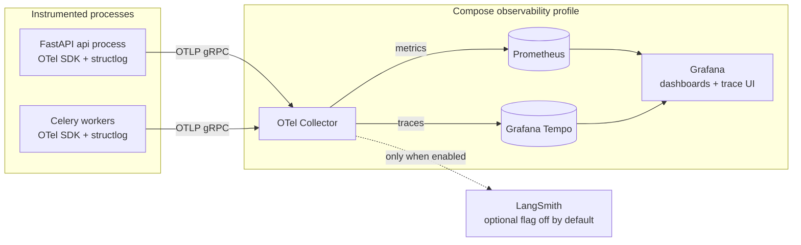

# Atlas — Observability Architecture

> Deliverable 18. Conforms to [00-architecture-decisions.md](00-architecture-decisions.md).

---

## 1. Philosophy

An AI system you cannot trace is a system you cannot debug, evaluate, or bill.
A wrong answer from a RAG pipeline has a dozen possible causes — watcher missed
a file, chunking split a table, retrieval ranked the wrong chunks, the packer
dropped the right one, the prompt regressed, the model changed — and without a
trace that stitches those stages together, "why was this answer wrong?" is
archaeology. So in Atlas, **observability is a feature of the product, not ops
garnish**: every answer in the UI is one click away from its full trace, every
LLM call knows its prompt version and cost, and the eval harness consumes the
same telemetry the debugger does (spine §2.5, §12; ADR-0010).

Two constraints shape everything below:

1. **Local-first privacy.** Telemetry is as sensitive as the corpus it
   describes. By default, every trace, metric, and log stays on the machine —
   the observability stack ships in the local Compose `observability` profile,
   and no exporter points off-box unless the user flips a flag (§12).
2. **Single-user scale.** We are instrumenting a laptop, not a fleet. That
   buys us 100% sampling and rich spans (§11) — the debugging ergonomics of a
   staging environment, in production.

## 2. Architecture



- **SDK:** `opentelemetry-sdk` configured once in `atlas/observability`,
  shared by the API app factory and the worker bootstrap. Auto-instrumentation
  for FastAPI, SQLAlchemy, Redis, and Celery (context propagation across the
  queue, so an agent step in a worker joins the trace that started it), plus
  our manual spans (§3).
- **Collector:** a local OTel Collector receives OTLP and fans out. Why a
  collector instead of exporting directly from the SDK: one place to add
  scrubbing/filtering processors, batch, retry, and (later) route to optional
  exporters — the processes themselves never need reconfiguring.
- **Traces backend: Grafana Tempo**, not Jaeger. Both are fine local trace
  stores; Tempo wins here because Grafana is already required for dashboards,
  so Tempo gives one UI for metrics *and* traces with links between them
  (exemplars from a latency histogram straight to the slow trace, trace→logs
  correlation), a single-binary local-storage mode that fits Compose, and
  TraceQL for attribute queries like `atlas.prompt_version = "rag_answer.v7"`.
  Jaeger would add a second UI for no additional capability we use.
- **Metrics:** Prometheus scrapes the Collector's Prometheus exporter.
- **Logs:** structlog JSON to stdout/file (§5); correlated to traces by
  `trace_id` field rather than shipped to a log store — at single-user scale,
  `grep` plus trace correlation beats running Loki. The Collector pipeline can
  add Loki later without touching app code.

Every API response carries `X-Trace-Id` (spine §8), and the UI shows it in a
message's detail panel — the handle that makes §10's workflow one click.

## 3. Span taxonomy

Span names are fixed by spine §12. Required attributes per span (all spans also
carry `atlas.profile` — `hybrid` or `local_only` — via a resource-level
attribute, plus standard OTel resource attrs `service.name` of `atlas-api` or
`atlas-worker`):

| Span name | Emitted by | Required attributes |
|---|---|---|
| `ingest.parse` | worker | `atlas.source_id`, `atlas.document_id`, `atlas.parser` (e.g. `pymupdf`), `atlas.file_size_bytes`, `atlas.mime_type`, `atlas.secrets_detected` (bool) |
| `ingest.chunk` | worker | `atlas.document_version_id`, `atlas.chunk_strategy`, `atlas.chunk_count` |
| `ingest.embed` | worker | `atlas.embedding_model`, `atlas.chunk_count`, `atlas.batch_size` |
| `rag.retrieve` | api | `atlas.query_hash` (SHA-256, not raw text), `atlas.top_k`, `atlas.candidates_vector`, `atlas.candidates_fts`, `atlas.candidates_fused`, `atlas.filters` (project/source ids), `atlas.abstained` (bool) |
| `rag.rerank` | api | `atlas.reranker_model`, `atlas.candidates_in`, `atlas.candidates_out` |
| `llm.call` | api + worker | GenAI semconv set (§4) + `atlas.prompt_version`, `atlas.cost_usd`, `atlas.conversation_id` or `atlas.run_id`, `atlas.feature` |
| `tool.invoke` | api + worker | `atlas.tool_invocation_id`, `atlas.capability`, `atlas.risk_tier`, `atlas.decision`, `atlas.approval_id` (when gated) |
| `agent.step` | worker | `atlas.run_id`, `atlas.step_index`, `atlas.step_type` (`thought` \| `tool` \| `observation`), `atlas.checkpointed` (bool) |
| `policy.check` | api + worker | `atlas.capability`, `atlas.scope`, `atlas.decision`, `atlas.matched_grant_id`, `atlas.risk_tier`, `atlas.untrusted_context` (bool) |

Conventions: attribute namespace `atlas.*` for everything not covered by an
official semconv; ids are UUIDv7 strings; booleans are real booleans, not
strings. `rag.retrieve` records a query *hash* because raw queries are user
content — content capture is a separate, opt-in switch (§5).

## 4. GenAI semantic conventions on `llm.call`

`llm.call` spans follow the OTel GenAI semantic conventions so any
GenAI-aware tool can read them, then add the Atlas layer:

| Attribute | Example | Source |
|---|---|---|
| `gen_ai.system` | `anthropic` \| `openai` \| `ollama` | semconv |
| `gen_ai.request.model` | `claude-sonnet-5` | semconv |
| `gen_ai.response.model` | resolved model id from the response | semconv |
| `gen_ai.usage.input_tokens` | `2841` | semconv |
| `gen_ai.usage.output_tokens` | `412` | semconv |
| `gen_ai.request.temperature` | `0.2` | semconv |
| `gen_ai.response.finish_reasons` | `["end_turn"]` | semconv |
| `atlas.prompt_version` | `rag_answer.v7` | prompt registry |
| `atlas.profile` | `hybrid` | config (resource attr) |
| `atlas.cost_usd` | `0.0119` | cost meter (§8) |
| `atlas.conversation_id` | UUIDv7 | chat use cases |
| `atlas.run_id` | UUIDv7 | agent runtime / eval runner |
| `atlas.feature` | `chat` \| `agent` \| `title` \| `judge` \| `memory` | caller |

Prompt and completion **content** is not recorded by default (semconv marks
content capture opt-in for good reason). A debug flag
(`observability.capture_content`, default off) adds content as span events for
local-only debugging sessions; the Collector scrubbing processor strips content
attributes from any non-local exporter unconditionally.

## 5. Logging

- **structlog, JSON lines.** One event per line; processors add ISO timestamps,
  level, logger, and — via the OTel context processor — `trace_id` and
  `span_id` on every record emitted inside a span. That correlation is the
  contract: given a log line you can open the trace; given a trace you can grep
  the logs.
- **Levels policy:**
  - `DEBUG` — developer detail; enabled per-module via config, never in
    packaged builds.
  - `INFO` — lifecycle events without content: request started/finished, job
    state changes, ids, counts, durations. **No document content, no prompt
    text, no query text at INFO** — privacy is a level policy, not vigilance.
  - `WARNING` — degraded-but-handled: provider fallback engaged, retry
    scheduled, circuit breaker half-open.
  - `ERROR` — failed operations with stack traces; always carries `trace_id`.
- **Scrubbing processors** run last in the chain: redact values for key names
  matching a denylist (`api_key`, `token`, `authorization`, `password`,
  `secret`), apply the same token-shaped-string regexes used at ingestion
  ([30-security-architecture.md](30-security-architecture.md) §7.3), and
  truncate any string field over 2 KB. Structured-first logging makes this
  reliable: scrubbing keyed fields beats regexing prose.

## 6. End-to-end trace examples

**A chat turn** (presentation → use case → retrieval → LLM → persistence):

```
POST /api/v1/conversations/{id}/messages       12.3s   [FastAPI auto-instr]
└─ usecase.send_message                        12.2s
   ├─ db.query  SELECT messages, memories       18ms   [SQLAlchemy auto-instr]
   ├─ rag.retrieve                             410ms   candidates_vector=24
   │  ├─ db.query  pgvector cosine top 24       95ms     candidates_fts=24
   │  ├─ db.query  FTS websearch top 24         60ms     candidates_fused=24
   │  └─ rag.rerank                            240ms   candidates_out=8
   ├─ llm.call                                11.4s   model=claude-sonnet-5
   │                                                   prompt_version=rag_answer.v7
   │                                                   input_tokens=2841 output_tokens=412
   │                                                   cost_usd=0.0119  (streaming: TTFT event)
   └─ db.query  INSERT message, citations       12ms
```

**An agent run** (API enqueues; steps execute in a worker, joined to the same
trace by context propagation through Celery):

```
POST /api/v1/agent-runs                        150ms
└─ usecase.start_agent_run                     130ms   run_id=…
   └─ celery.enqueue  agent.execute              3ms

agent.execute (worker, linked to parent trace)  84s
├─ agent.step  step_index=1 type=thought        6.1s
│  └─ llm.call  model=claude-sonnet-5           6.0s   feature=agent
├─ agent.step  step_index=2 type=tool           31s
│  ├─ policy.check  capability=fs.write.move    2ms    decision=require_approval
│  │                                                   untrusted_context=true
│  ├─ [approval wait — span event, 28s]
│  └─ tool.invoke  risk_tier=T2                 240ms  decision=approved
└─ agent.step  step_index=3 type=observation    4.2s
   └─ llm.call                                  4.1s
```

The second tree is the safety story made visible: the `policy.check` span with
`decision=require_approval` and the 28-second human gap are *in the trace*,
so "why did this run take 84 seconds" answers itself.

## 7. Metrics catalog

Prometheus names (rendered from OTel instruments), all prefixed `atlas_`.
Label discipline: bounded cardinality only — model, provider, route, tier;
never conversation ids or document ids (those live on spans).

| Metric | Type | Labels | Meaning |
|---|---|---|---|
| `atlas_http_request_duration_seconds` | histogram | `route`, `method`, `status` | API latency; SLO source |
| `atlas_llm_request_duration_seconds` | histogram | `provider`, `model`, `feature` | LLM call latency incl. TTFT bucket via exemplars |
| `atlas_llm_tokens_total` | counter | `provider`, `model`, `direction` | input/output tokens |
| `atlas_llm_cost_usd_total` | counter | `provider`, `model`, `feature` | metered cost (§8) |
| `atlas_llm_fallbacks_total` | counter | `from_model`, `to_model`, `reason` | routing/circuit-breaker activity |
| `atlas_retrieval_candidates` | histogram | `stage` = `vector` \| `fts` \| `fused` \| `final` | candidate counts per stage — a collapsing funnel is a quality smell |
| `atlas_abstentions_total` | counter | `reason` | abstention events; rate = abstentions / answers |
| `atlas_answers_total` | counter | `grounded` | denominator for abstention + grounding rates |
| `atlas_ingest_documents_total` | counter | `status` = `succeeded` \| `failed` \| `skipped` | ingestion throughput |
| `atlas_index_lag_seconds` | gauge | `source` | now minus oldest unprocessed watcher event — freshness of the index |
| `atlas_queue_depth` | gauge | `queue` | Celery backlog per queue |
| `atlas_jobs_failed_total` | counter | `task`, `reason` | dead-lettered work; should be near zero |
| `atlas_approval_wait_seconds` | histogram | `risk_tier` | human-in-the-loop latency; long tails mean approval fatigue |
| `atlas_feedback_total` | counter | `score` = `up` \| `down` | explicit feedback volume and polarity |

## 8. Cost metering

Cost is a first-class metric (spine §12), attributed at three grains:

1. **Rates config.** `atlas/config` ships a versioned rates table: per-model
   input/output USD per million tokens (and per-request rates where relevant).
   Local Ollama models have rate 0 — which makes the hybrid-vs-local cost
   difference visible rather than assumed. Rates are config, not code: a price
   change is a config PR, and the rates-file version is recorded on each run.
2. **Per-call.** The cost meter in `atlas/ai` computes cost when each call
   completes (streamed calls: at stream end from final usage), stamps
   `atlas.cost_usd` on the `llm.call` span, increments
   `atlas_llm_cost_usd_total`, and persists tokens + cost on the durable row
   that owns the call (`messages` for chat, `agent_steps` for agent calls,
   `eval_results` for eval calls).
3. **Rollups.** Daily and per-conversation aggregation are SQL views over
   those rows (`v_cost_daily`, `v_cost_by_conversation`, `v_cost_by_feature`)
   — no new tables, no drift risk from a second bookkeeping path, and the
   Cost dashboard queries Prometheus for trends and Postgres for exact
   attribution. Per-feature attribution comes from `atlas.feature`, so "chat
   costs $X/day, agent runs $Y, evals $Z" is a query, not a guess.

## 9. Dashboards

Four Grafana dashboards ship provisioned in the `observability` profile:

1. **Chat quality and latency** — p50/p95/p99 end-to-end turn latency; TTFT;
   `llm.call` latency by model; abstention rate; grounded-answer rate;
   retrieval funnel (candidates by stage); feedback up/down trend; exemplar
   links from the latency histogram to slow traces.
2. **Ingestion and index health** — documents ingested by status; parse/chunk/
   embed stage durations; `atlas_index_lag_seconds` per source; queue depth;
   job failures with task/reason breakdown; dead-letter count.
3. **Cost** — cost today/this week by model and by feature; tokens in/out by
   model; cost per conversation distribution; local-vs-cloud call mix;
   fallback events (fallbacks change spend).
4. **Agent runs** — runs started/completed/cancelled; steps per run; step
   duration by type; `policy.check` decisions (allow/deny/approval mix);
   approval wait histogram by tier; tool invocation outcomes.

## 10. Feedback capture and the debugging loop

**Capture.** Every assistant message renders thumbs up/down plus an optional
comment. `POST /messages/{id}/feedback` writes a `feedback` row storing the
score, comment, message id, and — the load-bearing field — the **`trace_id`**
of the turn that produced the message. A bad answer is one click from its full
trace.

**The workflow this exists for** (the whole point of the document):

1. User reports a wrong answer (or thumbs-down lands in the `feedback` table).
2. The message detail panel shows the `trace_id`; open it in Grafana/Tempo.
3. **Replay retrieval:** the `rag.retrieve` span records filters, candidate
   counts, and the final chunk ids (via citations); re-run `POST /search` with
   the same query and filters to see whether retrieval was the failure — wrong
   chunks retrieved, or right chunks ranked out at fusion/rerank.
4. **Inspect the prompt version:** the `llm.call` span names
   `atlas.prompt_version` and both request/response models — was this prompt
   revision or a model change the delta?
5. **File an eval case:** one action in the triage UI converts the failure
   into a draft eval example (retrieval, grounding, or tool case) in the
   appropriate dataset — the feedback→eval flywheel of
   [32-evaluation-architecture.md](32-evaluation-architecture.md).

Every step consumes telemetry defined in this document; nothing requires a
debugger or a reproduction environment. This loop is what "observability is a
product feature" means operationally.

## 11. Sampling

- **Today: 100% head sampling** (`ParentBased(AlwaysOn)`). Single-user request
  volume makes every-trace retention cheap, and evals + feedback both assume
  the trace for any given message exists. Sampling away traces would break the
  §10 loop precisely on the rare-bug traces you need.
- **Knobs for the future:** `observability.trace_sample_rate` (head sampling,
  default 1.0) exists in config now so a future multi-user/cloud deployment
  tunes without code changes; the intended evolution there is tail-based
  sampling at the Collector (keep all errors, all `llm.call`-bearing traces,
  and slow outliers; sample the healthy majority). Not enabled locally — it
  would only add moving parts.

## 12. LangSmith as optional exporter

The spine (ADR-0010) names LangSmith as an optional exporter. Rationale for
*optional*: LangSmith's LLM-trace UX (prompt diffing, dataset curation) is
genuinely good, but it is a cloud service — exporting traces means exporting
prompt metadata off-box, which contradicts the local-first default. So:

- Off by default; enabled by `observability.langsmith_enabled` plus an API key
  in the OS keychain (never dotenv — same rule as all secrets).
- When enabled, the Collector adds the export pipeline; app code is untouched.
- The content-scrubbing processor still applies: content attributes never
  leave the box unless the user *additionally* enables content capture, and
  the settings UI states both switches' consequences in plain language.

This is the pattern for any future SaaS observability integration: local
remains the source of truth; SaaS is a projection the user opts into.

## 13. Alerting-lite for a desktop product

A desktop app cannot page anyone, and should not: the "operator" is the user.
Instead of PagerDuty, an **in-app health surface**:

- The API's `GET /health` / `GET /ready` roll up subsystem checks (DB, Redis,
  workers heartbeat, provider circuit breakers, disk headroom).
- A lightweight in-app evaluator (Celery beat, using the same Prometheus
  queries as the dashboards) checks a short rule list: index lag over
  threshold, queue depth growing, repeated job failures, provider circuit
  breaker open, audit-chain verification failure, disk low.
- Findings surface as a status badge on the Tauri tray icon and a health panel
  in settings — severity-ranked, each with a "what this means / what to do"
  line. Critical items (audit chain broken, disk nearly full) also raise an OS
  notification.
- No emails, no webhooks, no phone-home. If Atlas ever runs headless/served,
  Prometheus alerting rules are the natural extension point — the metrics are
  already there.

## 14. Decisions made in this document

Choices the spine left open, resolved here (simplest consistent option):

1. **Trace backend: Grafana Tempo** over Jaeger — one UI with Grafana
   dashboards, metric-exemplar→trace and trace→log links, TraceQL, and
   single-binary local storage in the Compose `observability` profile.
2. **Collector-in-the-middle topology:** processes export OTLP to a local OTel
   Collector, which owns scrubbing, batching, and fan-out; optional exporters
   (LangSmith) attach at the Collector, never in app code.
3. **Span-attribute namespace and required sets** as tabulated in §3, with
   `atlas.*` for custom attributes, query *hashes* rather than raw query text,
   and profile as a resource attribute.
4. **Use-case span naming:** `usecase.<name>` (e.g. `usecase.send_message`)
   for the application-layer span between HTTP server spans and the fixed
   taxonomy of spine §12.
5. **Content capture off by default** even locally; `observability.capture_content`
   flag adds content as span events; the Collector strips content from any
   non-local exporter unconditionally.
6. **Logs stay files, not a log store:** structlog JSON with `trace_id`/
   `span_id` injection; no Loki in the local profile (extensible later at the
   Collector).
7. **Metric names and labels** per the §7 catalog, with a hard rule against
   unbounded-cardinality labels.
8. **Cost rollups as SQL views** (`v_cost_daily`, `v_cost_by_conversation`,
   `v_cost_by_feature`) over `messages`/`agent_steps`/`eval_results` rows —
   no new tables beyond the spine's canonical list.
9. **Sampling: 100% head sampling now**, config knob reserved; tail sampling
   documented as the future cloud posture, not enabled locally.
10. **Alerting: in-app health surface** (tray badge + settings panel + OS
    notification for critical) driven by beat-scheduled checks over local
    metrics; no external alerting dependencies.
