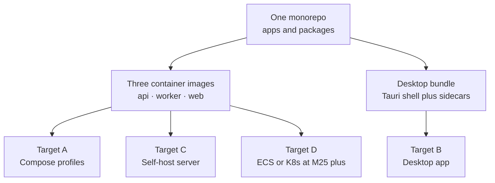
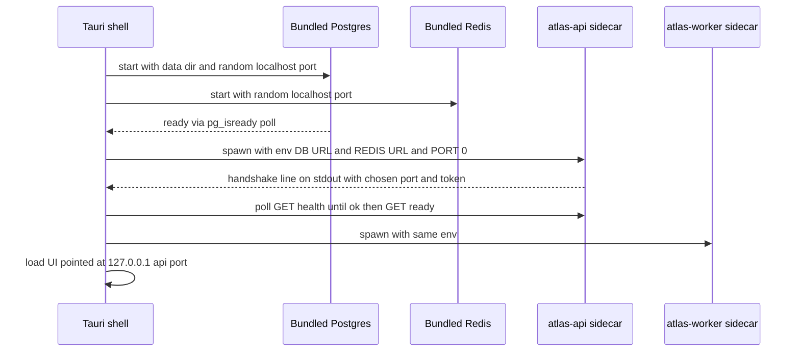

# Atlas — Deployment Architecture

> Deliverable 14. Conforms to [00-architecture-decisions.md](00-architecture-decisions.md).

---

## 1. Four deployment targets, one codebase

Atlas ships the **same modular monolith** to four very different places. The
architecture holds because the differences are pushed to the edges: process
supervision, configuration, and networking change per target; the `atlas`
package, the schema, and the API contract do not.

| Target | Who runs it | Processes | Postgres | Redis | Network exposure |
|---|---|---|---|---|---|
| A. Developer environment | Engineers | Docker Compose profiles | container (`pgvector/pgvector:pg16`) | container | localhost only |
| B. Desktop distribution | End users | Tauri 2 shell + supervised sidecars | bundled binary, app-managed | bundled binary, app-managed | `127.0.0.1` only |
| C. Self-host server | Prosumers, home labs | same Compose files on a server or NAS | container | container | LAN, auth required |
| D. Cloud SaaS — M25+ | Atlas the company | ECS or Kubernetes | managed (RDS/Cloud SQL) | managed (ElastiCache) | Internet, full authn/authz |

Why not Kubernetes everywhere, including dev? Because three of the four targets
are a single machine. Compose gives us declarative multi-service orchestration,
profiles, health checks, and volumes with none of K8s's control-plane overhead —
no etcd, no ingress controllers, nothing to page about on a laptop. K8s earns
its complexity only at Target D, where horizontal autoscaling, rolling deploys,
and multi-node scheduling are real requirements. The three-image container
strategy (§6) means the K8s migration is manifest-writing, not re-architecture.

---

## 2. Target A — developer environment (Compose profiles)

Canonical files live in `infra/compose/` with Dockerfiles in `infra/docker/`.
The spine fixes three profiles: `core`, `observability`, `full`.

### 2.1 Profile contents

| Service | Image / build | `core` | `observability` | `full` | Notes |
|---|---|---|---|---|---|
| `postgres` | `pgvector/pgvector:pg16` | ✅ | — | ✅ | volume `atlas-pgdata`; healthcheck `pg_isready` |
| `redis` | `redis:7-alpine` | ✅ | — | ✅ | `appendonly yes` for broker durability |
| `api` | `infra/docker/api.Dockerfile` | ✅ | — | ✅ | `uvicorn --reload`, source bind-mounted |
| `worker` | same image as `api` | ✅ | — | ✅ | Celery worker, `--beat` embedded in dev |
| `web` | `infra/docker/web.Dockerfile` (dev stage) | ✅ | — | ✅ | `next dev`, source bind-mounted |
| `otel-collector` | `otel/opentelemetry-collector-contrib` | — | ✅ | ✅ | receives OTLP from api and worker |
| `prometheus` | `prom/prometheus` | — | ✅ | ✅ | scrapes api, worker, collector |
| `grafana` | `grafana/grafana` | — | ✅ | ✅ | provisioned dashboards from `infra/` |
| `jaeger` | `jaegertracing/all-in-one` | — | ✅ | ✅ | trace backend behind the collector |
| `ollama` | `ollama/ollama` | — | — | ✅ | models in volume `atlas-ollama` |

Usage: `docker compose --profile core up` for day-to-day API/RAG work;
add `--profile observability` when working on tracing or dashboards;
`--profile full` when you need local embeddings/inference end to end.
Developers who run Ollama natively (common on macOS, where the container
cannot use the GPU) keep `core` and point `ATLAS_OLLAMA_URL` at the host —
the profile system makes both workflows first-class.

### 2.2 Dev-loop properties

- **Hot reload everywhere.** `api` mounts `apps/api/src` and restarts on
  change; `worker` uses `watchfiles`-driven restart; `web` uses Next.js fast
  refresh. The containers pin the toolchain; the code lives on the host.
- **Startup ordering** is health-check driven, not sleep driven: `api` has
  `depends_on: postgres: condition: service_healthy`, likewise redis. The api
  then runs migrations under an advisory lock (§8) before serving `/ready`.
- **Beat in dev** runs embedded in the worker (`celery worker -B`). That is
  acceptable only where exactly one worker exists; Targets C and D run a
  dedicated beat process so scaling workers never duplicates schedules.
- **Resets are cheap and explicit.** `docker compose down -v` destroys state;
  seeds and golden eval datasets rebuild a useful dev corpus from `evals/`.

---

## 3. Target B — desktop distribution (Tauri 2 + sidecars)

The desktop app is the product's primary form (ADR-0006, M14). One installer
delivers the Tauri shell, the Next.js UI (static export served by the shell),
and the Python backend as supervised sidecar processes.

### 3.1 Packaging the FastAPI sidecar: PyInstaller one-dir

**Decision: package the api/worker as a PyInstaller one-dir bundle** (one
bundle, multiple entrypoints: `atlas-api`, `atlas-worker`), shipped inside the
Tauri resources directory and registered as Tauri sidecar binaries.

Alternatives considered:

- **Embedded CPython** (ship `python-build-standalone` + a venv of wheels).
  Pros: no import-hook edge cases, debuggable site-packages, easy patching.
  Cons: we become a Python distributor — path handling, `.pyc` generation,
  signing hundreds of loose files on macOS notarization, and a larger, slower
  first launch. It is the right call for plugin-extensible apps; Atlas's
  sidecar is a closed application, not a Python runtime for users.
- **PyInstaller one-file.** Attractive single artifact, but it unpacks to a
  temp dir on every launch (seconds of cold start, AV false positives) and
  breaks the "sidecar restarts fast after a crash" requirement.
- **PyInstaller one-dir (chosen).** Fast start (no unpack), a stable on-disk
  tree that macOS/Windows code signing handles well, deterministic builds in
  CI from `uv export`-locked dependencies. Known cost: hidden-import and data
  file declarations for SQLAlchemy dialects, Alembic templates, and tiktoken
  data — paid once, encoded in the spec file, verified by a smoke test in CI
  that boots the frozen binary and hits `/health`.

### 3.2 Sidecar lifecycle — owned by the shell

The Tauri shell (Rust) is the process supervisor. The model is deliberately
boring: the shell owns start order, health, restart, and shutdown; the sidecar
owns nothing about its siblings.

- **Port negotiation.** Nothing is hardcoded. The shell starts Postgres and
  Redis on ephemeral `127.0.0.1` ports (Unix domain sockets for Postgres on
  macOS/Linux). The api binds `127.0.0.1:0`, then prints a single JSON
  handshake line (`{"port": …, "auth_token": …}`) on stdout; the shell injects
  the port and the per-boot bearer token into the UI. No port-collision
  support tickets, and no other local process can talk to the api without the
  token.
- **Health-checking.** `/health` is liveness (process up); `/ready` is
  readiness (migrations done, DB reachable). The shell shows a startup splash
  until `/ready`, then transitions the UI.
- **Crash restart.** The shell supervises with exponential backoff
  (0.5s → 8s cap) and a circuit: 5 crashes in 60s stops restarting and shows
  a diagnostic screen with the sidecar log tail — never a silent restart loop.
- **Clean shutdown.** On quit: stop worker (SIGTERM, Celery warm shutdown —
  finish current task, requeue the rest), stop api (SIGTERM, uvicorn drains
  in-flight requests), stop Redis, then `pg_ctl stop -m fast` so Postgres
  checkpoints cleanly. SIGKILL only after a 20s deadline per process.

### 3.3 Embedded database: bundled Postgres, not SQLite

**Decision: bundle real Postgres 16 + pgvector binaries, managed by the app**,
with `initdb` on first run into the platform data directory
(`~/Library/Application Support/Atlas/pgdata`, `%APPDATA%\Atlas\pgdata`,
`~/.local/share/atlas/pgdata`), superuser-less local auth, socket/loopback only.

The honest trade-off against the SQLite alternative:

| | Bundled Postgres (chosen) | SQLite + sqlite-vec fallback |
|---|---|---|
| Installer size | +45–60 MB compressed | ~0 |
| Ops surface | app must supervise initdb, upgrades, crash recovery | none — a file |
| pgvector fidelity | identical HNSW, FTS, SQL as every other target | different vector index, different FTS, different SQL dialect |
| Query engine | full parallelism, rich planner | good, but divergent behavior under hybrid search |
| Migration story | one Alembic history for all targets | dual-dialect migrations forever |
| Multi-process access | native (api + worker concurrently) | writer-lock contention with a busy worker |

The killer argument is **fidelity**: the retrieval pipeline (HNSW parameters,
`websearch_to_tsquery`, RRF over two rankings — spine §10) is the product's
core. A SQLite variant would mean two retrieval implementations, two eval
baselines, and bugs that only reproduce on end-user machines. We accept the
supervision burden — it is bounded, testable code in the shell — instead of an
unbounded behavioral fork. Postgres major upgrades ship as an explicit,
progress-barred `pg_upgrade` step in the app's update flow.

Redis is bundled the same way (a single small binary; ~10 MB, trivial to
supervise) so Celery works identically on desktop. On Windows, where upstream
Redis has no official build, we pin a maintained Windows port and CI-test the
broker contract against it; if that ever becomes untenable the `jobs` module's
queue boundary is the seam for an in-process fallback runner — a contained
change, because tasks are enqueued through a port, not by importing Celery
from use cases.

---

## 4. Target C — self-host server

The same Compose files from Target A, `full` profile, on a home server or NAS
— zero new artifacts. What changes is posture, not architecture:

- **Auth is mandatory.** Multi-user token auth activates (the `auth/` module's
  interfaces are OIDC-ready per the spine); the UI is served over the LAN, so
  anonymous localhost trust no longer applies.
- **TLS at the edge.** A reverse proxy (Caddy is the documented default for
  its automatic local CA) terminates TLS in front of `web` and `api`. Atlas
  containers still bind only the internal Compose network.
- **Resource pinning.** Compose `deploy.resources` limits keep a NAS usable:
  Postgres `shared_buffers` sized explicitly, worker concurrency capped,
  Ollama constrained to its GPU/CPU budget.
- **Backups become scheduled**, not best-effort: the maintenance queue's
  nightly `pg_dump` (see [41-infrastructure-architecture.md](41-infrastructure-architecture.md) §7)
  targets a mount the user chose, ideally off-box.

This target is the dress rehearsal for Stage 3 multi-user scaling
([42-scaling-strategy.md](42-scaling-strategy.md)): `workspace_id` scoping and
`permission_grants` are already in the schema, so turning on multi-user is
configuration, not migration.

## 5. Target D — future cloud SaaS (M25+ territory)

Post-1.0. The same three images go to ECS or Kubernetes; the deltas are
exactly the ones the seams were built for:

- **Managed Postgres** (RDS/Cloud SQL with pgvector) replaces the container;
  `DATABASE_URL` is the only code-visible change. **Managed Redis** likewise.
- **Per-tenant isolation**: shared schema + Postgres RLS keyed on
  `workspace_id` first (analysis in [42-scaling-strategy.md](42-scaling-strategy.md) §6).
- **Workers become an autoscaled pool** keyed on queue depth; Temporal (ADR-0004,
  M19) already carries durable agent workflows, which is precisely the part
  that must survive pod churn.
- **Object storage** for original documents behind the existing blob-store
  port; local disk was always an adapter.
- What does *not* change: the `atlas` package, Alembic history, the OpenAPI
  contract, the eval gates. That is the payoff of one codebase, four targets.

---

## 6. Container strategy — three images

| Image | Base | Contents | Compressed size target |
|---|---|---|---|
| `atlas-api` | `python:3.12-slim` | atlas package + uvicorn | ≤ 350 MB |
| `atlas-worker` | same base layers as api | api layers + parsing extras (PyMuPDF, python-docx, python-pptx, pandas) | ≤ 550 MB |
| `atlas-web` | `node:22-alpine` (build) → `node:22-alpine` (run) | Next.js standalone output | ≤ 200 MB |

Principles:

- **Multi-stage, uv-based Python builds.** Stage 1 (`ghcr.io/astral-sh/uv` on
  `python:3.12-slim`) runs `uv sync --frozen --no-dev` into a venv from
  `uv.lock`; stage 2 copies only the venv and `src/`. No compilers, no uv, no
  `.git` in the runtime image. Deterministic because the lockfile is the input.
- **Worker extends api**, not the reverse: identical interpreter, identical
  atlas package, plus the heavy parser wheels only workers need. Shared base
  layers mean the marginal pull cost of the worker is just the parser layer.
- **web uses Next.js `output: "standalone"`** so the runtime image carries the
  server bundle and static assets only — no `node_modules` forest.
- **Non-root `USER atlas`**, read-only root filesystem where possible,
  `HEALTHCHECK` mapping to `/health`. Size targets are CI-enforced (a job
  fails if an image regresses >10% over target) because image bloat is a
  slow leak, not an event.

## 7. Configuration layering

Configuration resolves in four layers, lowest to highest precedence, all
surfaced through **pydantic-settings** (`atlas/config`):

| Layer | Source | Examples | Mutability |
|---|---|---|---|
| 1. Code defaults | `Settings` field defaults | chunk size 512, RRF k=60, top-8 | release-time |
| 2. Profile | deployment profile file + runtime profile (`hybrid` / `local-only`) | model routing table, embedding dim 768 | install-time |
| 3. Environment | `ATLAS_`-prefixed env vars (Compose, ECS task def, shell-injected on desktop) | `ATLAS_DATABASE_URL`, `ATLAS_REDIS_URL`, ports, secrets refs | deploy-time |
| 4. `settings` table | DB-backed runtime settings + `feature_flags` | retrieval knobs, budgets, flags | runtime, hot-reload |

Two rules keep this sane. **Bootstrap keys** (anything needed before a DB
connection exists — DSNs, telemetry endpoint, profile name) may only come from
layers 1–3; the DB cannot configure how to reach the DB. **Runtime keys** may
be overridden in layer 4, are hot-reloaded on a short poll with an
invalidation pub/sub nudge, and every change writes an `audit_events` row —
"no magic" (spine §2.7) applies to configuration too. The UI settings screen
edits layer 4 only; layers 1–3 render read-only with their provenance, which
turns "why is this value set?" from archaeology into a screenshot.

## 8. Database migrations policy

**Alembic `upgrade head` runs in the api process at startup, under a Postgres
advisory lock. Workers never migrate.**

Mechanics: on boot the api takes
`pg_advisory_lock(hashtext('atlas_migrations'))`, runs pending migrations,
releases, and only then reports `/ready`. Concurrent api replicas (Targets C/D)
queue on the lock; followers wake to an already-migrated schema and verify the
`alembic_version` they require. Workers do the verify step only — on mismatch
they wait and retry rather than crash-loop, because during a rolling deploy
the api simply has not finished yet.

Why api-not-workers is a rule and not a habit:

- **One writer, one order.** Migrations racing from N processes is the classic
  corrupted-deploy story; the advisory lock plus a single designated role
  makes ordering a property of the system, not of luck.
- **Workers are the wrong lifecycle.** They restart on crash, scale
  horizontally, and (Target D) autoscale from zero — every one of those events
  would be a migration attempt.
- **Desktop equivalence.** On desktop the shell starts exactly one api sidecar
  before the worker; the same policy holds without any extra code path.

Migrations themselves follow **expand → migrate → contract**: additive DDL
first (new columns nullable or defaulted, new tables, `CREATE INDEX
CONCURRENTLY` where applicable), backfills as idempotent maintenance-queue
jobs, destructive contraction deferred at least one release. This discipline
is what makes the rollback story in §9 mostly a non-event.

## 9. Release engineering

### 9.1 Versioning and channels

- **SemVer** for the product: `MAJOR.MINOR.PATCH`. One version number moves
  the whole bundle — shell, web UI, sidecars, schema head, and the generated
  `packages/api-client` — because they are released and tested as a unit.
- **Two channels: `stable` and `beta`.** Beta gets every release candidate;
  stable gets promotions of beta builds that survived a soak window plus the
  full eval regression gate (spine §2.6 — model/prompt changes cannot ship on
  vibes). Channel is a user-visible setting; each channel has its own Tauri
  updater manifest endpoint.

### 9.2 Desktop auto-update

Tauri 2's updater with **signed artifacts**: every bundle is signed with the
Tauri updater's offline Ed25519 key (held outside CI; CI produces the artifact,
a release step signs it), on top of OS-level code signing and notarization.
The updater verifies the signature before staging; the sidecars and Postgres
binaries ship inside the bundle, so one update moves everything atomically.
Updates download in the background and apply on next launch — never mid-task,
because an agent run should not lose its process to an updater.

### 9.3 Compatibility rules (n-1 tolerance)

- **Sidecar ↔ schema:** sidecar version N must boot against schema N-1
  (it upgrades it — that is the startup migration) and against schema N
  (post-migration restart). Guaranteed by expand/contract discipline.
- **UI ↔ api:** UI N must work against api N and N-1, because during a desktop
  update or a rolling server deploy the pair can skew briefly. Practically:
  within a major version the api only adds — new endpoints, new optional
  fields — and never repurposes existing shapes.
- **Contract as artifact:** the OpenAPI document is committed per release, the
  TS client in `packages/api-client` is generated from it in CI (a dirty diff
  fails the build), and the api serves its live contract at
  `/api/v1/openapi.json`. Clients send `X-Atlas-Client: <version>`; the api
  logs skew and rejects only beyond the n-1 window with a clear
  problem+json `code` — visible, diagnosable version drift.

### 9.4 Rollback story

- **App rollback is the tool.** Reinstall previous desktop build / redeploy
  previous image tag. Because migrations are additive-first, version N-1 code
  runs correctly against schema N — the new columns it ignores are nullable
  or defaulted, and nothing it needs has been removed (contraction lags a
  release).
- **DB rollback is the exception**, reserved for a catastrophically bad
  migration: restore the nightly `pg_dump` (runbook in
  [41-infrastructure-architecture.md](41-infrastructure-architecture.md) §7),
  accept the data window loss, re-ingest to close the gap — tolerable
  precisely because documents, not the index, are the source of truth.
- Every Alembic revision still ships a real `downgrade()` — exercised in CI
  round-trip tests as a correctness check, even though production rollback
  policy is "roll the app back, not the schema."

---

## 10. Decisions made in this document

Choices the spine left open, resolved here (simplest consistent option):

1. **Sidecar packaging:** PyInstaller **one-dir** bundle with `atlas-api` /
   `atlas-worker` entrypoints — over embedded CPython and over one-file.
2. **Desktop database:** **bundled Postgres 16 + pgvector binaries** managed
   by the Tauri shell (initdb on first run, platform data dirs); SQLite
   fallback explicitly rejected for retrieval fidelity.
3. **Desktop broker:** bundled Redis binary supervised by the shell; pinned
   maintained port on Windows; queue-port seam documented as the fallback.
4. **Sidecar handshake:** bind `127.0.0.1:0` + one-line JSON handshake on
   stdout carrying port and per-boot bearer token; crash restart with
   0.5s→8s backoff and a 5-in-60s circuit.
5. **Trace backend** in the `observability` profile: **Jaeger all-in-one**
   behind the OTel collector.
6. **Reverse proxy for self-host:** Caddy as the documented default.
7. **Image size targets:** api ≤ 350 MB, worker ≤ 550 MB, web ≤ 200 MB
   (compressed), CI-enforced.
8. **Migration lock:** Postgres advisory lock keyed
   `hashtext('atlas_migrations')`; workers verify-and-wait, never migrate.
9. **Release channels:** `stable` and `beta` via per-channel Tauri updater
   manifests; offline Ed25519 updater key separate from CI.
10. **Skew policy:** n-1 tolerance for UI↔api and sidecar↔schema;
    `X-Atlas-Client` header for drift observability.
