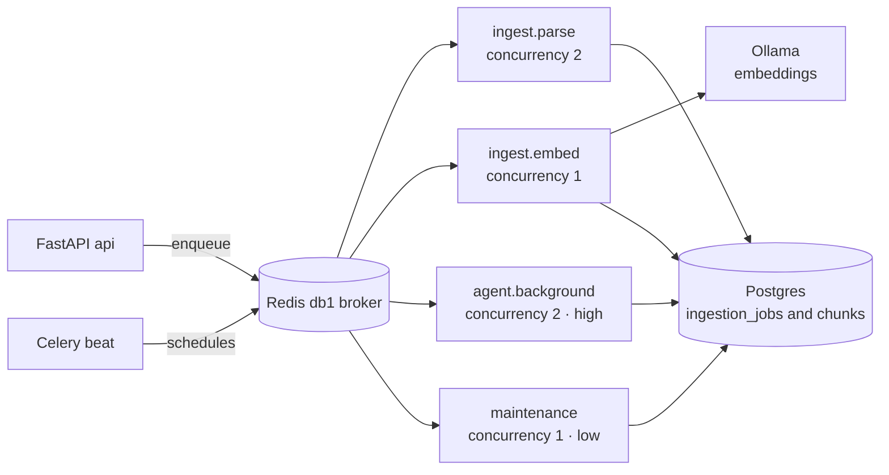

# Atlas — Infrastructure Architecture

> Deliverable 15. Conforms to [00-architecture-decisions.md](00-architecture-decisions.md).

---

## 1. Component inventory and responsibilities

| Component | Version | Responsibility | Explicitly not responsible for |
|---|---|---|---|
| PostgreSQL + pgvector | 16 | System of record: relational data, vector index (HNSW), FTS, DB-visible job states, settings, audit log | queuing (no `LISTEN/NOTIFY` job bus), caching hot paths |
| Redis | 7 | Cache, Celery broker, Celery result backend — three roles, three logical DBs (§2) | durable state of any kind |
| Celery | 5 | Background execution: ingestion pipeline, maintenance, scheduled work | agent durability (Temporal owns that from M19, ADR-0004) |
| Celery beat | 5 | Cron-style schedules (§3.3) | anything stateful beyond the schedule |
| FastAPI api | — | Interactive request path, SSE streaming, migrations at startup | long-running work (>2s of compute is a task) |
| Ollama | — | Local embeddings (`nomic-embed-text`, 768d) and local-profile chat | anything in the hybrid cloud path |
| OTel collector, Prometheus, Grafana, Jaeger | — | Telemetry pipeline (`observability` profile; see [31-observability-architecture.md](31-observability-architecture.md)) | being a runtime dependency — the app must run fine without them |

The load-bearing division: **Postgres is the only durable store.** Redis can be
flushed at any moment and Atlas must lose no data — only speed and in-flight
queue positions, which are reconstructable from `ingestion_jobs` rows (§4.2).

## 2. Redis roles — separate logical DBs

One Redis instance, three logical databases, so roles never collide and can be
flushed or migrated independently:

| Logical DB | Role | Contents | Loss impact |
|---|---|---|---|
| `db0` | Cache | retrieval cache, rate counters, settings hot-reload nudges | slower for seconds |
| `db1` | Celery broker | queue lists, unacked-delivery bookkeeping | in-flight tasks re-enqueued from `ingestion_jobs` sweep |
| `db2` | Celery result backend | task results and chord/group coordination state | in-progress chords restart |

Why not three Redis instances? Single-machine targets (desktop, self-host)
should not pay three processes of overhead; logical DBs give the isolation
that matters (no key collisions, `FLUSHDB` scoping) without it. At cloud
scale (Stage 4 in [42-scaling-strategy.md](42-scaling-strategy.md)) broker and
cache split into separate managed instances — a config change, since every
consumer already takes its own URL.

Why a result backend at all, when most tasks write status into
`ingestion_jobs`? Because the embedding fan-out uses Celery chords (parse →
group of embed batches → finalize), and chords need backend coordination.
Application-visible truth still lives in Postgres; `db2` is plumbing.

## 3. Queue design



### 3.1 Named queues by workload class

| Queue | Workload | Concurrency per worker | Priority | Why isolated |
|---|---|---|---|---|
| `ingest.parse` | CPU-bound parsing and chunking | 2 | normal | PyMuPDF and friends can spike CPU and RAM; capped so the machine stays usable |
| `ingest.embed` | Embedding batches via Ollama | 1 | normal | serializes access to the single local model — §3.2 |
| `agent.background` | Non-interactive agent work, scheduled runs, backfills | 2 | high | must not starve behind a 50k-chunk re-index |
| `maintenance` | Retention, backup, re-index sweep, VACUUM-adjacent jobs, eval triggers | 1 | low | housekeeping never competes with product work |

Workers subscribe explicitly (`celery worker -Q ingest.parse,ingest.embed …`);
on single-machine targets one worker process consumes all four queues with
per-queue prefetch of 1 (`worker_prefetch_multiplier = 1`), so a long embed
batch never hoards ten parse tasks behind it. On server targets, queues map to
dedicated worker pools — the queue names are the scaling seam.

Redis priorities are coarse (Celery emulates them with separate lists, no true
preemption), so we treat priority as a tiebreak and rely on **queue topology**
for real isolation — which is exactly why the queues are named by workload
class rather than by feature.

### 3.2 Why embedding gets its own queue

Embedding is the only workload gated on a **model-serving bottleneck**. Ollama
on a laptop is one model instance on one GPU (or a saturated CPU): two
concurrent embed tasks do not double throughput, they thrash the accelerator,
evict the model, and add latency to interactive local-profile chat that shares
the Ollama instance. A dedicated `ingest.embed` queue with concurrency 1 and
internal batching (chunks embedded in batches of 32–64 texts per Ollama call)
turns contention into an orderly pipeline: parse can run ahead at concurrency
2 and queue embed work; the embedder drains at whatever the hardware sustains.
On a GPU server, raising embed throughput is a *worker* change (more embed
workers pointing at a scaled inference tier), not a code change.

### 3.3 Celery beat schedules

| Job | Queue | Schedule | Purpose |
|---|---|---|---|
| `reindex.sweep` | `maintenance` | every 6h | reconcile watcher gaps: compare source trees against `documents`, enqueue deltas — the watcher is best-effort, the sweep is the guarantee |
| `retention.apply` | `maintenance` | daily 03:30 local | apply retention policy: prune orphaned `document_versions`, expired conversations per settings, temp artifacts |
| `backup.nightly` | `maintenance` | daily 04:00 local | `pg_dump` per §7 |
| `evals.nightly` | `agent.background` | daily 02:00 local | trigger eval suite when enabled and under token budget ([43-cost-strategy.md](43-cost-strategy.md)) |
| `queue.reconcile` | `maintenance` | hourly | re-enqueue `ingestion_jobs` stuck in `running` beyond a deadline (§4.4 safety net) |

Beat runs embedded in the dev worker, as a dedicated process on server
targets ([40-deployment-architecture.md](40-deployment-architecture.md) §2.2).

## 4. Reliability patterns

### 4.1 Retries — exponential backoff with jitter

Canonical task decorator configuration (`atlas/infrastructure/jobs`):

```python
@app.task(
    bind=True,
    autoretry_for=(TransientError,),   # network, provider 5xx/429, DB deadlock
    retry_backoff=2,                   # 2s, 4s, 8s, ...
    retry_backoff_max=600,             # cap at 10 min
    retry_jitter=True,                 # decorrelate thundering herds
    max_retries=5,
    acks_late=True,
    reject_on_worker_lost=True,
)
```

Errors are classified at the adapter boundary: `TransientError` (retryable)
vs `PermanentError` (schema-invalid file, unsupported format, provider 4xx
other than 429) which fails immediately — retrying a corrupt PDF five times
is pure waste and delays the dead-letter signal the user should see.

### 4.2 Dead-letter state — DB-visible, UI-surfaced, replayable

There is no separate DLQ broker topic. When retries are exhausted, the task
transitions its `ingestion_jobs` row to state `failed` with `error_code`,
`error_detail`, `attempt_count`, and the `trace_id` of the last attempt. That
makes the dead-letter set:

- **Queryable** — `GET /jobs?state=failed` (spine §8), no Redis spelunking;
- **Visible** — the Sources UI badges failed documents with the human-readable
  reason ("no magic": failure is a first-class product state, not a log line);
- **Replayable** — a replay action re-enqueues from the stored job parameters
  (a `POST /sources/{id}/reindex` scoped to failures, or per-job retry). Since
  tasks are idempotent (§4.3), replay is always safe.

This is deliberate: a broker-level DLQ would put the most user-relevant
failure information in the least user-visible place.

### 4.3 Idempotency via content-hash keys

Every pipeline step keys on the content hash that defines a
`DocumentVersion` (SHA-256, spine §6):

- Parse: skip if a `DocumentVersion` for this hash already has chunks.
- Embed: skip chunks whose embedding for this content hash already exists
  (the embedding cache, §5); batches record per-chunk completion, so a batch
  retry re-embeds only the missing tail.
- Upsert: `ON CONFLICT` on natural keys; a delivered-twice task converges to
  the same rows.

Idempotency is what makes every other reliability mechanism safe — at-least-
once delivery, replay, the reconcile sweep — and it costs one hash lookup.

### 4.4 Visibility-timeout pitfalls (Celery + Redis) and mitigations

Redis as a broker has no server-side ack; Celery emulates delivery guarantees
with a **visibility timeout**: an unacked task is redelivered after the
timeout. Two classic failure modes follow:

1. **Long task, short timeout → duplicate execution.** A 2-hour initial index
   with the default 1-hour visibility timeout gets redelivered mid-run and
   executes twice.
2. **Crashed worker with `acks_late=False` → silent loss.** The task was acked
   at receipt and dies with the worker.

Mitigations, in the order they defend:

- `acks_late = True` + `reject_on_worker_lost = True` — tasks ack on
  completion, so worker death means redelivery, not loss.
- `broker_transport_options = {"visibility_timeout": 7200}` — set above the
  worst-case single task. Kept honest by task design: no task is allowed to
  run for hours. Big work is **fanned out** (embed batches of ~500 chunks per
  task) so the longest unit stays minutes, not hours.
- Idempotency (§4.3) absorbs the residual duplicates that at-least-once
  delivery guarantees will eventually produce.
- The hourly `queue.reconcile` sweep (§3.3) catches the corner cases the
  above miss (e.g. broker flushed mid-flight): any `ingestion_jobs` row
  `running` past its deadline is re-enqueued.

Countdown/ETA tasks beyond the visibility timeout are also redelivered
repeatedly — so Atlas never uses long ETAs; future work is beat's job.

### 4.5 Circuit breakers around providers

Every provider adapter (Anthropic, OpenAI, Ollama) sits behind a circuit
breaker in `atlas/ai`: closed → open after 5 consecutive failures or a 50%
error rate over 30s; open fails fast (no queue of doomed 60s timeouts);
half-open probes with one request after 30s. Breaker state changes emit
metrics and an `audit_events` row, and the breaker feeds the degradation
matrix below — an open breaker is what *triggers* fallback routing.

### 4.6 Graceful degradation matrix

| Failure | Detection | Behavior | User-visible surface |
|---|---|---|---|
| Ollama down, hybrid profile | breaker open on embed/local calls | chat continues on cloud models; ingestion **pauses at embed** (embeddings never silently switch provider — dimension and semantics are pinned, spine §7) | banner: indexing paused; jobs queue, resume on recovery |
| Ollama down, local-only profile | breaker open | no model available: chat returns explicit unavailability; retrieval-only search still works (FTS + existing vectors) | error state with "start Ollama" remediation |
| Cloud provider down, hybrid | breaker open on Anthropic/OpenAI | fallback chain per routing table; if exhausted → **local-only mode**: Ollama chat with a quality banner | model badge switches; degraded-quality notice |
| Redis down | connection errors on cache and broker | API read paths work (cache misses → Postgres); chat works; ingestion and schedules pause; enqueues fail fast into `ingestion_jobs.pending` for the reconcile sweep | health shows degraded; sources page shows paused |
| Postgres down | connection failure | app stops meaningfully — `/ready` fails, api returns 503 problem+json | desktop shell shows diagnostic + restart of bundled Postgres; no fake answers from cache |

The philosophy: degrade **loudly and honestly**. Every degraded mode is a
banner, a health field, and an audit event — never a silent quality drop
(spine §2.4 and §2.7 both apply).

## 5. Caching architecture

| Layer | Store | Key | TTL / invalidation | Notes |
|---|---|---|---|---|
| Embedding cache | Postgres (`chunks` + hash-keyed dedup relation) | content hash + embedding model + dim | permanent; invalid only on embedding-model change (explicit re-embed migration, spine §7) | biggest win: unchanged files across re-index cost zero embed time |
| Retrieval cache | Redis `db0` | normalized query + workspace + filters + retrieval params version | 60s TTL **and** eager invalidation on index writes to affected sources | absorbs re-asks and pagination; short TTL bounds staleness to seconds |
| LLM response cache | Redis `db0` | prompt-hash + model + prompt_version | 24h | **deterministic internal calls only**: titles, classification, routing labels, eval-judge on identical inputs. Never user chat — chat is stateful (history, memories, fresh retrieval) so identical-prompt hits are vanishingly rare, and serving a cached answer as a live one would fake freshness and break the grounded-or-silent contract. Anthropic prompt caching covers the real chat win ([43-cost-strategy.md](43-cost-strategy.md) §5.3) |
| HTTP static assets | web server / shell | content-hashed filenames | immutable, `max-age=31536000` | Next.js hashed assets; desktop serves from disk, cache is moot but harmless |

Invalidation flow for the retrieval cache: chunk upserts publish
`source_id` on a Redis pub/sub channel; the api deletes matching cache
entries (keys are prefixed by source scope). Correctness does not depend on
this — the 60s TTL is the backstop; the eager path just makes freshly indexed
content searchable immediately, which is the demo that always gets tried.

## 6. pgvector operational tuning

Defaults, and — more importantly — when to touch them:

| Parameter | Default | Touch it when |
|---|---|---|
| HNSW `m` | 16 | rarely; higher (24–32) only for >5M chunks with recall SLO misses — rebuild required |
| HNSW `ef_construction` | 64 | recall matters more than build time (→128); build time is measured per re-index |
| `hnsw.ef_search` | 40 | per-query via `SET LOCAL`; raise to 80–120 when the eval suite shows recall@24 below gate; cost is roughly linear in latency |
| `maintenance_work_mem` | 512MB during index builds | initial index or `REINDEX` on large tables — an HNSW build that fits in memory is dramatically faster; set per-session, not globally, on laptops |
| `max_parallel_maintenance_workers` | 2 | large rebuilds on server hardware |

`ef_search` is a session/transaction setting, which is a feature: the
retrieval adapter sets it per query, so an eval run can sweep it and the
runtime can raise it for "deep search" without touching the index.

**Autovacuum for the high-churn `chunks` table.** Re-indexing a source deletes
and re-creates its chunks; version churn creates dead tuples that bloat both
heap and index, and HNSW pages are never shrunk by VACUUM. Therefore:

- Per-table autovacuum overrides:
  `autovacuum_vacuum_scale_factor = 0.02`, `autovacuum_analyze_scale_factor = 0.01`
  on `chunks` — the default 20% threshold is far too lazy for a table this hot.
- Prefer **incremental** re-index (only changed documents — the content-hash
  skip makes this the natural path) so churn stays proportional to actual edits.
- A `maintenance`-queue job monitors index bloat (via `pgstattuple` sampling)
  and schedules `REINDEX INDEX CONCURRENTLY` on the HNSW index when bloat
  exceeds ~40% — off-hours, progress-visible in the jobs UI.

## 7. Backup and recovery

### 7.1 What is backed up

- **Nightly `pg_dump -Fc`** (custom format, compressed, parallel-restorable)
  at 04:00 local via the `maintenance` queue, to a **user-chosen location**
  (settings; the desktop onboarding asks). Retention: 7 daily + 4 weekly.
- **Optional encrypted copy**: the same dump piped through `age` with a key
  stored in the OS keychain, for users who point backups at synced or
  cloud-replicated folders.
- **Excluded by default: nothing.** A full dump of a 1M-chunk corpus is a few
  GB and restores to a working system with zero re-compute. A
  space-saving option excludes embedding data
  (`--exclude-table-data` on the chunk-embedding relation), shrinking dumps
  ~80% at the cost of a re-embed on restore — off by default because most
  users should never have to learn what an embedding is to get their data back.
- Not in the dump, by design: Redis (disposable), Ollama models
  (re-pullable), telemetry stores (observability is not a system of record).

### 7.2 Restore runbook

1. Stop api and workers (desktop: quit the app; Compose: `docker compose stop api worker`).
2. Move the damaged cluster aside (rename `pgdata`); init or start a fresh one.
3. `pg_restore -d atlas --jobs 4 <dump>` (decrypt first if using the `age` copy).
4. Start the api: startup migrations bring an older dump forward to the
   current schema head under the advisory lock
   ([40-deployment-architecture.md](40-deployment-architecture.md) §8).
5. Run `reindex.sweep` once: it reconciles the restored catalog against the
   live filesystem sources and enqueues anything created since the dump.
6. Verify: `/ready` green, search returns, jobs draining, audit event recorded.

Time to recover: minutes for the restore, background hours for the sweep's
incremental catch-up — during which search works on the restored index.

### 7.3 The index-is-rebuildable principle

The worst case is not "the dump is bad", it is "there is no dump." Atlas is
architected so even that is survivable: **documents are the source of truth,
not the database.** Sources (watched folders, later connectors) still hold the
originals; a from-scratch re-ingest rebuilds documents, versions, chunks,
embeddings, and search. What re-ingest cannot rebuild — conversations,
memories, grants, audit history — is exactly the small, slowly-changing slice
the nightly dump protects. This asymmetry is why backup is simple here: the
big data is rebuildable, the small data is dumped nightly.

## 8. Resource footprint budget (developer laptop / desktop)

Target: **idle < 1.5 GB RSS total** for the full desktop stack; burst is
allowed during embedding and bounded by queue concurrency.

| Process | Idle budget | Burst | Notes |
|---|---|---|---|
| Postgres (bundled) | 350 MB | 600 MB | `shared_buffers=256MB` on desktop; server targets size upward |
| Redis (bundled) | 40 MB | 100 MB | `maxmemory 256mb`, `allkeys-lru` on `db0` keyspace pressure |
| atlas-api sidecar | 280 MB | 450 MB | uvicorn single process on desktop |
| atlas-worker sidecar | 300 MB | 900 MB | parse of a huge PDF is the spike; concurrency caps bound it |
| Tauri shell + webview | 250 MB | 400 MB | platform webview, not a bundled Chromium — the reason Tauri beat Electron |
| **Total** | **~1.2 GB** | ~2.5 GB | Ollama excluded: model residency (0.5–5 GB) is user hardware opt-in |

Enforcement, not aspiration: a CI perf job boots the desktop stack, idles 10
minutes, and fails on budget regression >15%.

**CPU niceness for background embedding.** The worker applies
`os.nice(10)` (Windows: below-normal priority class) to `ingest.parse` and
`ingest.embed` child processes, and Ollama embed batches are throttled to
leave headroom whenever an interactive chat stream is active (a simple
in-Redis "interactive session live" flag the embedder checks between
batches). The product rule: **indexing must never make typing feel slow.**
A background job finishing 20% later is invisible; a laggy chat is the app
feeling broken.

## 9. Local ports registry

All binds are `127.0.0.1` in dev and desktop. Desktop negotiates ephemeral
ports at runtime ([40-deployment-architecture.md](40-deployment-architecture.md) §3.2);
this table is the **dev-compose** registry, kept collision-free on purpose:

| Port | Service | Profile | Notes |
|---|---|---|---|
| 8000 | api (uvicorn) | core | `/api/v1`, `/health`, `/ready`, `/metrics` |
| 3000 | web (Next.js dev) | core | proxies `/api` to 8000 in dev |
| 5432 | Postgres | core | standard port; dev-only exposure for psql |
| 6379 | Redis | core | dev-only exposure for redis-cli |
| 11434 | Ollama | full | or native host install |
| 4317 / 4318 | OTel collector OTLP gRPC / HTTP | observability | api and worker export here |
| 9090 | Prometheus | observability | |
| 3001 | Grafana | observability | moved off 3000 to avoid the web dev server |
| 16686 | Jaeger UI | observability | trace backend |
| 5555 | Flower (optional) | — | Celery inspection, opt-in dev tool, never shipped |

---

## 10. Decisions made in this document

1. **Redis logical DB map:** `db0` cache, `db1` broker, `db2` result backend;
   single instance on single-machine targets, split at cloud scale.
2. **Queue topology:** four named queues (`ingest.parse` c=2, `ingest.embed`
   c=1, `agent.background` c=2 high, `maintenance` c=1 low) with
   `worker_prefetch_multiplier = 1`.
3. **Retry policy:** `autoretry_for` transient errors only, backoff base 2s
   capped 600s with jitter, `max_retries=5`, `acks_late=True`,
   `reject_on_worker_lost=True`; visibility timeout 7200s; task fan-out keeps
   the longest unit in minutes.
4. **DLQ shape:** exhausted retries land as `ingestion_jobs.state = failed`
   with error code, detail, attempts, trace id — DB-visible, UI-surfaced,
   replayable; no broker-level DLQ.
5. **Beat schedule set:** reindex sweep 6h, retention 03:30, backup 04:00,
   evals 02:00, queue reconcile hourly.
6. **Circuit breaker defaults:** open on 5 consecutive failures or 50%/30s,
   30s half-open probe.
7. **Cache TTLs:** retrieval 60s + eager pub/sub invalidation; internal LLM
   response cache 24h keyed prompt-hash + model + prompt_version; user chat
   never response-cached.
8. **pgvector defaults:** HNSW `m=16`, `ef_construction=64`, `ef_search=40`
   set per-query; `maintenance_work_mem=512MB` for builds; `chunks`
   autovacuum scale factors 0.02/0.01; concurrent HNSW reindex at ~40% bloat.
9. **Backup policy:** nightly `pg_dump -Fc` 04:00, 7 daily + 4 weekly, user-
   chosen location, optional `age`-encrypted copy, full-fidelity by default
   with an opt-in embedding-data exclusion.
10. **Resource budgets:** per-process table in §8, idle total ~1.2 GB against
    a 1.5 GB target, CI-enforced; background niceness `os.nice(10)` plus an
    interactive-session throttle flag for the embedder.
11. **Dev port registry** as tabled in §9, Grafana on 3001.
