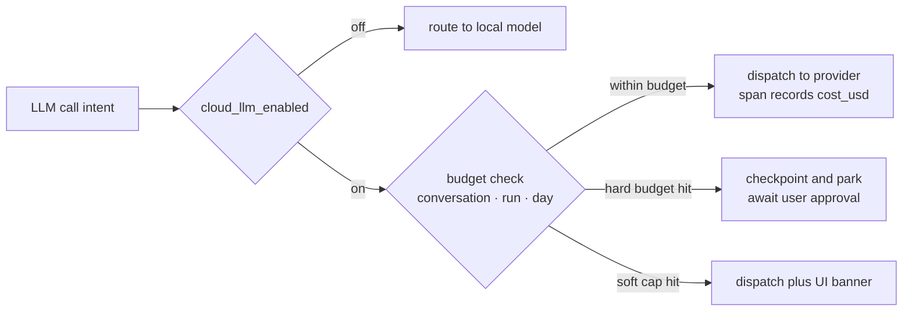

# Atlas — Cost Strategy

> Deliverable 27. Conforms to [00-architecture-decisions.md](00-architecture-decisions.md).

---

## 1. Cost philosophy

Local-first inverts the AI cost structure. In a typical AI SaaS, every
document indexed, every vector stored, and every token generated is the
vendor's marginal cost, silently amortized into a subscription. In Atlas,
**indexing, embeddings, storage, and search run on hardware the user already
owns — marginal cost approximately zero**. The only metered money is cloud
model spend in the hybrid profile, and that is:

- **Opt-in** — the local-only profile spends nothing, ever (spine §9);
- **Metered** — every `llm.call` span records `cost_usd` (spine §12);
- **Visible** — surfaced in the UI down to the conversation, not buried in a
  provider dashboard the user never opens.

The strategic consequence: Atlas's unit economics are structurally better
than embed-everything-in-the-cloud products, and the user's trust position is
structurally better than opaque-subscription products. Cost is not a
back-office concern here; it is a product feature (§10).

## 2. The cost model — rates as configuration

Rates are **configuration, not code**: a rates table in `atlas/config`
(runtime-overridable via the `settings` table, layer 4 of the configuration
stack in [40-deployment-architecture.md](40-deployment-architecture.md) §7),
updated when providers change pricing. The cost meter in `atlas/observability`
multiplies token counts from each response by the configured rate at call
time and stamps the span.

> **The numbers below are illustrative for planning math only.** Real rates
> live in config and track provider pricing; nothing in the codebase
> hardcodes a dollar figure.

| Model (hybrid profile role) | Input per Mtok | Output per Mtok | Cache write | Cache read |
|---|---|---|---|---|
| `claude-haiku-4-5-20251001` — classification, titles, routing, judging | $1.00 | $5.00 | 1.25× input | 0.1× input |
| `claude-sonnet-5` — workhorse chat and agent reasoning | $3.00 | $15.00 | 1.25× input | 0.1× input |
| `claude-opus-4-8` — explicit escalation only | $15.00 | $75.00 | 1.25× input | 0.1× input |
| `nomic-embed-text` via Ollama — all embeddings | $0 | $0 | — | — |
| Local models (local-only profile) | $0 | $0 | — | — |

Embeddings at $0 is the quiet headline: embedding is the *per-document* cost
that scales with corpus size in cloud products, and Atlas holds it at zero by
construction — embeddings stay local even in hybrid (spine §9).

## 3. Typical-usage envelope math

### 3.1 One grounded chat turn (sonnet)

| Component | Tokens |
|---|---|
| System prompt + tool definitions (stable prefix) | ~2,000 |
| Relevant memories | ~300 |
| Conversation summary + recent turns | ~700 |
| Context pack: top-8 chunks × ~550 tok (spine §10) | ~4,400 |
| User message | ~100 |
| **Input total** | **~7,500** |
| **Output (grounded answer + citations)** | **~600** |

Uncached: 7.5k × $3/M + 0.6k × $15/M ≈ **$0.031 per turn**.
With prompt caching on the stable prefix (§5.3): ≈ **$0.026**. Call it
**2–3¢ per grounded turn**. Haiku side-calls (title generation, query
classification) add ~$0.001 — noise, by design (§5.1).

### 3.2 One agent run (sonnet loop)

A representative background agent run: ~12 steps, each replaying a growing
context (~6k in / ~450 out average): ~72k input + ~5.4k output ≈
**$0.30 per run** uncached; **$0.12–0.20** with prompt caching, which pays
best exactly here because each step re-sends the previous steps
(§5.3). Planning range: **15–60¢**, opus-escalated runs 3–5×.

### 3.3 Daily usage scenarios — monthly envelope (hybrid profile)

| Scenario | Daily activity | Naive $/day | With controls §5 | Monthly range |
|---|---|---|---|---|
| Light | 10 chat turns, no agents | ~$0.31 | ~$0.20 | **$5–9** |
| Typical | 40 chat turns, 2 agent runs | ~$1.85 | ~$1.10 | **$30–55 naive · $25–40 controlled** |
| Heavy | 120 turns, 10 agent runs, ~5% opus escalations | ~$7.20 | ~$4.50 | **$130–220** |

Two readings of this table. For a user: typical serious usage lands in
coffee-budget territory, and the local-only profile is always the $0 exit.
For the roadmap: controls in §5 are worth 35–45% — they are not
micro-optimizations, they are the difference between price tiers.

## 4. Where the money is — before optimizing

Input tokens dominate: in the grounded-turn envelope, input is 7.5k of the
8.1k total and ~72% of turn cost; in agent runs, input is >90%. Therefore
the leverage ordering in §5 attacks input volume and input price first, and
output-side cleverness last. Measuring before optimizing is the observability
stack's job (§7) — the Cost dashboard answers "which feature, which model,
which prompt version" before anyone tunes anything.

## 5. Cost controls, in order of leverage

### 5.1 Model routing — the 10–20× lever

The routing table in `atlas/ai` (ADR-0005) sends each call class to the
cheapest model that passes its eval gate:

- **Haiku** for classification, routing decisions, title generation, memory
  extraction candidates, and LLM-judge scoring in evals — 3× cheaper on
  input, 3× on output than sonnet, and these tasks show no measurable
  quality gap in the eval suite.
- **Sonnet** as the workhorse for grounded chat and agent reasoning.
- **Opus** only on **explicit escalation**: the user asks for deep synthesis,
  or an agent's plan step is flagged complex — never silently. At 5× sonnet
  pricing, an unnoticed opus habit is the single fastest way to blow the
  envelope; escalation is therefore visible in the UI (model badge) and in
  per-model rollups.

Routing is eval-gated (spine §2.6): a model downgrade for a call class ships
only with a green regression run on that class's golden dataset.

### 5.2 Context budget discipline — the silent multiplier

Every input token is paid on every turn it is replayed, so context policy is
cost policy:

- **Retrieval top-8, not top-50** (spine §10). The context pack is ~4.4k
  tokens; a "more is better" top-50 pack would be ~27k — 6× the cost for
  *worse* answers (long-context distraction is real and measured in the
  RAG evals).
- **Conversation summarization instead of replay.** Beyond a recency window,
  history compresses into a running summary (~700 tokens flat) rather than
  growing linearly. A 40-turn conversation with full replay would cross 100k
  input tokens per turn by the end; with summarization it stays ~8k.
- **Memory selectivity:** only memories scoring above a relevance threshold
  enter the prompt — typed memories (spine §6) exist so retrieval can be
  precise, not so the prompt can be a junk drawer.

### 5.3 Caching — paying once for the stable parts

Three caches from
[41-infrastructure-architecture.md](41-infrastructure-architecture.md) §5
earn their keep in dollars:

- **Embedding cache:** content-hash → vector means unchanged content is never
  re-embedded. Free money at $0/embed today; critical if a cloud embedding
  provider is ever configured.
- **Internal LLM response cache:** deterministic internal calls (titles,
  classifications) keyed by prompt-hash + model + prompt_version. Repeat
  ingestion of similar content stops paying twice. Never user chat — a chat
  answer served from cache would fake freshness and grounding.
- **Anthropic prompt caching for the stable prefix.** Mechanism: the system
  prompt + tool definitions (~2k tokens, byte-stable across turns by
  construction — the prompt registry keeps them versioned and static within
  a conversation) are marked as a cache prefix. First call pays a 25%
  write premium (1.25×); subsequent calls within the cache TTL read that
  prefix at 0.1× input price, and each hit refreshes the TTL — a
  conversation's cadence keeps the prefix warm. Savings shape: ~90% off the
  prefix's share of input. Per grounded turn that is ~$0.005 (≈17% of turn
  cost); in agent loops, where the growing step history is also
  cache-prefixed, input savings reach 50–70% — the difference between $0.30
  and $0.12 per run in §3.2. The prompt registry is what makes this safe:
  cache efficiency depends on byte-stable prefixes, and versioned prompts
  guarantee stability *and* attribute any cost shift to the prompt change
  that caused it.

### 5.4 Batch and off-peak for evals

Nightly eval runs (02:00 beat schedule) are latency-insensitive: they run at
half concurrency off-peak, use haiku judges, and use provider batch pricing
where offered (typically ~50% off) — evals must never compete with
interactive spend for the daily budget.

### 5.5 Abstention is cheaper than hallucination retries

The grounded-or-silent rule (spine §2.4) is also a cost control. A
low-confidence retrieval that honestly abstains costs one short turn
(~$0.01, minimal output). The alternative failure mode — a confident
hallucination — costs the original turn plus the user's correction turn plus
a re-retrieval turn plus eroded trust: 3–4× the tokens to end up worse off.
Answer-quality discipline and cost discipline point the same direction.

## 6. Budget enforcement

Budgets are runtime config (layer 4, hot-reloadable), enforced in
`atlas/ai`'s cost meter *before* dispatch, not discovered after:

| Control | Default | Behavior on hit |
|---|---|---|
| Per-conversation hard budget | $1.00 | stream a clear budget notice; offer continue-with-confirmation or switch to local model |
| Per-agent-run hard budget | $0.50 | agent checkpoints (spine §6 AgentRun) and parks pending user approval to extend — never silently dies mid-task |
| Per-day soft cap | $5.00 | UI banner with spend meter; calls proceed; banner escalates at 100% and 150% |
| Cloud spend kill switch | `feature_flags.cloud_llm_enabled` | flips runtime to local-only routing instantly, no restart (DB-backed flags, hot-reload) |

Hard budgets fail *safe and resumable*: because agent runs checkpoint, a
budget stop is a pause with a "spend up to $X more?" approval — the same
approval machinery as risk-tier gates (spine §11), reused deliberately so
spending money and taking risky actions feel like the same class of event.

## 7. Cost observability

Defined in [31-observability-architecture.md](31-observability-architecture.md);
the cost-relevant slice:

- **`cost_usd` on every `llm.call` span**, alongside provider, model,
  `prompt_version`, token counts (spine §12) — cost is attributable to the
  exact call, prompt, and feature that incurred it.
- **Attribution dimensions:** spans carry `feature` (chat, agent, eval,
  internal) and conversation/agent-run ids, so rollups slice by feature,
  model, and prompt version without log archaeology.
- **Daily rollups** aggregated per request, per conversation, per day (spine
  §12) feed both Prometheus counters and the in-app spend meter.
- **The Cost dashboard** (Grafana, `observability` profile; mirrored in-app):
  spend today vs soft cap, 30-day trend, cost by feature, cost by model,
  top-10 conversations, cache-hit savings estimate. A prompt or routing
  regression shows up here as a visible slope change within a day — the
  dashboards are the regression test for §5's controls.

## 8. Infrastructure cost by deployment target

| Target | Infra cost | Token cost | Notes |
|---|---|---|---|
| Laptop / desktop | $0 marginal | §3 envelope, or $0 local-only | electricity noise-level; hardware already owned |
| Self-host server | electricity-order: ~10–40W continuous ≈ $1–5/month | same as desktop | plus disk for backups; a used mini-PC amortizes to a few $/month |
| Cloud SaaS (M25+) | sketch below | controlled §3 envelope per active user | the margin question |

**SaaS unit-economics sketch** (Stage 4 of
[42-scaling-strategy.md](42-scaling-strategy.md), shared-RLS tenancy): per
active user per month — share of managed Postgres and Redis ~$1–3 (thousands
of tenants per instance at RLS density), compute ~$1–2, object storage cents.
Infra COGS ≈ **$2–5**; tokens for a *typical controlled* user ≈ **$25–40**
(§3.3). Tokens dominate COGS 5–10×, which yields the strategy: (a) price
tiers track the §3.3 scenarios, (b) §5 controls are margin, (c) **local-first
keeps COGS structurally low versus typical AI SaaS** — embeddings compute on
user hardware in the desktop+sync model, originals stay local, and the cloud
tier carries reasoning tokens, not the corpus. A conventional
embed-everything SaaS pays per-document forever; Atlas's cloud bill scales
with *thinking*, not with *hoarding*.

## 9. Development-time costs

- **CI is nearly token-free.** The test pyramid runs on recorded/replayed
  LLM fixtures (cassette-style: recorded provider responses committed for
  deterministic replay); unit and integration suites make zero live calls.
  Live-provider smoke tests run only on release candidates, budgeted cents.
- **CI minutes:** GitHub Actions (spine §3); target < 3,000 min/month via
  uv/pnpm caching, path-filtered jobs in the monorepo, and image layer
  caching. Reviewed monthly like any other bill.
- **Nightly evals are the real dev spend:** ~300 golden examples × (~3k in /
  ~300 out), sonnet targets with haiku judges ≈ $2–4/night ≈ **$60–120/month**.
  A **hard monthly cap ($100)** is enforced by the eval runner itself: it
  checks month-to-date eval spend (from the §7 rollups) before starting and
  degrades gracefully — smaller sampled suite first, then skip-with-alert.
  An eval harness that can silently overspend is an eval harness that gets
  turned off; the cap keeps it politically sustainable.
- **Fixture refreshes** (re-recording cassettes after provider/model changes)
  are batched, off-peak, and show up in the Cost dashboard under
  `feature=dev` like everything else.

## 10. Cost as a product feature

Most AI products treat cost as something to hide — unlimited-sounding plans,
quiet downgrades to cheaper models under load, rate limits dressed up as
fair-use policies. Atlas inverts this, because the trust story (spine §2:
observable, no magic) and the cost story are the same story:

- **Users see what they spend**: per conversation, per agent run, per day —
  in the app, in plain dollars, with the model badge on every answer.
- **Users control what they spend**: profile switch to local-only, budget
  knobs in §6, explicit opt-in per opus escalation.
- **Nothing degrades silently**: a fallback to a cheaper or local model is a
  visible badge and an audit event, never a quiet quality drop.

Transparency here is strategy, not virtue: a user who can see that a deep
research run cost 40¢ makes an informed choice and trusts the tool more; a
user surprised by a bill or a silent model downgrade churns. In a market
where AI pricing is opaque by default, *legible cost* differentiates — and it
falls out of infrastructure Atlas needs anyway (§7): the observability spine
makes the trust feature nearly free to build.

---

## 11. Decisions made in this document

1. **Illustrative planning rates** (haiku $1/$5, sonnet $3/$15, opus $15/$75
   per Mtok; cache write 1.25×, read 0.1×) — explicitly config-not-code, with
   the rates table living in layer-4 runtime settings.
2. **Envelope constants:** ~7.5k in / ~0.6k out per grounded turn (2–3¢);
   ~12-step agent run ≈ 15–60¢; scenario table in §3.3.
3. **Budget defaults:** $1.00 per conversation, $0.50 per agent run (both
   hard, resumable via the approvals machinery), $5.00/day soft cap with
   escalating banners, `cloud_llm_enabled` kill-switch flag.
4. **Prompt-caching policy:** cache the versioned system+tools prefix always;
   cache agent step-history prefixes in loops; prompt registry guarantees the
   byte-stable prefixes caching requires.
5. **Internal-only LLM response caching** reaffirmed with cost rationale;
   user chat never response-cached.
6. **Eval spend cap:** $100/month hard cap self-enforced by the eval runner
   (sample-down, then skip-with-alert); live-provider tests restricted to
   release candidates.
7. **CI budget:** < 3,000 Actions minutes/month; cassette-based fixtures as
   the default test mode.
8. **Attribution convention:** `feature` attribute on `llm.call` spans
   (chat, agent, eval, internal, dev) as the rollup dimension for the Cost
   dashboard.
9. **SaaS COGS sketch:** $2–5 infra + controlled token envelope per active
   user; tokens-dominate framing adopted for future pricing work.
