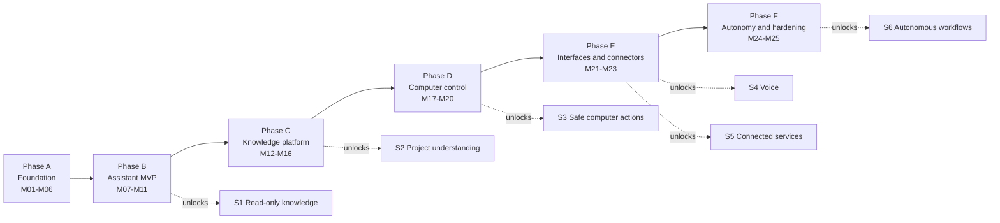

# Atlas — Feature Roadmap

> Deliverable 22. Conforms to [00-architecture-decisions.md](00-architecture-decisions.md).

---

## 1. How to read this roadmap

The roadmap has two axes, and confusing them is the most common way plans of
this kind rot:

- **Stages S1–S6 are capability tiers** (spine §1): what the user can *trust*
  Atlas to do. S1 Read-only knowledge → S2 Project understanding → S3 Safe
  computer actions → S4 Voice → S5 Connected services → S6 Autonomous
  workflows. Stages are cumulative and a stage never weakens the guarantees of
  the stages before it. A stage is "unlocked" only when its features are
  demoable end-to-end *and* its eval gates pass in CI — not when the code merges.
- **Phases A–F are build order** (spine §13): the engineering sequence,
  M01–M25. Phases exist so a solo founder always has a next concrete milestone
  and a phase-end demo to aim at.

The two axes are deliberately offset. Infrastructure for a stage often lands
one phase before the stage becomes user-visible: the tool registry (M15) and
agent runtime (M16) are built in Phase C, but S3 — the tier where Atlas may
touch your filesystem — only unlocks in Phase D, after the executors, approval
UX, and injection evals exist. Shipping the substrate early and the promise
late is a feature of the plan, not scheduling slack: the trust tier is the
product, and it is gated on evidence.

This document lists *features and why they belong to a stage*. Execution
detail — task breakdowns, acceptance criteria, exit gates per milestone —
lives in [60-milestones.md](60-milestones.md). Evaluation gates live in
[32-evaluation-architecture.md](32-evaluation-architecture.md).

| Phase | Milestones | Stage unlocked at phase exit |
|---|---|---|
| A — Foundation | M01–M06 | none — S1 substrate (ingest, index, retrieve) |
| B — Assistant MVP | M07–M11 | **S1 Read-only knowledge** |
| C — Knowledge platform | M12–M16 | **S2 Project understanding** + S3 substrate |
| D — Computer control | M17–M20 | **S3 Safe computer actions** |
| E — Interfaces & connectors | M21–M23 | **S4 Voice** and **S5 Connected services** |
| F — Autonomy & hardening | M24–M25 | **S6 Autonomous workflows** → 1.0 |

## 2. Build order and capability unlocks

## 3. Stage by stage: what the user can now say

Each stage below is written as capability statements plus the example
utterances from the product vision, placed at the stage where they *first
become honestly possible* — with the reason they need that stage.

### S1 — Read-only knowledge (unlocked at end of Phase B)

**Capability statements.** Atlas has indexed everything the user explicitly
pointed it at (watched folders; MD/TXT/PDF first, full formats in Phase C).
It answers questions about that content with streamed, citation-backed
answers, and abstains rather than guessing when retrieval confidence is low
(spine §10). Nothing is written, moved, or sent — ever, at this tier.

- **"Find the proposal I wrote for CAIR."** Needs S1 because it is pure
  retrieval: hybrid search (pgvector + FTS, RRF-fused) over locally indexed
  documents, ranked results with source paths. No action, no external data.
- **"What are the payment terms in my consulting contract?"** Needs S1's
  grounded-QA loop: retrieval → context assembly → cited answer. The citation
  click-through to the exact source paragraph is the trust primitive every
  later stage builds on.
- **"Have I written anything about vector databases?"** Exercises abstention
  honestly: if the corpus has nothing relevant, S1 Atlas says so instead of
  free-associating — the "grounded or silent" principle (spine §2.4).

### S2 — Project understanding (unlocked at end of Phase C)

**Capability statements.** Atlas understands *structure*, not just text:
Projects group Sources and Documents with their own memory scope; all
supported formats (DOCX, PPTX, XLSX, code) are indexed and incrementally
re-indexed on change; typed Memories persist decisions, preferences, and
entities across conversations. The desktop app (Tauri, M14) makes Atlas a
resident of the machine rather than a browser tab.

- **"Summarize where the CAIR proposal stands and what's still open."**
  Needs S2 because "stands" spans many documents and prior conversations
  inside one Project scope — project-scoped retrieval plus episodic memory,
  not one-shot search.
- **"What did I decide about pricing last month?"** Needs S2's typed Memory
  (`decision` kind, spine §6) — this is recall of a fact Atlas was told or
  inferred, distinct from both chat history and the document index.
- **"Search only within my thesis project."** Needs Projects as a first-class
  retrieval filter (M13), so scope is enforced in SQL, not by prompt hopes.

### S3 — Safe computer actions (unlocked at end of Phase D)

**Capability statements.** Atlas can *do* things on the machine — through the
tool layer only: schema-validated intent, deterministic policy check against
PermissionGrants, risk-tier gating (T0–T3), sandboxed executors, full audit
trail (spine §11). Reversible where physically possible; previewed and
approved where not.

- **"Organize my Downloads folder."** The flagship S3 utterance. Needs the
  agent runtime (plan over file listing), `fs.write.move` grants, and a T2
  batch approval with a rendered before/after preview — plus undo. This is
  unshippable at S1/S2 by definition, and unshippable *safely* without M15–M17.
- **"Create the folder skeleton for a new client project."** T1 reversible
  write: auto-allowed with a visible notification, demonstrating that the
  tier system is graduated, not all-or-nothing.
- **"Open the three files I need for the budget review."** Combines S1
  retrieval with the T0/T1 `app.open` capability — the first utterance where
  knowledge and action compose.

### S4 — Voice (unlocked in Phase E, M21)

**Capability statements.** Push-to-talk first, wake word later. Voice is a
*transport* over the same grounded chat and tool pipeline — same citations,
same policy engine, same audit log. WebSocket carries audio (spine ADR-0008);
answers stream back as speech with the sources available on screen.

- **"Atlas, find my latest invoice and open it."** Needs S4 for the modality
  and S3 for the `app.open` action beneath it — voice never gets a wider
  permission envelope than typing does.

### S5 — Connected services (unlocked at end of Phase E)

**Capability statements.** The Source abstraction stretches beyond folders:
Git and Drive connectors (M22), then email and calendar (M23). Each connector
is a Source with its own permission scope and its own read-only-by-default
posture. The daily brief is the flagship composition.

- **"Prepare me for tomorrow."** The signature utterance of the whole
  product — and it needs S5, because "tomorrow" lives in the calendar,
  context lives in email threads, and supporting material lives in documents.
  It composes three connectors plus retrieval plus summarization, each part
  citing its source.
- **"What did Sarah email me about the Henderson contract?"** Needs the email
  connector indexing messages as Documents under an `email.read` grant.
- **"Keep my Drive folder for the accounting project indexed."** Needs S5's
  connector sync; the *utterance shape* is identical to registering a local
  folder — deliberately, because Source is origin-agnostic.

### S6 — Autonomous workflows (unlocked at Phase F, 1.0)

**Capability statements.** Atlas acts *while the user is away* — scheduled
and event-triggered workflows on the durable engine (Temporal, M19), with
every step passing the same policy engine, approvals parking for the user's
return, and a reviewable run history. Autonomy is earned last because it is
trust compounded: S1 grounding × S3 permissions × S5 reach.

- **"Every Friday at four, tidy my Desktop and file the week's invoices."**
  Needs S6's scheduler plus durable execution — a laptop lid-close mid-run
  must resume, not corrupt.
- **"Watch Downloads and file new bank statements into Finance."** Needs S6
  event triggers; the move itself is still a T2 action, batched into a
  reviewable digest rather than silently applied — "no magic" (spine §2.7).

## 4. Flagship demo moments per phase

The demo is the phase's definition of done in portfolio or investor terms —
each one is scripted, repeatable, and shown from a clean machine.

- **After Phase A:** register a folder of real documents; watch the ingestion
  pipeline light up in traces (parse → chunk → embed spans); run a hybrid
  search from the API and get ranked, cited chunks back in milliseconds.
  Infra-shaped, but it proves the spine end-to-end.
- **After Phase B:** ask a question about your own documents, watch the
  answer stream token-by-token with citation markers, click a citation, see
  the exact source paragraph highlighted. Then ask something the corpus can't
  answer and watch Atlas *decline*. Close with the Grafana view: the whole
  request as one trace with token cost attached.
- **After Phase C:** the same conversation, but in the installed desktop app;
  answers scoped to a Project; then the security half — ask Atlas to move a
  file, and watch the deterministic denial (no grant exists) land in the
  audit log. The *refusal* is the demo.
- **After Phase D:** "Organize my Downloads folder," live: the plan appears,
  the T2 approval shows a rendered before/after preview, the user approves,
  files move, and the undo button reverses one of them. Then walk the audit
  trail of everything that just happened.
- **After Phase E:** a morning: say "Prepare me for tomorrow" out loud, and
  get a spoken-plus-on-screen brief assembled from calendar, unread email,
  and relevant documents — every line citing where it came from.
- **After Phase F:** show a scheduled workflow that has been running
  unattended for a week: its run history, its approval digests, one failure
  and its clean recovery. Then the 1.0 close: security-hardening summary and
  a signed installer.

## 5. Non-goals for 1.0 (won't-do list)

Explicit non-goals are a scope-creep firewall (see risk R20 in
[51-risk-analysis.md](51-risk-analysis.md)). Each has a one-line why:

- **No unrestricted computer control.** Free-form screen/mouse/keyboard
  driving cannot pass through a typed tool schema and a deterministic policy
  check, so it cannot meet the auditability bar — it breaks spine §2.2.
- **No browser automation in v1.** The live web is the highest-volume prompt
  injection surface there is; it waits until the policy engine has survived
  a full phase of real S3 usage.
- **No mobile app in v1.** Atlas's value concentrates where the files and
  the filesystem are — the desktop; mobile is a companion surface, not a host.
- **No fine-tuning in v1.** Retrieval + prompt versioning + evals improve
  quality per unit of solo-founder effort far faster than an MLOps pipeline;
  fine-tuning also weakens the swap-provider hedge (ADR-0005).
- **No multi-agent orchestration in v1.** One observable, checkpointed agent
  loop is hard enough to make trustworthy; N cooperating agents multiply
  failure modes faster than capability.
- **No plugin marketplace in v1.** Third-party tools without a proven
  sandbox and permission story would outsource the trust promise to
  strangers.

## 6. Post-1.0 horizon — explicitly speculative

None of these are commitments; they are directions the architecture was shaped
to leave open:

- **Knowledge graph deepening.** M20 ships entities and relations v1;
  post-1.0 extends to cross-source entity resolution ("this Sarah in email is
  that Sarah in the contract") and graph-assisted retrieval.
- **Plugin SDK.** The tool registry's schema + policy + audit pipeline
  becomes a public contract so third parties can ship capabilities that are
  *born* permission-gated — the marketplace question is only reopened then.
- **Team features.** Workspaces exist in the schema from day one (spine §7);
  shared projects, shared memory scopes, and multi-principal grants are the
  post-1.0 unlock.
- **Mobile companion.** Read-only knowledge access, approval inbox, and
  voice capture on the phone against the user's own desktop over an
  end-to-end-encrypted channel.
- **Browser automation behind the same policy engine**, once the injection
  track record at S3–S6 justifies it.

## 7. Feature dependency notes

Dependencies that shaped the build order — the reason phases are sequenced as
they are, recorded so future re-planning respects them:

- **Voice needs streaming chat.** S4 rides the SSE token loop from M07–M09;
  speech synthesis of a non-streamed answer would feel dead on arrival.
  Voice also needs retrieval latency already inside budget — you can hide
  800 ms behind a spinner, not behind silence.
- **Connectors need the Source abstraction.** M22–M23 are only tractable
  because Source has been origin-agnostic since M03 — a connector is a new
  adapter behind an existing port, plus a permission scope, not a new
  subsystem. Incremental re-index (M12) is a prerequisite, since connectors
  sync deltas, not snapshots.
- **Autonomy needs durable workflows plus approvals maturity.** S6 sits on
  Temporal (M19, ADR-0004) because Celery's at-least-once semantics are wrong
  for long-lived, human-gated runs; and on an approvals UX (M15–M17) that
  users have already learned to trust synchronously before it operates
  asynchronously.
- **The daily brief needs connectors, memory, and summarization evals.**
  "Prepare me for tomorrow" is deliberately late (M23): it composes S5
  sources with S2 memory, and it ships only with grounding evals in place,
  because a confidently wrong morning brief poisons trust in exactly the
  moment the product is supposed to shine.
- **Computer actions need the tool registry and agent runtime.** M17's
  executors are the *last* piece of S3, not the first — schema, policy, and
  planning (M15–M16) exist and are tested before anything touches disk.

## 8. Decisions made in this document

Choices not pinned by the spine, resolved here for consistency:

1. **Phase→stage unlock mapping** (§1 table): B unlocks S1; C unlocks S2;
   D unlocks S3; E unlocks S4 and S5; F unlocks S6. Phase A unlocks no stage.
2. **Unlock criterion:** a stage unlocks at *phase exit*, defined as demo
   scripted and repeatable + eval gates green — not at feature merge.
3. **Utterance placement** (§3): each signature utterance is assigned to the
   first stage where it is honestly possible; "Prepare me for tomorrow" is
   S5/M23, "Organize my Downloads folder" is S3/M17.
4. **Voice scope for v1:** push-to-talk first, wake word later within S4;
   voice never carries a wider permission envelope than text.
5. **Non-goals list** (§5) is normative for 1.0; reopening any item requires
   an ADR, same as a spine change.
6. **Post-1.0 items** (§6) are documented as speculative and are not
   milestone-bearing.
