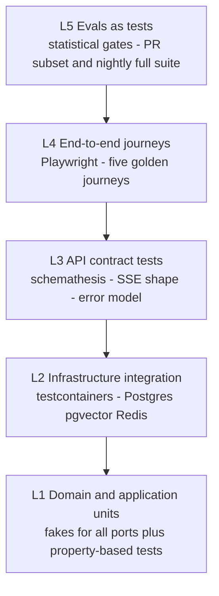

# Atlas — Testing Strategy

> Deliverable 25. Conforms to [00-architecture-decisions.md](00-architecture-decisions.md).

---

## 1. Philosophy: the layer split *is* the test strategy

Clean Architecture (ADR-0002) was chosen partly because it makes an AI system
testable at all. Atlas has three fundamentally different kinds of correctness,
and they demand three different testing regimes — naming them explicitly keeps
anyone from applying the wrong regime to the wrong code:

1. **Deterministic-logic regime.** Domain and application code is pure Python
   behind ports (spine §5). It is tested exhaustively, in memory, with fakes,
   in milliseconds. If a domain test needs Docker, the code is in the wrong
   layer — the test suite is a lint for the architecture.
2. **Infrastructure-contract regime.** Adapters (SQLAlchemy repositories,
   pgvector SQL, Celery tasks, parsers) are tested against *real* infra in
   containers. Mocking Postgres to test a repository tests the mock; the whole
   point of an adapter is its behavior against the real thing.
3. **Statistical-behavior regime.** LLM-dependent behavior — retrieval
   quality, grounding, tool selection — has no single right answer per input.
   It is tested by **evals**: metrics over golden datasets with thresholds
   and trend lines ([32-evaluation-architecture.md](32-evaluation-architecture.md)),
   not by asserting exact strings. Treating regime 3 problems with regime 1
   tools produces brittle snapshot tests; the reverse produces vibes.

One consequence is worth stating baldly: **the policy engine is regime 1 on
purpose.** Spine §11 mandates deterministic permission code precisely so the
security boundary is testable to exhaustion, including property-based testing
and mutation testing below. Security-critical code never lives in regime 3.

## 2. The pyramid

Proportions by test count (targets, reviewed at phase exits):

| Layer | Share | Order of magnitude | Runs |
|---|---|---|---|
| L1 units + properties | ~70% | thousands | every save locally; every PR |
| L2 integration | ~15% | low hundreds | every PR |
| L3 contract | ~8% | ~100 generated + curated | every PR |
| L4 E2E | ~2% | 5 journeys + smoke | every PR (journeys), nightly (extended) |
| L5 evals | ~5% | suites, not cases | PR subset; nightly full |

## 3. L1 — Domain and application unit tests

Every port (`ChunkRepository`, `LLMProvider`, `EmbeddingProvider`, `Clock`,
`UnitOfWork` …) has an in-memory fake maintained next to the port definition.
Use cases are tested by wiring fakes at construction — no patching, no
`MagicMock` archaeology; if a test needs `unittest.mock.patch`, the design has
a missing port. Target runtime for the whole L1 suite: under 30 seconds, so
it runs on file-save without ceremony.

### Property-based tests (Hypothesis)

Three components get property-based tests because their correctness is an
*invariant space*, not an example list:

- **Policy engine** — the highest-value tests in the codebase:
  - *No grant → never allow.* For arbitrary generated (capability, scope,
    tier) requests against an empty grant set, the decision is deny. Always.
  - *T3 never auto-approves.* No generated combination of grants, modes, and
    expiries yields an auto-allow for a T3 request — every path ends in a
    human confirmation requirement.
  - *Scope escapes are impossible.* For generated paths including `..`
    segments, symlink-shaped strings, case tricks, and unicode confusables,
    canonicalization means no decision ever allows a path outside the
    grant's scope root.
  - *Expiry is strict.* A grant at or past expiry behaves identically to no
    grant, for all generated clock values.
- **Chunker:**
  - *No content loss.* Concatenating chunks (minus overlap) reconstructs the
    normalized source text for arbitrary generated documents.
  - *Overlap and size bounds.* Every chunk respects the 512-token target and
    1024 hard max; overlap stays within the configured 15% band (spine §10).
  - *Determinism.* Same input, same chunking — byte-identical, across runs
    and platforms. Incremental re-index depends on this.
- **RRF fusion:**
  - *Rank stability.* Permuting tie-free input lists never changes the fused
    order; a document ranked higher in *both* input lists never fuses lower
    than one ranked lower in both (dominance monotonicity).
  - *Determinism under ties*, via the documented UUIDv7 tiebreak.

## 4. L2 — Infrastructure integration tests (testcontainers)

Real Postgres 16 + pgvector and Redis 7 containers per test session, schema
migrated by Alembic — the same migrations that run in production, which makes
every integration run a migration test for free. Coverage:

- **Repository contracts.** Every repository implementation is run against
  the *same* contract test suite as its in-memory fake ("fake vs real"
  parity), so fakes can't drift from reality.
- **Migrations up-down.** Each Alembic revision applies and rolls back
  cleanly against a seeded database; irreversible migrations must say so
  explicitly and are flagged in review.
- **Hybrid search SQL correctness.** Seeded fixture chunks with known
  embeddings and text; assertions on candidate generation (top-k by cosine,
  top-k by `websearch_to_tsquery`), RRF fusion results, and filter pushdown
  (source/project scoping happens in SQL, not in Python).
- **Celery task idempotency.** Every task is invoked twice with the same
  payload against real Redis; the second invocation must be a no-op by
  content-hash/state-machine check. This is the standing regression test for
  risk R02 ([51-risk-analysis.md](51-risk-analysis.md)).

## 5. L3 — API contract tests

The OpenAPI document is the contract (spine §8); L3 verifies the
implementation never lies about it:

- **schemathesis** generates requests from the exported OpenAPI schema and
  fuzzes every endpoint: response codes documented, response bodies
  schema-valid, no 500s from malformed input.
- **SSE stream shape tests.** The chat stream (`POST
  /conversations/{id}/messages`) has an explicit event grammar — token
  deltas, citation events, terminal done/error event with usage — asserted by
  a streaming test client, including the mid-stream-error and
  client-disconnect cases. SSE is invisible to schema fuzzers, so these are
  hand-curated.
- **Error-model conformance.** Every error path returns RFC 9457
  problem+json with a machine-readable `code` from the registered error
  catalog and an `X-Trace-Id` header. A conformance test walks all registered
  codes; an unregistered code appearing in any response is a failure.

## 6. L4 — End-to-end journeys (Playwright)

Playwright drives the real web UI against a full compose stack (`core`
profile) seeded with the fixture corpus. E2E is expensive; it exists to prove
the *seams* — UI ↔ generated client ↔ API ↔ workers ↔ DB — not to re-test
logic covered below.

### The golden fixture corpus

~50 files, checked into `evals/fixtures/corpus/`, versioned (see §9), all
authored for a fictional consultant persona ("Ada Reyes") — invoices,
proposals, meeting notes, a thesis draft, code. Composition:

| Group | Count | Contents |
|---|---|---|
| Markdown / TXT | 14 | notes, a proposal for CAIR, decision logs — headings for structure-aware chunking |
| PDF | 8 | text-native reports, one image-heavy deck export, one 200-page document |
| DOCX | 6 | contracts and proposals with tables, footnotes, tracked changes |
| PPTX | 5 | slide decks incl. speaker notes |
| XLSX / CSV | 6 | invoices ledger, budget sheets with multi-region layouts |
| Code | 6 | Python + TypeScript files for tree-sitter chunking |
| Adversarial / edge | 5 | zero-byte file, non-UTF-8 encoding, emoji filename, corrupt PDF, password-protected DOCX (expected outcome: `skipped` with reason) — plus planted prompt-injection strings inside two of the ordinary documents above |

### The five golden journeys

1. **Register a source:** add a folder → ingestion jobs appear → all
   non-adversarial files reach `succeeded`, adversarial ones reach `skipped`
   with visible reasons.
2. **Search:** query "CAIR proposal" → correct document ranked first →
   result opens with matching chunk highlighted.
3. **Chat with citation:** ask a question answerable from the corpus →
   streamed answer renders progressively → citation marker clicks through to
   the exact source paragraph.
4. **Grant permission:** create a scoped `fs.read` grant in the UI → grant
   listed with scope and expiry → audit event visible.
5. **Approve a T2 action:** trigger a file-move plan → approval appears with
   preview → approve → action executes → `tool_invocations` and audit rows
   visible; the *reject* branch is asserted too.

## 7. L5 — Evals as tests

The eval suite is specified in
[32-evaluation-architecture.md](32-evaluation-architecture.md) and is not
duplicated here. What belongs to the testing strategy is its *wiring*: the PR
fast-subset and nightly full suite run as CI gates with thresholds against a
pinned baseline ([53-cicd-strategy.md](53-cicd-strategy.md) §2 stage 5 and
§3). A quality regression is a red build, exactly like a failing unit test —
that equivalence is the point of principle §2.6.

## 8. LLM usage in tests: the determinism policy

- **L1–L4 never call a real model.** Unit and application layers use fake
  providers (canned completions, hash-based deterministic embeddings).
  Integration and E2E layers use recorded fixtures — VCR-style cassettes
  (`vcrpy` via `pytest-recording`) for HTTP-level adapter tests, committed
  and reviewed like code. CI for L1–L4 is deterministic, offline, and
  near-token-free by construction.
- **Only L5 eval jobs and one smoke set hit real providers.** The smoke set
  (~5 calls) verifies each configured provider adapter against the live API
  on main, with a hard budget cap and automatic skip on fork PRs where
  secrets are absent.
- **Cassette hygiene.** Cassettes are re-recorded deliberately (a make
  target), never implicitly; recording filters strip API keys and any
  non-fixture content before write.

## 9. Test data management

- **Factories:** `factory-boy` factories for every domain entity and ORM
  model, one canonical factory module per aggregate — no hand-rolled dict
  literals drifting from the schema.
- **Fixture corpus versioning:** the corpus carries a `MANIFEST.json` (file
  list, SHA-256 hashes, expected parse outcomes). Changing the corpus bumps
  its version and requires regenerating dependent eval baselines in the same
  PR — corpus and baselines never skew.
- **No real personal data in fixtures, ever.** Everything is authored for
  the fictional persona. The founder's real corpus is a *local* dogfood and
  eval environment only; nothing from it is committed. This is a hard rule
  because fixture files are the most-copied artifacts in a repo.

## 10. Coverage policy

- **Gated:** `domain/` + `application/` + the policy engine ≥ **90% line and
  branch** coverage. These are regime-1 code where full coverage is cheap and
  the cost of a gap is a business-rule or security bug.
- **Reported, not gated:** the global number. Rationale (anti-Goodhart): a
  single global gate manufactures assertion-free tests around adapters and
  glue — coverage of `infrastructure/` is a byproduct of the contract suites
  in L2, and chasing a number there optimizes the metric, not safety. The
  global figure is published per PR so trends stay visible; the *gate* sits
  only where coverage is a meaningful proxy.

## 11. Performance tests

Two benchmarks run in CI on the fixture corpus, results stored as CI
artifacts and tracked over time (regression is visible as a trend, alarmed on
step change):

- **Retrieval p95** for the seeded corpus: budget ≤ 300 ms without rerank,
  ≤ 700 ms with rerank, on the reference CI runner class.
- **Ingestion throughput:** full corpus parse→chunk→persist rate, using the
  deterministic stub embedder so the benchmark isolates pipeline mechanics
  from model inference (real embedding throughput is measured in the nightly
  job on a dedicated runner instead).

## 12. Mutation testing

`mutmut` runs on the **policy engine only**. Rationale: mutation testing is
expensive per line, and the policy engine is where a silently weakened test
(one that would pass with a `>=` flipped to `>` on an expiry check) has
security consequences. Gate: 100% of surviving mutants triaged — killed,
or explicitly annotated as equivalent — before any milestone that extends the
engine (M15, M17, M25) closes. Extending mutation testing wider is allowed
but not required; nowhere else clears the value-per-minute bar today.

## 13. Flake policy: zero tolerance, quarantine workflow

A flaky test is a defect in the test system with a deadline, not weather:

1. A test that fails then passes on retry is auto-labeled and moved to the
   quarantine set within the same day (skipped in the merge gate, still
   executed and reported nightly).
2. Quarantine entry *requires* a linked issue with the failure fingerprint.
3. Quarantine is capped: **max 5 tests, max 14 days each.** Breaching either
   cap fails the nightly build — quarantine is a repair queue, not a hospice.
4. Retries are never enabled globally; a retry decorator on a non-quarantined
   test fails lint.

The rationale is compounding trust: the whole strategy above only works if a
red build means something. One tolerated flake converts every future red
build into a shrug.

## 14. Decisions made in this document

Choices not pinned by the spine, resolved here:

1. **Three named regimes** (§1) as the organizing frame; policy engine
   assigned to the deterministic regime as a security requirement.
2. **Pyramid proportions** (§2 table) as targets reviewed at phase exits.
3. **Property-test scope:** Hypothesis mandatory for policy engine, chunker,
   RRF fusion; optional elsewhere.
4. **Fake-vs-real parity:** repository fakes must pass the same contract
   suite as real adapters (§4).
5. **Fixture corpus composition and persona** (§6): ~50 files under
   `evals/fixtures/corpus/` with `MANIFEST.json` versioning; fictional
   persona "Ada Reyes"; two documents deliberately carry planted injection
   strings shared with the injection eval suite.
6. **Cassette tooling:** `vcrpy` via `pytest-recording`, with re-record as an
   explicit make target and secret-stripping filters.
7. **Coverage gate numbers:** ≥ 90% line+branch on domain, application, and
   policy engine; global coverage reported only.
8. **Performance budgets** (§11): retrieval p95 300/700 ms, stub-embedder
   ingestion benchmark in PR CI, real-model throughput nightly.
9. **Mutation testing** scoped to the policy engine with a
   triage-all-survivors gate at M15/M17/M25.
10. **Flake quarantine caps:** 5 tests / 14 days, breach fails nightly.
