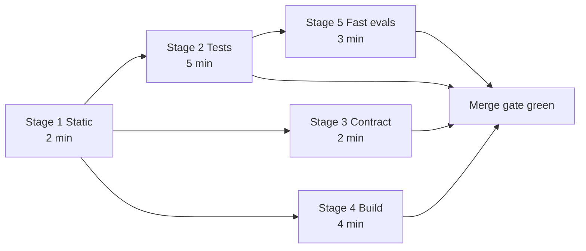

# Atlas — CI-CD Strategy

> Deliverable 26. Conforms to [00-architecture-decisions.md](00-architecture-decisions.md).

---

## 1. Principles

CI/CD runs on GitHub Actions (spine §3). Three principles govern everything
below:

1. **Trunk-based with short-lived branches.** One protected `main`; feature
   branches live days, not weeks; no long-running release branches. For a
   solo founder this is also a bus-factor mitigation — there is never a
   half-merged parallel universe to reconstruct.
2. **Every green PR = releasable main.** Merging is the release decision's
   *technical* half; tagging is only the ceremonial half. Anything that would
   make main unreleasable must be caught by the pipeline, which implies the
   pipeline owns tests, contracts, *and* AI-quality gates.
3. **The pipeline is the quality gate, not human vigilance.** Solo projects
   die by "I'll remember to check that." Every convention in this doc set
   that can be mechanically enforced, is: types, contracts, eval thresholds,
   secret hygiene, commit format. The reviewer (also the author) is freed to
   think about design, because the robot handles conformance.

A naming note to avoid confusion: the **pipeline stages 1–5** below are CI
concepts, unrelated to the product's autonomy stages S1–S6 (spine §1).

## 2. PR pipeline

Wall-clock budget: **under 10 minutes** from push to verdict. Stage 1 is a
fast tripwire; stages 2–4 fan out in parallel once it passes; stage 5 starts
as soon as the Python environment from stage 2 is warm. Budgets below are
p95 targets with caches warm.

Critical path: stage 1 → stage 2 → stage 5 ≈ 2 + 5 + 3 = **~10 min**; all
other paths finish earlier.

### Stage 1 — Static (budget 2 min)

- `ruff check` + `ruff format --check` (Python lint/format)
- `mypy --strict` on `apps/api` (cached incremental)
- `pnpm typecheck` + `pnpm lint` across `apps/web`, `packages/*`
- Lockfile freshness: `uv lock --check` and `pnpm install --frozen-lockfile`
  — a PR that edits dependencies without lockfiles fails here, not in prod
- Secret scan: `gitleaks` over the diff and history since merge-base

Static runs first because it fails in seconds and filters the majority of
broken pushes before any container spins up.

### Stage 2 — Tests (budget 5 min, matrix-parallel)

- Python unit + application suites (L1 of
  [52-testing-strategy.md](52-testing-strategy.md)), sharded by package
  across matrix jobs
- JS unit tests (Vitest) for `apps/web` and `packages/ui`
- Infrastructure integration (L2) with testcontainers services — Postgres 16
  + pgvector and Redis 7 — including migration up-down and hybrid-search SQL
  suites
- Coverage collected here; the domain/application/policy-engine ≥ 90% gate
  enforced, global number posted as a PR comment (not gated)

### Stage 3 — Contract (budget 2 min)

- Export OpenAPI from the FastAPI app factory (no server boot required)
- `oasdiff` against the schema exported from `main`: **breaking change =
  failure** unless the PR carries the `api-break-approved` label plus a
  linked ADR-or-changelog entry
- Regenerate the TS client into `packages/api-client` → `tsc` compile of the
  client and its consumers; any drift between committed client and generated
  output fails the build — the generated client is the enforcement mechanism
  keeping UI and API honest (ADR-0001 rationale)

### Stage 4 — Build (budget 4 min)

- Docker images for `api`, `worker`, `web` via buildx with registry-backed
  layer cache
- Build only — **no push on PRs**; the artifact is the proof that
  `main + PR` is packageable
- Desktop bundles are *not* built per-PR (too slow); they build on main for
  paths touching `apps/desktop` and always in release (§4)

### Stage 5 — Fast-eval gate (budget 3 min)

- The PR eval subset from
  [32-evaluation-architecture.md](32-evaluation-architecture.md): retrieval
  + grounding + injection smoke slices over the fixture corpus, thresholds
  compared against the **pinned baseline** committed in `evals/`
- **Hard token budget: 150k tokens (~1 USD) per PR run** — exceeding the
  budget fails the run rather than silently spending; local-profile eval
  slices run token-free against Ollama on the runner where feasible
- Escape hatch: docs-only PRs skip via path filters automatically;
  a human may apply the `skip-evals` label, which requires a linked issue
  and is reported in the weekly discipline metrics (risk R21,
  [51-risk-analysis.md](51-risk-analysis.md))
- Fork PRs: secrets are unavailable by design, so stage 5 runs only its
  token-free slices and reports neutral for the rest, pending a maintainer
  rerun

## 3. Main pipeline (post-merge) and nightly

Every merge to `main` re-runs the PR pipeline plus:

- **Image push** to GHCR tagged with the commit SHA (and `main-latest`);
  images are immutable — promotion to a release re-tags, never rebuilds
- **Provider smoke set** (~5 real API calls) validating each configured
  provider adapter, budget-capped

Nightly (scheduled workflow):

- **Full eval suite** across all datasets and both runtime profiles, with a
  **trend report artifact** (metrics over time, cost per suite) published to
  the workflow summary — this is the data behind the early-warning
  indicators in [51-risk-analysis.md](51-risk-analysis.md) §4
- **Dependency audit:** `pip-audit` + `pnpm audit`; new criticals open an
  issue automatically
- **CodeQL** on Python and TypeScript
- **Stale-baseline check:** eval baselines older than their freshness window
  (30 days) fail the nightly, forcing a deliberate re-pin — baselines rot
  silently otherwise
- Extended E2E and the real-model ingestion throughput benchmark
  ([52-testing-strategy.md](52-testing-strategy.md) §11)

## 4. Release pipeline (on tags)

Trigger: annotated tag `vX.Y.Z` on a main commit. Steps:

1. **Semver validation:** tag parses as semver; version matches
   `pyproject.toml` and the desktop bundle config; tag commit is on `main`
   and green.
2. **Desktop bundle matrix** via the Tauri action: macOS arm64 + x86_64,
   Windows x64, Linux AppImage. Each bundle embeds the **sidecar** — the
   FastAPI backend packaged as a self-contained binary per platform
   (ADR-0006) — and the bundle smoke-boots in CI (app starts, sidecar
   health check passes) before artifacts upload.
3. **Signing + notarization:** macOS codesign + notarize, Windows signing;
   keys live in **GitHub environment-protected secrets** (`release`
   environment, required reviewer = founder) so no PR-context workflow can
   ever read them.
4. **Auto-updater manifest:** the Tauri updater manifest (signed, per
   platform) is generated and published; the staging manifest path is
   exercised continuously from M14 so release day is a re-run, not a
   first run.
5. **GitHub Release** with changelog generated by `git-cliff` from
   conventional commits since the previous tag; server images promoted by
   re-tagging the exact SHA images from §3.

## 5. Repository policy

- **Branch protection on `main`:** PRs only (no direct pushes, including by
  admins), required checks green, linear history (squash merge only),
  force-push disabled.
- **Required checks:** `static`, `tests-python`, `tests-js`,
  `tests-integration`, `contract`, `build-images`, `fast-evals` — the seven
  named contexts map one-to-one onto §2.
- **CODEOWNERS:** committed now with the founder owning `*`, plus finer
  rows for `apps/api/src/atlas/domain/`, the policy engine, `evals/`, and
  `.github/`. Solo today, but the file is the routing table a first
  collaborator inherits — structure costs nothing now and prevents a
  permissions archaeology project later.
- **Conventional commits:** enforced on PR *titles* by a semantic-PR check;
  squash merge uses the PR title as the commit subject, so `main` history is
  conventional by construction without policing every WIP commit.
- **PR template:** what/why, milestone link (Mxx), risk-register touchpoints
  if any, eval impact (none / subset run / baseline re-pinned), and a
  checklist item confirming no real personal data enters fixtures.

## 6. Secrets and permissions hygiene in Actions

- **Least-privilege `GITHUB_TOKEN`:** top-level `permissions: contents:
  read` in every workflow; jobs that need more (`packages: write` for GHCR,
  `security-events: write` for CodeQL) request it per-job.
- **Actions pinned by commit SHA**, never by mutable tag; Dependabot updates
  the pins on its weekly schedule.
- **No secrets in fork PRs:** standard `pull_request` trigger only — no
  `pull_request_target` with checkout of untrusted code, ever. Eval and
  smoke jobs detect missing secrets and degrade to token-free slices (§2
  stage 5).
- **Environment-protected release secrets:** signing keys and notarization
  credentials exist only in the `release` environment with required-reviewer
  protection; provider API keys for evals live in a separate `evals`
  environment with a spend-capped key.
- **OIDC where possible:** no long-lived cloud credentials are needed today
  (GHCR uses the workflow token); if cloud deployment arrives post-1.0,
  access uses OIDC federation, not stored keys — the rule is recorded now so
  it is never debated under deadline.

## 7. Caching strategy

| Cache | Mechanism | Expected saving per run |
|---|---|---|
| Python deps | `uv` cache keyed on `uv.lock` | ~60–90 s |
| Node deps | pnpm store keyed on `pnpm-lock.yaml` | ~45–60 s |
| mypy incremental | `.mypy_cache` keyed on lockfile + source hash | ~30–60 s |
| Docker layers | buildx registry cache (`cache-from/to` GHCR) | ~2–3 min on stage 4 |
| Testcontainers images | pre-pull step for pinned postgres/redis digests | ~30–45 s of first-test latency |
| Playwright browsers | cache keyed on Playwright version | ~60 s on E2E jobs |

Cache keys always include the lockfile hash so a poisoned or stale cache
cannot mask a dependency change; caches are an optimization, never a
correctness input. Aggregate effect: warm-cache PR wall clock ~9–10 min vs
~18–20 min cold.

## 8. Developer loop parity

The pipeline must be reproducible on the laptop, or CI becomes a slot
machine:

- **`make ci-local`** runs the same gates in the same order — stages 1–3 and
  the token-free eval slices — by invoking the *same underlying scripts* CI
  uses (workflows and Make both call `scripts/ci/*.sh`; neither embeds its
  own logic, so parity is structural, not aspirational). Sub-targets exist
  per stage: `make ci-static`, `make ci-test`, `make ci-contract`,
  `make ci-eval-fast`.
- **pre-commit hooks as the first line:** ruff (lint+format), gitleaks,
  lockfile checks, conventional-commit message hint, and fast mypy on
  changed files. Hooks are the sub-second feedback tier; `make ci-local` is
  the pre-push tier; CI is the arbiter. All three run identical tools with
  identical configs from `pyproject.toml` / repo root — one config, three
  speeds.
- Testcontainers gives L2 parity for free: the same containers run locally
  and in CI, so "works on my machine" and "works in CI" are the same claim.

## 9. Decisions made in this document

Choices not pinned by the spine, resolved here:

1. **Pipeline shape:** five PR stages with stage 1 gating a parallel fan-out;
   named required checks as in §5; p95 wall-clock budget 10 min warm-cache.
2. **OpenAPI diffing tool:** `oasdiff`; breaking changes require the
   `api-break-approved` label plus a linked ADR/changelog entry.
3. **Fast-eval budget:** hard cap of 150k tokens (~1 USD) per PR eval run;
   `skip-evals` label requires a linked issue and is tracked as a discipline
   metric.
4. **Baseline freshness window:** 30 days, enforced by the nightly
   stale-baseline check.
5. **Registry:** GHCR with SHA tags; releases promote by re-tag, never
   rebuild.
6. **Changelog tooling:** `git-cliff` over conventional commits; commit
   format enforced via PR titles + squash-merge (not per-commit policing).
7. **Task runner:** `make` (not justfile) for `ci-local` and stage
   sub-targets — ubiquitous, zero install; both CI and Make delegate to
   `scripts/ci/*.sh` as the single source of truth.
8. **Desktop builds per-PR are skipped**; they run on main for
   `apps/desktop` paths and always on release, with a bundle smoke-boot
   gate.
9. **Secrets topology:** `release` and `evals` GitHub environments;
   release environment carries required-reviewer protection; actions pinned
   by SHA with Dependabot maintaining pins.
10. **Fork PR posture:** token-free eval slices only, neutral status for
    provider-dependent jobs pending maintainer rerun.
