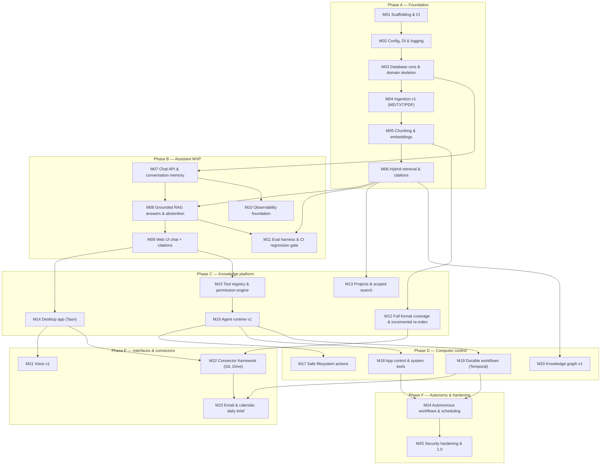

# Atlas — Milestone Roadmap

> Deliverable 28. Conforms to [00-architecture-decisions.md](00-architecture-decisions.md).

---

## 1. How to read this roadmap

Atlas ships in **25 milestones across 6 phases** (spine §13). Phases map onto the
autonomy stages of spine §1 as follows:

- **Phase A — Foundation** and **Phase B — Assistant MVP** build and complete
  **S1 Read-only knowledge**: local ingestion, hybrid retrieval, grounded and
  cited chat, with observability and eval gates in place before anything else
  grows on top.
- **Phase C — Knowledge platform** completes **S2 Project understanding**
  (full format coverage, projects, desktop shell) and lays the safety
  foundations for S3 (tool registry, permission engine, agent runtime).
- **Phase D — Computer control** completes **S3 Safe computer actions** and
  hardens the runtime (durable workflows, knowledge graph).
- **Phase E — Interfaces & connectors** delivers **S4 Voice** and
  **S5 Connected services**.
- **Phase F — Autonomy & hardening** delivers **S6 Autonomous workflows** and
  ships **1.0**.

Stages are cumulative: no milestone in a later phase may weaken a guarantee
established earlier (spine §1, §2). In particular, every capability added after
M15 goes through the permission engine, and every feature added after M11 is
covered by the eval gate before it ships.

**Definition of DONE.** A milestone is DONE only when all three hold:

1. Every acceptance criterion below passes, as written — they are designed to be
   objectively checkable.
2. All tests listed for the milestone are green in GitHub Actions CI on the main
   branch (including the eval regression gate once M11 lands).
3. The milestone's demo works end-to-end from a clean checkout
   (`docker compose --profile core up` + documented steps), and is recorded or
   scripted so it can be replayed.

**Complexity scale** (solo-founder calibration): **S** ≈ under a week ·
**M** ≈ 1–2 weeks · **L** ≈ 2–4 weeks · **XL** ≈ 4+ weeks or high uncertainty.

---

## 2. Dependency graph

Arrows are **hard dependencies only** — milestone X → Y means Y cannot reach
DONE without X being DONE. Soft sequencing (what is merely convenient to do
first) is described in the phase narratives instead.

## 3. Summary table

| ID | Title | Phase | Stage unlocked | Complexity |
|---|---|---|---|---|
| M01 | Scaffolding & CI | A — Foundation | — | M |
| M02 | Config, DI & logging | A — Foundation | — | M |
| M03 | Database core & domain skeleton | A — Foundation | — | L |
| M04 | Ingestion v1 (MD/TXT/PDF) | A — Foundation | — | L |
| M05 | Chunking & embeddings | A — Foundation | — | M |
| M06 | Hybrid retrieval & citations | A — Foundation | S1 (search over own data) | L |
| M07 | Chat API & conversation memory | B — Assistant MVP | — | L |
| M08 | Grounded RAG answers & abstention | B — Assistant MVP | S1 (grounded answers) | L |
| M09 | Web UI chat + citations | B — Assistant MVP | S1 complete | L |
| M10 | Observability foundation | B — Assistant MVP | — | M |
| M11 | Eval harness & CI regression gate | B — Assistant MVP | — | L |
| M12 | Full format coverage & incremental re-index | C — Knowledge platform | S2 (all formats) | XL |
| M13 | Projects & scoped search | C — Knowledge platform | S2 complete | M |
| M14 | Desktop app (Tauri) | C — Knowledge platform | — | XL |
| M15 | Tool registry & permission engine | C — Knowledge platform | S3 (read-only tools) | L |
| M16 | Agent runtime v1 | C — Knowledge platform | S3 (agentic reads) | XL |
| M17 | Safe filesystem actions | D — Computer control | S3 (safe writes) | L |
| M18 | App control & system tools | D — Computer control | S3 complete | M |
| M19 | Durable workflows (Temporal) | D — Computer control | — | L |
| M20 | Knowledge graph v1 | D — Computer control | — | L |
| M21 | Voice v1 | E — Interfaces & connectors | S4 complete | XL |
| M22 | Connector framework (Git, Drive) | E — Interfaces & connectors | S5 (first connectors) | L |
| M23 | Email & calendar, daily brief | E — Interfaces & connectors | S5 complete | L |
| M24 | Autonomous workflows & scheduling | F — Autonomy & hardening | S6 complete | XL |
| M25 | Security hardening & 1.0 | F — Autonomy & hardening | 1.0 | L |

---

## Phase A — Foundation

Phase A proves that the skeleton is production-grade before any AI feature
exists: a monorepo with strict CI, a clean-architecture backend whose domain
layer imports no frameworks, a single Postgres+pgvector datastore, and an
ingestion pipeline that turns a watched folder into a searchable, cited index.
The phase deliberately ends at retrieval, not chat — hybrid search with a
measured recall baseline is the load-bearing wall of everything after it, and it
must be verifiable in isolation. By the end of Phase A, `POST /search` over a
real local folder returns fused, scored, highlighted results, and every table,
ID, and error format matches the spine so nothing needs renaming later.

### M01 — Scaffolding & CI

**Objective.** Stand up the monorepo, toolchain, CI, and compose `core` profile
so that every later milestone lands on rails: one command to run, one pipeline
to trust.

**Features**
- Developer can clone, run `docker compose --profile core up`, and get a
  healthy API answering `/health` and `/ready`.
- CI runs lint, type-check, and tests on every PR; a red pipeline blocks merge.
- ADR process exists and the ten seed decisions are recorded.

**Deliverables**
- Repo layout per spine §4: `apps/api`, `apps/web` (placeholder), `apps/desktop`
  (placeholder), `packages/api-client`, `packages/ui`, `evals/`, `infra/`,
  `docs/`, `.github/workflows/`.
- `apps/api/pyproject.toml` managed by `uv`; root `pnpm-workspace.yaml`.
- FastAPI app factory in `apps/api/src/atlas/presentation/app.py`;
  `GET /health` (liveness: process up, version string) and `GET /ready`
  (readiness: Postgres + Redis reachable).
- `infra/compose/docker-compose.yml` with `core` profile: `postgres:16` with
  `pgvector`, `redis:7`; `infra/docker/` Dockerfiles for api and workers.
- `ruff`, `mypy --strict`, `pytest` configured; pre-commit hooks
  (ruff format/lint, mypy on changed files, conventional commit check).
- `.github/workflows/ci.yml`: lint + typecheck + test jobs, Python and Node
  caches.
- `docs/adr/` with template and ADR-0001..ADR-0010 backfilled from the spine.

**Acceptance criteria**
- Fresh clone → `uv sync && docker compose --profile core up -d` → `GET /health`
  returns `200` with `{"status":"ok","version":...}` within 60 seconds.
- `GET /ready` returns `503` when Postgres or Redis is stopped, `200` when both
  are up (verified in an integration test).
- CI is green on main; total pipeline wall time ≤ 5 minutes on the fast path.
- `mypy --strict` passes with zero `# type: ignore` outside a documented
  allowlist file; `ruff check` passes with zero suppressions.
- `docs/adr/` contains 10 accepted ADRs plus the template.

**Tests**
- Unit: app factory constructs without side effects; version endpoint shape.
- Integration: `/ready` against real compose services (testcontainers or
  compose-in-CI).
- CI meta-test: a deliberately failing test on a branch turns the pipeline red
  (verified once manually, documented in the PR).

**Architecture decisions**
- Exercises ADR-0001 (monorepo) and bootstraps the ADR process itself
  (spine §14). No new ADRs expected.

**Risks**
- *CI slowness creeps in from day one* → cache `uv` and `pnpm` stores, split
  fast/slow test markers now, budget 5-minute ceiling as a tracked metric.
- *Compose drift between dev machines* → pin image digests, healthchecks on
  every service, `compose config` validated in CI.
- *Placeholder packages rot* → each placeholder ships a trivial test so CI
  exercises the full workspace graph from the start.

**Dependencies:** none.

**Complexity:** M — well-trodden ground, but the toolchain choices here are
load-bearing for 24 more milestones and must be done carefully.

### M02 — Config, DI & logging

**Objective.** Establish the configuration, dependency-injection, error, and
logging spine so every subsequent module is wired the same way and every
response is traceable.

**Features**
- Runtime profile (`hybrid` vs `local-only`) selectable via settings; visible in
  `/health` payload.
- Every API response carries `X-Trace-Id`; every log line is JSON with the same
  `trace_id`.
- All errors — domain and unexpected — surface as RFC 9457 problem+json with a
  stable machine-readable `code`.

**Deliverables**
- `atlas/config/`: `pydantic-settings` models, `ATLAS_` env prefix, layered
  sources (defaults → file → env), `hybrid` / `local-only` profile objects per
  spine §9; `feature_flags` stub (in-memory now, DB-backed override at M03).
- Composition root: DI container wired in the app factory and worker bootstrap;
  no module-level singletons.
- `atlas/observability/logging.py`: structlog JSON pipeline, `trace_id` bound
  per request.
- `atlas/shared/errors.py`: domain error taxonomy (`NotFound`, `Conflict`,
  `PermissionDenied`, `ValidationFailed`, `ProviderUnavailable`, …) and
  `atlas/presentation/` exception handlers mapping them to problem+json.
- `X-Trace-Id` middleware (accepts inbound id, else generates; returned on every
  response including errors).

**Acceptance criteria**
- Switching `ATLAS_PROFILE=local-only` changes the resolved provider config
  without code changes (asserted in a unit test).
- 100% of responses — success, 4xx, 5xx — carry `X-Trace-Id` (middleware test
  sweeps every registered route).
- An unhandled exception returns problem+json with `status=500`, a stable
  `code`, and `trace_id`, and never leaks a stack trace in the body.
- Import-linter (or equivalent) contract passes: `domain` imports no framework,
  layer direction `presentation → application → domain` enforced in CI.
- Log output is valid JSON, one event per line, with `trace_id` present on all
  request-scoped events.

**Tests**
- Unit: settings precedence; error-to-problem+json mapping table (one case per
  taxonomy entry); trace id propagation into structlog context.
- Integration: middleware behavior on success/4xx/5xx; profile switch smoke.
- Contract: import-linter layer contract runs in CI.

**Architecture decisions**
- Exercises ADR-0002 (composition root is where Clean Architecture becomes
  enforceable) and the structlog half of ADR-0010. Error format fixed per
  spine §8 (RFC 9457).

**Risks**
- *DI ceremony without payoff* → keep the container minimal (constructor
  injection + a small wiring module), no framework magic.
- *Error taxonomy churn later* → codes are append-only from day one; renaming a
  code requires a deprecation entry in the API spec.
- *Trace ids diverge between HTTP and worker contexts* → a single
  `bind_trace_id` helper used by both; covered by test at M04.

**Dependencies:** M01.

**Complexity:** M — small surface, but every later milestone inherits its
mistakes, so it gets full test coverage.

### M03 — Database core & domain skeleton

**Objective.** Lay the persistence foundation — Alembic baseline, UUIDv7 keys,
repositories, Unit-of-Work — and the pure-Python domain skeleton, with
`workspace_id` scoping on every query from day one.

**Features**
- Migrations run from empty to head and back deterministically.
- Repositories expose domain entities, never ORM rows, and refuse unscoped
  queries.
- Feature flags become DB-backed and flippable without redeploys.

**Deliverables**
- Alembic baseline migration for: `users`, `workspaces`, `sources`, `documents`,
  `document_versions`, `chunks`, `ingestion_jobs`, `settings`, `feature_flags`,
  `audit_events` — conventions per spine §7 (snake_case plural, UUIDv7 `id`,
  `created_at`/`updated_at` timestamptz UTC, `deleted_at` only where the domain
  needs it, `audit_events` append-only).
- `atlas/shared/ids.py`: application-side UUIDv7 generator (ADR-0009).
- `atlas/domain/knowledge/` entities (`Source`, `Document`, `DocumentVersion`,
  `Chunk`) + repository ports; `atlas/domain/shared/` value objects, Result
  type, domain events.
- `atlas/infrastructure/persistence/`: SQLAlchemy 2.0 async models, mappers,
  repositories, Unit-of-Work implementing the application-layer port.
- Testcontainers-based integration suite in `apps/api/tests/integration/`
  running against real Postgres 16 + pgvector.

**Acceptance criteria**
- `alembic upgrade head` from an empty database completes in ≤ 30 s;
  `alembic downgrade base` returns to empty; both run in CI on every PR.
- Every repository method signature requires `workspace_id`; a CI test
  introspects repository classes and fails if any public query method lacks it.
- UUIDv7 ids are time-ordered: a property test generating 10,000 ids asserts
  monotonic non-decreasing timestamp prefixes.
- Attempting to update or delete an `audit_events` row raises at the DB level
  (trigger or revoked privilege), verified by integration test.
- `feature_flags` DB override wins over config default and takes effect without
  process restart (poll or listen, ≤ 30 s propagation, integration test).

**Tests**
- Unit: domain entities and value objects (pure, no DB); UUIDv7 property tests.
- Integration (testcontainers): repository CRUD round-trips, UoW commit/rollback
  semantics, migration up/down, append-only enforcement, workspace scoping
  (cross-workspace read returns nothing).

**Architecture decisions**
- Exercises ADR-0003 (single datastore), ADR-0009 (UUIDv7), ADR-0002 (ports and
  adapters in earnest — first real repository port). Table names fixed by
  spine §7; later milestones only *add* tables from that list.

**Risks**
- *Domain/ORM mapping ceremony slows everything* → codify one mapping pattern in
  the first repository and copy it; allow thin use cases for trivial CRUD per
  `03-architecture-overview.md` §3.1.
- *Scoping added "later" and forgotten* → the introspection test above makes
  unscoped queries a CI failure, not a review comment.
- *Migration drift vs models* → CI job compares autogenerate diff to empty;
  nonempty diff fails the build.

**Dependencies:** M02.

**Complexity:** L — the schema and repository patterns set here are the hardest
things to change later; correctness pressure is high.

### M04 — Ingestion v1 (MD/TXT/PDF)

**Objective.** Turn a watched local folder into tracked, versioned document
records via a resilient Celery pipeline with visible job state — the event-driven
ingestion flow of `03-architecture-overview.md` §5, minus chunking.

**Features**
- User registers a folder via `POST /sources`; Atlas discovers and parses
  MD/TXT/PDF files and keeps up with changes automatically.
- Job progress and failures are visible via `GET /jobs`; nothing fails silently.
- Re-index on demand per source.

**Deliverables**
- `atlas/infrastructure/watcher/`: watchfiles-based watcher with 2 s debounce,
  started with the worker process.
- `atlas/infrastructure/parsing/`: MD/TXT parser, PDF via PyMuPDF, behind a
  `DocumentParser` port defined in `atlas/domain/knowledge/`.
- `atlas/application/ingestion/`: `IngestDocument`, `ReindexSource`,
  `DetectChanges` use cases; SHA-256 content-hash gate creating immutable
  `document_versions` only on change.
- `atlas/infrastructure/jobs/`: Celery app + task definitions; `ingestion_jobs`
  state machine `pending → running → succeeded | failed | skipped` plus a
  DB-visible `dead_letter` terminal detail on `failed` after retries exhaust.
- Endpoints: `POST /sources`, `GET /sources`, `PATCH /sources/{id}`,
  `DELETE /sources/{id}`, `POST /sources/{id}/reindex`, `GET /jobs`,
  `GET /jobs/{id}`.

**Acceptance criteria**
- Registering a source over a fixture folder of 1,000 mixed MD/TXT/PDF files
  ingests all of them with zero manual intervention; final job states are 100%
  `succeeded` or `skipped`.
- A file created or modified in a watched folder has a corresponding
  `ingestion_jobs` row within 5 s (2 s debounce + dispatch), integration-tested.
- Re-running ingestion over an unchanged corpus creates **zero** new
  `document_versions` and marks jobs `skipped` (hash gate proof).
- A parse failure retries 3 times with exponential backoff, then lands in the
  dead-letter state, queryable via `GET /jobs?state=failed`; the worker process
  survives (no crash loop).
- `POST /sources/{id}/reindex` re-enqueues every document of the source and
  returns a job batch id; progress observable via `GET /jobs`.

**Tests**
- Unit: hash gate, debounce logic, state-machine transitions (invalid
  transitions rejected).
- Integration: watcher → job → parsed version round-trip against real Postgres
  + Redis; retry/dead-letter path with an injected failing parser; trace id
  propagation from API through Celery task logs.
- E2E: 1,000-file fixture corpus run in nightly CI.

**Architecture decisions**
- Exercises ADR-0004 (Celery now — this pipeline is exactly the "bulk,
  stateless, retryable" workload Celery is kept for at M19) and the
  DocumentVersion immutability rule (spine §6).

**Risks**
- *PDF parsing variance* (encrypted, scanned, malformed) → treat parser errors
  as data not bugs: dead-letter with reason codes; OCR explicitly out of scope
  until M12.
- *Watcher event storms* (git checkout, `node_modules`) → debounce + default
  ignore globs + per-source include/exclude patterns from day one.
- *Duplicate work races* (watcher + reindex overlap) → idempotency key
  `(document_id, content_hash)` on job insert; unique constraint tested.

**Dependencies:** M03.

**Complexity:** L — first pipeline with real concurrency, retries, and
filesystem edge cases.

### M05 — Chunking & embeddings

**Objective.** Convert document versions into retrievable chunks with local
embeddings: structure-aware chunking, the Ollama embedding adapter, HNSW
indexing, and a measured throughput baseline.

**Features**
- Ingested documents become chunks with embeddings, automatically, as part of
  the M04 pipeline.
- Unchanged content is never re-embedded (cache by content hash).
- Indexing throughput is a published number, not a feeling.

**Deliverables**
- `atlas/rag/` chunking strategies: heading-aware MD chunker, page/block-aware
  PDF chunker; targets per spine §10 (512-token target, 15% overlap, 1024 hard
  max).
- `atlas/infrastructure/providers/ollama/`: `EmbeddingProvider` adapter for
  `nomic-embed-text` (768d), with batching (default batch 32) and retry.
- Alembic migration: `chunks.embedding vector(768)` + HNSW index
  (`m=16`, `ef_construction=64`), per the spine §7 dimension rule.
- Embedding cache keyed by `(embedding_model, content_hash)` so re-chunked but
  unchanged spans skip the model.
- `ingest.chunk` / `ingest.embed` pipeline stages wired into the M04 Celery
  flow with per-stage job visibility.
- Throughput benchmark script + recorded result (docs/hour on the documented
  reference laptop) committed to `docs/40x` infra notes.

**Acceptance criteria**
- Chunker property tests hold over a 200-document fixture set: no chunk exceeds
  1,024 tokens; ≥ 90% of chunks fall within 256–768 tokens; consecutive chunks
  overlap ≈ 15% (±5 points); no heading is split mid-line for MD.
- Embeddings are 768-dimensional and non-null for 100% of chunks of a
  successfully ingested document.
- Full reindex of an unchanged 1,000-file corpus performs **zero** embedding
  provider calls (cache hit proof, asserted via provider call counter).
- HNSW index exists and is used: `EXPLAIN` on the vector query shows the index
  scan (integration test).
- Benchmark recorded: ≥ 500 MD/TXT docs/hour end-to-end (parse→chunk→embed) on
  the reference laptop, with the exact hardware documented alongside the number.

**Tests**
- Unit/property: chunk size/overlap invariants (Hypothesis), tokenizer edge
  cases, cache key derivation.
- Integration: end-to-end file → chunks with embeddings; cache-hit path;
  Ollama adapter against a real local model in nightly CI (mocked on PR path).
- Benchmark: scripted, output archived as CI artifact nightly.

**Architecture decisions**
- Exercises ADR-0003 (pgvector HNSW inside Postgres) and ADR-0005 (embedding
  behind a port — the adapter is replaceable, the 768d dimension is a
  deployment-profile constant per spine §7; changing models = explicit
  re-embed migration).

**Risks**
- *Token counting mismatch* between chunker and models → use one tokenizer
  utility in `atlas/shared/`, property-tested; sizes are targets, the hard max
  is the only invariant.
- *Ollama unavailable/slow in CI* → PR path uses a fake provider; only nightly
  exercises the real model; `/ready` does not depend on Ollama.
- *Throughput below target* → batching and concurrency knobs in config;
  benchmark runs nightly so regressions are visible immediately.

**Dependencies:** M04.

**Complexity:** M — the pipeline plumbing exists from M04; the new risk is
concentrated in chunker quality and the benchmark.

### M06 — Hybrid retrieval & citations

**Objective.** Ship the canonical retrieval pipeline — pgvector + FTS candidate
generation, RRF fusion, filters — behind `POST /search`, and pin its quality
with the first golden dataset. This completes searchable S1.

**Features**
- Sub-second hybrid search over the local index with source/project/date/type
  filters.
- Results carry scores and text highlights, ready to become citations.
- Retrieval quality is a recorded, versioned baseline number.

**Deliverables**
- Alembic migration: generated `tsvector` column on `chunks` + GIN index.
- `atlas/infrastructure/search/`: hybrid implementation — top 24 by pgvector
  cosine (HNSW) ∥ top 24 by FTS (`websearch_to_tsquery`, `ts_rank_cd`), RRF
  fusion with k=60, optional rerank port (`bge-reranker-base` adapter stub
  behind the `Reranker` port, off by default) → final top 8 (spine §10).
- `atlas/application/retrieval/`: `HybridSearch` use case with filter DTOs
  (source, project, date range, document type).
- `POST /search` endpoint; `GET /documents/{id}`, `GET /documents/{id}/chunks`.
- Response schema: per-result `chunk_id`, `document_id`, fused score, component
  ranks, `ts_headline` highlights.
- `evals/retrieval/golden_v1.jsonl`: ~50 queries with labeled relevant chunks
  over a committed fixture corpus in `evals/fixtures/`; baseline metrics
  recorded in the dataset's README.

**Acceptance criteria**
- `POST /search` p95 latency < 500 ms against a 10,000-chunk fixture index
  (measured over ≥ 200 requests, recorded in CI artifact).
- Candidate generation and fusion parameters are exactly spine §10 (24+24,
  RRF k=60, top 8) and asserted by unit tests, not just config defaults.
- Filters provably scope: a filtered search never returns a chunk outside the
  filter (property test over generated filter combinations).
- Recall@8 on `golden_v1` ≥ 0.75 and MRR ≥ 0.60; both recorded as the pinned
  baseline for M11's regression gate.
- Every result includes at least one non-empty highlight span for FTS-matched
  candidates.

**Tests**
- Unit: RRF math (hand-computed fixtures), filter SQL construction, score
  normalization.
- Property: filter-scoping invariant; fusion is permutation-stable for tied
  ranks.
- Integration: end-to-end query against seeded pgvector+FTS index; latency
  measurement harness.
- Eval: golden_v1 run wired as a script now (formal harness arrives at M11).

**Architecture decisions**
- Validates the core bet of ADR-0003: one datastore serves relational, vector,
  and FTS well enough at Atlas scale. If recall or latency misses targets, the
  fallback (dedicated vector store) requires a new ADR — write it only if the
  numbers force it.

**Risks**
- *Golden dataset bias* (queries authored by the same person who wrote the
  chunker) → include paraphrase and keyword-only variants per query; grow the
  set from real usage feedback after M09.
- *FTS/vector score scales incomparable* → RRF sidesteps score mixing by rank
  fusion; keep raw component ranks in the response for debuggability.
- *Latency target missed on laptop-class hardware* → HNSW `ef_search` tuning
  knob in config; measure on the reference laptop, not CI runners.

**Dependencies:** M05.

**Complexity:** L — retrieval quality is the product's foundation and the first
milestone with an ML-quality bar, not just a functional one.

---

## Phase B — Assistant MVP

Phase B turns the index into an assistant someone would actually use: streaming
chat grounded in the user's documents, citations that open the real source, an
honest "I don't know" when retrieval is weak, and a web UI. Just as important,
this phase installs the two trust systems the spine demands before features
multiply — full observability (traces, GenAI spans, cost as a first-class
metric) and the eval harness with a CI regression gate. At the end of Phase B,
S1 Read-only knowledge is complete and *defended*: any PR that degrades
retrieval or groundedness turns CI red.

### M07 — Chat API & conversation memory

**Objective.** Ship streaming conversations with the provider layer (Anthropic +
Ollama, routed per profile), context-window management, summarization, and
per-message token/cost capture.

**Features**
- Streaming chat over SSE with resumable conversation history.
- Works in both profiles: cloud reasoning (hybrid) or fully local (local-only).
- Long conversations keep working — old turns are summarized, not truncated
  arbitrarily.
- Typed long-lived memories (v1) can be stored and recalled via API.

**Deliverables**
- Alembic migrations: `conversations`, `messages` (roles
  `user | assistant | tool | system`), `memories` (typed kinds per spine §6).
- `atlas/domain/conversation/` + `atlas/application/chat/` (`SendMessage`,
  `StreamAnswer`); `atlas/domain/memory/` + `atlas/application/memory/`
  (`RememberFact`, `RecallMemories`) as a v1.
- `atlas/ai/`: provider-agnostic runtime — routing table per spine §9
  (chat: `claude-sonnet-5` hybrid / `llama3.1:8b` local; cheap tier:
  `claude-haiku-4-5-20251001` / `llama3.1:8b`; escalation: `claude-opus-4-8`),
  fallback chains, circuit breaker, token/cost accounting per call.
- `atlas/infrastructure/providers/anthropic/` and `ollama/` chat adapters
  implementing the `LLMProvider` port.
- `POST /conversations`, `GET /conversations`, `GET /conversations/{id}`,
  `POST /conversations/{id}/messages` returning the SSE stream using the event
  protocol defined in `12-api-specification.md`; `GET/POST/PATCH/DELETE
  /memories`.
- Context-window manager: history + memories packed to model budget;
  Celery-based conversation summarization job that compacts turns beyond a
  threshold into a rolling summary message.

**Acceptance criteria**
- SSE stream emits the spec's event sequence (start → deltas → usage/done;
  error event on failure) and terminates cleanly on client disconnect within
  2 s (no orphaned provider calls — verified via provider-call cancellation
  test).
- First-token p95 ≤ 2.5 s in hybrid profile over 50 sequential requests against
  the live provider (nightly job, recorded artifact); local-only profile streams
  successfully end-to-end on the reference laptop.
- Every persisted assistant message row records provider, model, input/output
  tokens, and computed cost USD; a fixture conversation's totals match the
  provider-reported usage exactly.
- A property test proves assembled context never exceeds the model's window for
  arbitrary history lengths; summarization triggers when history exceeds 70% of
  budget and the summarized conversation still answers a question about early
  turns correctly (fixture test).
- Killing the provider mid-stream (fault injection) yields a problem+json-coded
  SSE error event and a `failed` message state — never a hung stream.

**Tests**
- Unit: routing table per profile, fallback order, circuit-breaker state
  machine, cost arithmetic against a rates fixture.
- Property: context packing budget invariant.
- Integration: SSE lifecycle against the real ASGI app with a fake provider;
  summarization job; memories CRUD.
- Contract: SSE event names/payloads pinned against `12-api-specification.md`.

**Architecture decisions**
- Exercises ADR-0005 (the thin provider abstraction earns its keep here — two
  providers, one port) and ADR-0008 (SSE for token streams). Memory v1 lands
  here as a deliberate slice of `22-memory-architecture.md`; project-scoped
  memory waits for M13.

**Risks**
- *Provider API drift* → adapters covered by nightly live-API contract tests;
  fallback chain means one provider outage degrades, not breaks.
- *Summarization loses load-bearing facts* → summaries are additive rows (the
  originals are retained), so the strategy is tunable without data loss.
- *SSE proxies/buffering* → localhost-only in this phase, but the event protocol
  includes heartbeats so the desktop path (M14) inherits robustness.

**Dependencies:** M03 (tables, UoW); uses M02 config/DI throughout.

**Complexity:** L — three moving systems (provider runtime, streaming, memory)
that must fail gracefully together.

### M08 — Grounded RAG answers & abstention

**Objective.** Connect retrieval to chat: every answer about the user's data is
assembled from retrieved chunks, cited by marker, or honestly abstained —
"grounded or silent" (spine §2.4) made real.

**Features**
- Answers cite sources inline (`[1]`, `[2]`) and the citations resolve to real
  chunks.
- When the index has no good answer, Atlas says so instead of guessing.
- Prompts are versioned artifacts; every call records which version ran.

**Deliverables**
- `atlas/rag/`: context assembly (dedupe by document, pack to budget, inline
  `[n]` markers per spine §10), citation extraction mapping markers →
  `citations` rows, abstention logic driven by fused-relevance threshold.
- Alembic migrations: `citations`, `prompts`, `prompt_versions`.
- `atlas/ai/prompts/`: prompt registry v1 — immutable versioned templates; the
  grounded-RAG prompt is the first registered `PromptVersion`; every LLM call
  records `prompt_version`.
- Retrieval wired into `SendMessage`: retrieve → assemble → stream → persist
  citations.
- Abstention response path with a distinct SSE event/message flag so the UI can
  render it honestly.
- Groundedness judge prompt drafted and registered (used by M11's harness).

**Acceptance criteria**
- On a 40-question answerable fixture set over the golden corpus, ≥ 95% of
  answers contain ≥ 1 citation marker, and 100% of emitted markers resolve to
  persisted `citations` rows pointing at real chunks.
- On a 20-question unanswerable set (facts absent from the corpus), ≥ 90% of
  responses abstain (flagged abstention, zero fabricated citations).
- Citation-marker parsing is lossless: a property test over generated
  marker-laden streams reconstructs exactly the emitted marker set.
- The abstention threshold is a config value; changing it changes behavior in a
  deterministic test (no hidden coupling).
- 100% of LLM calls in the chat path record a non-null `prompt_version`
  (asserted by DB check in integration tests).

**Tests**
- Unit: context packing/dedup, marker insertion and extraction, threshold
  logic.
- Property: marker round-trip under chunked streaming (markers split across SSE
  deltas).
- Integration: end-to-end question → cited answer → citations rows; abstention
  path.
- Eval (pre-harness): answerable/unanswerable sets run by script; numbers
  recorded for M11 baseline pinning.

**Architecture decisions**
- Implements spine §10 end-to-end and principle 4 ("grounded or silent").
  Prompt registry design follows spine §5/§7 (`prompts`, `prompt_versions`) —
  no new ADR needed; if the abstention threshold proves per-corpus rather than
  global, write a short ADR documenting the calibration policy.

**Risks**
- *Citation markers corrupt in streaming* → extraction operates on the
  accumulated buffer, property-tested against split markers.
- *Over-abstention frustrates users* → both failure directions measured (M08
  criteria + M11 trend), threshold tuned against data, not vibes.
- *Prompt edits silently change behavior* → immutability: editing a prompt
  means a new `PromptVersion`; CI forbids mutating registered versions.

**Dependencies:** M06 (retrieval), M07 (chat pipeline).

**Complexity:** L — the product's core trust promise; quality bar and test
surface are both high.

### M09 — Web UI chat + citations

**Objective.** Ship the Next.js UI: streaming chat with citation chips, a
source viewer with chunk highlighting, and management screens for sources,
jobs, and settings — S1 complete and demoable.

**Features**
- Chat with live token streaming, citation chips, abstention state, and
  feedback (thumbs) per message.
- Clicking a citation opens the source document with the cited chunk
  highlighted.
- Sources management (add folder, include/exclude, reindex), jobs progress
  view, settings screen with profile toggle (hybrid/local-only).
- Dark mode.

**Deliverables**
- `apps/web/` (Next.js App Router, TypeScript strict, Tailwind + shadcn/ui):
  chat screen, source viewer, sources screen, jobs screen, settings screen.
- `packages/api-client`: TS client generated from the OpenAPI spec; CI step
  regenerates and fails on uncommitted diff (the drift guard from ADR-0001's
  rationale).
- `packages/ui`: shared shadcn-based primitives (chip, stream cursor, status
  badge).
- SSE consumption layer matching the M07 event protocol, with reconnect and
  error rendering (problem+json surfaced with `trace_id`).
- `POST /messages/{id}/feedback` endpoint + `feedback` table migration; thumbs
  UI wired to it.

**Acceptance criteria**
- Playwright E2E on CI: send a message → first streamed token visible in ≤ 3 s
  (fake-provider backend) → completed answer shows ≥ 1 citation chip → clicking
  the chip opens the source viewer with the exact cited chunk visually
  highlighted (asserted via test id on the highlighted span).
- Abstention answers render a visually distinct "not found in your documents"
  state (E2E asserted).
- Adding a source folder via UI triggers ingestion; jobs screen reflects
  progress states within 5 s of backend state change (polling or SSE).
- Profile toggle round-trips through `GET/PATCH /settings` and is reflected in
  `/health` payload.
- `pnpm build` passes with TypeScript strict; zero hand-rolled `fetch` calls to
  `/api/v1` outside the generated client (lint rule).
- Dark and light themes both pass a visual smoke (Playwright screenshot
  comparison on the chat screen).

**Tests**
- Unit (Vitest): SSE parser, citation chip mapping, state stores.
- Contract: generated client compiles against the live OpenAPI spec in CI.
- E2E (Playwright): the five flows above against compose `core` + fake
  provider.

**Architecture decisions**
- Exercises ADR-0001 (generated client as the contract enforcement) and
  consumes ADR-0008's SSE protocol. Frontend stack fixed per spine §3 — no new
  decisions expected.

**Risks**
- *UI scope creep* (polish is unbounded) → screens limited to the five listed;
  visual polish beyond the smoke bar is deferred to M14/M25.
- *OpenAPI drift friction* → regeneration is a single `pnpm gen` command and a
  CI check, so drift is caught at PR time, not integration time.
- *SSE handling divergence between browsers* → one tested consumption module in
  `packages/api-client`, not per-component ad hoc parsing.

**Dependencies:** M08 (cited answers to render); M07's protocol via M08.

**Complexity:** L — broad surface across five screens plus the client-generation
pipeline, though each piece is individually standard.

### M10 — Observability foundation

**Objective.** Install the full observability stack per spine §12: OTel traces
across api and workers, GenAI-semconv LLM spans, Prometheus metrics, Grafana
dashboards, and cost as a first-class metric.

**Features**
- Every user request is one trace, from HTTP through Celery to the provider
  call, findable by the `trace_id` the client already receives.
- Four working dashboards: chat latency/quality, ingestion health, cost, agent
  runs (placeholder panels until M16).
- Per-request, per-conversation, and per-day cost visible without a
  spreadsheet.

**Deliverables**
- `atlas/observability/`: OTel SDK setup for api and workers (traces, metrics,
  logs correlation), span taxonomy exactly per spine §12 (`ingest.parse`,
  `ingest.chunk`, `ingest.embed`, `rag.retrieve`, `rag.rerank`, `llm.call`,
  `tool.invoke`, `agent.step`, `policy.check` — the last three registered now,
  emitted from M15/M16).
- `llm.call` spans following OTel GenAI semantic conventions, always recording
  provider, model, `prompt_version`, input/output tokens, cost USD, latency,
  stop reason.
- `infra/compose/` `observability` profile: OTel collector, Prometheus,
  Grafana with provisioned dashboards (JSON committed under
  `infra/docker/grafana/`).
- Cost meter in `atlas/observability/` with a rates config file
  (per-model input/output token prices) in `atlas/config/`; Prometheus counters
  for tokens and cost; optional LangSmith exporter behind a flag (ADR-0010).
- Metrics: latency histograms, token counters, cost counters, queue depth,
  index lag.

**Acceptance criteria**
- A chat request produces a single trace containing `rag.retrieve` and
  `llm.call` spans with correct parentage; an ingestion event produces
  `ingest.parse → ingest.chunk → ingest.embed` under one trace — both verified
  by integration tests against an in-memory span exporter.
- 100% of `llm.call` spans carry the seven required attributes (schema-checked
  in tests; missing attribute fails CI).
- `docker compose --profile observability up`: all four dashboards render with
  live data from a scripted traffic generator within 5 minutes.
- Cost meter output matches a hand-computed fixture to within $0.0001 per call,
  and matches provider-reported usage for a live nightly sample.
- The `trace_id` in an API response finds the full trace in the collector
  (round-trip verified in E2E).

**Tests**
- Unit: cost arithmetic, rates config parsing, span attribute schemas.
- Integration: trace shape assertions via in-memory exporter for chat and
  ingestion paths; log/trace correlation (same `trace_id`).
- E2E: compose observability profile smoke with traffic generator (nightly).

**Architecture decisions**
- Implements ADR-0010 in full. Span names and required attributes are fixed by
  spine §12 — dashboards and alerts may evolve, the taxonomy may not without a
  spine change.

**Risks**
- *Instrumentation overhead* → sampling stays at 100% locally (single user) but
  the exporter is async/batched; overhead measured (< 5 ms p95 added latency
  asserted in the latency harness).
- *Dashboard rot* → dashboards are provisioned from committed JSON, so drift is
  a PR diff, not a snowflake.
- *Cost rates staleness* → rates file carries an `as_of` date; nightly live
  sample comparison flags divergence.

**Dependencies:** M07 (LLM calls and cost capture to instrument); spans for
ingestion cover M04–M05 paths.

**Complexity:** M — mostly integration of mature components, but the span
taxonomy discipline pays compound interest and must be exact.

### M11 — Eval harness & CI regression gate

**Objective.** Make quality regressions impossible to merge silently: a
first-class eval runner, retrieval and groundedness metrics, LLM-judge scoring,
pinned baselines, and CI gates (fast subset on PR, full nightly).

**Features**
- One command runs any eval suite locally and in CI with identical results
  format.
- PRs fail if retrieval or groundedness drops beyond tolerance against the
  pinned baseline.
- Nightly full runs publish a trend artifact; adding an eval case from user
  feedback is a documented 10-minute task.

**Deliverables**
- `atlas/evals/`: eval runner, metric implementations (recall@k, MRR, nDCG),
  LLM-judge harness for groundedness and citation correctness using the
  haiku-tier judge (`claude-haiku-4-5-20251001` per spine §9) and the M08 judge
  prompt.
- Alembic migrations: `eval_datasets`, `eval_examples`, `eval_runs`,
  `eval_results`.
- `evals/` datasets: `retrieval/golden_v1.jsonl` (from M06),
  `grounding/answerable_v1.jsonl`, `grounding/unanswerable_v1.jsonl` (from
  M08), suite configs.
- Endpoints: `POST /eval-runs`, `GET /eval-runs`, `GET /eval-runs/{id}`.
- Baseline pinning: a committed baseline file referencing an `eval_runs` id and
  its metric values; a documented promotion procedure to move the pin.
- `.github/workflows/evals.yml`: PR job (fast subset, mocked LLM where
  deterministic + judged subset) and nightly job (full suites, live models)
  publishing a trend artifact (metrics per run over time).
- `docs/32-evaluation-architecture.md` section: adding eval cases from
  `feedback` rows, dataset versioning rules.

**Acceptance criteria**
- PR eval job completes in ≤ 10 minutes and fails the build when retrieval
  recall@8 drops > 0.02 below baseline, or groundedness judge score drops
  > 0.05 below baseline (thresholds live in one committed config file).
- Judge reliability measured: on a 50-item human-labeled calibration set, judge
  agreement with labels ≥ 0.85 (recorded in the docs; recalibrated when the
  judge prompt or model changes).
- Nightly run produces a machine-readable trend artifact covering ≥ all three
  suites, retained ≥ 90 days.
- Metric implementations validated against hand-computed fixtures (recall@k,
  MRR, nDCG each have exact-value unit tests).
- A demo PR that deliberately degrades the retriever (e.g. disables FTS
  candidates) is shown to fail the gate (documented once with a link to the red
  run).
- Same runner invocation locally and in CI yields identical result schemas
  (golden-file test).

**Tests**
- Unit: metric math, runner orchestration, threshold comparison.
- Integration: full eval run against fixture corpus writes correct
  `eval_runs`/`eval_results` rows.
- Contract: eval result schema pinned; judge prompt version recorded per run.

**Architecture decisions**
- Implements spine principle 6 (evaluation-driven) as infrastructure. **Write
  ADR-0011: eval gating policy** — judge model choice, thresholds, baseline
  promotion rules, and how flaky-judge variance is handled (e.g. medians over 3
  judge samples).

**Risks**
- *Judge nondeterminism flakes CI* → temperature 0, median-of-3 sampling on the
  PR subset, tolerance bands rather than exact match; calibration set guards
  judge drift.
- *Eval cost creep* → PR subset capped (~30 judged cases); haiku-tier judge;
  cost per eval run is itself a recorded metric on the cost dashboard (M10).
- *Baselines pinned to lucky runs* → promotion requires a nightly full run, not
  a PR run, and a second confirming run within tolerance.

**Dependencies:** M08 (grounding datasets + judge prompt), M06 (retrieval
dataset); M10's cost meter is used but not a hard prerequisite.

**Complexity:** L — the harness itself is moderate, but calibrating judges and
thresholds so the gate is trusted (neither noisy nor toothless) takes real
iteration.

---

## Phase C — Knowledge platform

Phase C turns the assistant into a platform: every mainstream file format
indexed incrementally at 10k-document scale, projects that scope search and
memory, and the Tauri desktop app that makes Atlas a resident of the machine
rather than a browser tab. The phase then crosses the product's most important
line — from reading to acting — by building the tool registry and deterministic
permission engine *before* the agent runtime that will use them, in that order,
so that by the time the first ReAct loop runs there is no code path from model
output to the OS that bypasses policy (spine §2.2). S2 completes at M13; the
safety substrate of S3 stands at M16.

### M12 — Full format coverage & incremental re-index

**Objective.** Index everything a knowledge worker actually has — DOCX, PPTX,
XLSX, CSV, JSON, and source code — with per-format structure-aware chunking,
minimal re-work on change, and proven robustness at 10k-document scale.

**Features**
- Office documents, data files, and code repositories become searchable with
  format-appropriate chunk boundaries.
- Renames and deletes propagate to the index; edits re-process only what
  changed.
- Malformed files are quarantined data, never crash loops.

**Deliverables**
- `atlas/infrastructure/parsing/`: python-docx, python-pptx, pandas
  (XLSX/CSV), JSON parsers behind the existing `DocumentParser` port.
- `atlas/rag/` chunkers per spine §10: headings (DOCX), slides (PPTX), sheet
  regions (XLSX), tree-sitter functions/classes for code (Python, TypeScript,
  JavaScript at minimum).
- `DetectChanges` extended: rename detection (same hash, new path → move, no
  re-embed), delete propagation (chunks removed from index), modified-file
  minimal re-chunk — only changed spans re-embed where feasible (per-chunk
  content-hash diff against the previous version).
- 10k-document stress corpus generator + nightly stress run.
- Fuzz/robustness pass: malformed-file corpus (truncated, wrong-extension,
  zip-bombed OOXML) routed to dead-letter with reason codes.

**Acceptance criteria**
- Fixture files of all six new formats produce chunks with the correct
  structural metadata (slide number, sheet/region, symbol name for code) —
  golden-file tests per format.
- Rename of an unchanged file updates the document path with **zero** new
  embeddings; delete removes its chunks from search results within 10 s of the
  watcher event.
- Editing one section of a 100-page fixture DOCX re-embeds < 10% of its chunks
  (span-level diff proof, asserted via provider call counter).
- 10k-document mixed corpus ingests unattended to 100% terminal job states
  (`succeeded`/`skipped`/dead-letter with reasons); worker RSS stays < 2 GB
  throughout; total wall time recorded and published.
- After the 10k ingest, `POST /search` p95 remains < 500 ms (M06's bound holds
  at 10× scale).
- 500-file malformed corpus: zero worker crashes, zero unhandled exceptions in
  logs, 100% of failures visible in `GET /jobs` with machine-readable reason
  codes.

**Tests**
- Unit: per-format chunk boundary logic; rename/delete state transitions.
- Property: chunk-diff minimal re-embed (random edits → re-embedded set is a
  superset of changed spans and < configured bound).
- Integration: format round-trips; propagation timing.
- Fuzz: malformed corpus in nightly CI; stress: 10k corpus nightly with
  recorded metrics.

**Architecture decisions**
- Extends spine §10 chunking table to its full breadth. Tree-sitter enters the
  dependency set — no ADR needed (it is an adapter behind the chunker
  interface), but record grammar versions in the lockfile discipline.

**Risks**
- *OOXML edge-case long tail* → dead-letter-first posture: unknowns are
  quarantined with reasons, coverage grows from observed failures, not
  speculation.
- *Minimal re-embed complexity outweighs benefit for small files* → feasibility
  gate: files under N chunks (config, default 20) just re-process fully; the
  optimization applies only where it pays.
- *Stress test flakiness in CI* → runs nightly on a dedicated runner profile
  with fixed corpus seed; PR path uses a 500-doc subset.

**Dependencies:** M05 (chunking/embedding pipeline; M04's ingestion via M05).

**Complexity:** XL — six formats × parsing + chunking + change semantics, plus
scale and robustness proof; the widest milestone in the roadmap.

### M13 — Projects & scoped search

**Objective.** Introduce Projects as the S2 organizing unit: user-defined
groupings of sources/documents with scoped search, scoped chat, per-project
memory, and ranking that favors the active project.

**Features**
- Create projects, attach sources/documents, and switch the active project in
  the UI.
- Chat and search can be scoped to a project; memories can belong to a
  project.
- Active project boosts ranking without hiding the rest of the corpus (unless
  hard-scoped).
- Saved filter scopes for repeatable searches.

**Deliverables**
- Alembic migrations: `projects`, `project_documents`.
- `atlas/domain/projects/` (`Project`, `ProjectDocument`) + application use
  cases; project CRUD endpoints + `POST /projects/{id}/documents` per spine §8.
- `HybridSearch` extended: hard project scope filter; active-project soft
  ranking boost (post-fusion score adjustment, configurable weight).
- `memories.scope` wired to `MemoryScope` (global vs project) — recall in chat
  merges global + active-project memories.
- Saved filter scopes (named filter sets persisted in `settings`).
- `apps/web`: project switcher, project management screen, scope indicator in
  chat.

**Acceptance criteria**
- Hard-scoped search over a two-project fixture returns **zero** results from
  outside the project (property test across generated corpora).
- Soft boost measurably reorders: on a 20-query ambiguous-term dataset spanning
  two projects, mean rank of active-project results improves by ≥ 2 positions
  vs no-boost, while recall@8 on the M06 golden set (unscoped) is unchanged
  (within 0.01 — boost must not damage global search).
- Project-scoped chat retrieval never cites an out-of-scope chunk (integration
  assertion on citations rows).
- A project-scoped memory is recalled in that project's chat and absent from
  other projects' context packs (fixture test).
- E2E: create project → attach source → switch project → scoped answer with
  citation, all through the UI.

**Tests**
- Unit: boost math, scope filter construction, memory scope merge rules.
- Property: scoping invariant under generated project/document assignments.
- Integration: scoped retrieval + citations; saved scopes round-trip.
- Eval: ambiguous-term boost dataset added to the M11 nightly suite.

**Architecture decisions**
- Implements the Project concept exactly per spine §6. The boost lives
  post-fusion so spine §10's candidate/fusion parameters stay canonical —
  if boosting ever needs to move into candidate generation, that is a spine
  change requiring an ADR.

**Risks**
- *Boost degrades global quality* → the "recall unchanged within 0.01"
  criterion makes this a gated regression, not an opinion.
- *Scope leakage via memories or summaries* → context assembly asserts scope on
  every ingredient (chunks, memories, summaries) in one place; tested there.
- *Project UX confusion (hard vs soft scope)* → explicit scope indicator in the
  chat UI; E2E covers both modes.

**Dependencies:** M06 (search to scope); memories from M07.

**Complexity:** M — conceptually clean extension of existing machinery; the
care is in not regressing unscoped quality.

### M14 — Desktop app (Tauri)

**Objective.** Ship Atlas as a real desktop application: Tauri 2 shell bundling
the FastAPI sidecar with managed lifecycle, keychain-held secrets, tray and
global shortcut, first-run onboarding, and a packaging/update pipeline.

**Features**
- Install a native app; first run walks through folder selection, profile
  choice, and initial indexing with progress.
- Atlas lives in the tray with a global shortcut to summon it.
- Sidecar crashes self-heal; secrets never touch plaintext files.
- Signed builds for macOS/Windows/Linux from CI, with an auto-update channel.

**Deliverables**
- `apps/desktop/`: Tauri 2 shell loading the `apps/web` UI; sidecar manager
  (spawn `apps/api` binary, dynamic port negotiation, health-gated readiness,
  crash detection + restart with backoff).
- Device token generated on first run, stored in the OS keychain via
  `atlas/infrastructure/security/` keychain adapter; API rejects unauthenticated
  local requests (`POST /auth/token`, `GET /auth/me` wired).
- Tray icon + menu, global shortcut (summon/hide), native notifications
  plumbing (used fully at M18).
- First-run onboarding flow: choose folders → choose profile (hybrid/local-only
  with plain-language trade-offs per spine §9) → initial index with live
  progress from `GET /jobs`.
- `.github/workflows/release.yml`: tag-triggered packaging matrix (macOS
  universal, Windows x64, Linux AppImage/deb), artifact signing hooks,
  update-manifest generation for the Tauri updater channel.

**Acceptance criteria**
- Cold start (app launch → chat usable) ≤ 5 s on the reference laptop,
  measured and recorded; sidecar port is dynamic (two instances on one machine
  do not collide).
- `kill -9` on the sidecar: app detects within 3 s, restarts it, and the UI
  recovers without user action (automated test on Linux CI, manual matrix
  checklist for macOS/Windows).
- Device token exists only in the OS keychain (filesystem scan in the test
  asserts no token material in config/log files); API returns 401 without it.
- Onboarding E2E: fresh profile → folder picked → profile chosen → initial
  index completes on a 200-file fixture with progress UI reaching 100%.
- Tag push produces installable artifacts for all three OS targets in one CI
  run; update manifest is generated and a v-next build updates a v-prev install
  in a scripted updater test.
- The binding remains `127.0.0.1`-only (asserted: external interface connection
  refused).

**Tests**
- Unit (Rust): sidecar state machine (spawn/health/restart/backoff).
- Integration: port negotiation, keychain adapter (per-OS behind an interface,
  Linux secret-service in CI), auth handshake.
- E2E: onboarding and crash-recovery flows via Playwright/WebDriver against the
  packaged app on Linux CI; manual release checklist for the other targets.

**Architecture decisions**
- Implements ADR-0006 (Tauri + sidecar). **Write ADR-0012: packaging, signing,
  and auto-update channel strategy** (updater feed format, key custody, rollout
  policy) — deliberately out of the spine today.

**Risks**
- *Per-OS packaging/signing yak-shaves* (notarization, entitlements) → Linux
  fully automated first as the CI truth; macOS/Windows signing tracked as
  release-blocking checklist items with documented manual steps until keys are
  provisioned.
- *Sidecar orphaning (app killed, python lives)* → parent-death watchdog in the
  sidecar + PID-file sweep on app start; tested.
- *Webview/UI divergence from browser* → the same `apps/web` bundle serves
  both; Playwright suite runs against the webview build on CI.

**Dependencies:** M09 (the UI it ships).

**Complexity:** XL — three operating systems, process supervision, secrets,
signing, and updates; highest operational-unknown density so far.

### M15 — Tool registry & permission engine

**Objective.** Build the safety substrate of S3 before any agent exists: a
typed tool registry, capability catalog, deterministic policy engine,
approvals, and a complete audit trail — with the first T0 read-only tools.

**Features**
- Users can see every capability Atlas could ever exercise, grant or revoke
  scoped permissions, and review a pending-approvals inbox.
- Every tool invocation — allowed or denied — is auditable after the fact.
- First tools work today: read a file, open/reveal a file, system info.

**Deliverables**
- `atlas/domain/tools/`: `ToolDefinition`, `Capability`, `RiskTier` (T0–T3 per
  spine §11), `PermissionGrant`, `Approval` entities and ports.
- `atlas/tools/`: registry with JSON-schema'd parameters per tool; capability
  catalog (namespaced verbs per spine §11); built-in T0 tools `fs.read`,
  `fs.open`, `fs.reveal`, `system.info` with scoped executors.
- Deterministic policy engine (pure function: grant set × invocation request →
  allow / deny / require-approval), in `atlas/tools/` with domain types —
  zero I/O, zero model involvement (ADR-0007).
- Alembic migrations: `permission_grants`, `approvals`, `tool_invocations`.
- `atlas/application/tools/`: `InvokeTool`, `GrantCapability`,
  `RevokeCapability`; every decision writes an `audit_events` row.
- Endpoints per spine §8: `GET /tools`, `GET/POST/DELETE /permissions`,
  `GET /approvals`, `POST /approvals/{id}/decision`, `GET /audit-events`.
- `apps/web`: permissions management screen, approval inbox with
  approve/deny.
- `policy.check` and `tool.invoke` spans emitting per spine §12.

**Acceptance criteria**
- Property suite (Hypothesis, ≥ 1,000 generated cases per property) proves:
  (a) deny-by-default — no grant ⇒ deny; (b) scope containment — a grant on
  `~/Projects/**` never allows a path outside it, including `..` and symlink
  traversal attempts; (c) expiry — expired grants behave as absent;
  (d) tier monotonicity — a T2/T3 capability never resolves to auto-allow.
- Policy decision p95 < 10 ms in-process (it is a pure function; measured).
- 100% of invocations (allow, deny, and approval-pending) produce
  `tool_invocations` and `audit_events` rows (integration-asserted).
- `fs.read` outside the granted scope returns a problem+json `permission_denied`
  and an audit row; inside scope returns content.
- Approval flow E2E: a T2-classified request parks an `approvals` row, appears
  in the inbox, and executes only after human approval; denial is terminal and
  audited.
- Model output is demonstrably unable to escalate: a test feeds adversarial
  tool-call payloads (fake grants, tier-override fields) and asserts the engine
  ignores everything except the persisted grant set.

**Tests**
- Unit: registry schema validation, catalog integrity (every tool maps to a
  capability with a tier).
- Property: the four policy invariants above.
- Integration: grant → invoke → audit round-trips; approval lifecycle.
- E2E: permission screen and approval inbox flows.

**Architecture decisions**
- Implements ADR-0007 (deterministic permission engine outside the model) —
  this milestone *is* that ADR made code. Risk tiers fixed per spine §11.

**Risks**
- *Path-scope matching subtleties* (symlinks, case-insensitive filesystems,
  UNC paths) → canonicalize before match; the property suite includes symlink
  and traversal generators; Windows semantics covered at M14's matrix.
- *Approval fatigue by over-tiering* → tier assignments live in the catalog as
  reviewable data; UX cost revisited with real usage at M17.
- *Audit volume growth* → `audit_events` is append-only by design; retention
  policy deferred deliberately to M25 hardening, noted here.

**Dependencies:** M09 (UI for permissions/approvals screens); M03 tables via
chain.

**Complexity:** L — the logic is deliberately simple; the rigor (property
suite, audit completeness) is the work.

### M16 — Agent runtime v1

**Objective.** Ship the first agent: a ReAct loop over Anthropic tool-use with
write-ahead step persistence, budgets, reflection, approval-gated continuation,
and a run timeline UI — every action flowing through M15's engine.

**Features**
- Start an agent task, watch its thoughts/tool-calls/observations stream live,
  approve gated steps, and cancel at any time.
- Runs survive inspection after the fact: the timeline is rebuilt from the
  database, not from memory.
- Budgets cap steps, tokens, cost, and wall time.

**Deliverables**
- `atlas/agents/`: ReAct loop (Anthropic tool-use API), planner stub,
  reflection step (self-check before final answer), checkpointing.
- Alembic migrations: `agent_runs`, `agent_steps`, `agent_checkpoints`.
- Write-ahead persistence: each step row persisted (`intended`) before its tool
  executes, updated after (`observed`); crash between the two leaves a
  resumable, unambiguous state.
- Budget enforcement: max steps, max tokens, max cost USD, max wall time per
  run — configurable defaults, hard-stop with honest partial report.
- Approval-gated continuation: T2+ tool intent parks the run
  (`waiting_approval`), emits an SSE event, resumes on decision.
- Endpoints per spine §8: `POST /agent-runs`, `GET /agent-runs/{id}`,
  `GET /agent-runs/{id}/steps`, `POST /agent-runs/{id}/cancel`.
- `apps/web`: run timeline UI (steps, tool calls, observations, approvals
  inline), rebuilt purely from `GET /agent-runs/{id}/steps`.
- `agent.step` spans per spine §12; agent-runs dashboard panels (M10
  placeholder) go live.
- `evals/agents/tool_selection_v1.jsonl`: ≥ 30 tasks with expected
  tool-choice labels, wired into the M11 nightly suite.

**Acceptance criteria**
- A scripted multi-step task (read three granted files, synthesize an answer)
  completes with every step persisted; killing the API process mid-run and
  restarting yields a run resumable from the last checkpoint with no duplicated
  tool execution (integration chaos test).
- Budgets: a run configured with max 5 steps stops at 5 with state
  `budget_exceeded` and a partial report; token/cost/time budgets each proven
  the same way.
- Every tool call in every run has a matching `tool_invocations` +
  `audit_events` row — zero bypass (cross-table integrity assertion).
- Approval gating: T2 intent pauses the run within the same step (no
  speculative execution), inbox decision resumes or terminates it; E2E through
  the UI.
- Cancellation takes effect ≤ 2 s from `POST /agent-runs/{id}/cancel` — no
  further provider or tool calls after acknowledgment (asserted via call
  counters).
- Tool-selection eval: ≥ 80% correct tool choice on `tool_selection_v1`
  baseline, pinned in the M11 harness.

**Tests**
- Unit: loop state machine, budget accounting, reflection trigger.
- Integration: write-ahead crash-resume; approval pause/resume; cancellation.
- Contract: agent SSE events pinned to the API spec.
- E2E: timeline UI renders a completed and an awaiting-approval run.
- Eval: tool-selection suite in nightly.

**Architecture decisions**
- Exercises ADR-0005 (tool-use through the provider port) and ADR-0007 (no
  agent-side policy shortcuts). Checkpoint design deliberately anticipates
  ADR-0004's second half — step persistence is shaped so M19's Temporal
  migration moves orchestration, not data.

**Risks**
- *Loop runaway (repeated failing tool calls)* → step budget + repeated-failure
  detector (same tool+args failing twice triggers reflection or halt).
- *Write-ahead overhead on chatty runs* → single-row insert per step is cheap;
  measured in the latency harness; batching only if data demands it.
- *Approval deadlocks (human never responds)* → runs in `waiting_approval`
  expire to `cancelled` after a configurable TTL with notification.

**Dependencies:** M15 (registry + policy engine — hard, by design).

**Complexity:** XL — concurrency, persistence, human-in-the-loop, and model
behavior interacting; the most intricate state machine in the product.

---

## Phase D — Computer control

Phase D is where Atlas earns the "OS" in its name — and where the blast radius
grows accordingly. Safe filesystem actions ship first with preview, undo, and
trash-only deletes; app control and allowlisted terminal templates follow. The
runtime then migrates to Temporal so long-lived agent work survives crashes by
construction, proven with a kill-the-worker chaos test rather than a promise.
The knowledge graph closes the phase, widening retrieval from "chunks that
match" to "entities that relate". Everything here runs through the M15 policy
engine — this phase adds capability, never exemptions.

### M17 — Safe filesystem actions

**Objective.** Give agents reversible write powers over the filesystem — create,
rename, move, copy, trash-only delete — with dry-run previews, an undo journal,
and property-tested rollback. The flagship organize-Downloads demo lands here.

**Features**
- "Organize my Downloads folder" works end-to-end: plan → preview diff →
  approve → execute → undo if regretted.
- Deletes only ever move to the OS trash; nothing is unlinked.
- Every batch shows a dry-run diff before touching anything at T2+.

**Deliverables**
- New tools in `atlas/tools/`: `fs.create_folder` (T1),
  `fs.rename` / `fs.move` / `fs.copy` (T2 with preview), `fs.delete` (T3,
  trash-only via platform trash API).
- Undo journal: reverse operations recorded per `tool_invocations` row
  (`reverse_op` payload) + `undo` application use case executing reverse ops
  latest-first with conflict detection (target changed since op → refuse with
  explanation).
- Batch executor: a multi-op plan renders a dry-run diff (tree before/after)
  as the T2/T3 approval preview per spine §11.
- Organize-Downloads flagship demo: scripted scenario + fixture Downloads
  folder, runnable via one command, recorded for the portfolio.
- `apps/web`: diff-preview rendering in the approval inbox; undo button on
  completed filesystem runs.

**Acceptance criteria**
- Rollback property (Hypothesis): for randomized sequences (≤ 50 ops) of
  supported operations over a generated directory tree, executing then undoing
  restores the exact prior tree — path set, file contents (hashes), and
  structure identical; ≥ 1,000 generated cases green in CI.
- Preview fidelity property: the executed operation set is byte-identical to
  the previewed plan — no op executes that was not shown (plan hash matched at
  execution).
- `fs.delete` never calls unlink: filesystem audit in tests confirms deleted
  fixtures exist in the platform trash location.
- Undo conflict safety: mutating a moved file's target after the run makes undo
  refuse that op with a per-op explanation, leaving the rest undoable.
- Flagship demo: 120-file mixed fixture Downloads folder organized into a
  category structure with ≥ 95% of files placed per the plan, preview shown,
  approval given, full undo verified — scripted E2E in nightly CI.
- All four tier assignments enforced end-to-end (T1 notification, T2 approval,
  T3 typed confirmation) — E2E per tier.

**Tests**
- Unit: reverse-op derivation per op type; trash adapter per platform.
- Property: rollback and preview-fidelity invariants above.
- Integration: batch execute/undo against a real tmpdir tree; conflict cases.
- E2E: flagship demo; tier-gating flows through the UI.

**Architecture decisions**
- Exercises ADR-0007 tiers with real stakes; spine §2.3 (reversible where
  physically possible) becomes testable policy. Reverse-op payloads live on
  `tool_invocations` to avoid a new table (spine §7 list is closed); if the
  journal outgrows that, adding a table is a spine amendment via ADR.

**Risks**
- *Platform trash API inconsistencies* → one `TrashPort` with per-OS adapters;
  Linux (XDG trash) is the CI truth, macOS/Windows on the M14 matrix
  checklist.
- *Undo after external changes corrupts state* → conflict detection compares
  recorded post-op hashes before reversing; partial undo is explicit, never
  silent.
- *Preview/execution TOCTOU drift* → plan re-validated against the filesystem
  immediately before execution; drift aborts with a fresh preview.

**Dependencies:** M16 (agent runtime executes the plans).

**Complexity:** L — bounded op set, but correctness must be property-proven,
not spot-checked.

### M18 — App control & system tools

**Objective.** Extend safe action beyond files: open/focus applications,
clipboard, notifications, and terminal commands strictly behind allowlisted
parameterized templates — composing into user-approved recipes.

**Features**
- "Start my dev environment" as a one-command recipe: opens apps, runs
  allowlisted commands, notifies on completion.
- Clipboard read/write with T2 gating; native notifications.
- Terminal access exists only as typed, parameterized templates — never free
  text.

**Deliverables**
- New tools: `app.open` / `app.focus` (T1), `clipboard.read` /
  `clipboard.write` (T2), `notify.send` (T1), `system.info` expansion (disk,
  battery, network summary — T0).
- `terminal.run` (T3, typed confirmation per spine §11): executes only
  allowlisted parameterized templates defined in committed config
  (`atlas/tools/` templates dir) — parameters schema-validated, shell
  interpolation impossible by construction (argv arrays, no shell=True).
- Recipes: named compositions of already-granted tools stored as data
  ("start my dev environment"), invoked via chat/agent, each step still
  individually policy-checked.
- `apps/web`: recipe management screen; template catalog view showing exactly
  what each template can execute.

**Acceptance criteria**
- Injection corpus (≥ 50 adversarial parameter payloads: `;`, `&&`, backticks,
  quotes, null bytes, path traversal) against every shipped template: zero
  shell metacharacter reaches execution — commands run via argv with parameters
  as single arguments (asserted by a recording executor).
- A `terminal.run` request naming a non-allowlisted template or extra
  parameters is denied by schema/policy before any execution, with an audit
  row.
- Recipe execution performs zero tool calls outside the recipe's declared
  tool set (cross-check against `tool_invocations`), and halts at the first
  T2+ step until approved.
- `clipboard.write` requires approval (T2) every time unless a standing grant
  with expiry exists; both paths E2E-tested.
- Dev-environment demo recipe runs end-to-end on the reference laptop: ≥ 3
  apps opened, ≥ 2 templated commands run, completion notification delivered.
- Every new tool appears in `GET /tools` with correct capability, tier, and
  schema (catalog integrity test extended).

**Tests**
- Unit: template parameter validation, argv construction, recipe step
  resolution.
- Property/fuzz: injection corpus over generated parameter values.
- Integration: per-tool executor behavior with policy engine; recipe halting
  semantics.
- E2E: dev-environment recipe; clipboard approval flow.

**Architecture decisions**
- Exercises ADR-0007 at its sharpest point (terminal). The
  allowlisted-template design is a policy decision worth capturing: append a
  note to ADR-0007 or write a short ADR if template governance (who can add
  templates, review requirements) needs formalizing.

**Risks**
- *Template allowlist pressure* ("just let me run anything") → resisting this
  is the product stance (spine §2); arbitrary execution is out of scope for
  1.0, documented in the template catalog UI.
- *Per-OS app-control API variance* → `app.open/focus` via per-OS adapters
  with graceful capability degradation reported in `GET /tools`.
- *Clipboard privacy* (sensitive data through cloud models) → clipboard content
  is never auto-included in prompts; only explicit tool results, flagged for
  the M23 redaction rules.

**Dependencies:** M16 (runtime); M17 precedes it in-phase but is not a hard
dependency.

**Complexity:** M — modest new surface; the injection-hardening rigor is the
main cost.

### M19 — Durable workflows (Temporal)

**Objective.** Execute the second half of ADR-0004: migrate agent runs to
Temporal workflows with approval signals and per-activity retry/timeout
policies, proving crash-resume with a chaos test — while Celery stays for bulk
ingestion.

**Features**
- Agent runs survive worker crashes and machine restarts, resuming exactly
  where they stopped — including runs parked on human approval for days.
- Retry and timeout behavior is explicit per activity, not global luck.
- Ingestion throughput is unaffected.

**Deliverables**
- `infra/compose/`: Temporal server + UI added under the `full` profile.
- `atlas/agents/` workflows: agent run orchestration as a Temporal workflow;
  tool invocation, LLM call, and checkpoint persistence as activities;
  approval as a Temporal signal; cancellation as workflow cancel.
- Per-activity retry/timeout policies (committed config): e.g. LLM call —
  3 retries, exponential, 120 s timeout; tool invocation — no automatic retry
  for T1+ side-effecting ops (idempotency-gated), 60 s timeout.
- Idempotency keys on side-effecting activities so replay never double-executes
  (keyed by `agent_steps.id`).
- Kill-the-worker chaos test: SIGKILL the Temporal worker mid-run (between
  write-ahead and observation), assert resume-and-complete with zero duplicate
  side effects.
- Celery retained for ingestion (spine §3); boundary documented.
- Revisit note appended to ADR-0004: what the migration actually cost, what
  was learned, whether ingestion should ever move.

**Acceptance criteria**
- Chaos test in CI: a 10-step scripted run interrupted by SIGKILL at 3
  randomized points completes with exactly one execution per side-effecting
  activity (verified by `tool_invocations` count and an effect-counting fake) —
  10/10 green repetitions.
- A run parked `waiting_approval` survives full stack restart
  (`compose down && up`) and resumes correctly on approval signal — integration
  test.
- All M16 acceptance criteria still pass on the Temporal-backed runtime (the
  migration is behavior-preserving; M16's suite is the regression harness).
- Ingestion suite (M04/M05/M12) green and 10k-corpus nightly throughput within
  10% of pre-M19 baseline (Celery untouched, proven not assumed).
- Every activity's retry/timeout policy is explicit in committed config; a
  missing policy fails a startup validation check.
- ADR-0004 contains the appended revisit note (PR-reviewed).

**Tests**
- Unit: workflow logic via Temporal's test framework (time-skipping).
- Integration: signal-based approval, cancellation, restart-resume.
- Chaos: kill-the-worker suite (nightly + on runtime-touching PRs).
- Regression: full M16 suite against the new runtime.

**Architecture decisions**
- Completes ADR-0004 as scheduled. The Celery/Temporal boundary rule of thumb
  gets codified in the revisit note: bulk-stateless-retryable → Celery;
  long-lived-stateful-human-in-the-loop → Temporal.

**Risks**
- *Temporal operational weight for a laptop product* → runs only under the
  `full` profile; the desktop bundle ships it embedded/managed at M24 when
  scheduling requires it — resource ceiling measured (< 500 MB RSS target
  noted for M24).
- *Determinism constraints break the loop* (non-deterministic code in workflow)
  → LLM/tool calls are activities only; workflow code passes Temporal's replay
  determinism checks in CI.
- *Migration regression risk* → M16's suite as regression harness is the
  mitigation, plus a feature flag to fall back to the in-process runner during
  the transition window.

**Dependencies:** M16 (the runtime being migrated).

**Complexity:** L — Temporal is mature and the runtime was shaped for this; the
work is the chaos proof and behavior-preserving migration.

### M20 — Knowledge graph v1

**Objective.** Extract people, organizations, and projects from the corpus into
a provenance-carrying graph, and use graph hops to widen retrieval — answering
"everything related to X" across documents.

**Features**
- Ask "what do I have related to Acme Corp?" and get a cited cross-document
  answer.
- Explore an entity's neighborhood visually (documents, people, projects it
  connects to).
- Every graph fact traces back to the chunks that support it.

**Deliverables**
- Entity extraction pipeline: haiku-tier calls
  (`claude-haiku-4-5-20251001` hybrid / `llama3.1:8b` local-only) over new
  and updated chunks, batched in the ingestion flow, extracting
  people/orgs/projects with aliases and confidence.
- Graph schema via **ADR-0013** (see below): `graph_nodes`, `graph_edges`
  tables — edges carry provenance (supporting `chunk_id`s) and confidence;
  spine §7 amendment recorded in the ADR.
- Entity-expanded retrieval in `atlas/infrastructure/search/`: query entity
  linking → 1-hop neighbor expansion widens the candidate pool before fusion
  (bounded: ≤ 16 extra candidates), behind a feature flag.
- "Related to X" query path in chat: graph neighborhood + hybrid retrieval →
  cited synthesis.
- `apps/web`: basic graph explorer (entity search, neighborhood view, edge →
  source chunk drill-down).
- `evals/retrieval/relationship_v1.jsonl`: 20 relationship queries with labeled
  relevant chunks.

**Acceptance criteria**
- Extraction precision ≥ 0.80 on a 100-sample human-labeled set drawn from the
  fixture corpus (labeled once, versioned in `evals/`); measured per entity
  type.
- 100% of edges have ≥ 1 provenance chunk reference; the explorer drill-down
  resolves each to a real chunk (integrity test).
- Graph-expanded retrieval improves recall@8 on `relationship_v1` by ≥ 10
  percentage points over the M06 baseline pipeline, while recall@8 on
  `golden_v1` stays within 0.01 (the flag must not hurt non-relationship
  queries) — both gated in the M11 nightly suite.
- Entity dedup: fixture aliases ("Acme", "Acme Corp", "ACME Inc.") resolve to
  one node with ≥ 90% accuracy on a 50-alias fixture set.
- Incremental correctness: re-ingesting an unchanged corpus produces zero new
  nodes/edges; deleting a document removes edges whose only provenance it was.
- Extraction cost per 1,000 chunks recorded on the cost dashboard (M10) and
  documented.

**Tests**
- Unit: alias normalization, provenance bookkeeping, hop-expansion bounds.
- Integration: chunk → extraction → graph rows; delete propagation.
- Eval: relationship suite + golden-set non-regression in nightly.
- E2E: explorer neighborhood view with drill-down.

**Architecture decisions**
- **Write ADR-0013: knowledge-graph schema in Postgres** — tables, provenance
  model, why relational adjacency (not a graph DB) at Atlas scale, and the
  spine §7 amendment adding the two tables. Extraction model tiering per
  spine §9.

**Risks**
- *Extraction noise pollutes retrieval* → confidence thresholds + the
  golden-set non-regression gate; expansion stays flag-gated until the numbers
  hold for two consecutive nightly runs.
- *Extraction cost on large corpora* → haiku-tier + batch + only new/changed
  chunks (rides M12's incremental machinery); cost is a recorded metric with a
  budget alert.
- *Entity resolution rabbit hole* → v1 scope is exact/alias-table matching
  only; probabilistic ER is explicitly out of scope, noted in the ADR.

**Dependencies:** M06 (retrieval pipeline being widened); rides M12's
incremental hooks in practice.

**Complexity:** L — well-bounded v1, but quality gates across two eval suites
make it more than plumbing.

---

## Phase E — Interfaces & connectors

Phase E widens the aperture in two directions: how you talk to Atlas (voice,
with local STT by default and sub-1.2-second first audio), and what Atlas can
see (a connector framework proven against local Git and Google Drive, then
email and calendar — strictly read-only). The connector SPI is the deliberate
centerpiece: auth, enumeration, fetch, and delta cursors as one contract with a
conformance suite, so every future integration is an adapter, not an
adventure. The phase ends with the daily brief — the first scheduled,
composed, multi-source artifact Atlas produces on its own, and the dress
rehearsal for S6.

### M21 — Voice v1

**Objective.** Ship push-to-talk voice: streaming STT (local whisper.cpp
default), streaming TTS, barge-in, and full observability parity — voice turns
are messages like any other.

**Features**
- Hold the global shortcut, speak, release — hear the grounded, cited answer
  read back, and see it in the transcript.
- Interrupt Atlas mid-answer by speaking (barge-in).
- Fully offline voice in local-only profile; cloud STT strictly opt-in.

**Deliverables**
- `WS /ws/voice` session protocol per spine §8 (WebSocket reserved for voice,
  ADR-0008): audio frames up, partial transcripts + audio frames down, session
  state events (listening / transcribing / speaking / interrupted) documented
  in `12-api-specification.md`.
- `STTProvider` / `TTSProvider` ports; whisper.cpp streaming STT adapter
  (default, local), cloud STT adapter behind explicit opt-in setting; local
  TTS adapter (engine selection recorded in ADR-0014).
- Barge-in v1: voice activity during playback stops TTS and opens a new
  capture turn.
- Desktop push-to-talk: global shortcut integration in `apps/desktop`
  (M14 tray/shortcut plumbing), input device selection in settings.
- Transcripts persisted as `messages` (role `user`/`assistant`) flowing the
  standard chat pipeline — same retrieval, citations, memory, traces, cost
  capture as text.
- Latency instrumentation: end-of-speech → first audio byte, per-stage spans
  (STT finalize, retrieval, first token, TTS start).

**Acceptance criteria**
- First-audio latency (end of user speech → first TTS audio) p50 < 1.2 s and
  p95 < 2.5 s over a 50-utterance scripted benchmark on the reference laptop,
  hybrid profile; recorded per stage.
- Barge-in halts TTS output within 250 ms of detected speech onset (automated
  test with synthetic audio).
- Local-only profile: complete voice round-trip with network disabled
  (integration test asserts zero outbound connections).
- STT word error rate ≤ 15% on a 100-utterance fixture set (recorded; quality
  reference for future model swaps).
- Observability parity: a voice turn produces the same span taxonomy as a text
  turn plus voice stages; transcript messages carry tokens/cost identically
  (trace-shape test).
- WS protocol conformance: a scripted client exercises every documented event
  transition; undocumented transitions fail the contract test.

**Tests**
- Unit: session state machine, audio framing, device selection logic.
- Integration: WS lifecycle with synthetic audio; barge-in timing; offline
  round-trip.
- Contract: WS event protocol pinned to the API spec.
- Benchmark: latency suite nightly with recorded artifact.

**Architecture decisions**
- Exercises ADR-0008 (the WebSocket half). **Write ADR-0014: STT/TTS engine
  selection** — whisper.cpp variant and model size, TTS engine, licensing, and
  the cloud-STT opt-in boundary in each profile.

**Risks**
- *Latency target misses on modest hardware* → per-stage instrumentation from
  day one makes the bottleneck visible; mitigations ordered: smaller whisper
  model, TTS pre-warm, retrieval overlap with STT finalization.
- *Audio device/platform quirks* → device abstraction lives in the Tauri layer
  with a diagnostics screen; Linux CI covers the protocol, hardware matrix is
  a manual checklist (M14 pattern).
- *Barge-in false positives (Atlas interrupts itself)* → echo suppression +
  VAD threshold tuning; measured false-positive rate on the benchmark suite.

**Dependencies:** M14 (desktop shell, shortcut, device access); chat pipeline
via M14's chain.

**Complexity:** XL — real-time audio, streaming in both directions, and a hard
latency budget across four subsystems.

### M22 — Connector framework (Git, Drive)

**Objective.** Generalize ingestion beyond folders: a `SourceConnector` SPI
(auth, enumerate, fetch, delta cursor) with a conformance suite, proven by a
local Git connector and a read-only, incrementally-syncing Google Drive
connector.

**Features**
- Connect a local Git repo: READMEs, docs, and commit messages become
  searchable knowledge (code rides M12's chunkers).
- Connect Google Drive read-only; syncs are incremental and their status
  visible.
- OAuth secrets live in the OS keychain, never in the database or files.

**Deliverables**
- `SourceConnector` SPI as ports in `atlas/domain/knowledge/`: `authenticate`,
  `enumerate`, `fetch`, `delta(cursor)`; connector-backed Sources carry
  permission scope per spine §6.
- SPI conformance test suite: any connector implementation must pass it
  (enumerate completeness, fetch integrity, cursor monotonicity, resumability
  after interruption, rate-limit behavior).
- `atlas/infrastructure/connectors/git/`: local repo connector — README/docs
  indexed as documents, commit messages as documents (batched), code files
  delegated to M12 chunkers; incremental via commit-cursor.
- `atlas/infrastructure/connectors/gdrive/`: read-only Drive connector — OAuth
  flow (tokens in OS keychain via the M14 adapter), Drive changes API as delta
  cursor, export of Google-native formats to parseable types.
- Per-connector rate limiting + backoff (429-aware) in the sync scheduler
  (Celery-driven, per ADR-0004's boundary).
- `apps/web`: connector setup flows, per-source sync status UI (last sync,
  cursor age, item counts, error states).
- ADR-0015 (see below); layout note: `infrastructure/connectors/` added as an
  adapter home alongside `infrastructure/watcher/`.

**Acceptance criteria**
- Both shipped connectors pass the full SPI conformance suite; the suite runs
  against a reference in-memory fake connector in PR CI (proving the suite
  itself) and against real connectors nightly.
- Git connector on a 500-commit fixture repo: all READMEs/docs and 100% of
  commit messages indexed; a new commit is searchable after the next sync with
  zero re-fetch of prior history (cursor proof via fetch counter).
- Drive connector second sync after changing 5 of 200 fixture files fetches
  exactly the 5 changed files (delta proof); revoked OAuth mid-sync degrades to
  an actionable error state in the sync status UI, never a crash loop.
- Keychain-only custody: automated scan asserts no OAuth token material in
  Postgres rows, config files, or logs (canary-token test).
- Interrupted sync (worker killed) resumes from the persisted cursor with no
  duplicate `document_versions` (idempotency via content hash, chaos test).
- Rate limiting: a fake 429-emitting server induces backoff conforming to
  `Retry-After` with zero dropped items (integration test).

**Tests**
- Unit: cursor serialization, format-export mapping, rate limiter.
- Contract: SPI conformance suite (the milestone's centerpiece).
- Integration: end-to-end Git sync on fixture repo; Drive against a recorded/
  sandboxed API double in PR CI, live account nightly.
- Chaos: interrupted-sync resume.

**Architecture decisions**
- **Write ADR-0015: connector SPI & OAuth token custody** — the SPI contract,
  keychain-only secret storage, sync scheduling model, and the
  `infrastructure/connectors/` layout addition. Read-only scope for all
  connectors until M25's hardening review (spine §2.3 posture).

**Risks**
- *Google API quota/consent-screen friction* → nightly live tests on a
  dedicated test account; PR path runs against a recorded double so CI never
  depends on Google's mood.
- *SPI over-abstraction before the third connector* → the SPI is validated by
  two deliberately different connectors (local/no-auth vs cloud/OAuth); resist
  speculative hooks — M23 is the third consumer and the SPI's real test.
- *Drive export fidelity (Google-native formats)* → export mappings are
  golden-file tested per format; unsupported types dead-letter with reasons per
  the M04/M12 posture.

**Dependencies:** M12 (format/code chunkers the connectors feed), M14 (keychain
custody).

**Complexity:** L — the SPI and conformance suite are design-heavy; individual
connectors are then bounded work.

### M23 — Email & calendar, daily brief

**Objective.** Connect email and calendar read-only under strict T0 with
redaction rules for hybrid-profile cloud calls, and ship the first proactive
artifact: the scheduled "Prepare me for tomorrow" brief, cited and delivered.

**Features**
- Gmail (API/IMAP) and calendar become searchable, strictly read-only.
- Every morning (or on demand): a cited brief composing tomorrow's calendar,
  relevant documents, and open email threads, delivered by notification and a
  brief UI.
- In hybrid profile, configured redaction rules strip sensitive content before
  any cloud model call.

**Deliverables**
- Email connector (Gmail API primary, IMAP fallback) and calendar connector on
  the M22 SPI; capabilities `email.read`, `calendar.read` registered at
  strict T0 — no send/write capability exists in the catalog this milestone.
- Redaction engine in `atlas/infrastructure/security/`: configurable rules
  (pattern classes: credentials, financial identifiers, configurable custom
  patterns) applied to connector-derived content in hybrid-profile prompt
  assembly; redactions logged (counts, not contents) and visible in traces.
- "Prepare me for tomorrow" brief: Temporal-scheduled workflow (M19) —
  compose next-day calendar + recently touched documents + open threads →
  grounded, cited synthesis via the standard RAG path → persisted brief +
  `notify.send` delivery.
- `apps/web`: brief UI (today/tomorrow view, per-item citations, history);
  brief schedule setting.
- `evals/briefs/brief_v1` fixture scenario: seeded mailbox + calendar +
  document fixture with expected-coverage labels.

**Acceptance criteria**
- Catalog assertion: `email.*` and `calendar.*` expose exactly one capability
  each (`.read`), tier T0; any write-verb registration for these namespaces
  fails the catalog integrity test.
- Redaction: a canary corpus (50 planted secrets across email/calendar
  fixtures) yields zero canary strings in any outbound cloud-provider request
  (asserted via a recording provider transport in integration tests); redaction
  counts appear on the trace.
- Brief coverage on the fixture scenario: 100% of next-day events mentioned;
  ≥ 80% of labeled "should-surface" items included; 100% of factual brief
  claims carry citations resolving to real sources (email/event/chunk).
- Scheduled delivery: brief generated within ±5 minutes of the configured
  time across a simulated week (time-skipped Temporal test) and delivered via
  notification + UI.
- Brief generation wall time ≤ 2 minutes on the reference laptop; cost per
  brief recorded on the cost dashboard.
- Degradation: with the email connector forced down, the brief still delivers
  calendar + documents with an explicit "email unavailable" notice (no silent
  gaps — spine §2.7).

**Tests**
- Unit: redaction rules (per pattern class), brief composition selection
  logic.
- Integration: connectors via SPI conformance + recorded doubles; redaction
  canary suite; scheduled workflow with time-skipping.
- Eval: brief coverage scenario in nightly.
- E2E: on-demand brief through the UI with citation drill-down.

**Architecture decisions**
- **Write ADR-0016: redaction policy for hybrid-profile cloud calls** — rule
  classes, where redaction sits in prompt assembly, and its guarantee limits
  (pattern-based, not semantic). Strict-T0 posture for communications data
  until the M25 review reconsiders send capabilities post-1.0.

**Risks**
- *Redaction false confidence* (patterns miss novel secrets) → ADR-0016
  documents limits honestly; local-only profile remains the strong guarantee;
  canary suite grows from any observed miss as a regression test.
- *Brief quality is subjective* → coverage labels on a fixture scenario make it
  measurable; user feedback (M09 thumbs) on briefs feeds the M11 case-adding
  loop.
- *Mailbox scale (50k+ messages)* → initial sync bounded by configurable
  recency window (default 90 days), backfill as background low-priority jobs.

**Dependencies:** M22 (SPI + OAuth custody), M19 (scheduled durable workflow).

**Complexity:** L — connectors ride the SPI; the new work is redaction
rigor and the first composed proactive artifact.

---

## Phase F — Autonomy & hardening

Phase F closes the loop and closes the gaps. Autonomous workflows let Atlas
plan and execute multi-tool work on a schedule — with human checkpoints at
every T2+ boundary, per-workflow budgets, and honest partial-completion
reporting, because autonomy without honesty is the failure mode this product
exists to avoid. Then everything faces the adversarial review: threat model,
injection eval suite, dependency audit, multi-user foundations, at-rest
encryption decision, and recorded latency targets. 1.0 is tagged only when the
security review passes and the demo script runs clean — S6 achieved without
ever weakening S1–S5's guarantees.

### M24 — Autonomous workflows & scheduling

**Objective.** Ship plan-then-execute autonomous workflows spanning multiple
tools — scheduled one-off or recurring, checkpointed at T2+ boundaries, budget-
guarded, and honest about partial failure.

**Features**
- Define a workflow ("every Friday, organize Downloads and prepare a weekly
  review brief"), schedule it, and watch it run with approvals where required.
- Workflow templates make common automations one-click.
- Partial failures produce honest reports: what completed, what didn't, and
  why — never a silent half-done state.

**Deliverables**
- Plan-then-execute mode in `atlas/agents/`: planner produces a typed
  step DAG (tools, parameters, expected tiers) validated against the tool
  registry before execution; executor runs it as a Temporal workflow with the
  M16 runtime semantics per step.
- Human checkpoints: every T2+ boundary in the plan becomes an explicit
  approval checkpoint (Temporal signal, M19 machinery), previewed with the
  step's rendered plan (M17's diff pattern where applicable).
- Scheduling: one-off and recurring (cron-style) workflow schedules via
  Temporal schedules; scheduling UI in `apps/web`.
- Workflow templates (≥ 3 shipped): weekly Downloads organization, daily
  brief (M23's, now user-schedulable/customizable), dev-environment start
  (M18's recipe as a scheduled workflow).
- Per-workflow budget guardrails: steps/tokens/cost/time budgets per run and a
  cost ceiling per schedule per day; breach → halt + honest report +
  notification.
- Partial-failure recovery: per-step retry policy where safe (idempotent
  steps), otherwise halt-and-report; workflow run history UI (per-run timeline,
  outcomes, reports).

**Acceptance criteria**
- Checkpoint invariant (property/integration): for generated plans containing
  T2+ steps, execution never crosses a T2+ boundary without a recorded
  approval — zero violations across ≥ 500 generated plans (fake executors).
- A plan referencing an ungranted capability fails validation before any step
  executes, with a problem+json explanation naming the missing grant.
- Partial failure: a 6-step fixture workflow with step 4 forced to fail
  produces a report listing steps 1–3 completed (with effects), 4 failed (with
  reason), 5–6 not attempted; completed reversible steps offer undo (M17
  journal).
- Budget guardrails: a workflow configured with a $0.50 run budget halts within
  one step of breach with state `budget_exceeded`; a schedule's daily cost
  ceiling suppresses further runs that day with notification (both
  integration-tested with a fake-cost provider).
- Scheduling: across a simulated month (time-skipped), a weekly recurring
  workflow fires exactly 4–5 times as expected, survives a full stack restart
  mid-window, and the run history shows every occurrence.
- All three templates run end-to-end on the reference laptop; the weekly-
  organize template E2E includes approval + undo.

**Tests**
- Unit: plan validation against the registry, budget accounting, schedule
  computation.
- Property: checkpoint invariant over generated plans.
- Integration: partial-failure reporting, budget halts, restart-surviving
  schedules (time-skipped Temporal tests).
- E2E: template flows through scheduling UI and run history.
- Eval: plan-quality seed set (≥ 20 tasks → expected plan shapes) added to the
  nightly suite.

**Architecture decisions**
- Composes ADR-0004 (Temporal schedules), ADR-0007 (checkpoints are policy,
  not model courtesy). Plan-DAG format is a stable contract worth an ADR if it
  becomes user-visible/exportable — decide during the milestone.

**Risks**
- *Planner produces invalid or bloated plans* → registry validation before
  execution catches invalid; step-count budget catches bloat; plan-quality
  eval watches drift.
- *Recurring workflows amplify small costs* → per-schedule daily cost ceilings
  on by default (conservative defaults), cost dashboard already per-day (M10).
- *Approval-parked runs pile up* → M16's TTL-expiry applies per checkpoint;
  the run history surfaces expired runs distinctly.

**Dependencies:** M19 (durable execution + schedules), M18 (tool breadth that
makes workflows worth scheduling).

**Complexity:** XL — planning, scheduling, budgets, and failure honesty
interact combinatorially; the most product-defining state space in the roadmap.

### M25 — Security hardening & 1.0

**Objective.** Subject the whole system to adversarial review and close the
gaps: threat-model findings fixed, injection evals passing, dependencies clean,
multi-user foundations activated, encryption decision executed, latency targets
recorded — then tag 1.0 with a demo script and portfolio writeup.

**Features**
- Atlas 1.0: installable, documented, demoable, with published performance and
  security posture.
- Multi-user-ready foundations (JWT path, RLS strategy) without changing the
  single-user product.
- A docs site that teaches the architecture as designed (spine §14's teaching-
  artifact intent).

**Deliverables**
- Threat-model review against `30-security-architecture.md`: findings register
  with severity, fixes landed for all high/critical, mediums triaged with
  owners/dates in the register.
- Injection eval suite in `evals/security/`: ≥ 100 cases spanning prompt
  injection via documents (indexed content instructing the model), tool-result
  injection, connector-content injection (email bodies), and approval-preview
  spoofing attempts — wired into the M11 harness as a permanent gate.
- Dependency audit: `pip-audit` + `pnpm audit` + `cargo audit` in CI as
  blocking checks; licenses inventoried.
- Multi-user foundations: JWT auth path in `atlas/auth/` behind a feature flag
  (`api_keys` table lands here per spine §7; local device-token flow unchanged
  as default); Postgres RLS policies on `workspace_id` written and validated.
- At-rest encryption decision executed via **ADR-0017**: evaluate OS full-disk
  reliance vs application-level encryption for content tables; implement the
  chosen posture or record the deliberate deferral with rationale.
- Performance record: p95 targets measured on the reference laptop and
  published — search < 500 ms (10k-chunk corpus), chat first-token ≤ 2.5 s
  (hybrid), voice first-audio p50 < 1.2 s — snapshot committed to docs with
  dashboard exports.
- Docs site published (rendered `docs/` set, ADR index included); demo script
  (scripted tour: ingest → cited chat → organize Downloads → voice → daily
  brief → scheduled workflow) + portfolio writeup.
- `v1.0.0` tag with release artifacts from the M14 pipeline.

**Acceptance criteria**
- Findings register shows zero open high/critical items; every fixed finding
  links to its PR and a regression test.
- Injection suite: **zero policy violations** — across all ≥ 100 cases, no
  injected instruction ever produces a tool invocation outside the granted,
  tier-gated path (deterministic layer must be absolute); ≥ 95% of injection
  attempts are additionally refused or flagged at the model layer (defense in
  depth, judge-scored).
- Cross-workspace isolation: with RLS enabled in the test harness, a
  compromised-session simulation (valid token, workspace A) returns zero rows
  from workspace B across every table with a `workspace_id` (generated-query
  sweep).
- JWT path: token issue/verify/expiry/refresh tests green behind the flag;
  default local flow byte-identical to M14 behavior (regression suite).
- Dependency audits report zero known critical/high vulnerabilities (or
  documented, time-boxed exceptions approved in the findings register).
- All three latency targets met in the recorded benchmark run; the snapshot in
  docs names hardware, dataset sizes, and run date.
- ADR-0017 merged with a decision (implemented or deferred-with-rationale);
  docs site builds and deploys from CI; demo script runs clean start-to-finish
  on a fresh install (recorded).
- Full CI — tests, evals, audits — green on the tagged commit.

**Tests**
- Security: injection suite (permanent eval gate); RLS isolation sweep;
  secrets-custody scans (M14/M22 canary tests re-run against 1.0).
- Regression: entire accumulated suite green on the release candidate.
- Benchmark: performance record run, archived.
- E2E: demo script automated where feasible; manual checklist for the rest.

**Architecture decisions**
- **Write ADR-0017: at-rest encryption posture.** Revisit notes appended where
  the milestone's review changes posture (e.g. connector write capabilities
  post-1.0). The spine is re-read top to bottom; any drift found is either
  fixed in code or amended by ADR — 1.0 means the spine and the system agree.

**Risks**
- *Threat-model findings exceed the timebox* → severity-ordered fixing;
  high/critical block 1.0, mediums get owners and dates — the register makes
  the cut explicit rather than silent.
- *Injection "zero violations" bar is unforgiving* → it is deliberately
  absolute only at the deterministic layer (where 100% is achievable by
  construction); the model layer carries the probabilistic bar.
- *1.0 scope temptation* (one more feature) → the phase narrative is the
  contract: F hardens, it does not add; new capabilities queue for post-1.0.

**Dependencies:** M24 (the complete system under review).

**Complexity:** L — little new machinery, but adversarial review across every
subsystem, with fix work of unpredictable shape.

---

*End of roadmap. Amendments to milestone titles, phase grouping, or the
dependency graph require a spine change (ADR) per
[00-architecture-decisions.md](00-architecture-decisions.md).*
